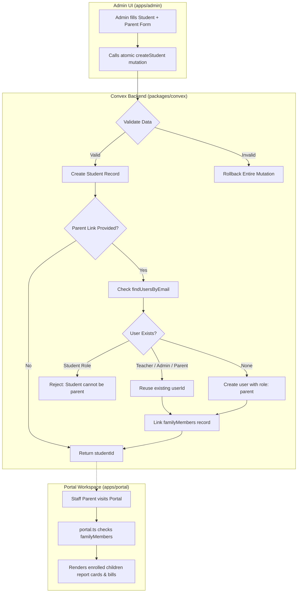

# Technical Briefing & Investigation Report: Student Enrollment & Staff-Parent Architecture

**Document Type**: Technical Investigation & Architectural Review  
**Date**: September 2, 2026  
**Target Systems**: `packages/convex` (Convex Backend), `apps/admin` (Admin App), `apps/portal` (Parent/Student Portal), `apps/teacher` (Teacher Workspace)  
**Status**: Root Causes Identified · Ready for Architectural Review & Execution  

---

## 1. Executive Summary

During end-to-end testing of the **Student Enrollment & Family Onboarding** flow on the Admin workspace (`/academic/students`), two interconnected architectural issues were surfaced:

1. **Non-Atomic Client-Side Mutation Chaining**: Student creation and family linking execute as two separate sequential client-side network calls (`createStudent` followed by `upsertStudentFamilyLink`). When step 2 fails, step 1 has already committed to the database. The client UI remains in "New Admission" creation mode, and re-submitting fails with `"A student with this admission number already exists"` because the record was partially created in step 1.
2. **Staff-as-Parent Email Collision & Monolithic Role Model**: School staff (teachers and administrators) who have children enrolled in the school cannot have their staff email linked as a parent. The backend rejects them with `"A user with this email already exists"` due to a defensive check assuming every parent email must exclusively map to a user with `role: "parent"`. Furthermore, portal authorization (`apps/portal`) restricts access strictly based on `users.role` rather than household membership in `familyMembers`.

---

## 2. Issue Breakdown & Root Cause Analysis

### Issue A: Non-Atomic Student Admission & Form State Lock

#### Sequence of Events & Observed Logs
1. **Timestamp `Sep 02, 01:18:48.438`**:
   - The user fills out the combined student + parent onboarding form:
     - Student: **Amara Nwosu**, Admission ID: `MCA/2026/042`, Class: `Year 5 - Emerald`.
     - Parent: **Emeka Nwosu**, Email: `e.nwosu@meridiancrest.org` (who is also an active teacher).
   - User clicks **"Complete Admission + Family Link"**.
   - Client calls `createStudent(...)`. **Result: Succeeded.** The student row is committed to the database, and reactive subscriptions immediately show Amara Nwosu on the roster table.
   - Client immediately calls `upsertStudentFamilyLink(...)`. **Result: Failed with `ConvexError("A user with this email already exists")`** (because `e.nwosu@meridiancrest.org` belongs to a teacher).
   - JavaScript exception triggers the catch block:
     - `resetStudentCreationForm()` is never called.
     - The form stays open on the right sidebar in "New Admission" mode with `MCA/2026/042` populated.
2. **Timestamp `Sep 02, 01:21:14.822`**:
   - The user edits the parent email in the form and clicks submit again.
   - The form executes `handleCreateStudent` again from the beginning, calling `createStudent(...)` with admission ID `MCA/2026/042`.
   - **Result: Failed with `ConvexError("A student with this admission number already exists")`**.
   - Root cause: `MCA/2026/042` was already created in the database during step 1 of the previous attempt.

#### Code Location
- [`apps/admin/app/academic/students/page.tsx`](file:///c:/CreativeOS/01_Projects/Code/Personal_Stuff/2026-03-14_School_Management_System/apps/admin/app/academic/students/page.tsx#L630-L665):
```typescript
// Non-atomic sequence on client
const createdStudentId = await createStudent({ ... });

if (shouldLinkParent && normalizedParentFirstName && normalizedParentLastName) {
  await upsertStudentFamilyLink({
    studentId: createdStudentId,
    // ...
  });
}

// Only reached if BOTH succeed
resetStudentCreationForm();
setSelectedStudentId(createdStudentId);
```

---

### Issue B: Staff-as-Parent Email Collision & Role Architecture

#### Current Data Model (`packages/convex/schema.ts`)
- **`users` table**:
  - `role`: `"student" | "parent" | "teacher" | "admin"`
  - `email`: string
  - `schoolId`: `Id<"schools">`
- **`families` table**:
  - `name`: string (e.g. "Nwosu Family")
  - `schoolId`: `Id<"schools">`
- **`familyMembers` table**:
  - `familyId`: `Id<"families">`
  - `parentUserId`: `Id<"users">`
  - `relationship`: `"Father" | "Mother" | "Guardian" | ...`
  - `isPrimaryContact`: boolean
- **`students` table**:
  - `userId`: `Id<"users">` (student user account)
  - `familyId`: `Id<"families">`
  - `admissionNumber`: string

#### The Defect in Backend User Resolution
In [`packages/convex/functions/academic/studentEnrollment.ts`](file:///c:/CreativeOS/01_Projects/Code/Personal_Stuff/2026-03-14_School_Management_System/packages/convex/functions/academic/studentEnrollment.ts#L2281-L2294):
```typescript
const matchingUsers = await findUsersByEmail(ctx, schoolId, normalizedEmail);
const activeUsers = matchingUsers.filter((candidate) => !candidate.isArchived);
const activeParentUsers = activeUsers.filter((candidate) => candidate.role === "parent");
const activeOtherUsers = activeUsers.filter((candidate) => candidate.role !== "parent");

// DEFECT: Throws if the matching user is a teacher or admin!
if (activeOtherUsers.length > 0) {
  throw new ConvexError("A user with this email already exists");
}
```

#### Sibling Clarification vs Staff-Parent Collision
- **Regular Parents with Multiple Children (Siblings)**:
  - If `John Doe` (`role: "parent"`) already exists with one child, adding a second child with `john.doe@gmail.com` **succeeds**. The backend finds `activeParentUsers[0]`, reuses John's `_id`, and links the new child to the existing family.
- **Teachers/Admins with Children**:
  - If `Emeka Nwosu` (`role: "teacher"`) has a child, the backend filters him into `activeOtherUsers` and explicitly throws an error, making it impossible to enroll staff children with their staff emails.

---

### Issue C: Multi-Workspace Authorization & Portal Routing

#### 1. Portal Route Guard & Backend Query
- In [`apps/portal/app/(portal)/layout.tsx`](file:///c:/CreativeOS/01_Projects/Code/Personal_Stuff/2026-03-14_School_Management_System/apps/portal/app/%28portal%29/layout.tsx#L45-L48):
  ```typescript
  if (session?.user?.role !== "parent" && session?.user?.role !== "student") {
    router.replace("/sign-in?error=unauthorized");
  }
  ```
- In [`packages/convex/functions/portal.ts`](file:///c:/CreativeOS/01_Projects/Code/Personal_Stuff/2026-03-14_School_Management_System/packages/convex/functions/portal.ts#L215-L222):
  ```typescript
  const activePortalMemberships = memberships.filter(
    (user) => !user.isArchived && (user.role === "parent" || user.role === "student")
  );
  if (activePortalMemberships.length === 0) {
    throw new ConvexError("Unauthorized");
  }
  ```
- **Consequence**: If a teacher (`role: "teacher"`) is linked into `familyMembers`, they would still be locked out of the portal because authorization checks only look at `user.role` instead of checking whether the user is a `parentUserId` in `familyMembers`.

---

## 3. Comprehensive Remediation Plan



### Proposed Changes Across Layers

| Component | File Path | Proposed Modification |
| :--- | :--- | :--- |
| **Atomic Mutation** | `packages/convex/functions/academic/studentEnrollment.ts` | Update `createStudent` mutation arguments to accept optional `parentLink` object (`firstName`, `lastName`, `email`, `phone`, `relationship`, `isPrimaryContact`). Execute student creation + family linking inside a single atomic Convex transaction. |
| **Staff User Reuse** | `packages/convex/functions/academic/studentEnrollment.ts` | In `upsertStudentFamilyLink` and `createStudent`, allow reusing existing active users whose role is `"teacher"`, `"admin"`, or `"parent"`. Only reject if the user's role is `"student"`. |
| **Portal Membership** | `packages/convex/functions/portal.ts` | In `getPortalMemberships`, look up `familyMembers` by `parentUserId`. If any exist for the user, grant parent portal context regardless of whether `users.role` is `"teacher"` or `"admin"`. |
| **Portal Layout** | `apps/portal/app/(portal)/layout.tsx` | Allow authenticated users with staff roles (`teacher`, `admin`) to load portal views if they have linked family memberships. |
| **Admin UI Form** | `apps/admin/app/academic/students/page.tsx` | Pass `parentLink` directly to `createStudent` in a single call. Remove the disconnected two-step `upsertStudentFamilyLink` call. |
| **Admin Family Panel** | `apps/admin/app/academic/students/components/StudentFamilyPanel.tsx` | Display a badge (e.g. `Staff: Teacher` or `Staff: Admin`) next to parents whose user account has a staff role. |

---

## 4. Verification & Testing Matrix

1. **Atomic Rollback Test**:
   - Submit a new admission with an invalid parent email or phone.
   - Verify that NO student row is created in `students`, and re-submitting with corrected data succeeds without `"admission number already exists"` error.
2. **Staff as Parent Test**:
   - Admit a student with a teacher's email (`e.nwosu@meridiancrest.org`).
   - Verify student is created and linked to Emeka Nwosu in `familyMembers`.
   - Verify Emeka's `users.role` remains `"teacher"`.
3. **Teacher Portal Access Test**:
   - Log in as the teacher and navigate to `portal.meloschool.com`.
   - Verify the teacher can view their child's report cards, fee invoices, and attendance.
   - Navigate to `teacher.meloschool.com` and verify normal grading and lesson planning still work.
4. **Sibling Grouping Test**:
   - Enroll a second child with the same parent email.
   - Verify both children appear under the same family household in the portal and admin views.
