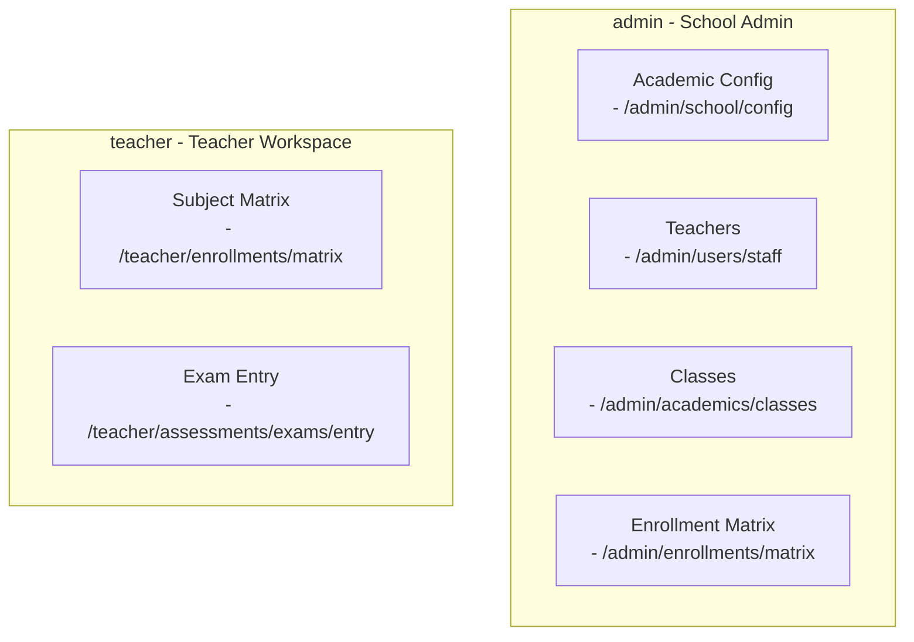

# Global Sitemap: School Management System

**Date:** 2026-03-25  
**Status:** Approved  
**Apps Covered:** `www`, `admin`, `teacher`, `portal`

## Overview

This document defines the complete page inventory for all four application surfaces in the School Management System. Each app serves distinct user groups with role-specific workflows.

---

## App 1: `www` — Public Marketing Website

**Purpose:** Public-facing marketing site and admissions portal for prospective families.  
**Base Path:** `/`  
**Auth Required:** No

### 1.1 Homepage
| Route | Page Purpose | Key Components |
|-------|---------------|-----------------|
| `/` | Landing page | Hero section, school highlights, call-to-action, testimonials, contact info |

### 1.2 About Section
| Route | Page Purpose | Key Components |
|-------|---------------|-----------------|
| `/about` | School history and mission | Timeline, leadership bios, values |
| `/facilities` | Campus and infrastructure | Photo gallery, virtual tour |
| `/staff` | Faculty and staff directory | Searchable list, profiles |

### 1.3 Academics
| Route | Page Purpose | Key Components |
|-------|---------------|-----------------|
| `/academics` | Academic overview | Curriculum, approach, achievements |
| `/curriculum` | Detailed curriculum info | Subject breakdown by level |
| `/calendar` | Academic calendar | Events, term dates |

### 1.4 Admissions
| Route | Page Purpose | Key Components |
|-------|---------------|-----------------|
| `/admissions` | Admissions landing | Requirements, process overview |
| `/apply` | Application form | Multi-step form, document upload |
| `/fees` | Fee structure | Tuition, payments, FAQs |
| `/visit` | Schedule a visit | Calendar booking, contact form |

### 1.5 News & Events
| Route | Page Purpose | Key Components |
|-------|---------------|-----------------|
| `/news` | News and announcements | Blog listing, filters |
| `/news/[slug]` | News detail | Article, images, share |
| `/events` | School events | Calendar view, registration |
| `/gallery` | Photo/video gallery | Albums, lightbox |

### 1.6 Contact
| Route | Page Purpose | Key Components |
|-------|---------------|-----------------|
| `/contact` | Contact page | Form, map, contact details |

---

## App 2: `admin` — School Administration Console

**Purpose:** Full operational control for school admins, bursars, and super admins.  
**Base Path:** `/admin`  
**Auth Required:** Yes (School Admin, Bursar, Super Admin roles)

### 2.1 Dashboard
| Route | Page Purpose | Key Components |
|-------|---------------|-----------------|
| `/admin` | Main dashboard | Stats widgets, quick actions, notifications, activity feed |
| `/admin/overview` | Executive summary | KPIs, charts, alerts |

### 2.2 School Setup
| Route | Page Purpose | Key Components |
|-------|---------------|-----------------|
| `/admin/school` | School profile | Logo, name, contact, branding |
| `/admin/school/branding` | White-label settings | Theme colors, fonts, templates |
| `/admin/school/terms` | Academic calendar | Sessions, terms, holidays |
| `/admin/school/config` | Comprehensive Academic Config | Sessions, terms, master subjects catalog |
| `/admin/school/settings` | Global settings | Config flags, preferences |

### 2.3 Users & Access
| Route | Page Purpose | Key Components |
|-------|---------------|-----------------|
| `/admin/users` | User directory | Search, filters, bulk actions |
| `/admin/users/staff` | Staff management | Teachers, admins list |
| `/admin/users/students` | Student roster | Class filtering, profiles |
| `/admin/users/parents` | Parent accounts | Family linking, access |
| `/admin/users/invite` | Invite new users | Email invite form |
| `/admin/permissions` | Role & permissions | Permission matrix editor |

### 2.4 Academic Structure
| Route | Page Purpose | Key Components |
|-------|---------------|-----------------|
| `/admin/academics` | Academic dashboard | Overview, quick navigation |
| `/admin/academics/classes` | Class management | Create, edit, assign teachers |
| `/admin/academics/subjects` | Subject catalog (Config) | Subject list, teachers |
| `/admin/academics/assignments` | Teacher-class mapping | Bulk assignments |
| `/admin/academics/class-subjects` | Class-subject linking | Subject allocation |

### 2.5 Enrollments
| Route | Page Purpose | Key Components |
|-------|---------------|-----------------|
| `/admin/enrollments` | Enrollment dashboard | Stats, recent enrollments |
| `/admin/enrollments/new` | New enrollment | Student form, class selection |
| `/admin/enrollments/bulk` | Bulk import | CSV upload, mapping |
| `/admin/enrollments/matrix` | Enrollment matrix | Bulk student-subject selection grid |
| `/admin/enrollments/[id]` | Enrollment detail | Full student profile |
| `/admin/enrollments/families` | Family management | Parent-student linking |

### 2.6 Assessments
| Route | Page Purpose | Key Components |
|-------|---------------|-----------------|
| `/admin/assessments` | Assessment overview | Terms, statuses |
| `/admin/assessments/setup` | Assessment config | CA weights, grading rules |
| `/admin/assessments/setup/shared` | Common exam settings | Global school mode |
| `/admin/assessments/results` | All results | Filter by class, term |
| `/admin/assessments/results/entry` | Admin bulk score entry | Session, term, class, subject selectors and roster grid |
| `/admin/assessments/approval` | Result moderation | Approve/reject workflow |

---

## App 3: `teacher` — Teacher Workspace

**Purpose:** Classroom tools for lesson planning, assessments, and grading.  
**Base Path:** `/teacher`  
**Auth Required:** Yes (Teacher role)

### 3.1 Dashboard
| Route | Page Purpose | Key Components |
|-------|---------------|-----------------|
| `/teacher` | Main dashboard | My classes, upcoming lessons, alerts |

### 3.2 Classes & Students
| Route | Page Purpose | Key Components |
|-------|---------------|-----------------|
| `/teacher/classes` | My classes | Class list with subjects |
| `/teacher/classes/[id]` | Class detail | Student roster, stats |
| `/teacher/classes/[id]/attendance` | Take attendance | Mark present/absent |

### 3.3 Assessments & Results
| Route | Page Purpose | Key Components |
|-------|---------------|-----------------|
| `/teacher/assessments` | My assessments | CA and exam scores |
| `/teacher/assessments/exams/entry` | Exam recording sheet | Bulk score entry grid |
| `/teacher/enrollments/matrix` | Enrollment matrix | Teacher-level subject selection |
| `/teacher/assessments/submit` | Submit for approval | Lock and submit |

---

## App 4: `portal` — Parent & Student Portal

**Purpose:** Academic view for parents and students to track progress, results, and notifications.  
**Base Path:** `/portal`  
**Auth Required:** Yes (Parent, Student roles)

### 4.1 Dashboard
| Route | Page Purpose | Key Components |
|-------|---------------|-----------------|
| `/` | Main dashboard | Child switcher, report-card summary, term snapshot cards, notifications |

### 4.2 Academic Views
| Route | Page Purpose | Key Components |
|-------|---------------|-----------------|
| `/report-cards` | Report card view | Child selector, term selector, printable report card sheet |
| `/results` | Result history | Timeline of recent terms, summary cards, quick links |
| `/notifications` | Academic notifications | Notice cards, term reminders, event alerts |

### 4.3 Authentication
| Route | Page Purpose | Key Components |
|-------|---------------|-----------------|
| `/sign-in` | Portal sign-in | Email/password form, error state, callback routing |

---

## Route Groupings Summary

---

*This sitemap serves as the design-to-build contract for all mockup and implementation work.*
