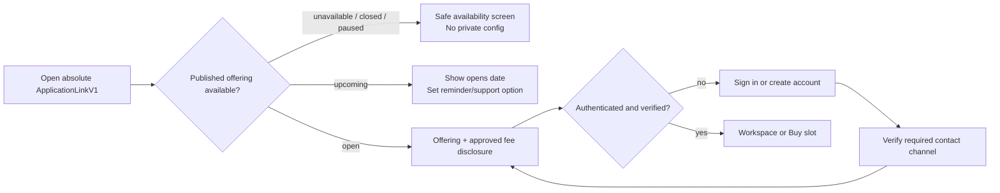
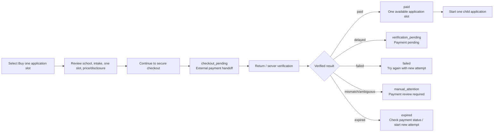
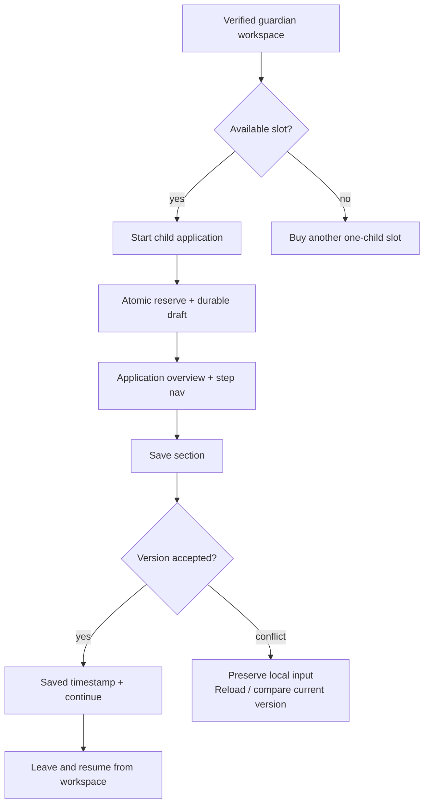
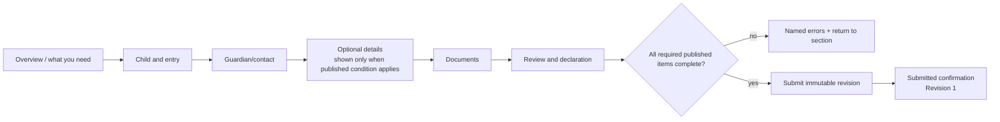
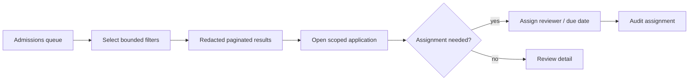
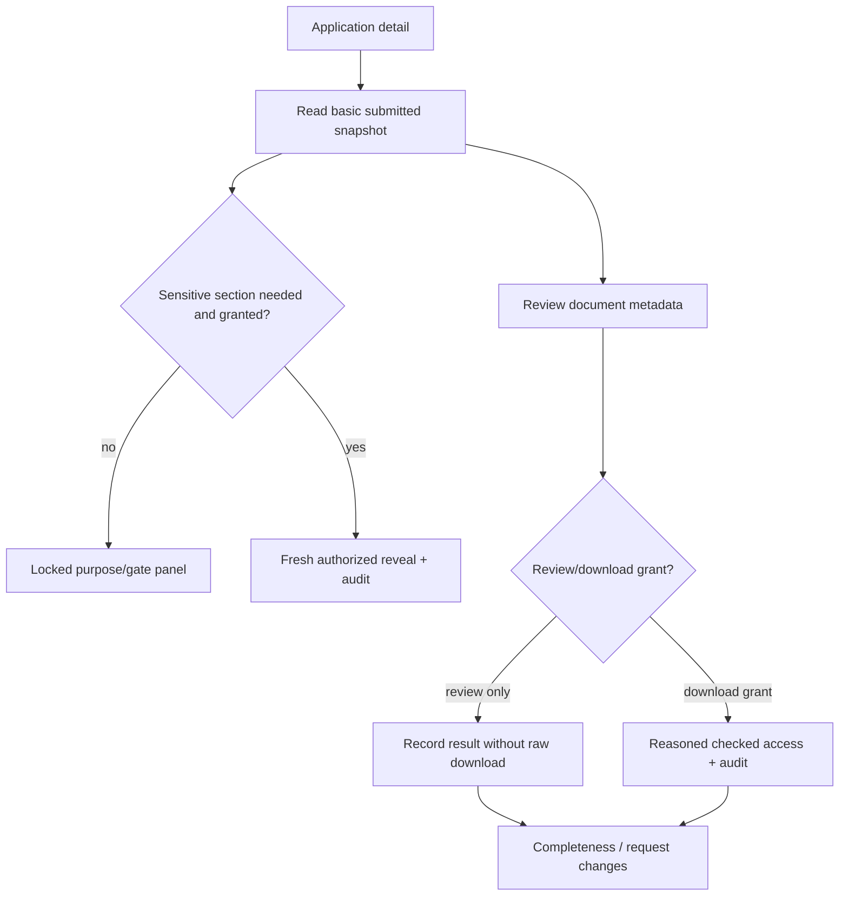
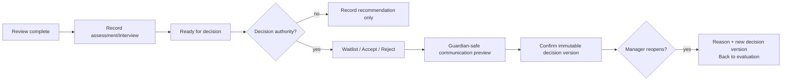
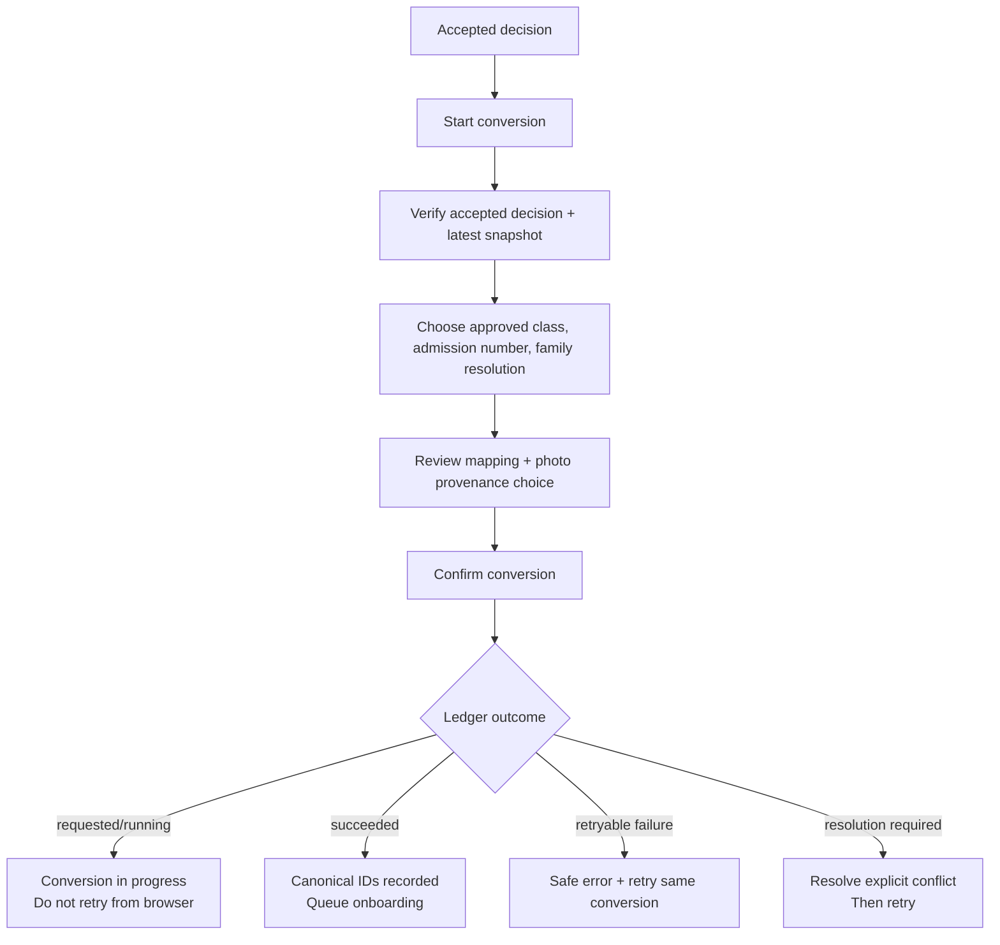

# Admissions Experience Design

**Status:** Design specification for D1 review  
**Scope:** Guardian public admissions surface (`B2`) and tenant-scoped staff operations (`B3`)  
**Architecture source of truth:** [Admissions Application Platform Architecture](AdmissionsApplicationPlatformArchitecture.md) and [ADR: Admissions Application Surface and Lifecycle](../decisions/ADR-008-admissions-application-surface-and-lifecycle.md)

## 1. Design intent and guardrails

### Users and jobs

| User | Primary job | Design outcome |
|---|---|---|
| Prospect | Understand whether an intake is available | See only published, approved offering information and a truthful availability state. |
| Verified guardian | Buy and use a separate application slot for each child, then follow progress | Keep sibling applications distinct, preserve work, and never mistake payment or review for admission. |
| Admissions clerk | Triage a school-scoped queue without unnecessary child data | Work from redacted, paginated lists and escalate sensitive needs rather than opening files by default. |
| Reviewer / decision maker | Review evidence, request corrections, record a human decision | Make permissions, snapshot revisions, completeness, and decision authority explicit. |
| Conversion operator | Safely create canonical school records after acceptance | Treat conversion as a separate, confirmable, replay-safe operation—not an automatic next step. |

### Experience principles

1. **Truth before optimism.** “Payment pending,” “Application submitted,” “Under review,” “Accepted,” and “Converted” are distinct visual states. Never promise a place from checkout, a submitted form, or an accepted document.
2. **One child, one slot, visibly.** A slot card represents one child application only. A second child begins with a separately purchased slot; the UI never clones a child into a sibling slot.
3. **Privacy in the interface.** Sensitive values are purposeful, optional by default, access-gated, and absent from queue rows, URLs, browser titles, and routine notifications.
4. **Progress without data loss.** Save indicators, local recovery copy, expected-version conflicts, resumable drafts, and explicit retry actions make poor connectivity survivable without silently overwriting data.
5. **Human decisions remain human.** Completeness and assessment information support staff; no score, document state, or automation renders a decision.
6. **Plain, accountable language.** Explain why a field/document is requested, whether it is required for this published offering, who can see it, and what happens next.

### Visual direction

Use a calm, credible, mobile-first service UI rather than a school marketing site. The public experience has an `Apply` wordmark/approved school mark, ample whitespace, a clear stepper, high-contrast indigo action color, teal confirmation color, and amber only for pending/action-needed states. Staff operations use the same semantic palette with denser data views and persistent state/filter context.

- Do not use red/green alone for status; pair color with text, icon, and/or pattern.
- Use familiar sentence-case labels: **Application slot**, **Save and continue**, **Request changes**, **Record decision**, **Start conversion**.
- Avoid “enrol/enroll” and “student” for a pre-acceptance child. Use **application**, **applicant**, and **child**.
- The school name, approved fee disclosure, documents, and declaration copy are runtime content. Mockup values are labels/placeholders, never approved OBHIS facts.

## 2. Route and screen inventory

The route strings below consume G1's fixed contract. They do not add a backend endpoint or authorization mechanism.

### Guardian surface (`apps/apply`, B2)

| Route / view | Purpose | Key components | Entry / exit |
|---|---|---|---|
| `/s/{schoolSlug}` | Public offering and route entry | School identity, availability banner, intake selector, approved fee disclosure, sign-in/start CTA | External or managed-site absolute link; then auth or workspace. |
| `/s/{schoolSlug}/i/{intakeSlug}` | Optional published intake campaign | Same content constrained to one intake | Canonical campaign link; unavailable state retains generic help, not tenant internals. |
| Auth interstitial | Sign in/sign up and verify contact before private work | “Why verification” panel, return-to-intent, verification status | Return to the exact purchase/resume intent after verification. |
| `/s/{schoolSlug}/account` | Guardian slot workspace | Slot cards, applications, purchase/add-slot CTA, status/message summary | Home for resumption, support, and sibling separation. |
| Purchase disclosure | Confirm one-slot product/price/version before external handoff | Fee disclosure, refund-policy key/copy, school/intake/product summary, consent-free acknowledgement | Creates/reuses a purchase attempt; no child form before entitlement is available. |
| External checkout handoff / return | Truthfully resolve payment | Leaving-site notice; pending, confirmed, failed, expired, manual-review, refund/reversal cards | Provider page; return then server verification/poll. |
| `/s/{schoolSlug}/applications/{opaquePublicId}` | One owned child application | Header/status, step nav, form sections, document vault, declaration, submit/revision timeline | Only owning verified guardian may view; opaque ID is not authority. |
| Application status/messages | Track submitted/review/change/decision state | State banner, safe staff messages, revision history, requested changes checklist, withdrawal control | Accessible from workspace and application header. |
| Support/recovery views | Handle unavailable offering, session, conflicts and uploads | Safe reference, retry/resume, current saved state, contact path | Never reveal other school/object existence. |

### Staff surface (existing admin app, B3)

| View | Purpose | Key components | Permission boundary |
|---|---|---|---|
| Admissions queue | Triage and assign work | Tenant header, bounded filters, redacted rows, pagination, assignment drawer | `applications.list`; no sensitive data or document previews. |
| Application detail | Review one scoped application and revisions | State rail, safe profile summary, tabs, revision selector, timeline | `applications.view_basic`; sensitive sections are separately gated. |
| Sensitive section gate | Reveal purpose-limited high-risk fields | Lock panel, grant explanation, fresh re-auth requirement where configured | `applications.view_sensitive`; audit on reveal. |
| Document review | Inspect one file and record result | Metadata, explicit view/download action, reviewer result form, version history | `documents.review`; raw download separately requires `documents.download`. |
| Assignment and change request | Coordinate review and ask guardian to correct named items | Assignee/scope/due controls, field/requirement picker, guardian-safe message preview | `reviews.assign` / `reviews.record`. |
| Assessment/interview | Capture configured human evaluation | Schedule/completion state, result, bounded score fields, internal notes | `reviews.record`; result does not decide admission. |
| Decision | Record waitlist/accept/reject or reopen | Preconditions panel, decision choice, approved reason, safe guardian message, confirmation | `decisions.record`; not available to a recommender alone. |
| Conversion | Execute/recover accepted-record creation | Prerequisite summary, class/admission/family resolution, confirmation, ledger status | `conversions.execute`; no automatic launch after acceptance. |
| Audit timeline | Explain who did what and when | Redacted, paginated events; filter by action/outcome | `audit.view`; never render sensitive bodies. |

## 3. Guardian journey maps

### A. Link entry, offering selection, authentication, and verification

**Annotations**
- The public page may show only G1-approved published school/programme/intake/product information. An unknown or disabled slug uses `OFFERING_UNAVAILABLE`; it does not distinguish why.
- Before auth, a guardian may review availability and disclosure but cannot create a payment attempt, draft, upload, or access a status.
- Auth explains: “Verification protects your child’s application and lets you return to it.” It preserves the destination locally/in the authenticated return flow and never asks for a caller-supplied guardian ID.
- Email is the assumed verified contact baseline. If policy later requires phone, expose it as a separately labelled verification step, not a silently required form field.

### B. Buy a one-child slot and resolve payment

**Required UI behavior**
- The disclosure view repeats **“One payment creates one application slot for one child.”** It identifies the selected school/intake/product, exact server-resolved price/currency, and approved refund disclosure version. It does not provide a quantity picker in v1.
- `checkout_pending` is a handoff screen, not a success screen. It says “You are being taken to secure checkout” and provides a return-safe action if the provider window does not open.
- `PAYMENT_PENDING` says: “We are confirming your payment. A payment start does not reserve a school place.” Show a partial reference only and a **Check again** action using bounded polling/backoff. The workspace remains usable, but does not show an available slot.
- `paid` says: “Payment confirmed. Your application slot is ready.” It does **not** say admission, registration, placement, or acceptance is confirmed.
- `failed` provides a reason-safe retry action. A retry starts a new purchase attempt only after the guardian confirms current disclosure; it must not duplicate an unsettled attempt.
- `manual_attention` exposes a partial reference and a support/reconciliation path; it never offers a slot while payment evidence conflicts.
- `refunded` / `reversed` on an unused slot state that the slot is no longer available. On a consumed slot, show a held-status support message; never erase the application history or promise automatic withdrawal.

### C. Workspace, siblings, reserve/resume, and draft

**Workspace composition**
- Top summary: “Applications for **[School]**,” an available-slot count, a prominent **Buy another application slot** CTA, and a compact explanation that each slot is for one child.
- Slot cards use separate labels: **Available slot**, **Draft — [child name only after saved]**, **Action needed**, **Submitted**, **Decision recorded**, **Conversion in progress**, **Converted**, **Unavailable/held**. Cards never infer a sibling relationship from names.
- Draft cards include last saved time, current section, percent/step completion, and **Resume**. They do not show medical/document details in the card.
- The first child name is collected only inside the reserved application. Until then, an available slot has no child identity.
- A concurrent reserve response (`APPLICATION_ALREADY_EXISTS`) opens the existing owned application; it never starts another draft.

### D. Child application, private documents, declaration, and submission

**Form frame**
- Desktop: a left vertical stepper and right content panel. Mobile: a numbered “Step x of y” header, progress bar, and compact section menu. A single section is shown at a time to limit bandwidth and cognitive load.
- Every section header has status (`Not started`, `In progress`, `Complete`, `Needs attention`) and a **Save and continue** button. Manual save remains available even when autosave is enabled.
- Save feedback is textual and programmatic: `Saving…`, `Saved at 10:42`, `Could not save — Retry`, and `Changes conflict with a newer saved version`. Do not rely only on a spinning icon/toast.
- Required labels use text (`Required`), not an asterisk alone. Optional fields show `Optional`. A sensitive label is additive: `Optional • Sensitive` with an inline “Why we ask / who can access this” disclosure.
- Conditional fields appear only when their bounded published condition is met. When hidden, their prior answer is not silently shown, deleted, or copied to unrelated screens. A condition change explains whether an already supplied answer remains included in the next snapshot according to the published form rule.
- The overview lists configured document requirements with category, required/optional state, accepted type/size summary, purpose, and visibility before the guardian starts. Requirements remain generic in this design; no historic OBHIS requirement is treated as approved.

**Private document vault**
- Each requirement row has category label, purpose, file limits, current version/status, and **Upload / Replace**. No raw storage ID appears in the DOM-visible route, UI, error copy, or file URL.
- Upload flow: choose file → client-side size/type guidance → one-time upload → explicit server binding → `Uploaded` status. A failed binding is not represented as a submitted document; it offers **Retry upload** or **Choose another file**.
- A guardian can access an owned document only through a checked action. The UI warns that links are temporary and should not be shared. Quarantined/unavailable content does not expose a file link.
- A replacement creates a new version. The guardian sees “Version 2 uploaded” and whether staff asked for a replacement; previous private content is not displayed as a public preview.

**Review and declaration**
- The review screen renders an accessible summary of all answers, document categories/statuses, and the exact published declaration version. It has links back to editable sections only while draft/changes-requested.
- Required service declaration and optional communications/sensitive-data consents are visually separate, unchecked by default, and independently named. Display the declaration purpose/version/date, signer name/relationship capture, and acceptance timestamp after submission.
- Submit is a deliberate final action: **Submit application**. Confirmation copy: “Submitting locks this revision for review. You can change it only if the school requests changes.” A final confirmation dialog is not a substitute for inline validation.
- Submission is atomic from the experience perspective: on timeout, show `Submitting — checking status` and reload the owned application rather than inviting a second submit. A successful state shows the revision number, submission time, what staff can do next, and a non-sensitive reference.

### E. Status, change requests, decisions, withdrawal, and conversion visibility

| Visible application state | Guardian-facing explanation | Primary recovery/action |
|---|---|---|
| `draft` | “Your application has not been submitted.” | Resume and complete sections. |
| `submitted` | “Your application was submitted on [date]. The school has not started review yet.” | View submitted revision; withdraw where allowed. |
| `under_review` | “The school is reviewing your application. They may contact you if they need changes.” | Read safe messages; no edit controls. |
| `changes_requested` | “The school asked you to update the items below.” | Edit only named unlocked fields/requirements, then resubmit as next revision. |
| `decisioned` + `waitlisted` | “The school recorded a waitlist decision.” | Read approved message; no inferred outcome timeline. |
| `decisioned` + `accepted` | “The school recorded an acceptance decision.” | Read school-approved next-step message. Do not show “student account created” unless conversion succeeds. |
| `decisioned` + `rejected` | “The school recorded a decision.” | Read approved safe message/support or appeal information only if published. |
| `withdrawn` | “This application was withdrawn and cannot be submitted again.” | View record/support; no new app from same slot. |
| `archived` | “This application is no longer available online under the school’s retention policy.” | Safe records/support path; no detail leak. |
| accepted conversion `requested/running/failed_retryable` | “The school is preparing its internal records.” | No guardian action; avoid exposing staff failure detail. |
| conversion `succeeded` | “The school has completed its internal record setup.” | Show only a separately approved onboarding message/status. |
| conversion `failed_terminal` | “The school needs to complete an internal check.” | No guardian action; do not reveal identity/admission-number conflict. |
| `ONBOARDING_PENDING` | “Your application decision is recorded. Account setup communication is still being sent.” | Wait/contact school; never repeat conversion. |

**Changes requested design**
- A top amber action panel names each allowed field/document requirement in a checklist, the guardian-safe staff message, due date if configured, and a **Continue updates** action.
- Locked sections retain read-only revision context; they do not turn into blank inputs. The app marks revised content as “Will be included in revision N+1.”
- When resubmitted, a revision timeline shows `Revision 1 submitted`, `Changes requested`, `Revision 2 submitted`, without exposing internal reviewer notes.

**Withdrawal design**
- Make withdrawal a secondary, destructive action with a reason selector/free-text only if policy publishes one. Explain that payment and submitted history remain recorded and a withdrawn application cannot be reassigned to another child.
- For states where withdrawal is no longer available, show the reason-safe current status and support route, not a disabled unexplained button.

## 4. Staff journeys

### A. Triage, filtering, and assignment

**Queue design**
- Persistent tenant context reads `Admissions · [School]`; any selector change resets filters and results to prevent cross-school carryover.
- Default columns: application reference, submitted/updated date, programme/intake, workflow state, completeness summary, assignee, and safe priority/due indicator. Child name is permitted only if `applications.view_basic` and policy requires it; never show DOB, address, medical values, document thumbnails, storage IDs, or raw document filenames in the queue.
- Filters are server-backed and bounded: intake, workflow state, decision state, assignee, document/completeness state, date range. Use an explicit **Apply filters** on mobile and a **Clear** control. The URL may contain non-sensitive filter values but no application/document storage identifier.
- Rows state the number of active filters and result range. Pagination uses `Next` / `Previous` or accessible load-more with result count; no unbounded client list.
- An empty queue distinguishes `No applications match these filters` from permission-safe `No applications available`. A denied/unknown object is `NOT_FOUND_OR_DENIED`.
- Bulk decision, bulk download, and bulk sensitive export are out of scope for this design.

**Assignment**
- An assignment drawer shows application reference, programme/intake, selected reviewer, permitted scoped role, and optional due date. The assignee picker contains only same-school, scope-eligible staff.
- Reassigning requires an audit-visible reason. Assignment is not a decision and does not grant sensitive-document download by itself.

### B. Detail, revision awareness, documents, and change request

**Detail layout**
- Header: opaque application reference, programme/intake, workflow state, assigned staff, last event time, and contextual actions constrained by permission/state.
- Left/desktop rail or mobile summary sheet: application state, current decision state, revision selector, completeness, document counts, and conversion status. State pills always include text.
- Tabs: **Overview**, **Application**, **Documents**, **Review**, **Decision**, **Conversion**, **Audit**. Tabs hidden for absent permissions do not imply content existence; a permitted but empty tab has an informative empty state.
- The **Application** tab defaults to the current immutable submitted revision. It labels every value with the revision and distinguishes guardian-supplied information from staff activity. A staff member cannot inline-edit a snapshot.
- High-risk fields render as a locked panel unless the viewer has explicit `applications.view_sensitive`; if available, the reveal action names the purpose and records an audit event. A broad administrator role alone is insufficient.

**Document review**
- The list shows category, requirement, version, upload date, status, and review result—not a thumbnail or raw file URL. A medical/government category carries a sensitivity badge.
- **View file** / **Download file** is an explicit action after permission and, where configured, fresh session re-auth plus a required reason/context. Access is audited before a transient checked URL/stream is returned.
- Reviewer action sheet: `Accept`, `Reject`, `Quarantine/escalate` (privacy/security path), reason code, guardian-safe explanation where rejection is selected, and internal note. Document acceptance is visually labelled **Document reviewed** and never changes the application decision.
- Replacement chains show version/status chronology. The UI may state “Superseded” but never expose an old unsigned file URL.

**Request changes**
- From a submitted/under-review application, staff selects **Request changes**. The modal has: selected fields/requirements only; reason category; guardian-safe message; optional configured due date; preview of guardian view; confirm.
- The picker cannot select staff-only/internal evaluation fields. Submission is blocked until at least one editable item and a guardian-safe message are present.
- On success, the detail header moves to `changes_requested`; the audit/review timeline records the request. Staff sees immutable prior revision and waits for a new one rather than editing it.

### C. Evaluation, decision, and reopen

- Evaluation UI supports only configured types, scheduled/completed state, bounded score/result values, evaluator, and internal notes. It states: “Recording an assessment does not decide admission.”
- The decision panel is unavailable until G1-preconditions are met. It lists current revision, completeness/document status, configured evaluations, and role authority. Warnings (for example capacity/policy) require acknowledgement but do not change a decision automatically.
- Decision choices are distinct controls: **Place on waitlist**, **Accept application**, **Reject application**. Each requires an approved reason code and guardian-safe message. The confirmation copy says “This records a decision version; it does not create a student.”
- A recommender can record a recommendation but cannot see or activate the decision confirmation control without `decisions.record`.
- Reopen is manager-only where G1 permits it. It requires an explicit reason, creates a new decision version, returns to `in_evaluation`, and is unavailable when G1 disallows reopening after conversion.

### D. Explicit conversion and recovery

**Conversion screen requirements**
- Visible only to `conversions.execute` after an accepted decision; accepting does not auto-open or auto-run conversion.
- A prerequisite panel confirms school scope, accepted decision version, latest submitted revision, required staff-approved class and admission number, and explicit family-resolution choice. It calls out that exact/similar identities are not auto-merged.
- Mapping preview identifies only allowed source groups: child/core details, authenticated guardian/family choice, selected class/admission number, and optional selected application photo marked `application_upload`. Medical/sensitive custom answers are excluded unless an approved canonical mapping exists; this design does not offer a generic “copy everything” checkbox.
- The confirmation requires an intentional acknowledgement: “I have checked the class, admission number, and family resolution. This creates or links canonical records once.”
- `requested`/`running`: disable repeated execution and show ledger status/last checked time. A reload reads the existing conversion by application rather than starting a duplicate.
- `succeeded`: show completion time and recorded canonical identifiers only to staff who are entitled to see them; show onboarding as a separate `Queued`, `Sending`, `Sent`, or `Pending retry` status.
- `failed_retryable`: show safe code and **Retry conversion** using the same ledger, never a “create again” flow. `failed_terminal`/`CONVERSION_RESOLUTION_REQUIRED` names the missing resolution class (for example “identity/family or admission number needs review”) without exposing unrelated candidate data. A privacy/security issue routes to the appropriate policy holder.

## 5. Field, document, and data-use presentation

### Form grouping and defaults

| Step | Published fields shown | Required/default behavior | UX treatment |
|---|---|---|---|
| Before you begin | Programme/intake, fee disclosure, required document checklist, privacy/declaration summary | Published offering only | Explain one-child slot and save/resume before collecting child data. |
| Child and entry | Legal first/last name, DOB, selected programme/intake/requested entry; optional middle/preferred name, gender/sex, nationality/country of birth | Core identity/entry required as G1 defines; optional values are not presumed required | Date input has locale hint and keyboard entry; no age judgement copy beyond published rules. |
| Guardian and contact | Primary guardian name/relationship, verified email; optional phone/address and other contacts | Verified contact is visible as an account fact; non-account contacts are not portal users | Clearly distinguish “account owner” from a contact supplied for this application. |
| Optional background | Previous school, siblings, published low/moderate-risk custom fields | Optional unless the published form explicitly requires a purpose-approved field | Use short groupings; never infer sibling data into another application. |
| Support, health, identity | Conditional medical/allergy/support questions, conditional sensitive document requirement | Disabled/optional by default; government identifiers prohibited by default | `Optional • Sensitive` label, purpose, access statement, and no pre-check. |
| Documents | Published requirement categories | Configurable published required/optional rule | Show MIME/size/count and purpose before upload; private vault behavior. |
| Review and declaration | Read-only summary, exact declaration(s), signer evidence | Required declaration separate from optional consents | Require explicit checks and final submit confirmation. |

### Sensitive-field disclosure pattern

For every high-risk question/document, render in this order:

1. **Label and state:** `Medical support information — Optional • Sensitive`.
2. **Purpose:** “Share only information needed for safety or accommodation during the application process.”
3. **Access:** “Only staff with specific admissions permissions can view this information.”
4. **Choice:** `Prefer not to answer`/blank is valid whenever the published form allows it; provide an accommodation/support contact route without requiring detailed disclosure.
5. **Retention:** show approved school policy link/summary when available; never invent a retention period in the UI.

Never make NIN, passport, genotype, religion, blood group, or medical information required by a template. Do not render AI/OCR/verification score controls.

## 6. Component inventory and interaction contract

| Component | Used by | Required states/behavior | Contract consumed by build |
|---|---|---|---|
| `OfferingHeader` | B2 | Published/open/upcoming/paused/closed/unavailable; school-safe branding | `public.getOffering`, `ApplicationLinkV1`; no host-derived authorization. |
| `AvailabilityBanner` | B2 | Text + icon for open, upcoming, paused, closed, unavailable | `availability`, `opensAt`, `closesAt`; generic unavailable response. |
| `AuthVerificationGate` | B2 | sign in, sign up, pending verification, verified return | `guardian.getOrCreateIdentity`; server-derived identity only. |
| `FeeDisclosureCard` | B2 | current disclosure, confirm, price changed, no quantity control | Server-resolved product/price; `PRICE_CHANGED` requires renewed confirmation. |
| `PaymentStatePanel` | B2 | created, checkout pending, verification pending, paid, failed, expired, manual attention, refunded/reversed | `payments.createAttempt`, `initializeAttempt`, `verifyReturn`; no success from redirect alone. |
| `SlotWorkspace` / `SlotCard` | B2 | available, reserved draft, consumed/submitted, held/revoked/refunded; multiple independent cards | `guardian.listWorkspace`, entitlement/application states. |
| `ApplicationStepper` | B2 | section status, mobile/desktop navigation, progress | Current published form version; no implicit sensitive defaults. |
| `AutosaveStatus` | B2 | idle/saving/saved/offline/error/conflict | expected-version saves; preserve local input on `DRAFT_VERSION_CONFLICT`. |
| `FieldFrame` | B2 | required/optional/sensitive/conditional/error/help | Typed field contract; no arbitrary field execution. |
| `DocumentRequirementRow` | B2 | required/optional, upload/bind/progress/fail/retry, version/review state | `documents.createUploadUrl`, `bindUpload`, `getOwnAccess`; never URL storage ID. |
| `DeclarationPanel` | B2 | versioned required declaration; independent optional consents; signer evidence | Published declaration version; immutable on submission. |
| `SubmissionSummary` | B2 | incomplete, confirming, submitting/checking, submitted revision | `applications.submit`; first submit consumes slot atomically. |
| `ApplicationStatusRail` | B2/B3 | workflow/decision/conversion state and revision timeline | G1 state model; staff and guardian visibility differ. |
| `SafeMessageThread` | B2 | guardian-visible messages/status only | `admissionsReviewEvents` safe projection; no internal note. |
| `RecoveryPanel` | B2/B3 | safe code, retry/resume/support/action | Error matrix below; no tenant/object oracle. |
| `AdmissionsQueue` | B3 | redacted rows, bounded filter chips, pagination, empty/error | `staff.listQueue`; `applications.list`, tenant-scope filtering. |
| `AssignmentDrawer` | B3 | eligible assignee, scope, due date, reason on reassign | `staff.assignReview`; same-school eligible assignee only. |
| `ApplicationRevisionViewer` | B3 | immutable revision select, basic/sensitive gate | `staff.getApplicationDetail`; no inline snapshot edit. |
| `SensitiveRevealGate` | B3 | locked, reason/purpose, re-auth if configured, audited reveal | `applications.view_sensitive`; access event. |
| `DocumentReviewPanel` | B3 | metadata, explicit access, accept/reject/quarantine, history | `staff.getDocumentAccess`, `recordDocumentReview`; separate review/download permissions. |
| `ChangeRequestComposer` | B3 | allowed item picker, safe message, preview, confirmation | `staff.requestChanges`; only editable fields/requirements. |
| `EvaluationForm` | B3 | configured type, schedule/completion, result, evaluator | `staff.recordEvaluation`; no decision automation. |
| `DecisionComposer` | B3 | preconditions, waitlist/accept/reject, reason, safe copy, reopen | `staff.recordDecision` / `reopenDecision`; `decisions.record`. |
| `ConversionWorkspace` | B3 | prerequisites, mapping preview, confirmation, ledger progress/retry | `staff.requestConversion`; `conversions.execute`; one ledger/application. |
| `AuditTimeline` | B3 | redacted, paginated, timestamp/actor/action/outcome | `staff.getAudit`; `audit.view`, no sensitive payload. |

## 7. Validation, error, and recovery copy matrix

All messages pair an accessible text heading with a status icon and `aria-live="polite"` for non-destructive updates. Error summaries receive focus after submit; each linked field has an inline message and `aria-describedby`. Safe codes can be logged/displayed to support without private data.

| Trigger / safe code | Guardian copy and action | Staff copy and action |
|---|---|---|
| `OFFERING_UNAVAILABLE` | **This application link is not available.** “Please check the link or contact the school for current admissions information.” Action: Back to available offerings/support. | **This offering is unavailable.** Do not expose unpublished intake/settings details. Action: check tenant settings if authorized. |
| `VERIFICATION_REQUIRED` | **Verify your contact to continue.** “Verification protects your child’s application and lets you return to it.” Action: send/check verification, then resume. | N/A. |
| `PRICE_CHANGED` | **The application fee has changed.** “Review the current fee details before starting a new checkout.” Action: Review fee. | **Price confirmation is outdated.** Action: verify published price version; do not override purchase history. |
| `PAYMENT_PENDING` | **We are confirming your payment.** “Your application slot is not ready yet, and this does not confirm a school place.” Action: Check again; support with partial reference. | **Payment confirmation is pending.** Action: view minimized attempt state; do not manually grant a slot without verified evidence. |
| payment `failed` | **Payment was not completed.** “No application slot has been created from this attempt.” Action: Try again after reviewing current fee. | **Payment attempt failed.** Action: inspect safe provider result/audit; no entitlement action. |
| payment `expired` | **This checkout session expired.** “If you completed payment, check its status before starting again.” Action: Check payment / Start new checkout. | **Checkout expired.** A later verified event may still settle; do not mark final without evidence. |
| `PAYMENT_REVIEW_REQUIRED` / `manual_attention` | **Your payment needs a check.** “We cannot make an application slot available yet.” Action: contact support with partial reference. | **Payment needs reconciliation.** Action: privileged finance evidence workflow; no direct entitlement creation. |
| refunded/reversed | **This application slot is no longer available.** If consumed: “The school is reviewing the payment status for this application.” | **Refund/reversal received.** Action: follow approved hold/refund policy; retain audit/history. |
| `APPLICATION_ALREADY_EXISTS` | **You already started this application.** Action: Open your saved application. | N/A. |
| `DRAFT_VERSION_CONFLICT` | **A newer saved version is available.** “Your typed changes are still on this device. Review the latest saved version before trying again.” Action: Reload and compare. | N/A. |
| offline/autosave failed | **We could not save yet.** “Keep this page open if you can. Your latest typed changes have not been confirmed.” Action: Retry save. | **Update was not saved.** Action: retry; do not assume a partial staff action succeeded. |
| `APPLICATION_INCOMPLETE` | **Complete the highlighted items before submitting.** Action: Go to first issue; errors name fields/categories, not hidden data. | **The application is incomplete.** Action: review completeness or request changes; do not decide around missing published prerequisites. |
| `APPLICATION_LOCKED` | **This application is locked for review.** “You can edit it only if the school requests changes.” Action: View status/messages. | **Submitted data is locked.** Action: use Request changes; never edit snapshot values. |
| document type/size/bind failure | **This file could not be added.** “Choose a file that meets the listed type and size requirements, then try again.” | **Document is not available for review.** Action: inspect category/status; do not access unbound object. |
| `DOCUMENT_UNAVAILABLE` / quarantine | **This document is temporarily unavailable.** Action: Replace it or contact the school if requested. | **Document access is restricted.** Action: follow quarantine/privacy process; no ordinary download. |
| `NOT_FOUND_OR_DENIED` | **We could not open that item.** “Sign in with the account that owns this application, or return to your workspace.” | **The application is unavailable.** Do not indicate whether it exists. Action: return to queue/check school context. |
| invalid review/decision transition | N/A | **This action is not available in the application’s current state.** Action: refresh status, complete required review work, or request changes. |
| missing decision authority | N/A | **You can record review information but cannot record this decision.** Action: assign/escalate to a decision maker. |
| `CONVERSION_RESOLUTION_REQUIRED` | **The school is completing an internal check.** No identity/admission conflict detail. | **Conversion needs resolution.** “Review the approved class, admission number, and explicit family/identity resolution, then retry this same conversion.” |
| conversion running | **The school is preparing internal records.** | **Conversion is in progress.** Action: refresh ledger status; do not start another conversion. |
| `ONBOARDING_PENDING` | **Account setup is still being sent.** “Your application decision is already recorded.” | **Onboarding notification is pending.** Action: monitor/retry outbox only; do not rerun conversion. |
| session timeout / fresh re-auth | **Sign in again to continue securely.** Return to owned application section after sign-in. | **Confirm your identity to access this sensitive action.** Return to the document/decision/conversion context after re-auth. |

## 8. Responsive, low-bandwidth, and WCAG 2.2 AA requirements

### Responsive behavior

| Breakpoint / condition | Guardian behavior | Staff behavior |
|---|---|---|
| 320–599 px | Single-column cards; sticky bottom Save/Continue; stepper collapses to progress + menu; no horizontal form tables; payment and status actions full width. | Queue becomes labeled cards or a horizontally scrollable table inside a clearly announced region; filters open in a modal/drawer with Apply/Clear; destructive actions remain separated. |
| 600–1023 px | Two-column only where fields remain readable; documents and summary use stacked cards. | Queue table can retain core columns; application rail collapses above tabs. |
| ≥1024 px | Persistent step rail and content panel; review summary can be side-by-side with form. | Persistent tenant/filter context, queue table, detail rail plus tabbed content; conversion confirmation uses constrained modal/panel. |
| Slow/offline | Do not load document previews; show text-first shell, save status, retry controls, and preserve unsent typed input in-memory/local recovery only until server acknowledgement. | Prioritize queue metadata and explicit reload; disable ambiguous mutation repeats while status is unresolved. |

### Accessibility acceptance requirements

- Meet WCAG 2.2 AA: 4.5:1 normal-text contrast, 3:1 large text/UI indicators, visible `:focus-visible`, no color-only state, and minimum 24×24 CSS-pixel targets (44×44 preferred for primary mobile actions).
- Use landmarks (`header`, `nav`, `main`, labelled `aside`), one H1 per view, ordered H2/H3 hierarchy, native buttons/inputs, real labels, and semantic table markup for desktop queues.
- Step navigation identifies current step with `aria-current="step"`; tabs use the tabs pattern only when content is truly tabbed. Do not make generic cards clickable without a labelled control.
- Validation summary moves focus only on attempted submit; status/autosave updates use polite live regions; destructive/critical failure uses assertive notification sparingly. Do not shift focus for ordinary autosave.
- Dialogs trap focus, have labelled titles/descriptions, restore focus to their trigger, and provide an explicit cancel. Escape may close non-destructive dialogs but must not discard unsaved input without warning.
- Conditional fields announce when added/removed; no keyboard focus may remain in hidden content. Required state, optional state, format guidance, and errors are textual.
- File upload supports keyboard activation and an accessible selected-file/progress/status message. Never require drag-and-drop. Error instructions do not depend on image/document preview.
- Respect `prefers-reduced-motion`; limit animation to short opacity/progress transitions and never gate state comprehension on motion. Respect text zoom up to 200% and reflow at 320 CSS px without two-dimensional page scrolling except data tables.
- Application and document pages use noindex/private cache controls at implementation; UI must not place private content in title, share text, copied link, toast, or support reference.

## 9. State coverage checklist

| G1 domain state | Visible guardian treatment | Visible staff treatment / recovery |
|---|---|---|
| Purchase: `created`, `checkout_pending`, `verification_pending` | Checkout handoff/pending panel, partial reference, check-again action | Attempt state/audit, no slot grant. |
| Purchase: `paid`, `failed`, `expired`, `manual_attention`, `refunded`, `reversed` | Confirmed slot; retry; delayed-payment check; reconciliation; held/removed slot | Evidence/reconciliation state and audited policy action. |
| Entitlement: `available`, `reserved`, `consumed`, `expired`, `refunded`, `revoked` | Available/start, draft/resume, submitted history, unavailable/held explanation | Status in detail; no rebinding or duplicate application action. |
| Application: `draft`, `submitted`, `under_review`, `changes_requested`, `decisioned`, `withdrawn`, `archived` | Editable/resume; read-only status; named changes; decision copy; withdrawal/archived support | Queue/detail state rail; request changes rather than edit; retention-safe archive. |
| Document: `uploaded`, `in_review`, `accepted`, `rejected`, `quarantined`, `superseded`, `deleted` | Upload/retry/replace and safe availability; never a public file URL | Metadata/review actions; explicit audited access; quarantine/delete gate. |
| Decision: `in_evaluation`, `ready_for_decision`, `waitlisted`, `accepted`, `rejected`, `withdrawn`, reopened to `in_evaluation` | Safe status/message only | Evaluation panel, authority/preconditions, immutable decision version, manager reopen. |
| Conversion: `requested`, `running`, `succeeded`, `failed_retryable`, `failed_terminal` | Internal setup/pending or approved onboarding status only | Ledger progress, same-ledger retry, explicit resolution; recorded IDs on success. |
| Communication: retry pending | `ONBOARDING_PENDING` without altered decision | Outbox status/retry separate from conversion. |

## 10. B2/B3 handoff contracts

### B2 — public guardian application surface

Build the guardian mockup at `docs/mockups/admissions/guardian-journeys.html` as the interaction/layout source of truth, while consuming only B1/B0 contracts.

1. Implement exactly the public routes in section 2 and `ApplicationLinkV1` absolute-link behavior. Support managed-site and external-site entry with no source-domain cookie requirement.
2. Use the component states in section 6 and all guardian state/copy rules in sections 3, 7, and 9. In particular, redirect is `checkout_pending`/`PAYMENT_PENDING`, not paid; one paid slot is one child; an application is not an accepted place or student.
3. Use the G1 guardian function boundary: published offering, identity/verification, workspace, purchase/create/verify, draft section saves with expected version, checked uploads/bind/access, submit, and withdrawal. Do not infer IDs, permissions, prices, document URLs, or state from the client.
4. Implement current form/declaration/requirement versions as server-supplied published content. Preserve field labels/purpose/data-class treatment; do not add high-risk default requirements or freeform custom execution.
5. Keep private document keys/storage IDs out of routes/list UI and apply the low-bandwidth/mobile/a11y rules in section 8. Cover payment return/pending, resume, conflict, upload retry, one-slot-one-submission, request-change/resubmit, and keyboard/mobile flow.

### B3 — staff admissions operations

Build the staff mockup at `docs/mockups/admissions/staff-review-journeys.html` as the interaction/layout source of truth, together with D3 for settings.

1. Use the queue/detail/review/decision/conversion layouts and permission-gated actions in sections 4 and 6. Scope all views to the active school; use redacted, paginated lists and generic denied responses.
2. Enforce the G1 permission separation in visible UI: basic view ≠ sensitive view; document review ≠ document download; recommendation/review ≠ decision; accepted ≠ converted; conversion ≠ onboarding retry.
3. Consume B1 staff contracts only: queue/detail, document checked access/review, assignment, change request, evaluation, decision/reopen, conversion request/recovery, and redacted audit. No client-side state transition invention or snapshot editing.
4. Render immutable revision history, guardian-safe messages, access/audit cues, and safe conversion recovery exactly as specified. Sensitive values/files must be absent until explicit authorized access; no preview in queues.
5. Apply the staff error matrix and responsive/a11y requirements. Test tenant separation, permission gates, invalid transitions, conversion replay/retry display, and document-access boundary.

## 11. Design approvals still needed

- Approved application fee/currency, refund and duplicate-payment wording, provider/payment-method presentation, and v1 quantity policy.
- Published document requirements/limits by programme, whether/when a birth certificate is required, and the lawful purpose/retention/access plan for any sensitive collection.
- Email-only versus email-plus-phone verification; exact guardian/support contact wording.
- Named staff roles/grant bootstrap, fresh re-auth policy, assessment/interview/waitlist/appeal policy, and approved decision copy.
- Admission-number/class/family-resolution operating process, onboarding content, retention notice, and privacy/legal review.

No OBHIS price, document rule, school claim, contact, declaration/legal statement, or imagery is approved by this design artifact.
