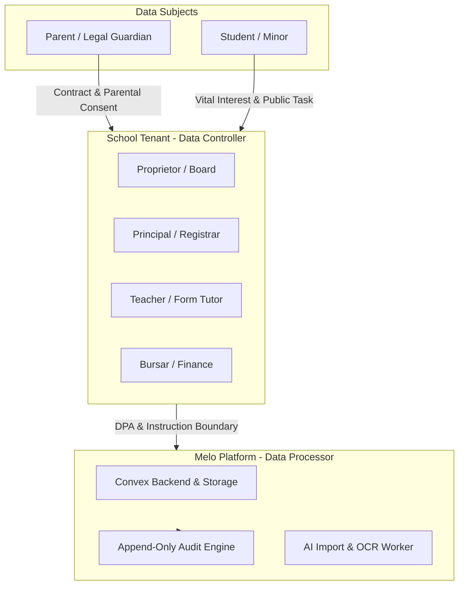
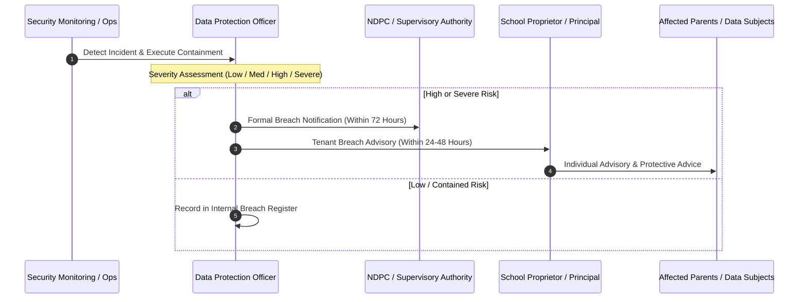
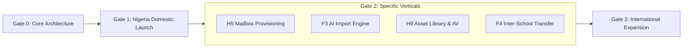

# Melo Compliance Control Dossier (F5)

## 1. Document Header & Legal Status Notice

### 1.1 Metadata
- **Document Identifier**: `MELO-SPEC-D01-COMPLIANCE-DOSSIER`
- **Feature Code**: `F5` (Global Legal, Privacy, and Child-Data Compliance Program)
- **Version**: `1.0.0`
- **Status**: Authoritative Technical & Compliance Engineering Specification
- **Effective Date**: 2026-09-03
- **Parent Orchestrator Session**: `orch-20260903-143249`
- **Author Role**: Compliance Researcher & Security Architect
- **Review Cadence**: Mandatory quarterly re-audit; triggered reviews upon any statutory amendment or major architectural revision.

### 1.2 Explicit Legal Disclaimer
> [!IMPORTANT]
> **LEGAL NOTICE & STATUS DISCLAIMER**:
> This document represents versioned technical, architectural, and compliance engineering guidance developed for the Melo School Management System codebase. **This document does NOT constitute legal advice, nor does it establish an attorney-client relationship or represent formal legal clearance.**
> 
> Educational data protection regulations—especially regarding minors, biometric markers, institutional emails, and cross-border data residency—vary across international jurisdictions. Deployment of Melo into production in any target market requires formal review and written sign-off by qualified legal counsel licensed within the applicable jurisdiction before commercial activation or sensitive minor processing.

---

## 2. Comprehensive Data Inventory & Classification Matrix

Melo processes data across administrative, academic, financial, communicative, and cognitive subsystems. All schema fields and binary artifacts are categorized under the six canonical data tiers established in `packages/convex/functions/foundation/contracts.ts` via `admissionsDataClassValidator`.

### 2.1 Canonical Data Classification Tiers
1. **`public`**: Freely disclosable school information, published school website content, public intake announcements, and general academic term calendars. No privacy or confidentiality exposure.
2. **`internal`**: School-operational metadata, anonymized class rosters, active subject catalogs, grading band presets, non-sensitive administrative circulars, and system health status.
3. **`personal`**: Standard identifiable data of adults (parents, guardians, faculty, staff), including legal names, contact numbers, residential addresses, and employment records.
4. **`child_confidential`**: Student academic performance metrics, assessment scores, terminal grades, daily attendance records, teacher observations, report cards, and student pastoral notes. Requires heightened minor data protection.
5. **`highly_sensitive`**: Special category data under statutory protection: student medical/health conditions, immunization certificates, special educational needs (SEN), safeguarding/welfare records, government identity documents (birth certificates, passports, NIN), and raw student photographs.
6. **`financial_security`**: School bank account configurations, merchant gateway credentials, payment tokens, transaction reference IDs, parent fee invoices, receipts, and platform settlement records.

### 2.2 Subsystem Data Field Inventory & Posture Matrix

| Subsystem / Domain | Data Entities & Specific Fields | Canonical Data Class | Convex Storage Location | Access Roles (RBAC) | Encryption, Storage & Redaction Posture | Statutory / Operational Retention Baseline |
|---|---|---|---|---|---|---|
| **Identity & Demographics (Adults)** | Staff & Guardian legal names, gender, marital status, title, nationality, language. | `personal` | `users`, `admissionsGuardians`, `admissionsApplicantProfiles`, `families`, `familyMembers` | Proprietor, Principal, Registrar, Self | Encrypted at rest (AES-256); in transit (TLS 1.3). Never masked in administrative editing; redacted in public logs. | Duration of employment/enrollment + 7 years post-exit. |
| **Identity & Demographics (Minors)** | Student first name, last name, date of birth, gender, state/LGA of origin, nationality, religion (optional). | `child_confidential` | `students`, `admissionsApplicantProfiles`, `admissionsApplications` | Proprietor, Principal, Registrar, Form Teacher, Assigned Teachers | Encrypted at rest. Strict school-tenant isolation. Minor DOB used to calculate age; masked in non-administrative views. | Duration of student enrollment + permanent graduation record retention. |
| **Contact Data** | Residential addresses, personal email addresses, mobile phone numbers, emergency contact details. | `personal` | `users`, `admissionsGuardians`, `admissionsApplicationContacts`, `schools` | Proprietor, Principal, Registrar, Bursar | Encrypted at rest. Phone numbers masked in general audit logs (`***-****-1234`). | Active enrollment + 7 years post-exit. |
| **Educational Performance** | Continuous Assessment (CA1, CA2, CA3), raw/scaled exam marks, totals, letter grades, remarks. | `child_confidential` | `assessmentRecords`, `historicalTermTotals`, `reportCardComments`, `reportCardManualAdjustments` | Subject Teacher, Form Teacher, Academic Director, Principal, Proprietor, Student/Parent (own only) | Append-only adjustments (`reportCardManualAdjustmentEvents`). Snapshotted on report card finalization. Tenant isolated. | Permanent academic record (historical transcript preservation). |
| **Attendance & Timetable** | Times present, times absent, times school opened, reason for absence, tardiness marks. | `child_confidential` | `reportCardAttendanceStudentValues`, `reportCardAttendanceClassValues`, `schoolEvents` | Form Teacher, Principal, Parent/Student (own only) | Encrypted at rest. Tenant isolated. Redacted during bulk class exports to avoid peer leakage. | 7 years following academic session completion. |
| **Health & Medical (Minors)** | Allergies, chronic conditions, immunization documents, blood group, emergency medical directives, doctor contacts. | `highly_sensitive` | `admissionsApplicantProfiles`, `admissionsDocuments`, `admissionsSubmissionSnapshots` | School Nurse/Medical Admin, Principal, Designated Safeguarding Lead (DSL) | Strictly restricted. Decoupled from routine teacher views. Audit-logged upon every access (`admissionsDocumentAccessAudits`). | Active enrollment + 10 years (or until minor attains age 25). |
| **Special Educational Needs (SEN)** | Learning accommodations, psychological evaluations, individual education plans (IEP), behavioral assessments. | `highly_sensitive` | `admissionsApplicationAnswers`, `admissionsDocuments`, `admissionsSubmissionSnapshotItems` | Principal, SEN Coordinator, Assigned Form Teacher | Field-level access controls. Never exposed on standard report cards. Access audited on every read. | Active enrollment + 10 years post-exit. |
| **Safeguarding & Disciplinary** | Child protection incident logs, disciplinary records, suspension notices, welfare concern referrals. | `highly_sensitive` | `admissionsEvaluations`, `contentAuditEvents`, private pastoral records | Proprietor, Principal, Designated Safeguarding Lead | Separate access boundary. Excluded from general school audit exports. Excluded from automatic inter-school transfer network. | Minimum 25 years from incident date or minor's 25th birthday (whichever is later). |
| **Biometrics & Media** | Student passport photographs, admission document scans, government photo ID scans, birth certificates. | `highly_sensitive` | `admissionsDocuments`, `schoolSiteAssets`, Convex Storage (`_storage`) | Registrar, Admissions Committee, Principal | Stored in private storage buckets. Quarantined upon upload. Accessible only via short-lived signed URLs with fresh auth assurance. | Active enrollment + 5 years for identity verification; permanent for archived transcript photo. |
| **Financial & School Billing** | Fee structures, student invoices, invoice snapshots, manual bank payment receipts, offline transfer instructions. | `financial_security` | `feePlans`, `studentInvoices`, `billingPayments`, `paymentAllocations`, `schoolBillingSettings` | Proprietor, Bursar, Parent (own invoices only) | Issued invoices are immutable snapshots. Bank details snapshot payment instructions. Tenant isolated. | 7 years minimum (mandatory statutory tax/accounting compliance). |
| **Bank Accounts & Merchant Secrets** | School settlement bank account numbers, sort codes, Paystack subaccount codes, secret API keys. | `financial_security` | `schoolPaymentProviders`, `schoolPaymentProviderSecrets`, `schoolBankAccounts` (MX-08) | Proprietor, Authorized Bursar (view/edit); System Action | API secrets encrypted at rest; bank account numbers masked to last 4 digits in settings summaries and logs; full number only on invoice render. | Active lifecycle; archived upon deactivation. Never hard-deleted if historically referenced. |
| **Authentication & Credentials** | Session tokens (`authTokenIdentifier`), Better Auth user IDs, multi-factor tokens, auth assurance levels. | `financial_security` | `users`, `platformAdmins`, `freshAuthAssurance` | System Authentication Engine; User (self) | Passwords salted and hashed via external IdP. Session tokens validated server-side. Never recorded in application audit logs. | Ephemeral session validity (15 mins to 30 days); auth audit logs retained 1 year. |
| **Application Audit Trails** | User actions, timestamps, actor IDs, group/branch context, module, entity ID, redacted before/after values. | `internal` | `auditEvents` (MX-04), `admissionsAuditEvents`, `schoolSiteAuditEvents`, `academicTimelineAuditEvents` | Platform Super Admin (platform scope), Proprietor (group scope), Principal (branch scope) | Append-only. No deletion path. Passwords, complete bank numbers, and raw PII payloads permanently masked before insertion. | Minimum 7 years for operational events; indefinite for ownership, security, and academic timeline changes. |
| **AI Inputs & Extracted Text** | Uploaded spreadsheets, document chunks, curriculum sources, OCR raw text, system prompts. | `internal` / `child_confidential` | `knowledgeMaterials`, `knowledgeMaterialChunks`, `knowledgeOcrJobs`, `stagedImportRecords` | Authoring Teacher, Academic Director, Principal | Uploads scanned before OCR. Staged import rows verified before commit. Content sanitized before AI provider submission. | Temporary processing storage purged 30 days post-extraction; finalized curricula retained per school term. |
| **AI Execution & Usage Logs** | Prompt token counts, completion token counts, model identifiers, provider execution costs, execution latency. | `internal` | `aiRunLogs`, `quotaLedger` (H8), `rateLimitCounters` | Platform Super Admin, Proprietor (usage totals only) | Technical metadata only. Prompt text and raw document payloads are excluded from billing/metering ledger rows. | Retained 3 years for billing reconciliation and capacity planning. |
| **Third-Party Directory Sync** | Google Workspace / Microsoft 365 / Zoho Mail account mappings, external user IDs, sync job statuses. | `internal` | `emailDomainConfigurations`, `institutionalMailboxAccounts` (H5) | Platform Super Admin, Proprietor, IT Admin | Maps external provider UUIDs to internal person IDs. Decoupled from login auth tokens. Sync failures logged with safe codes. | Active lifecycle of institutional mailbox + 90 days post-suspension archive. |

---

## 3. Purpose & Lawful Basis Matrix

Under the **Nigeria Data Protection Act (NDPA 2023)** Section 25, the **NDPC General Application and Implementation Directive (GAID) 2024**, and international counterparts (GDPR Art. 6 & 9, POPIA Sec. 11, Kenya DPA Sec. 30), every processing activity within Melo must possess an identifiable lawful basis.

### 3.1 Statutory Lawful Bases under NDPA 2023
- **Consent (Art. 25(1)(a))**: Explicit, informed, and unambiguous agreement by the data subject or verified guardian.
- **Performance of a Contract (Art. 25(1)(b))**: Necessary for the fulfillment of the educational service contract or pre-contractual steps (e.g., admissions).
- **Legal Obligation (Art. 25(1)(c))**: Mandatory compliance with national laws, Ministry of Education regulations, or tax statutes.
- **Vital Interests (Art. 25(1)(d))**: Essential protection of the life or physical safety of the child or another individual.
- **Public Task / Public Interest (Art. 25(1)(e))**: Performance of educational functions authorized by statutory law.
- **Legitimate Interests (Art. 25(1)(f))**: Necessary for lawful administrative, security, and fraud prevention purposes, balanced against individual rights.

### 3.2 Processing Purpose & Lawful Basis by Organizational Role



| Operational Role | Specific Processing Activity | Lawful Basis (NDPA / GAID) | Lawful Basis (GDPR / UK GDPR) | Special Category Justification (Health/Minor) |
|---|---|---|---|---|
| **Platform Super Admin** | Platform maintenance, database backup, tenant onboarding, emergency proprietor account recovery. | Legitimate Interests (Art. 25(1)(f)) / Contractual necessity. | Legitimate Interests (Art. 6(1)(f)) | Emergency break-glass access strictly audited; zero routine access to pupil records. |
| **Proprietor** | Institutional oversight, group multi-branch governance, fee scheduling, bank account configuration, RBAC delegation. | Performance of Contract (Art. 25(1)(b)) & Legitimate Interests. | Performance of Contract (Art. 6(1)(b)) & Legitimate Interests. | Governance of educational establishment; processing student aggregates only. |
| **Principal / Academic Director** | Academic curriculum management, teacher evaluation, exam editing policy enforcement, admission finalization. | Performance of Contract (Art. 25(1)(b)) & Public Task. | Performance of Contract (Art. 6(1)(b)) & Public Task (Art. 6(1)(e)). | Educational provision; processing minor academic history. |
| **Registrar / Admissions Officer** | Application triage, intake configuration, birth certificate review, sequential admission number allocation (H4). | Pre-contractual steps & Consent (Art. 25(1)(a)/(b)). | Performance of Contract (Art. 6(1)(b)) & Consent (Art. 6(1)(a)). | Minor verification; explicit parental consent gathered during admission submission. |
| **Teacher / Form Teacher** | Continuous assessment entry, attendance tracking, lesson planning, report card remarks, pastoral guidance. | Performance of Contract (Art. 25(1)(b)) & Public Task. | Performance of Contract (Art. 6(1)(b)) & Public Task (Art. 6(1)(e)). | Inherent to educational instruction; access restricted to assigned classes/subjects. |
| **Bursar / Finance Admin** | Student fee invoicing, offline bank payment verification, Paystack split reconciliation, billing reports. | Performance of Contract (Art. 25(1)(b)) & Legal Obligation (Tax). | Performance of Contract (Art. 6(1)(b)) & Legal Obligation (Art. 6(1)(c)). | Financial accounting and tax record compliance; pupil financial ledger only. |
| **Parent / Guardian** | Application submission, fee payment, report card inspection, attendance review, communication preferences. | Performance of Contract (Art. 25(1)(b)) & Consent. | Performance of Contract (Art. 6(1)(b)) & Consent. | Authorized representative of minor data subject under Child's Rights Act 2003. |
| **Student (Minor)** | Accessing learning materials, viewing assignments, participating in Computer Based Testing (CBT). | Performance of Contract (Art. 25(1)(b)) (via guardian). | Performance of Contract (Art. 6(1)(b)). | Direct educational beneficiary; interface tuned for age-appropriate privacy. |

### 3.3 Special Category & Minor Data Processing Rules
Processing of sensitive personal data (health, SEN, religion, biometrics) and all minor data is prohibited under NDPA Section 30-31 unless compliant with the following strict exceptions:
1. **Explicit Guardian Consent**: Documented in `admissionsDeclarationVersions` with cryptographic timestamp, IP address, and specific declaration text.
2. **Medical Necessity**: Information collected strictly to administer first aid or emergency healthcare while the minor is under the school's custody (Vital Interests - NDPA Art. 25(1)(d)).
3. **Statutory Requirement**: Information collected pursuant to Ministry of Education accreditation standards or national educational statistics reporting (Legal Obligation - NDPA Art. 25(1)(c)).

---

## 4. Controller / Processor / Subprocessor Boundaries

A fundamental tenet of Melo's security architecture is the formal separation of roles between the software provider and the educational institution.

### 4.1 Boundary Delineation
- **School Tenant as Data Controller**: The school (represented by its Proprietor and Board of Governors) is the sole Data Controller for all student records, academic performance, parent contact information, disciplinary logs, and staff employment data. The school defines the purpose, determines the retention policies, and holds primary responsibility for issuing privacy notices and gathering guardian consent.
- **Melo Platform as Data Processor**: Melo acts strictly as a Data Processor on behalf of the school for all tenant operational records. Melo processes pupil and parent data solely pursuant to the documented instructions of the school as memorialized in the Master SaaS Subscription Agreement and Data Processing Agreement (DPA).
- **Melo Platform as Data Controller (Limited Scope)**: Melo acts as a Data Controller exclusively for its direct customer relationships: SaaS billing details of the school proprietor, platform administrator authentication credentials, support ticket correspondence, and platform aggregate security/telemetry logs.

### 4.2 Subprocessor Register & Safeguards

All subprocessors utilized by Melo undergo security due diligence, execute DPAs containing Standard Contractual Clauses (SCCs) or local adequacy equivalents, and are restricted from using tenant data for model training or commercial profiling.

| Subprocessor | Corporate Entity & Jurisdiction | Role / Service Provided | Data Transferred & Processed | Data Hosting Region | Transfer Mechanism & Safeguards |
|---|---|---|---|---|---|
| **Convex Inc.** | Convex, Inc. (San Francisco, CA, USA) | Serverless backend database, transactional execution, secure object storage (`_storage`). | All application data (encrypted at rest), audit logs, temporary uploaded files. | United States (AWS `us-east-1`) | NDPA Art. 41-43 Standard Contractual Clauses, SOC 2 Type II certified, encrypted in transit and at rest. |
| **Paystack Payments Limited** | Paystack Payments Ltd (Ikeja, Lagos, Nigeria / Stripe Inc., USA) | Payment processing, parent checkout gateway, split payment settlement, recurring card mandates. | Payer email, phone number, transaction amount, student invoice reference, masked card tokens. | Nigeria / South Africa | NDPC licensed, PCI-DSS Level 1 compliant, localized Nigerian processing nodes. |
| **Google LLC** | Google LLC (Mountain View, CA, USA) | Google Workspace institutional email directory synchronization (H5). | Student/staff first name, last name, proposed institutional email address, school domain. | Global / United States | Google Workspace Data Processing Amendment, ISO 27001/27017/27018 certified. |
| **Microsoft Corporation** | Microsoft Corporation (Redmond, WA, USA) | Microsoft 365 / Entra ID institutional email directory provisioning (H5). | Student/staff first name, last name, institutional email address, school domain. | Global / United States | Microsoft Products and Services DPA, EU Standard Contractual Clauses, ISO 27001 certified. |
| **Zoho Corporation** | Zoho Corporation Pvt. Ltd. (Chennai, India / Pleasanton, CA, USA) | Zoho Mail institutional email integration (H5). | User display name, institutional email address, provisioning status. | United States / European Union | Zoho Data Processing Addendum, SOC 2 Type II, ISO 27001 certified. |
| **Resend Inc. / Twilio** | Resend Inc. (USA) / Twilio Inc. (USA) | Transactional notification delivery (admissions status, fee reminders, security alerts). | Recipient email address, mobile phone number, notification subject, message text. | United States | DPA with Standard Contractual Clauses, strict data retention expiration (logs purged after 30 days). |
| **AI Inference Providers (Anthropic / OpenAI / Google Vertex)** | Anthropic PBC / OpenAI LLC / Google LLC (USA) | AI-assisted spreadsheet import mapping (F3), OCR document extraction, curriculum unit drafting. | Sanitized spreadsheet header rows, anonymized curriculum fragments, extracted document text. | United States | Enterprise API agreements with **Zero Data Retention (ZDR)**; contractually barred from training models on customer prompts. |

---

## 5. Child Data, Minor Protection & Guardian Consent

### 5.1 Definition of Minor Across Target Jurisdictions
Melo's data handling architecture operates on the principle of maximum statutory protection, adhering to the most stringent definition of minor status across our launch markets.

| Jurisdiction | Statutory Instrument | Definition of Minor / Child | Digital Age of Consent | Legal Representative Rule |
|---|---|---|---|---|
| **Nigeria** | Child's Rights Act 2003 (Sec. 274); NDPA 2023 (Sec. 31, 65). | Person under **18 years**. | **18 years** (consent required from parent/legal guardian). | Both parents or lawful legal guardian; verification required for enrollment. |
| **United Kingdom** | Data Protection Act 2018 (Sec. 9); Age Appropriate Design Code. | Person under **18 years**. | **13 years** for Information Society Services (ISS). | Parental consent mandatory under age 13; heightened design protections apply up to age 18. |
| **European Union** | EU GDPR (Regulation 2016/679) Article 8. | Person under **18 years**. | **16 years** (Member states may lower to 13; e.g. France 15, Germany 16, Ireland 16). | Holder of parental responsibility must give or authorize consent. |
| **United States** | COPPA (16 CFR Part 312); FERPA (34 CFR Part 99). | COPPA: under **13 years**; FERPA: eligible student at **18 years** or postsecondary. | **13 years** (COPPA verifiable parental consent). | Under FERPA, rights belong to parent until student turns 18 or attends postsecondary institution. |
| **South Africa** | POPIA (Act 4 of 2013) Sections 34-35. | Person under **18 years** (Sec. 1). | **18 years** (general prohibition on processing child data without guardian consent). | Competent person (parent or legal guardian) must consent. |
| **Kenya** | Data Protection Act 2019 Section 33. | Person under **18 years**. | **18 years** (unless processing is necessary for education/health with guardian consent). | Consent of child’s parent or legal guardian mandatory. |
| **Ghana** | Data Protection Act 2012 (Act 843) Section 38. | Person under **18 years** (Children's Act 1998). | **18 years**. | Parent or lawful guardian consent mandatory for processing. |

### 5.2 Verifiable Parental / Guardian Consent Protocol
For all students who have not attained the age of majority (18 in Nigeria), processing of personal data requires verifiable guardian consent:
1. **Admissions Verification Gate**: Admissions applications cannot transition from `draft` to `submitted` without completing an active `admissionsDeclarationVersions` declaration. The submission captures:
   - Guardian verified email and phone number (`admissionsGuardians`).
   - Explicit declaration checkboxes for: (a) academic record processing, (b) emergency medical treatment, (c) fee billing and invoice delivery, (d) platform communication.
   - Client timestamp, browser user-agent hash, and IP address.
2. **Granular Media & Photography Consent**: Media consent is **opt-in** and strictly decoupled from educational enrollment:
   - Separate binary flags: `consent_internal_id_card`, `consent_yearbook_print`, `consent_public_website_social`.
   - The school site publishing engine (`schoolSiteAssets`, `schoolSiteRevisions`) enforces validation checks: no student photograph may be selected or published on public school pages without unexpired `approvalClass = "identity"` evidence (`schoolApprovalEvidence`).
3. **Institutional Email Issuance Consent (H5)**:
   - When a school provisions a student mailbox under its custom domain, guardians are provided an upfront disclosure regarding mailbox administration, domain administrator monitoring rights, and naming conventions.
   - Schools may select between privacy-preserving pseudonymous local-parts (e.g. `s2026.1042@school.edu.ng`) or standard `firstname.lastname@school.edu.ng`. Minor accounts default to restricted internal-only email routing where supported by the provider.

### 5.3 Transition of Rights at Legal Majority
Under NDPA Section 31 and international standards, when a student attains the age of 18:
1. **Automated Age Evaluation**: An automated system job evaluates `students.dob`. On the minor’s 18th birthday, an in-app notice and secure email notification are dispatched to the student and guardian.
2. **Transfer of Subject Rights**: The student becomes the primary data subject. Data Subject Access Requests (DSAR) and consent management authority transition to the student.
3. **Parent Billing Continuation**: Financial records and invoice notifications continue to be accessible to the paying parent/guardian under the independent lawful basis of contract performance (the parent being the contractual counterparty responsible for school fee settlement).

---

## 6. Data Subject Rights & Operational Implementation Controls

### 6.1 Data Subject Access Requests (DSAR) & Leakage Prevention
- **Self-Service Export**: Parents and adult students can download historical report cards, attendance summaries, and fee payment receipts directly from the portal.
- **Administrative DSAR Assembly**: Upon receipt of a formal DSAR, an authorized Registrar (`applications.view_sensitive`) generates a consolidated JSON or PDF package via an internal query.
- **Third-Party Anti-Leakage Boundary**: The export pipeline enforces deterministic filtering:
  - Class assessment sheets are filtered strictly to the requesting student (`studentId`); all peer scores, class rankings, and peer names are stripped.
  - Sibling data is decoupled; each child’s DSAR is generated as an independent, isolated archive.
  - Pastoral and safeguarding notes involving third parties are flagged for manual redaction review before release.

### 6.2 Rectification & Append-Only Audit Integrity
- Personal identity data (e.g. spelling of names, updated contact addresses) may be rectified by authorized administrative personnel.
- **No Historical Mutation**: In compliance with educational audit standards, published academic marks and issued financial documents cannot be overwritten in place:
  - Exam grade adjustments require a formal `reportCardManualAdjustments` entry recording the prior score, new score, authorized actor (`actorId`), and detailed justification.
  - Academic calendar or term date changes append an immutable `academicTimelineAuditEvents` record.
  - School bank account modifications snapshot existing documents and create new configuration records rather than altering historical invoices.

### 6.3 Erasure ("Right to be Forgotten") vs Mandatory Statutory Retention
Data subjects may request deletion of their personal data. However, the Right to Erasure is qualified and must be balanced against statutory and regulatory obligations.

```
Data Subject Deletion Request
   │
   ├── Is student actively enrolled? ─────────► DENY: Active educational delivery required.
   │
   ├── Are records financial/invoices? ───────► RETAIN: FIRS / CAMA 6-7 year mandatory tax retention.
   │
   ├── Are records official transcripts? ────► RETAIN: Ministry of Education permanent academic archive.
   │
   └── Is record non-statutory / expired? ────► APPROVE & EXECUTE:
         ├── Move asset/profile to Trash (30-day recovery window)
         └── Purge from active database upon expiration (unless Retention Hold active)
```

1. **Mandatory Retention Overrides (Non-Erasable)**:
   - **Academic Transcripts & Graduation Records**: Retained permanently by the school tenant to verify educational credentials and support alumni credential verification requests.
   - **Financial Invoices & Payment Ledgers**: Retained for a minimum of 7 years in compliance with Nigerian tax regulations (Federal Inland Revenue Service Establishment Act / CAMA 2020) and international financial audit standards.
   - **Safeguarding / Child Protection Incident Records**: Retained for 25 years from the incident date to ensure accountability in potential future statutory child protection inquiries.
2. **Eligible for Erasure**:
   - Abandoned admission applications and unsubmitted drafts (`admissionsApplications.status = "draft"`).
   - Temporary OCR text chunks and uploaded spreadsheets (`knowledgeMaterialChunks`, `stagedImportRecords`).
   - Expired session tokens and transient rate-limit counters.
   - Parent contact details and portal accounts once all enrolled children have graduated and financial accounts are settled.

### 6.4 Data Portability
- Data subjects may request their portable data record under NDPA Section 34.
- Portable outputs are exported in structured, machine-readable format (`JSON` and standard `CSV`).
- **Scope of Portability**: Student demographic profile, course attendance records, termly grade history, and personal payment receipts. Excludes proprietary school curriculum plans, teacher confidential internal notes, and AI model parameters.

### 6.5 Restriction of Processing & Contested Records
- When an academic record, admission decision, or disciplinary finding is formally contested by a parent or student, an authorized administrator can apply a `processing_restricted` flag.
- While restricted, the record remains accessible to senior leadership (`Proprietor`, `Principal`) for legal dispute resolution but is hidden from routine report generation, bulk communications, and external transfer networks.

### 6.6 Data Breach Incident Response Protocol
In compliance with NDPA Section 40 and GDPR Articles 33-34, Melo maintains a strict breach notification and containment procedure.



#### Incident Severity Matrix
- **Level 1 (Low)**: Isolated non-sensitive data leak; quick containment; no minor or financial data exposed. Action: Internal remediation, log in incident register.
- **Level 2 (Medium)**: Temporary exposure of adult contact info or internal school circulars; no credential or biometric leakage. Action: Tenant notification, password rotation if applicable.
- **Level 3 (High)**: Exposure of minor educational records, report cards, or unencrypted parent contact lists. Action: Regulatory notification to NDPC within 72 hours; direct written notification to school controller; user mitigation advice.
- **Level 4 (Severe)**: Compromise of authentication credentials, payment provider secrets, child safeguarding files, or health records. Action: Immediate API credential revocation, emergency platform patching, mandatory NDPC notification within 72 hours, emergency notification to all affected data subjects.

### 6.7 Retention Lifecycle & Safe Purge Architecture
- **Active State**: In-use operational data.
- **Trash State (`isTrash = true`, H9)**: Files, documents, or draft records moved to Trash are removed from standard navigation but remain recoverable for **30 calendar days**. Trashed bytes remain metered against tenant storage quotas until purged.
- **Retention Hold (`retentionHolds`)**: An active retention hold (e.g. pending litigation, ongoing audit, disciplinary investigation) locks an entity and blocks automated or manual purge routines.
- **Permanent Purge**: Post-expiration background cron routines permanently delete eligible expired records and remove backing files from storage (`ctx.storage.delete()`). The purge operation writes an immutable summary audit event recording the entity ID, tenant ID, and reason, with zero PII in the audit payload.

### 6.8 International Data Transfers & Safeguards
- Melo’s cloud infrastructure leverages Convex deployed in AWS `us-east-1` (United States).
- **Compliance with NDPA Section 41-43**:
  1. **Adequacy Verification**: Data transfer occurs under standard contractual clauses (SCCs) executed with cloud infrastructure providers ensuring an adequate level of data protection.
  2. **Data Minimization in Transit**: Cross-border transfers are strictly limited to technical hosting and compute requirements.
  3. **Encryption Standard**: All customer data transmitted outside Nigeria is encrypted in transit using TLS 1.3 with forward secrecy and encrypted at rest using AES-256.
  4. **Future Data Residency Roadmap**: Melo maintains an architectural roadmap to support localized storage nodes in Nigerian data centers as commercial cloud infrastructure matures in the region.

---

## 7. Dated Jurisdiction & Primary Source Register

This register establishes the primary legal authorities governing Melo’s compliance posture. Every entry is linked to official government publications, reflects the effective statute as of September 2026, and establishes mandatory verification schedules.

| Jurisdiction | Governing Law / Regulatory Instrument | Official Regulatory Authority | Official Source URL | Effective Date | Date Verified | Next Review Schedule |
|---|---|---|---|---|---|---|
| **Nigeria** | **Nigeria Data Protection Act 2023** (Act No. 22 of 2023) | Nigeria Data Protection Commission (NDPC) | `https://ndpc.gov.ng/Files/Nigeria_Data_Protection_Act_2023.pdf` | 2023-06-12 | 2026-09-03 | Bi-annual (2027-03-01) |
| **Nigeria** | **NDPC General Application and Implementation Directive (GAID) 2024** | Nigeria Data Protection Commission (NDPC) | `https://ndpc.gov.ng/guidelines` | 2024-02-15 | 2026-09-03 | Bi-annual (2027-03-01) |
| **Nigeria** | **Child's Rights Act 2003** (Federal Act & State Enactments) | Federal Ministry of Women Affairs / National Human Rights Commission | `https://www.refworld.org/docid/47036d562.html` | 2003-07-31 | 2026-09-03 | Annual (2027-09-01) |
| **Nigeria** | **CBN Consumer Protection Framework & e-Payments Regulations** | Central Bank of Nigeria (CBN) | `https://www.cbn.gov.ng/Documents/consumerprotection.asp` | 2016-11-07 | 2026-09-03 | Annual (2027-09-01) |
| **United Kingdom** | **UK General Data Protection Regulation (UK GDPR)** & **Data Protection Act 2018** | Information Commissioner's Office (ICO) | `https://www.legislation.gov.uk/ukpga/2018/12/contents` | 2018-05-25 (retained 2020-12-31) | 2026-09-03 | Bi-annual (2027-03-01) |
| **United Kingdom** | **Age Appropriate Design Code (Children's Code)** | Information Commissioner's Office (ICO) | `https://ico.org.uk/for-organisations/childrens-code-hub/` | 2020-09-02 (enforced 2021-09-02) | 2026-09-03 | Annual (2027-09-01) |
| **European Union** | **General Data Protection Regulation (Regulation (EU) 2016/679)** | European Data Protection Board (EDPB) | `https://eur-lex.europa.eu/eli/reg/2016/679/oj` | 2018-05-25 | 2026-09-03 | Bi-annual (2027-03-01) |
| **United States** | **Family Educational Rights and Privacy Act (FERPA)** (34 CFR Part 99) | Student Privacy Policy Office (SPPO), US Department of Education | `https://studentprivacy.ed.gov/ferpa` | 1974-08-21 (amended) | 2026-09-03 | Annual (2027-09-01) |
| **United States** | **Children's Online Privacy Protection Act (COPPA)** (16 CFR Part 312) | Federal Trade Commission (FTC) | `https://www.ftc.gov/legal-library/browse/rules/childrens-online-privacy-protection-rule-coppa` | 2000-04-21 (revised 2013-07-01) | 2026-09-03 | Annual (2027-09-01) |
| **South Africa** | **Protection of Personal Information Act 4 of 2013 (POPIA)** | Information Regulator (South Africa) | `https://inforegulator.org.za/popia/` | 2020-07-01 (enforced 2021-07-01) | 2026-09-03 | Bi-annual (2027-03-01) |
| **Kenya** | **Data Protection Act 2019** (Act No. 24 of 2019) | Office of the Data Protection Commissioner (ODPC) | `https://www.odpc.go.ke/data-protection-act/` | 2019-11-25 | 2026-09-03 | Bi-annual (2027-03-01) |
| **Ghana** | **Data Protection Act 2012** (Act 843) | Data Protection Commission (DPC Ghana) | `https://www.dataprotection.org.gh/` | 2012-10-16 | 2026-09-03 | Annual (2027-09-01) |

---

## 8. Implementation Controls & Traceability to Product Features

Melo’s software engineering principles require direct, bidirectional traceability between statutory compliance mandates and executable codebase contracts.

### 8.1 Traceability Matrix

| Feature Code | Product Feature Name | Statutory & Compliance Mandate | Technical Architecture & Implementation Control | Verification & Enforcement Seam |
|---|---|---|---|---|
| **H5** | Institutional Email Domains & Addressing | Minor privacy protection (NDPA Sec. 31, Children's Code); right to attribution; anti-spoofing. | 1. Separate login identifier (`tokenIdentifier`) from active mailboxes.<br>2. Configurable naming templates with minor privacy warnings (`firstname.lastname` vs masked ID).<br>3. Automated collision detection across shared domains.<br>4. Re-allocation freeze: deactivated or graduated student email addresses are archived, never reassigned to new students.<br>5. Source school retains mailbox ownership upon inter-school transfer. | Internal Convex actions for directory sync; public mutations restricted to proposal review; idempotent synchronization jobs (`emailDomainConfigurations`). |
| **F3** | AI-Assisted Import Pipeline | Data accuracy (NDPA Sec. 24(1)(d)); human-in-the-loop accountability (GDPR Art. 22); zero unauthorized data exposure. | 1. Zero Direct AI Commits: AI outputs structured mapping proposals only.<br>2. Deterministic server-side validation: schema, types, tenant boundaries, and unique constraints validated prior to insertion.<br>3. Audited human review: administrator must inspect and explicitly confirm proposed rows.<br>4. Admission numbering (H4): existing admission numbers preserved; new numbers allocated atomically without guessing official counters.<br>5. Prompt sanitization: raw PII excluded from model context where generic column headers suffice. | Bounded mutation batches (`stagedImportRecords`); rollback and reconciliation manifests; validation engine in Convex Node actions. |
| **H8** | AI, OCR & Storage Usage Metering | Data minimization (NDPA Sec. 24(1)(c)); billing transparency; confidentiality of inputs. | 1. Quota reservation pattern: worst-case quota reserved prior to execution; settled to actual usage; unconsumed balance released.<br>2. Zero Payload Logging: usage ledger (`quotaLedger`) records timestamps, model ID, token counts, and monetary costs, never raw prompt or document content.<br>3. Failed operations refunded: provider or network errors release reserved units without charging the tenant.<br>4. Idempotency keys prevent double billing on retried requests. | Serverless reservation/settlement transactions; RBAC-gated usage dashboards isolating branch usage. |
| **H9** | School Assets & PDF Handling | Integrity and security of processing (NDPA Sec. 39); malware prevention; safe document lifecycle. | 1. Quarantine-First Pipeline: uploads placed in private quarantine storage; unvalidated files blocked from standard users.<br>2. Anti-Malware Gate: antivirus scanning required before file access expands beyond system administrators.<br>3. Visible Navigable Trash: deleted assets moved to Trash for 30 days before permanent purge.<br>4. Retention Hold Check: permanent purge routines check `retentionHolds`; purge blocked if active hold exists.<br>5. PDF Compression Safety: skips encrypted or digitally signed PDFs; verifies candidate readability and page counts before replacing original; retains temporary rollback original. | Authoritative server validation on magic bytes and size; Convex internal mutations for asset finalization; idempotent purge cron jobs. |
| **F4** | Future Melo-to-Melo Transfer Network | Guardian authorization; student portability (NDPA Sec. 34); protection of sensitive pupil history. | 1. Verifiable guardian consent required prior to transfer initiation.<br>2. Two-party handshake: source school initiates release; destination school explicitly accepts.<br>3. Endpoint verification: transfers permitted only between verified, active Melo institutions.<br>4. Selective Disclosure: academic transcripts portable; private financial debts, child safeguarding notes, and disciplinary records are strictly barred from automatic transfer.<br>5. Cryptographic attribution: transfer package signed with timestamped hash; immutable audit log retained at source and destination. | Design-gated for independent networks; within-group transfers enforce isolated branch records without rewriting historical `schoolId`. |
| **F1** | Application-Wide Audit Log | Accountability and demonstrable compliance (NDPA Sec. 24(3), GDPR Art. 5(2)). | 1. Append-Only Architecture: audit table (`auditEvents`) has no update or delete mutations.<br>2. Mandatory PII Masking: passwords, bearer tokens, payment secrets, and complete bank account numbers permanently masked prior to write.<br>3. Immutable historical timeline: security events, bank changes, and grade corrections retained permanently or per statutory schedule.<br>4. Scoped access: visibility filtered by tenant and RBAC role; ordinary staff see only their own actions. | Central internal audit writer called atomically within originating transaction; automated sensitive-action alerts. |
| **H2** | Granular Administrative RBAC | Least privilege principle; protection against privilege escalation. | 1. Backend enforcement: all queries, mutations, and actions enforce capability checks server-side; navigation hiding is convenience only.<br>2. Proprietor ceiling: delegated managers cannot grant permissions exceeding their proprietor-defined ceiling.<br>3. Self-modification prohibition: delegated admins cannot modify their own permissions or escalate privileges above higher authorities.<br>4. Direct URL access denied: unauthorized module navigation produces clean permission-denied views rather than misleading errors. | Evaluator function `authorize(ctx, capability, scope)`; immutable authority audit log (`authorityChanges`). |
| **H3** | School Bank Details & Documents | Prevention of financial fraud; auditability of payment instructions. | 1. Issued Document Snapshot: finalized invoices capture a snapshot of bank payment instructions at issuance; future bank account edits do not retroactively alter issued invoices.<br>2. Masked Display: bank account numbers masked to last 4 digits in administrative listings and audit logs; full number exposed only on payment views.<br>3. Bank Change Alerts: modifications to school bank details trigger high-priority alerts to the Proprietor.<br>4. Deletion freeze: historically referenced bank accounts are archived, never hard-deleted. | Backend snapshotting in invoice creation mutations; RBAC permission `Manage Bank Details` restricted to Proprietor / Bursar. |

---

## 9. Explicit Counsel Questions & Launch Gating Checklist

To transition from engineering design into production launch, the following legal questions must be resolved by qualified counsel, and all corresponding launch gates must be formally satisfied.

### 9.1 Open Questions for Qualified Legal Counsel

```
┌────────────────────────────────────────────────────────────────────────────────────────────────┐
│                           FORMAL LEGAL COUNSEL REVIEW DOSSIER                                  │
├────┬───────────────────────────────────────────────────────────────────────────┬───────────────┤
│ ID │ Legal Question / Regulatory Uncertainty                                   │ Jurisdiction  │
├────┼───────────────────────────────────────────────────────────────────────────┼───────────────┤
│ Q1 │ Under NDPA 2023 Sec. 31, does a single legal guardian's consent suffice   │ Nigeria       │
│    │ for student data onboarding, or does joint custody require both parents'  │               │
│    │ affirmative signatures for sensitive medical/safeguarding records?       │               │
├────┼───────────────────────────────────────────────────────────────────────────┼───────────────┤
│ Q2 │ Does the school-managed issuance of an institutional email (H5) under a   │ Nigeria / UK  │
│    │ school domain qualify as an Information Society Service (ISS), thereby    │               │
│    │ triggering the UK Age Appropriate Design Code or NDPC minor profiling     │               │
│    │ restrictions for students aged 13-17?                                     │               │
├────┼───────────────────────────────────────────────────────────────────────────┼───────────────┤
│ Q3 │ Under Nigerian banking and tax regulations (CAMA 2020 / FIRS), what is    │ Nigeria       │
│    │ the exact statutory retention period required for digital fee invoices,   │               │
│    │ offline payment receipts, and Paystack split-settlement transaction logs? │               │
├────┼───────────────────────────────────────────────────────────────────────────┼───────────────┤
│ Q4 │ For the AI-assisted spreadsheet import pipeline (F3), does submitting     │ Nigeria / EU  │
│    │ anonymized or pseudonymized educational data to enterprise LLM APIs with  │               │
│    │ Zero Data Retention (ZDR) satisfy NDPA Art. 41 cross-border requirements? │               │
├────┼───────────────────────────────────────────────────────────────────────────┼───────────────┤
│ Q5 │ When a student transfers between independent educational institutions (F4)│ Nigeria       │
│    │ does the source school’s lawful basis to transfer academic transcripts    │               │
│    │ rely upon guardian consent, or does it operate under legitimate interest  │               │
│    │ / public educational interest under Ministry of Education guidelines?     │               │
├────┼───────────────────────────────────────────────────────────────────────────┼───────────────┤
│ Q6 │ In the event of a school closure or insolvency, what are Melo’s legal     │ Nigeria       │
│    │ obligations as a Data Processor regarding the retention vs handover of   │               │
│    │ historical academic transcripts to state educational authorities?         │               │
├────┼───────────────────────────────────────────────────────────────────────────┼───────────────┤
│ Q7 │ Does storing encrypted school operational backups in US AWS regions       │ Nigeria       │
│    │ satisfy NDPC GAID 2024 adequacy criteria without a formal bilateral treaty│               │
│    │ between Nigeria and the United States?                                    │               │
├────┼───────────────────────────────────────────────────────────────────────────┼───────────────┤
│ Q8 │ For UK/EU school deployments, does school-wide Paystack merchant routing  │ UK / EU       │
│    │ satisfy local PCI-DSS and financial regulatory licensing without Melo     │               │
│    │ registering as a regulated payment intermediary?                          │               │
├────┼───────────────────────────────────────────────────────────────────────────┼───────────────┤
│ Q9 │ Under US FERPA (34 CFR Part 99), does Melo qualify as a "School Official"  │ United States │
│    │ with legitimate educational interests, exempting schools from obtaining   │               │
│    │ individual parental consent for standard SIS database processing?         │               │
├────┼───────────────────────────────────────────────────────────────────────────┼───────────────┤
│ Q10│ Under South Africa POPIA (Sec. 35), what specific authorizations are      │ South Africa  │
│    │ required from the Information Regulator to process biometric student ID   │               │
│    │ photographs and disciplinary records of minors?                           │               │
└────┴───────────────────────────────────────────────────────────────────────────┴───────────────┘
```

### 9.2 Launch Gating Checklist

The deployment of Melo features into commercial production is gated by the following sequential compliance verification stages.



#### Gate 0: Core Platform Baseline (Pre-Rollout)
- [x] **Data Inventory Complete**: Every schema field classified under one of the 6 canonical tiers.
- [x] **Append-Only Audit Engine**: Zero-PII logging enforced; password/bank number masking active.
- [x] **Tenant Isolation Verified**: School and branch scope checked server-side across all Convex queries and mutations.
- [x] **Subprocessor DPA Execution**: Signed Data Processing Agreements with Convex, Paystack, and communication providers.

#### Gate 1: Nigeria Domestic Production Launch
- [ ] **NDPC Compliance Audit**: Platform registered with NDPC as a Data Processor / Controller of Major Importance (if threshold met).
- [ ] **Standard Terms & Privacy Policy**: Master SaaS Agreement, School DPA, and Parent Privacy Notice approved by Nigerian legal counsel.
- [ ] **Guardian Verification Workflow**: Active admission declaration contract enforced on all enrollment forms.
- [ ] **Paystack Merchant Verification**: Formal review of direct school merchant routing vs optional split mode.

#### Gate 2: Feature-Specific Production Gates
- **Institutional Email Domains (H5)**:
  - [ ] Legal approval of minor email naming policy and guardian privacy notices.
  - [ ] Collision detection and address freeze verified in staging.
  - [ ] Provider directory sync actions confirmed isolated from authentication credentials.
- **AI-Assisted Import Pipeline (F3)**:
  - [ ] Confirmation of Enterprise API agreements with Zero Data Retention (ZDR) for AI providers.
  - [ ] Deterministic pre-validation rules confirmed blocking unverified AI commits.
  - [ ] Rollback and batch reconciliation manifests tested in development refresh.
- **Asset Library & Quarantine (H9)**:
  - [ ] Antivirus scanning integration verified before expanding file access beyond system administrators.
  - [ ] 30-day recoverable Trash navigation and UI verified.
  - [ ] Retention hold blocking purge operations tested and confirmed.
- **Melo Transfer Network (F4)**:
  - [ ] Guardian transfer consent contract finalized.
  - [ ] Cryptographic attribution and selective disclosure filters verified (safeguarding and financial debt records excluded from automatic transfer).

#### Gate 3: Secondary International Launch Markets
- **United Kingdom & European Union**:
  - [ ] Formal UK GDPR and EU GDPR Data Protection Impact Assessment (DPIA) signed off.
  - [ ] Standard Contractual Clauses (SCCs) and International Data Transfer Addendum (IDTA) executed.
  - [ ] Children's Code compliance verification for all minor-facing user interfaces.
- **United States**:
  - [ ] FERPA School Official agreement terms incorporated into US Master Services Agreement.
  - [ ] COPPA parental consent verification workflow implemented for pupils under 13.
- **South Africa, Kenya & Ghana**:
  - [ ] POPIA Section 35 minor data processing authorization confirmed.
  - [ ] Kenya ODPC and Ghana DPC registration completed.
  - [ ] Localized cross-border transfer documentation filed where required.

---

## 10. Summary & Signoff Record

This document establishes the technical, operational, and regulatory constraints governing the development of Melo’s expansion program. No engineering team or autonomous agent may bypass these classification boundaries, retention rules, or authorization gates without formal amendment and compliance review.

```
Engineering Architecture Signoff:
Role: Compliance Researcher & Security Architect
Session: orch-20260903-143249
Date: 2026-09-03
Status: APPROVED FOR SYSTEM DESIGN (D-01 COMPLETE)

Legal Review Checkpoint:
Role: External Data Protection Legal Counsel
Date: [PENDING FORMAL COUNSEL REVIEW]
Status: AWAITING JURISDICTION-SPECIFIC SIGN-OFF
```
