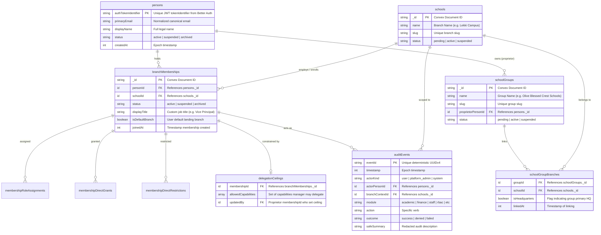
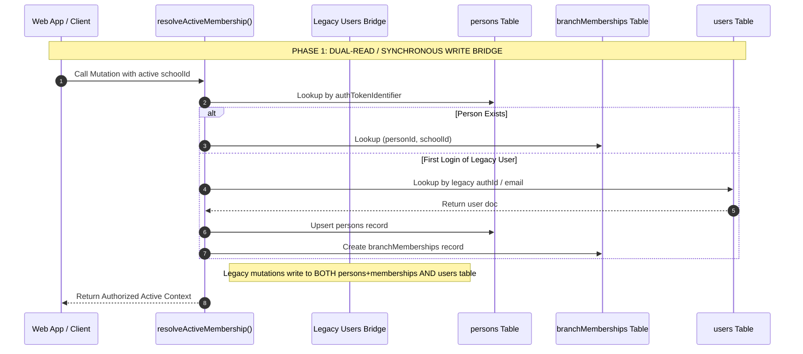
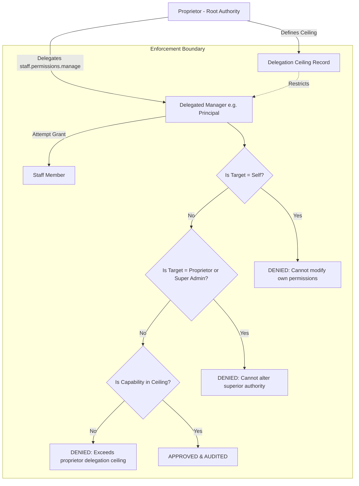
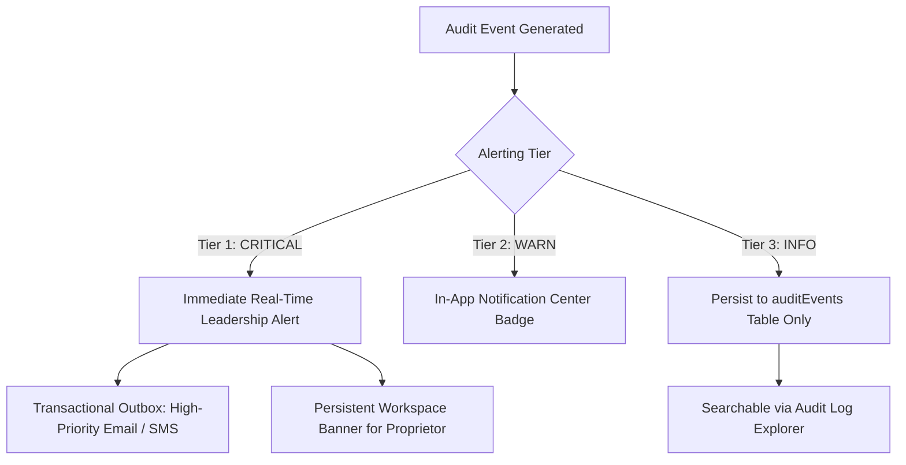
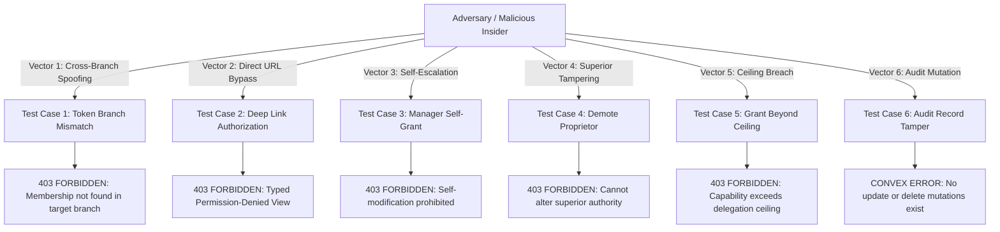
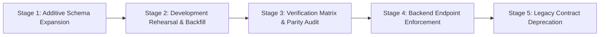

# D-02: Identity, Group, RBAC, and Audit Architecture (F2 / H2 / F1)

## 1. Document Header & Architectural Scope

### 1.1 Metadata
- **Document Identifier**: `MELO-SPEC-D02-IDENTITY-RBAC-AUDIT`
- **Feature Codes**: 
  - `F2`: School Groups and Multi-Branch Tenancy
  - `H2`: Granular Administrative RBAC and Authority Ceiling
  - `F1`: Application-Wide Append-Only Audit Log
- **Version**: `1.0.0`
- **Status**: Authoritative Technical & Architectural Specification
- **Effective Date**: 2026-09-03
- **Parent Orchestrator Session**: `orch-20260903-143249`
- **Authors**: Security Architect & Data Systems Modeler
- **Dependencies**: `docs/features/D01_ComplianceControlDossier.md` (Data Classifications & Statutory Controls)

---

### 1.2 Architectural Problem Statement
The historical Melo data model anchored user identity directly to a single school tenant via `users.schoolId`, relying on a coarse binary role flag (`users.role = "admin" || users.isSchoolAdmin === true`) and resolving sessions via `ctx.auth.getUserIdentity().subject` against Better Auth.

This single-school identity topology introduces severe architectural blockers for institutional multi-branch expansion:
1. **Multi-Branch Staff & Proprietor Duplication**: A proprietor or teacher operating across multiple campuses (e.g., Olive Blessed Crest Ikoyi and Lekki) was forced to maintain separate user accounts, juggle multiple credentials, or suffer cross-branch record corruption when `schoolId` was ambiguously resolved.
2. **Coarse Privilege Assignment & Over-Privileged Staff**: Operational staff (e.g., Bursar, Exam Officer, Admissions Registrar) were either granted blanket `admin` access—giving them dangerous control over bank credentials, staff salaries, and global settings—or relegated to non-admin roles unable to perform specialized functions.
3. **Privilege Escalation & Lack of Delegation Ceilings**: A delegated administrator could grant themselves root permissions, alter fellow administrators' rights, or modify the school proprietor's credentials without an authoritative ceiling.
4. **Fragmented, Mutable, or Unredacted Audit Trails**: Audit records were dispersed across disconnected domain tables (`admissionsAuditEvents`, `adminLeadershipAuditEvents`, `academicTimelineAuditEvents`) without uniform redaction standards, allowing sensitive financial account numbers and personal credentials to leak into log sinks.

### 1.3 Scope of this Architecture
This specification freezes the data model, API contracts, authority engine, and migration bridge to evolve Melo into a secure, multi-branch, capability-governed educational operating system:
- **Canonical Person Identity & Explicit Branch Memberships (`persons`, `branchMemberships`)**: Decouples the human identity from branch employment.
- **School Groups & Multi-Branch Linking (`schoolGroups`, `schoolGroupBranches`)**: Establishes multi-branch umbrella governance without merging or rekeying operational tenant records.
- **Legacy `users` Bridge**: Guarantees zero downtime, zero lockout, and backward compatibility for existing functions during the migration window.
- **Granular Capability RBAC (`permissionCatalog`, `roleTemplates`, `delegationCeilings`)**: Replaces binary roles with 47 typed capabilities across 8 domains, governed by mathematical evaluation and proprietor delegation ceilings.
- **Centralized Append-Only Redacted Audit Engine (`auditEvents`, `auditAlerts`)**: Enforces cryptographic and pattern-based redaction, multi-tier alerting, and 7-year/indefinite statutory retention.

---

### 1.4 Non-Negotiable Invariants

> [!IMPORTANT]
> **CORE ARCHITECTURAL INVARIANTS**:
> 1. **Branch Isolation First**: Every operational record (students, classes, grades, invoices, attendance, assets) retains an immutable branch `schoolId`. A group membership or umbrella link **never** grants implicit access to a branch. Every database query, mutation, action, and storage operation MUST validate explicit membership within the target branch.
> 2. **Backend is the Authoritative Security Boundary**: UI navigation hiding is an ergonomic convenience, not a security control. Every backend entry point independently verifies identity, active branch membership, and required capability. Direct URL navigation or forged API calls to unauthorized modules MUST yield a clean, typed `403 Forbidden` response.
> 3. **Strict Delegation Ceiling Enforcement**: Delegated managers (such as Principals granted staff management capabilities) CANNOT edit their own permissions, CANNOT alter the Proprietor or Platform Super Admins, and CANNOT grant any capability outside their explicitly defined `delegationCeiling`.
> 4. **Append-Only Truth & Snapshot Immutability**: Historical financial transactions, certified academic reports, authority adjustments, and audit events are strictly immutable. Corrections append new linked reversal or rectification events; they NEVER overwrite past records in place.
> 5. **Universal Audit Redaction**: Passwords, bearer tokens, API secrets, complete bank account numbers, and sensitive minor health notes are barred from audit persistence. Bank account numbers are permanently masked to their last 4 digits (`***-****-1234`).

---

## 2. Canonical Identity & Multi-Branch Tenancy Model (F2)

### 2.1 Entity Relationship Model



---

### 2.2 Convex Schema Definition (`schema.ts` Additions)

To maintain backward compatibility while introducing the multi-branch kernel, the following tables and indexes are added additively to `packages/convex/schema.ts`:

```typescript
// --- Multi-Branch Tenancy & Canonical Identity Kernel (F2 / H2) ---

export const personStatusValidator = v.union(
  v.literal("active"),
  v.literal("suspended"),
  v.literal("archived")
);

export const membershipStatusValidator = v.union(
  v.literal("active"),
  v.literal("suspended"),
  v.literal("archived")
);

export const schoolGroupStatusValidator = v.union(
  v.literal("pending"),
  v.literal("active"),
  v.literal("suspended")
);

// Canonical Global Identity
export const personsTable = defineTable({
  authTokenIdentifier: v.string(), // Guaranteed stable Convex tokenIdentifier
  betterAuthUserId: v.optional(v.string()), // Legacy Better Auth subject UUID
  primaryEmail: v.string(),
  phone: v.optional(v.string()),
  displayName: v.string(),
  firstName: v.optional(v.string()),
  lastName: v.optional(v.string()),
  avatarStorageId: v.optional(v.id("_storage")),
  status: personStatusValidator,
  createdAt: v.number(),
  updatedAt: v.number(),
})
  .index("by_auth_token_identifier", ["authTokenIdentifier"])
  .index("by_primary_email", ["primaryEmail"])
  .index("by_status", ["status"]);

// Explicit Branch Membership Boundary
export const branchMembershipsTable = defineTable({
  personId: v.id("persons"),
  schoolId: v.id("schools"),
  status: membershipStatusValidator,
  displayTitle: v.optional(v.string()), // e.g. "Vice Principal - Academics"
  isDefaultBranch: v.boolean(),
  joinedAt: v.number(),
  archivedAt: v.optional(v.number()),
  archivedBy: v.optional(v.id("persons")),
  createdAt: v.number(),
  updatedAt: v.number(),
})
  .index("by_person", ["personId"])
  .index("by_school", ["schoolId"])
  .index("by_person_and_school", ["personId", "schoolId"])
  .index("by_school_and_status", ["schoolId", "status"]);

// School Groups (Multi-Branch Umbrella)
export const schoolGroupsTable = defineTable({
  name: v.string(),
  slug: v.string(),
  proprietorPersonId: v.id("persons"),
  settingsVersion: v.number(),
  status: schoolGroupStatusValidator,
  createdAt: v.number(),
  updatedAt: v.number(),
})
  .index("by_slug", ["slug"])
  .index("by_proprietor", ["proprietorPersonId"])
  .index("by_status", ["status"]);

// Group-to-Branch Association
export const schoolGroupBranchesTable = defineTable({
  groupId: v.id("schoolGroups"),
  schoolId: v.id("schools"),
  isHeadquarters: v.boolean(),
  linkedAt: v.number(),
  linkedBy: v.id("persons"),
})
  .index("by_group", ["groupId"])
  .index("by_school", ["schoolId"])
  .index("by_group_and_school", ["groupId", "schoolId"]);
```

---

### 2.3 Legacy `users` Bridge & Backward Compatibility Layer

The existing codebase contains over 50 functions and queries dependent on `ctx.db.query("users")` and `user._id`. A breaking rewrite would introduce immediate regressions. Melo implements an **Additive Expand-and-Bridge Pattern** across three distinct phases:



#### Bridge Operation Rules
1. **Canonical Primary Write**: All new user onboarding, staff creation, and branch assignment mutations write primarily to `persons` and `branchMemberships`.
2. **Synchronous `users` Projection**: Whenever a `branchMemberships` row is created or modified, an internal database trigger/helper synchronously updates or inserts the corresponding `users` row:
   ```typescript
   // Synchronous compatibility projection into legacy `users` table
   export async function syncLegacyUserProjection(
     ctx: MutationCtx,
     personId: Id<"persons">,
     schoolId: Id<"schools">
   ): Promise<Id<"users">> {
     const person = await ctx.db.get(personId);
     const membership = await ctx.db
       .query("branchMemberships")
       .withIndex("by_person_and_school", (q) =>
         q.eq("personId", personId).eq("schoolId", schoolId)
       )
       .unique();

     if (!person || !membership) {
       throw new ConvexError("Cannot project non-existent membership");
     }

     const existingUser = await ctx.db
       .query("users")
       .withIndex("by_school_and_email", (q) =>
         q.eq("schoolId", schoolId).eq("email", person.primaryEmail)
       )
       .first();

     const now = Date.now();
     if (existingUser) {
       await ctx.db.patch(existingUser._id, {
         authTokenIdentifier: person.authTokenIdentifier,
         name: person.displayName,
         firstName: person.firstName,
         lastName: person.lastName,
         phone: person.phone,
         isArchived: membership.status === "archived",
         updatedAt: now,
       });
       return existingUser._id;
     }

     return await ctx.db.insert("users", {
       schoolId,
       authId: person.betterAuthUserId ?? person.authTokenIdentifier,
       authTokenIdentifier: person.authTokenIdentifier,
       name: person.displayName,
       firstName: person.firstName,
       lastName: person.lastName,
       email: person.primaryEmail,
       phone: person.phone,
       role: "admin", // default safe compatibility role
       isSchoolAdmin: true,
       isArchived: membership.status === "archived",
       createdAt: now,
       updatedAt: now,
     });
   }
   ```
3. **Migration Phasing**:
   - **Phase 1 (Dual-Write Bridge)**: `branchMemberships` created alongside `users`. Resolvers check `authTokenIdentifier` on `persons` first, falling back to `users.authId`.
   - **Phase 2 (Function Migration)**: Core subsystems (Academics, Billing, Admissions) migrated to accept `membershipId` and `personId`.
   - **Phase 3 (Legacy Read-Only)**: `users` table converted into a read-only historical view.
   - **Phase 4 (Deprecation & Archive)**: `users` table archived after verification matrix passes 100%.

---

### 2.4 Active Branch Selection & Session Scoping Contract

#### The Session Scoping Boundary
In a multi-branch environment, a user (e.g., Proprietor or Traveling Teacher) possesses multiple valid branch memberships. The client application maintains an `activeSchoolId` in application state (persisted in secure session storage). 

> [!CAUTION]
> **ZERO CLIENT TRUST**:
> The client-supplied `activeSchoolId` is treated strictly as an **untrusted request argument**. The backend NEVER accepts assertions such as `role`, `isSchoolAdmin`, or `permissions` from the client. Every incoming query and mutation must resolve authority through `resolveActiveMembership(ctx, requestedSchoolId)`.

#### Authoritative Backend Resolution Flow
```typescript
export interface ActiveMembershipContext {
  person: Doc<"persons">;
  membership: Doc<"branchMemberships">;
  school: Doc<"schools">;
  group: Doc<"schoolGroups"> | null;
  isProprietor: boolean;
  isPlatformAdmin: boolean;
  effectiveCapabilities: Set<PermissionCapability>;
}

export async function resolveActiveMembership(
  ctx: QueryCtx | MutationCtx,
  requestedSchoolId: Id<"schools">
): Promise<ActiveMembershipContext> {
  const identity = await ctx.auth.getUserIdentity();
  if (!identity) {
    throw new ConvexError({ code: "UNAUTHENTICATED", message: "User must be authenticated." });
  }

  const tokenIdentifier = identity.tokenIdentifier;

  // 1. Check Platform Super Admin (System Support Boundary)
  const platformAdmin = await ctx.db
    .query("platformAdmins")
    .withIndex("by_auth_token_identifier", (q) =>
      q.eq("authTokenIdentifier", tokenIdentifier)
    )
    .first();

  if (platformAdmin) {
    if (!platformAdmin.isActive) {
      throw new ConvexError({ code: "FORBIDDEN", message: "Platform admin account is inactive." });
    }
    const school = await ctx.db.get(requestedSchoolId);
    if (!school) {
      throw new ConvexError({ code: "NOT_FOUND", message: "Target school does not exist." });
    }

    // Return platform admin context with audited support capabilities
    return {
      person: {
        _id: "platform_admin" as any,
        _creationTime: platformAdmin.createdAt,
        authTokenIdentifier,
        primaryEmail: platformAdmin.email,
        displayName: platformAdmin.name,
        status: "active",
        createdAt: platformAdmin.createdAt,
        updatedAt: platformAdmin.updatedAt,
      },
      membership: {
        _id: "platform_membership" as any,
        _creationTime: platformAdmin.createdAt,
        personId: "platform_admin" as any,
        schoolId: requestedSchoolId,
        status: "active",
        displayTitle: "Platform Super Admin",
        isDefaultBranch: false,
        joinedAt: platformAdmin.createdAt,
        createdAt: platformAdmin.createdAt,
        updatedAt: platformAdmin.updatedAt,
      },
      school,
      group: null,
      isProprietor: false,
      isPlatformAdmin: true,
      effectiveCapabilities: new Set(["system.tenant.recover", "audit.branch.view"]),
    };
  }

  // 2. Resolve Canonical Person Record
  let person = await ctx.db
    .query("persons")
    .withIndex("by_auth_token_identifier", (q) =>
      q.eq("authTokenIdentifier", tokenIdentifier)
    )
    .first();

  // Fallback: Resolve via legacy user email during migration
  if (!person && identity.email) {
    person = await ctx.db
      .query("persons")
      .withIndex("by_primary_email", (q) => q.eq("primaryEmail", identity.email!))
      .first();
  }

  if (!person) {
    throw new ConvexError({ code: "IDENTITY_NOT_FOUND", message: "No registered person found for credentials." });
  }

  if (person.status === "suspended" || person.status === "archived") {
    throw new ConvexError({ code: "ACCOUNT_LOCKED", message: "Account has been suspended or archived." });
  }

  // 3. Resolve Target School Branch
  const school = await ctx.db.get(requestedSchoolId);
  if (!school) {
    throw new ConvexError({ code: "BRANCH_NOT_FOUND", message: "Specified school branch does not exist." });
  }

  if (school.status === "suspended") {
    throw new ConvexError({ code: "WORKSPACE_SUSPENDED", message: "This school branch is suspended by platform administration." });
  }

  // 4. Resolve Explicit Branch Membership
  const membership = await ctx.db
    .query("branchMemberships")
    .withIndex("by_person_and_school", (q) =>
      q.eq("personId", person._id).eq("schoolId", requestedSchoolId)
    )
    .unique();

  if (!membership || membership.status !== "active") {
    throw new ConvexError({
      code: "MEMBERSHIP_REQUIRED",
      message: `Access denied. You hold no active membership in ${school.name}.`,
    });
  }

  // 5. Resolve Group Association & Proprietor Ownership
  const groupLink = await ctx.db
    .query("schoolGroupBranches")
    .withIndex("by_school", (q) => q.eq("schoolId", requestedSchoolId))
    .first();

  let group: Doc<"schoolGroups"> | null = null;
  let isProprietor = false;

  if (groupLink) {
    group = await ctx.db.get(groupLink.groupId);
    if (group && group.proprietorPersonId === person._id) {
      isProprietor = true;
    }
  }

  // 6. Compute Effective Capabilities via RBAC Engine
  const effectiveCapabilities = await evaluateEffectiveCapabilities(ctx, membership._id, isProprietor);

  return {
    person,
    membership,
    school,
    group,
    isProprietor,
    isPlatformAdmin: false,
    effectiveCapabilities,
  };
}
```

---

## 3. Granular RBAC & Authority Ceiling Model (H2)

### 3.1 Separation of Display Title vs Authorization Capabilities

In traditional school management systems, a job title (e.g. "Vice Principal") is hardcoded to a fixed permission set. In Melo:
1. **Display Title (`branchMemberships.displayTitle`)**: A cosmetic, administrative attribute (e.g. "Vice Principal - Academics & Pastoral Care", "Dean of Science", "Head of Junior School"). Displayed on report cards, public school web pages, and internal staff directories.
2. **Authorization Capabilities (`membershipRoleAssignments` + Direct Grants)**: A strictly typed mathematical set of granular permissions evaluated server-side. A "Vice Principal" may be assigned the base template `principal` plus `exam_officer`, granting assessment finalization powers without requiring arbitrary code changes.

---

### 3.2 Standard Base Role Templates

Melo defines seven (7) standardized, factory-seeded base role templates. A user's baseline capability set is the **Union** of all templates assigned to their membership.

| Role Template Key | Template Name | Strategic Organizational Scope | Default Capabilities Included |
|---|---|---|---|
| `proprietor` | **Proprietor (School Owner)** | Ultimate institutional ownership, financial accounts, group governance, root delegation, audit oversight. | **ALL** 47 capabilities (full root authority across the school branch and group). |
| `principal` | **Principal / Head of School** | Operational leadership, faculty supervision, academic policy execution, student discipline, admissions overview. | Academic (all except final publish), Enrollment (all except number override), Staff (onboard, profiles, view), Settings (general, branding), Assets (view, upload, trash), Audit (branch view). |
| `academic_director` | **Academic Director** | Curriculum governance, timetable management, subject catalogs, grading bands, teacher allocations. | `academic.curriculum.manage`, `academic.classes.manage`, `academic.subjects.manage`, `academic.timetables.manage`, `academic.grading_bands.manage`, `staff.assignments.manage`. |
| `exam_officer` | **Examination Officer** | CA scoring audits, score overrides, grade locks, report card remarks, final report card publishing. | `academic.assessments.enter`, `academic.assessments.adjust`, `academic.report_cards.preview`, `academic.report_cards.publish_final`, `academic.grading_bands.manage`. |
| `bursar` | **Bursar / Finance Officer** | Student fee plans, invoicing, offline payment reconciliation, Paystack split monitoring, debt recovery. | `finance.fee_plans.manage`, `finance.invoices.issue`, `finance.payments.record_manual`, `finance.reports.view`, `finance.bank_details.manage` (if explicitly delegated). |
| `registrar` | **Registrar / Admissions Officer** | Admissions intake configuration, application triage, guardian identity verification, sequential admission number issuance. | `enrollment.applications.list`, `enrollment.applications.view_basic`, `enrollment.applications.view_sensitive`, `enrollment.documents.review`, `enrollment.decisions.record`, `enrollment.intakes.manage`. |
| `staff_administrator` | **Staff Administrator** | Staff directory onboarding, teacher timetable assignment, institutional email mailbox approval (H5). | `staff.list.view`, `staff.onboard`, `staff.profiles.edit`, `staff.assignments.manage`, `settings.domains.request`. |

---

### 3.3 The Capability Catalog (`permissionCatalog`)

Melo implements a closed, strictly typed capability catalog comprising 47 permissions across eight (8) domains.

```typescript
export const permissionDomainValidator = v.union(
  v.literal("academic"),
  v.literal("enrollment"),
  v.literal("finance"),
  v.literal("staff"),
  v.literal("settings"),
  v.literal("assets"),
  v.literal("audit"),
  v.literal("system")
);

export type PermissionCapability =
  // Academic Domain
  | "academic.curriculum.manage"
  | "academic.classes.manage"
  | "academic.subjects.manage"
  | "academic.timetables.manage"
  | "academic.grading_bands.manage"
  | "academic.assessments.enter"
  | "academic.assessments.adjust"
  | "academic.report_cards.preview"
  | "academic.report_cards.publish_final" // SENSITIVE
  // Enrollment Domain
  | "enrollment.intakes.manage"
  | "enrollment.applications.list"
  | "enrollment.applications.view_basic"
  | "enrollment.applications.view_sensitive"
  | "enrollment.documents.review"
  | "enrollment.decisions.record"
  | "enrollment.admissions.override_number" // SENSITIVE
  // Finance Domain
  | "finance.fee_plans.manage"
  | "finance.invoices.issue"
  | "finance.payments.record_manual"
  | "finance.reports.view"
  | "finance.settlements.view"
  | "finance.bank_details.manage" // SENSITIVE
  // Staff & User Domain
  | "staff.list.view"
  | "staff.onboard"
  | "staff.profiles.edit"
  | "staff.assignments.manage"
  | "staff.permissions.manage" // SENSITIVE
  | "staff.account.suspend" // SENSITIVE
  | "staff.password.reset" // SENSITIVE
  // Settings Domain
  | "settings.general.view"
  | "settings.general.edit"
  | "settings.branding.manage"
  | "settings.domains.request"
  | "settings.domains.manage" // SENSITIVE
  // Assets Domain
  | "assets.library.view"
  | "assets.upload"
  | "assets.download.standard"
  | "assets.download.sensitive"
  | "assets.trash.manage"
  | "assets.permanent_delete" // SENSITIVE
  | "assets.group_share.manage"
  // Audit Domain
  | "audit.branch.view"
  | "audit.group.view" // SENSITIVE
  | "audit.export.csv" // SENSITIVE
  | "audit.export.pdf" // SENSITIVE
  // System Domain
  | "system.migration.execute" // SENSITIVE
  | "system.bulk_purge" // SENSITIVE
  | "system.tenant.recover"; // SENSITIVE
```

#### Sensitive Capabilities Register
The following eleven (11) capabilities carry profound security, financial, or legal risk and are decoupled from general administrative templates:

1. `staff.permissions.manage`: Ability to assign role templates, direct grants, or modify user permissions. Restricted to Proprietor and delegated managers with an active delegation ceiling.
2. `finance.bank_details.manage`: Ability to add, modify, or archive school settlement bank accounts (H3). Requires high-priority leadership alerts.
3. `academic.report_cards.publish_final`: Ability to freeze, lock, and publish official terminal report cards.
4. `enrollment.admissions.override_number`: Ability to bypass atomic sequential admission numbering and manually allocate a student ID (H4).
5. `audit.export.csv` & `audit.export.pdf`: Bulk extraction of immutable school audit trails.
6. `staff.password.reset` & `staff.account.suspend`: Account takeover and access revocation powers.
7. `assets.permanent_delete`: Destruction of stored school assets bypassing the 30-day Trash window (H9).
8. `settings.domains.manage`: Authority to link external Google/Microsoft/Zoho email domains (H5).
9. `system.migration.execute` & `system.bulk_purge`: Database mutation and purging operations.
10. `system.tenant.recover`: Emergency account recovery.

---

### 3.4 Permission Evaluator Formula & Engine Contract

```
EffectivePermissions = ( ⋃ TemplateCapabilities ) ∪ DirectGrants ∖ DirectRestrictions
```

#### Evaluation Engine Implementation
```typescript
export async function evaluateEffectiveCapabilities(
  ctx: QueryCtx | MutationCtx,
  membershipId: Id<"branchMemberships">,
  isProprietor: boolean
): Promise<Set<PermissionCapability>> {
  // 1. Proprietor bypass: School group owner holds full capability set
  if (isProprietor) {
    return new Set(ALL_CAPABILITIES_CATALOG);
  }

  // 2. Fetch Assigned Base Role Templates
  const templateAssignments = await ctx.db
    .query("membershipRoleAssignments")
    .withIndex("by_membership", (q) => q.eq("membershipId", membershipId))
    .collect();

  const effective = new Set<PermissionCapability>();

  for (const assignment of templateAssignments) {
    const templateCapabilities = ROLE_TEMPLATE_DEFINITIONS[assignment.roleTemplateKey] ?? [];
    for (const cap of templateCapabilities) {
      effective.add(cap);
    }
  }

  // 3. Apply Direct Capability Grants (+)
  const directGrants = await ctx.db
    .query("membershipDirectGrants")
    .withIndex("by_membership", (q) => q.eq("membershipId", membershipId))
    .collect();

  for (const grant of directGrants) {
    effective.add(grant.capability as PermissionCapability);
  }

  // 4. Apply Direct Capability Restrictions (-)
  const directRestrictions = await ctx.db
    .query("membershipDirectRestrictions")
    .withIndex("by_membership", (q) => q.eq("membershipId", membershipId))
    .collect();

  for (const restriction of directRestrictions) {
    effective.delete(restriction.capability as PermissionCapability);
  }

  return effective;
}
```

#### Read-Only Permission Preview Engine
Before committing changes to a staff member's permissions, administrators must be able to preview the effective outcome. Melo exposes `previewEffectivePermissions`:
- **Purity**: Evaluates candidate templates, grants, and restrictions in memory without mutating database state.
- **Identical Logic**: Uses the exact mathematical evaluator formula, preventing parity drift between UI previews and backend enforcement.

---

### 3.5 Proprietor Authority & Delegation Ceiling

To prevent administrative privilege escalation while allowing institutional delegation:



#### The Six Rules of Delegated Authority
1. **No Self-Modification**: A delegated manager CANNOT grant capabilities to themselves, remove their own restrictions, or modify their own delegation ceiling.
2. **No Superior or Peer Alteration**: A delegated manager CANNOT alter, suspend, or revoke permissions of the Proprietor, Platform Super Admins, or any administrator with authority equal to or higher than themselves.
3. **Strict Ceiling Bound**: A delegated manager holding `staff.permissions.manage` CAN ONLY grant capabilities that are explicitly present in their `delegationCeilings.allowedCapabilities`.
4. **Possession != Delegation Power**: Possessing a capability does NOT confer the right to delegate it. For example, a Principal who holds `academic.report_cards.publish_final` CANNOT grant that capability to a teacher unless `academic.report_cards.publish_final` is explicitly enumerated in the Principal's delegation ceiling.
5. **Proprietor Sole Custody of Permission Management**: Only the Proprietor (or Platform Super Admin during audited recovery) can grant or expand the `staff.permissions.manage` capability.
6. **Immutable Authority Audit**: Every change to role assignments, direct grants, restrictions, or delegation ceilings emits an immutable `authorityChanges` audit event capturing the grantor, recipient, before/after sets, and reason.

---

### 3.6 Platform Super Admin Support & Emergency Recovery Contract

1. **Isolation from Operational Data**: Platform Super Admins do not possess blanket access to student grades, parent invoices, or medical records. Platform administration is confined to tenant lifecycle, database health, billing settlement, and emergency account recovery.
2. **Audited Break-Glass Recovery**: In the event that a school proprietor loses access to their account:
   - A Platform Super Admin can execute `recoverSchoolProprietor(ctx, { schoolId, newProprietorEmail, justification })`.
   - The recovery requires two-person verification or an authenticated statutory support ticket.
   - The operation generates a high-severity `auditEvents` record dispatched directly to the school's registered legal contact address.

---

## 4. Append-Only Audit Log & Redaction Contract (F1)

### 4.1 Audit Event Schema (`auditEvents`)

Melo consolidates all system audit logging into a single, high-performance, append-only table in Convex:

```typescript
export const auditActorKindValidator = v.union(
  v.literal("user"),
  v.literal("platform_admin"),
  v.literal("system")
);

export const auditOutcomeValidator = v.union(
  v.literal("success"),
  v.literal("denied"),
  v.literal("failed")
);

export const auditRetentionClassValidator = v.union(
  v.literal("operational_7yr"), // Standard operational records
  v.literal("permanent_statutory") // Ownership, financial, academic certificates, security
);

export const auditEventsTable = defineTable({
  eventId: v.string(), // Deterministic UUIDv4
  timestamp: v.number(), // Epoch milliseconds
  actorKind: auditActorKindValidator,
  actorPersonId: v.optional(v.id("persons")),
  actorMembershipId: v.optional(v.id("branchMemberships")),
  actorEmailSnapshot: v.string(),
  actorIpHash: v.optional(v.string()), // SHA-256 hashed IP for forensic non-repudiation
  groupContextId: v.optional(v.id("schoolGroups")),
  branchContextId: v.id("schools"), // Mandatory tenant isolation boundary
  module: v.string(), // e.g. "academic", "finance", "staff", "rbac", "settings"
  action: v.string(), // e.g. "role_assigned", "bank_account_modified", "grade_overridden"
  targetType: v.string(), // e.g. "student", "invoice", "bank_account", "branchMembership"
  targetId: v.string(), // Primary identifier of affected entity
  outcome: auditOutcomeValidator,
  safeSummary: v.string(), // Human-readable redacted narrative
  beforeSummary: v.optional(v.string()), // Redacted JSON string of prior state
  afterSummary: v.optional(v.string()), // Redacted JSON string of new state
  correlationId: v.string(), // Traceability ID linking related operations
  retentionClass: auditRetentionClassValidator,
  createdAt: v.number(),
})
  .index("by_branch_and_timestamp", ["branchContextId", "timestamp"])
  .index("by_group_and_timestamp", ["groupContextId", "timestamp"])
  .index("by_actor_and_timestamp", ["actorPersonId", "timestamp"])
  .index("by_target_and_timestamp", ["targetType", "targetId", "timestamp"])
  .index("by_module_and_action", ["branchContextId", "module", "action"]);
```

---

### 4.2 Universal Redaction Pipeline & Rules

Under NDPA 2023 Section 24 and statutory child privacy standards, audit logs must never act as a secondary data leakage vector. The audit writer enforces an authoritative sanitization pipeline prior to persistence:

```mermaid
flowchart LR
    RawInput[Incoming Mutation State] --> Sanitize[sanitizeAuditPayload]
    
    subgraph RedactionRules [Sanitization Filters]
        R1[Passwords & Bearer Tokens -> [REDACTED_SECRET]]
        R2[Bank Account Numbers -> Mask to ***-****-1234]
        R3[NIN & Passports -> Mask to ***-****-5678]
        R4[Minor Health & Medical -> [CONFIDENTIAL_MEDICAL_NOTE]]
        R5[Binary Documents -> Replace with SHA-256 + Size]
    end
    
    Sanitize --> RedactionRules
    RedactionRules --> Insert[ctx.db.insert 'auditEvents']
```

#### Strict Field Redaction Specifications
1. **Authentication Secrets**: Any key named `password`, `hash`, `secret`, `token`, `authTokenIdentifier`, `apiKey`, or `bearer` is stripped and replaced with `[REDACTED_SECRET]`.
2. **Bank Account Numbers**: Full bank account numbers (10 digits in Nigeria NUBAN) are permanently masked: `0123456789` -> `***-****-6789`.
3. **Government Identification Numbers**: NIN, Driver's License, or International Passport numbers are masked: `***-****-1234`.
4. **Minor Special Category Data**: Student health records, allergies, and safeguarding incident notes are redacted to `[CONFIDENTIAL_MEDICAL_RECORD]` or `[RESTRICTED_SAFEGUARDING_RECORD]`.
5. **Binary & Large Document Payloads**: File contents, base64 images, or spreadsheet imports are never stringified into audit rows. The audit entry logs only `{ storageId, fileName, sha256Checksum, byteSize }`.

---

### 4.3 Multi-Tier Alerting Architecture

To protect against administrative compromise without flooding leadership with routine operational noise, audit events are triaged into three alerting tiers:



| Alert Tier | Triggering Security & Administrative Events | Immediate Notification Target | Action & Remediation Flow |
|---|---|---|---|
| **Tier 1: CRITICAL** | 1. Modification of school settlement bank accounts.<br>2. Assignment of `staff.permissions.manage` capability.<br>3. Expansion of a manager's delegation ceiling.<br>4. Emergency proprietor account recovery.<br>5. Permanent purge of school assets or database records.<br>6. Bulk student or staff account suspension. | School Proprietor, Principal, and Affected Administrator. | In-app push notification + immediate email dispatch with 1-click verification link to review and freeze unauthorized changes. |
| **Tier 2: WARN** | 1. Final publication of terminal report cards.<br>2. Manual continuous assessment score override.<br>3. Manual sequential admission number override (H4).<br>4. CSV or PDF export of school audit log.<br>5. Bulk student import commit. | Relevant Department Heads (Principal, Bursar, Exam Officer). | In-app notification center badge with link to detailed audit inspection modal. |
| **Tier 3: INFO** | 1. Daily student attendance marking.<br>2. Regular teacher continuous assessment score entries.<br>3. Non-sensitive staff profile updates.<br>4. Fee invoice creation and standard payment allocations. | None (Silent persistence). | Searchable via audit log UI; filtered out of notification feeds. |

---

### 4.4 Retention & Export Contracts

#### Statutory Retention Policies
- **Operational Records (`retentionClass = "operational_7yr"`)**: Retained for a minimum of seven (7) calendar years following the academic year of creation, compliant with statutory tax (FIRS/CAMA) and education ministry baselines. Eligible for automated cold-archive purging post-7-years.
- **Statutory & Ownership Records (`retentionClass = "permanent_statutory"`)**: Retained **indefinitely**. Includes all ownership recovery, bank credential changes, certified academic grade finalizations, and role/permission grants.

#### Export API Contract (CSV & PDF)
- **RBAC Gated**: Access requires `audit.export.csv` or `audit.export.pdf`.
- **Tenant & Scope Filtered**:
  - Platform Super Admin: Can export cross-branch support audits.
  - Proprietor: Can export entire group audit history.
  - Principal: Can export branch audit history.
  - Delegated Staff: Can export only permitted module history.
- **Redaction Maintained**: Export pipelines read from the already-sanitized `auditEvents` table; masked bank account numbers and masked phone numbers remain masked in the exported CSV and PDF documents.

---

## 5. Complete Endpoint Enforcement Inventory

Every Convex function, HTTP action, and storage route is cataloged with its authoritative capability check, tenant scoping boundary, and emitted audit event:

| Module / Route | Endpoint Name & Type | Required Capability | Scope & Tenant Check | Emitted Audit Action | Alert Tier |
|---|---|---|---|---|---|
| **Academic** | `academic.assessments:saveScore` (Mutation) | `academic.assessments.enter` | Branch active membership; teacher subject assignment verified. | `assessment_score_entered` | Tier 3 (INFO) |
| **Academic** | `academic.assessments:adjustScore` (Mutation) | `academic.assessments.adjust` | Branch active membership; requires explicit written justification. | `assessment_score_adjusted` | Tier 2 (WARN) |
| **Academic** | `academic.reportCards:publishTerminal` (Mutation) | `academic.report_cards.publish_final` | Branch active membership; verifies all subject grade sheets locked. | `report_cards_final_published` | Tier 2 (WARN) |
| **Academic** | `academic.curriculum:updateGradingBand` (Mutation) | `academic.grading_bands.manage` | Branch active membership; checks snapshot rendering compatibility. | `grading_band_updated` | Tier 2 (WARN) |
| **Enrollment** | `admissions.intakes:createIntake` (Mutation) | `enrollment.intakes.manage` | Branch active membership. | `admissions_intake_created` | Tier 3 (INFO) |
| **Enrollment** | `admissions.applications:viewSensitive` (Query) | `enrollment.applications.view_sensitive` | Branch active membership; audits read access to minor documents. | `application_sensitive_viewed` | Tier 3 (INFO) |
| **Enrollment** | `admissions.decisions:recordDecision` (Mutation) | `enrollment.decisions.record` | Branch active membership. | `admission_decision_recorded` | Tier 3 (INFO) |
| **Enrollment** | `admissions.numbers:overrideNumber` (Mutation) | `enrollment.admissions.override_number` | Branch active membership; requires reason & uniqueness check. | `admission_number_overridden` | Tier 2 (WARN) |
| **Finance** | `finance.billing:createFeePlan` (Mutation) | `finance.fee_plans.manage` | Branch active membership. | `fee_plan_created` | Tier 3 (INFO) |
| **Finance** | `finance.invoices:issueStudentInvoice` (Mutation) | `finance.invoices.issue` | Branch active membership; snapshots bank transfer instructions. | `student_invoice_issued` | Tier 3 (INFO) |
| **Finance** | `finance.payments:recordManualReceipt` (Mutation) | `finance.payments.record_manual` | Branch active membership. | `manual_payment_recorded` | Tier 3 (INFO) |
| **Finance** | `finance.bankAccounts:modifyAccount` (Mutation) | `finance.bank_details.manage` | Branch active membership; masks before/after numbers. | `bank_account_modified` | **Tier 1 (CRITICAL)** |
| **Staff & RBAC** | `staff.members:onboardStaff` (Mutation) | `staff.onboard` | Branch active membership. | `staff_member_onboarded` | Tier 3 (INFO) |
| **Staff & RBAC** | `staff.rbac:assignRoleTemplates` (Mutation) | `staff.permissions.manage` | Branch active membership; enforces delegation ceiling & anti-self-edit. | `role_templates_assigned` | **Tier 1 (CRITICAL)** |
| **Staff & RBAC** | `staff.rbac:setDirectGrant` (Mutation) | `staff.permissions.manage` | Branch active membership; verifies grant is within delegation ceiling. | `direct_grant_configured` | **Tier 1 (CRITICAL)** |
| **Staff & RBAC** | `staff.rbac:updateCeiling` (Mutation) | `Proprietor Only` | Branch active membership; restricted strictly to school group owner. | `delegation_ceiling_updated` | **Tier 1 (CRITICAL)** |
| **Staff & RBAC** | `staff.security:suspendAccount` (Mutation) | `staff.account.suspend` | Branch active membership; cannot suspend superiors. | `staff_account_suspended` | **Tier 1 (CRITICAL)** |
| **Settings** | `settings.branding:updateTheme` (Mutation) | `settings.branding.manage` | Branch active membership. | `school_branding_updated` | Tier 3 (INFO) |
| **Settings** | `settings.domains:configureMailbox` (Mutation) | `settings.domains.manage` | Branch active membership; verifies domain DNS ownership. | `email_domain_configured` | **Tier 1 (CRITICAL)** |
| **Assets** | `assets.library:generateUploadUrl` (Mutation) | `assets.upload` | Branch active membership; checks tenant quota allowance (H8). | `asset_upload_initiated` | Tier 3 (INFO) |
| **Assets** | `assets.library:moveToTrash` (Mutation) | `assets.trash.manage` | Branch active membership. | `asset_moved_to_trash` | Tier 3 (INFO) |
| **Assets** | `assets.library:purgePermanent` (Mutation) | `assets.permanent_delete` | Branch active membership; verifies no active retention hold exists. | `asset_permanently_purged` | **Tier 1 (CRITICAL)** |
| **Audit** | `audit.logs:queryEvents` (Query) | `audit.branch.view` | Branch active membership; filters by caller's module capabilities. | None (Query read) | None |
| **Audit** | `audit.export:exportCsv` (Action) | `audit.export.csv` | Branch active membership; applies universal redaction to CSV stream. | `audit_log_exported_csv` | Tier 2 (WARN) |
| **Audit** | `audit.export:exportPdf` (Action) | `audit.export.pdf` | Branch active membership; renders masked printable audit document. | `audit_log_exported_pdf` | Tier 2 (WARN) |
| **System** | `platform.recovery:recoverProprietor` (Mutation) | `Platform Admin Only` | Platform Super Admin context; requires ticket verification. | `proprietor_account_recovered` | **Tier 1 (CRITICAL)** |

---

## 6. Threat Model & Negative-Test Matrix

To verify that the implementation resists real-world attacks, privilege escalations, and cross-tenant leakage, the test suite must satisfy the following negative-test matrix:



### 6.1 Attack Scenarios & Automated Verification Suite

| Test ID | Attack Scenario & Target Vector | Precondition / Threat Setup | Execution / Attack Payload | Authoritative Expected Behavior & Rejection Assertion |
|---|---|---|---|---|
| **SEC-NEG-01** | **Cross-Branch Access via Spoofed `schoolId`** | User Alice holds an active teacher membership in Branch A (Ikoyi) but NO membership in Branch B (Lekki). | Alice authenticates with valid Branch A token, but invokes `academic.assessments:saveScore` with `schoolId = Branch_B_ID`. | **REJECT with 403 Forbidden**: `resolveActiveMembership` detects no active membership for Alice in Branch B. Zero database records read or written. |
| **SEC-NEG-02** | **Direct URL / Route Navigation Bypass** | Teacher Bob does not possess the `finance.reports.view` capability. Admin UI navigation hides the `/finance` link. | Bob bypasses UI navigation and types `https://admin.meloschool.com/finance/reports` directly or calls `finance.reports:getSummary`. | **REJECT with 403 Forbidden**: The backend query rejects execution with `{ code: "FORBIDDEN", capability: "finance.reports.view" }`. UI renders typed Permission-Denied error page, NOT a misleading 404. |
| **SEC-NEG-03** | **Delegated Manager Self-Escalation** | Principal Carol holds `staff.permissions.manage` with a delegation ceiling covering academic capabilities. | Carol calls `staff.rbac:setDirectGrant` targeting her own `membershipId` with capability `finance.bank_details.manage`. | **REJECT with 403 Forbidden**: Evaluator asserts `actorMembershipId !== targetMembershipId`. Self-modification is strictly rejected. Emits Tier 1 security alert. |
| **SEC-NEG-04** | **Privilege Escalation Against Superior Authority** | Principal Carol attempts to revoke the Proprietor's administrative roles or alter the Proprietor's email address. | Carol calls `staff.rbac:assignRoleTemplates` targeting the school Proprietor's `membershipId`. | **REJECT with 403 Forbidden**: Evaluator asserts target authority level. Delegated managers cannot alter users with equal or greater authority. |
| **SEC-NEG-05** | **Delegation Beyond Proprietor Ceiling** | Principal Carol possesses `staff.permissions.manage`. Her delegation ceiling contains only Academic capabilities. | Carol attempts to grant `finance.invoices.issue` to teacher Dave. | **REJECT with 403 Forbidden**: System checks Carol's `delegationCeilings.allowedCapabilities`. Since `finance.invoices.issue` is absent, the mutation aborts immediately. |
| **SEC-NEG-06** | **Audit Log Immutability & Deletion Tampering** | Malicious administrator Eve attempts to cover her tracks after unauthorized data modifications. | Eve calls an internal mutation or CLI command attempting `ctx.db.delete(auditEventId)` or `ctx.db.patch(auditEventId, ...)`. | **REJECT at Engine Level**: The Convex API exposes NO update or delete mutations for `auditEvents`. Schema definitions omit modification endpoints. Attempt logged as anomaly. |
| **SEC-NEG-07** | **Group Umbrella Leakage via Unlinked Branch** | Olive Blessed Crest Group contains Branch 1 and Branch 2. Branch 3 belongs to an unrelated school group. | Administrator Frank of Branch 1 attempts to query aggregate statistics passing `schoolId = Branch_3_ID`. | **REJECT with 403 Forbidden**: Group linkage lookup verifies that Branch 3 is not associated with Frank's group. Frank's active membership in Branch 1 confers zero access. |
| **SEC-NEG-08** | **Lockout Prevention During Migration Transition** | Existing admin George is registered only in the legacy `users` table with `isSchoolAdmin = true`. | George logs in for the first time during Phase 1 migration before explicit `branchMemberships` backfill runs. | **SUCCESSFUL FALLBACK RESOLUTION**: Migration auth bridge intercepts the request, identifies George's active legacy `users` row, provisions his canonical `persons` and `branchMemberships` rows, and grants full baseline admin access without disruption. |
| **SEC-NEG-09** | **Masked Bank Account Leakage in Audit Exports** | Authorized auditor Helen requests a full CSV export of school audit logs (`audit.export:exportCsv`). | Helen downloads the generated CSV file containing recent bank detail modifications. | **ASSERT REDACTION**: The CSV output displays bank account numbers strictly as `***-****-1234`. Full NUBAN digits are absent from the export stream. |
| **SEC-NEG-10** | **Suspended School Tenant Access Block** | School Branch Lekki is suspended by Platform Super Admin due to non-payment or compliance investigation. | School Principal attempts to log in and query student rosters. | **REJECT with 403 Forbidden**: `resolveActiveMembership` evaluates `school.status === "suspended"` and rejects all operational access with clear advisory message. |

---

## 7. Migration, Deployment & Verification Sequencing

To deliver this architecture safely into production without service disruption, the program follows the five-stage migration lifecycle:



1. **Stage 1: Additive Schema Expansion (M1)**:
   - Deploy `persons`, `branchMemberships`, `schoolGroups`, `schoolGroupBranches`, and RBAC tables to the development database.
   - Add new indexes (`by_auth_token_identifier`, `by_person_and_school`) alongside existing `users` indexes.
2. **Stage 2: Development Rehearsal & Backfill (M1 / D-05)**:
   - Execute read-only production snapshot restore into backed-up development environment.
   - Run idempotent migration runner `backfillCanonicalIdentityFromUsers`:
     - Creates `persons` from unique `users.email` and `users.authTokenIdentifier`.
     - Creates `branchMemberships` for each `(userId, schoolId)` pair.
     - Seeds default `proprietor` and `principal` role assignments for existing school administrators.
3. **Stage 3: Verification Matrix & Parity Audit (M1 / M2)**:
   - Verify that 100% of existing school users map to exactly one `persons` record and their corresponding `branchMemberships`.
   - Confirm that dual-read resolvers produce identical authentication outcomes.
4. **Stage 4: Backend Endpoint Enforcement (M2 / M3)**:
   - Roll out `resolveActiveMembership` and capability checks to academic, financial, and admissions endpoints.
   - Activate append-only `auditEvents` writer across all mutating transactions.
5. **Stage 5: Legacy Contract Deprecation (Post-M8)**:
   - Retire direct queries against `users` table after all applications and background jobs verify zero legacy reliance.
