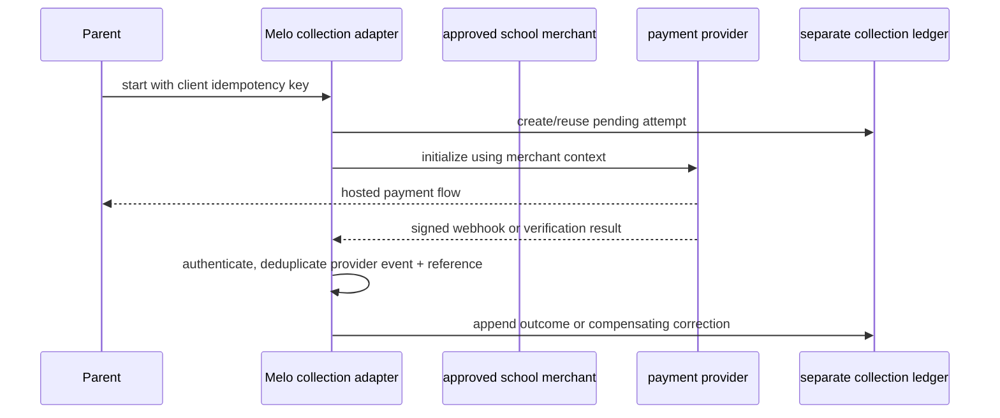
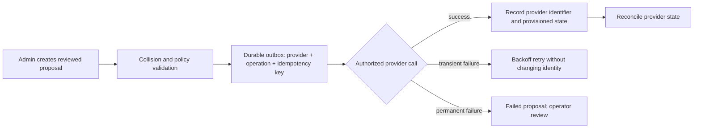
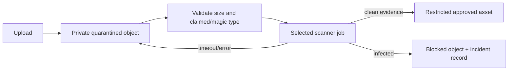
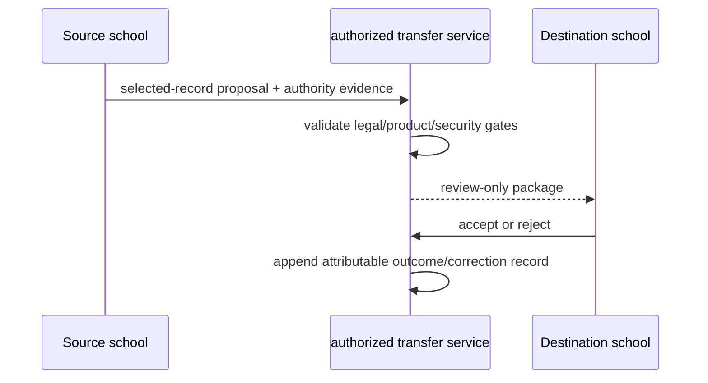

# Melo Provider, Runtime, and Settlement Spikes (D-03)

**Status:** corrected, blocked spike-contract dossier — no provider, runtime, financial, legal, or production approval.
**Version / review date:** 1.1.0 / 2026-09-03. **Owner:** Integration Architecture.
**Dependencies:** D-01, `product-decisions.md`, and feature-specific security/finance/counsel approval.

## 1. Evidence status and decision rule

This document records what must be proved, not provider facts. It was prepared from repository and decision-ledger review only. No external sandbox credentials, delegated-admin tenant, AV account, provider quote, production data, or authorized live call was supplied; the task also prohibits live secrets and payment triggers. Therefore every provider capability, cost, rate limit, data region, settlement date, API behavior, and contract term below is **unknown / provider-gated** until its evidence record is completed.

A spike record is complete only with: dated provider documentation, a sanitized sandbox transcript/test result, selected account/region/plan, contract/DPA/retention evidence, failure/retry result, security review, and applicable finance/counsel approval. A failed or blocked spike is a valid result and must not be converted into a product claim.

### Cross-cutting non-negotiable target constraints

- Melo operates **no mail server**; mailbox hosting and delivery remain with an approved external provider.
- School collections, Melo SaaS billing, usage top-ups, and any future split settlement are separate ledgers.
- No fixed, “instant,” T+1, or next-day settlement promise is permitted without current provider-specific evidence.
- Unapproved native binaries are excluded from the Convex Node execution path.
- Assets remain inside a controlled administrative/quarantine boundary until the approved scanning control reports a clean result.

## 2. Blocked spike register

| ID / capability | Evidence or documented access blocker | Cost / limit status | Recommended / declined pending evidence | Irreversible decision gate |
|---|---|---|---|---|
| S1 Paystack direct merchant, split/subaccount, recurring mandate, webhook/refund/dispute | **Blocked:** no authorized Paystack sandbox merchant, split/subaccount account, mandate test authority, or provider terms/finance evidence was available; no provider call made. Existing repository routing is context, not proof of new capability. | unknown / provider-gated | **Recommend:** preserve direct school-merchant separation as the current product direction. **Decline:** enabling Melo-routed split mode or recurring charge. | merchant/contract, sandbox lifecycle, finance/tax/legal, reconciliation and product approval |
| S2 Google Workspace directory | **Blocked:** no school domain control, Workspace tenant, delegated-admin/service-account authorization, license, or sandbox authority supplied. | unknown / provider-gated | **Recommend:** provider-neutral proposal/outbox seam only. **Decline:** provider selection/provisioning. | school authorization, scopes, DPA/transfer, sandbox lifecycle and dry run |
| S3 Microsoft 365 / Graph directory | **Blocked:** no Microsoft tenant, app registration, delegated/admin consent, license, or sandbox authority supplied. | unknown / provider-gated | **Recommend:** same provider-neutral seam. **Decline:** Graph selection/provisioning. | tenant consent/scopes, DPA/transfer, sandbox lifecycle and dry run |
| S4 Zoho directory | **Blocked:** no Zoho organization, administrator/OAuth authorization, license, or sandbox authority supplied. | unknown / provider-gated | **Recommend:** same provider-neutral seam. **Decline:** Zoho selection/provisioning. | organization authorization/scopes, DPA/transfer, sandbox lifecycle and dry run |
| S5 AV/quarantine | **Blocked:** no scanner vendor/account, private storage integration, sample-handling approval, or permitted malware test corpus supplied. | unknown / provider-gated | **Recommend:** retain private quarantine and deny broader access until selected scanner evidence exists. **Decline:** claiming a scanner, public multi-engine upload, or clean status for legacy files. | vendor/privacy/security review; failure, timeout, infected and retention tests |
| S6 PDF runtime / `pdf-lib` candidate | **Blocked:** no approved Convex development runtime measurement or test corpus was supplied for this spike. Repository dependency/old test material is not a runtime capability record. | unknown / runtime-gated | **Recommend:** retain originals and make optimization optional. **Decline:** native binaries and a compression/savings claim. | measured current runtime/package results; candidate fidelity/rollback results; security approval |
| S7 Future independent-school transfer signing | **Blocked:** no approved trust model, institution-verification authority, key-management service, legal basis, or security/counsel approval supplied. | unknown / future-program-gated | **Recommend:** keep F4 later and design only selected-record boundaries. **Decline:** choosing Ed25519/ECDSA, VC format, key custody, or automatic transfer. | separate Genesis/product, counsel, security/crypto and operating-model approval |

## 3. Contracts to execute when access is authorized

### S1 — Payment routing and settlement

**Questions:** Can each approved merchant mode initialize/verify/refund/handle disputes? Are split/subaccount and recurring-mandate features available to the proposed merchant and market? Who receives funds and fees? What are the provider-confirmed limits, costs, settlement estimates, tax/accounting implications, and webhook replay behavior?

**Concrete retry/idempotency model:** generate one `clientOperationId` per user intent; persist an attempt before initialization; reuse it on client retry. Treat `(provider, merchant, providerReference)` and provider event ID as unique replay keys. Verify signature and expected school/mode/amount/currency before state transition. Accept duplicate delivery as a no-op; reconcile `pending` attempts by an idempotent scheduled verifier with bounded exponential backoff. Never infer success from a browser return. Refund, reversal, dispute, and correction append compensating ledger entries; they do not mutate history.

**Evidence checklist:** sandbox merchant and mode; signed-webhook verification; duplicate/out-of-order events; cancel/failure/refund/dispute; direct vs split reconciliation; provider-derived fee/limit/settlement evidence; merchant-of-record/custody/tax/legal decision; exact customer copy. **Gate:** no split/mandate enablement, schedule copy, or rate hard-coding until all apply.

### S2–S4 — Google, Microsoft, and Zoho directory lifecycle

**Common contract:** no mail-server operation; addresses are a directory/provisioning concern. The states are `login_only`, `external_verified`, and `provider_provisioned`. `login_only` must never be called an inbox.

**Concrete retry/idempotency model:** a proposal has a stable UUID; the outbox uniqueness key is `(school, provider, operation, proposal UUID)`. Persist intent before the call. Retry only classified transient failures with capped exponential backoff and jitter; stop at a reviewed terminal failure. A timeout is unknown, so reconcile by provider-side immutable identifier/address before retrying create. Suspension/archive uses the same record and does not delete person/membership attribution. Provider failure cannot alter core identity or enrollment.

**Provider-specific evidence checklist (complete separately for Google, Microsoft, Zoho):** school domain ownership; named tenant/organization; administrator authority; licensing; OAuth/service-account/delegated scope list; provider API and rate-limit evidence; DPA/transfer/retention terms; DNS verification; create/update/suspend/archive/alias/recovery tests; collision/manual-edit cases; retry/reconciliation transcript; minor naming/notice decision. **Gate:** select only the provider whose record is complete for the school; no default provider is selected here.

### S5 — AV and quarantine

**Concrete retry/idempotency model:** assign `assetId` and content hash at intake; scanner request key is `(assetId, content hash, scan policy version)`. Re-submit only pending/timeout scans with bounded backoff. A duplicate callback with the same scanner job/result is a no-op; conflicting terminal results escalate and retain quarantine. Do not expose a URL merely because upload/storage succeeded. Legacy files remain `legacy_unverified` until independently processed.

**Due diligence:** private byte path; samples/residency/subprocessor terms; malware-result retention and incident handling; max file size/concurrency/price evidence; scanner failure SLA; safe test corpus approval; clean/infected/timeout/retry/access tests; purge/hold behavior. **Gate:** no general-user access and no vendor selection before all relevant evidence is approved. Public multi-engine scanning is declined unless privacy, contract, and jurisdiction review explicitly approves it.

### S6 — PDF runtime candidate

**Contract:** test only an approved development deployment with a sanitized corpus representing text PDFs, scans, embedded fonts, forms, signatures, encrypted/password-protected files, and malformed input. For every candidate record current Convex/runtime/package versions, elapsed time, peak memory where observable, input/output size, page count, open/readability result, error classification, and rollback behavior. Do not represent structural reserialization as image recompression.

**Retry/idempotency model:** `candidateId` is keyed by `(assetId, source storage version, optimizer version)`. Generate a separate candidate object; a retry can reuse the candidate key but must never overwrite the source. Promote only after the approved verifier succeeds; otherwise retain source and terminal reason. A stale job detects source-version mismatch and exits. Rollback is a separate audited state change.

**Due diligence/gate:** current Convex package/runtime support; license/security review; sanitized corpus evidence; encrypted/signed/form policy; page-count and visual/readability checks; measured threshold selected by owner; original retention and expiry/restore test. Native binaries and an unmeasured “saves X%” claim are declined. No promotion path until the record passes.

### S7 — Future transfer signing and portable records

**Contract:** selected academic records may be considered only after a separate program approval; financial debts, safeguarding records, health/SEN records, and internal behavioral notes are excluded from any automatic package. The eventual signer/verifier identity, algorithm, canonicalization, key storage/rotation/revocation, timestamp authority, replay key, expiry, correction, cancellation, dispute, and institution verification are open decisions.

**Retry/idempotency model:** source intent UUID is the transfer key; destination acceptance is unique per transfer/version. Replays return the current case state; network timeout creates no assumed acceptance. Any changed selection creates a new version requiring fresh review. Expiry/cancel/reject are terminal, auditable states; corrections are append-only references, not signature rewriting.

**Gate:** counsel determines authority/lawful basis and cross-border conditions; security approves threat model, key lifecycle and independent verification; product approves the selected-record and dispute policy; operations proves verified institutions and incident response. No crypto or protocol selection is made here.

## 4. Common provider due diligence record

For each selected service, store outside Git: provider legal entity/product/plan; decision owner/date; documentation version and access date; deployment/processing location; DPA/subprocessor/transfer and retention/training terms; security assurance; exact scopes/credentials/rotation; costs/limits/SLA; sanitized sandbox evidence; incident/support contacts; deletion/export path; retry/reconciliation evidence; and approvals. Missing, ambiguous, or stale evidence blocks production credentials and customer data transfer.

## 5. Decision gates and handoff

| Gate | Decision allowed only after | Result if not met |
|---|---|---|
| G1 payment mode | S1 evidence + finance/legal/product approval | direct/split/mandate feature remains disabled; no settlement promise |
| G2 directory provider | one of S2–S4 complete for the specific school | keep reviewed proposal/login-only state; do not provision |
| G3 asset expansion | S5 control selected and clean/failure evidence approved | keep quarantine/controlled-admin boundary |
| G4 PDF promotion | S6 measured runtime and fidelity/rollback evidence | retain original; optimization unavailable |
| G5 independent transfer | S7 separate approvals | F4 remains future design only |

**Builder handoff:** read D-01 first, then the relevant S-record. Build only the reversible proposal/outbox/quarantine/candidate seams already supported by approved feature contracts; do not fill blocked facts with defaults.
