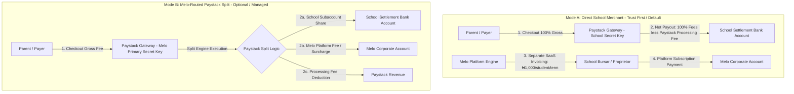
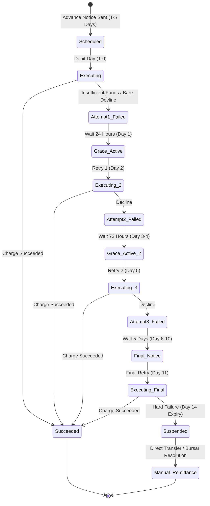
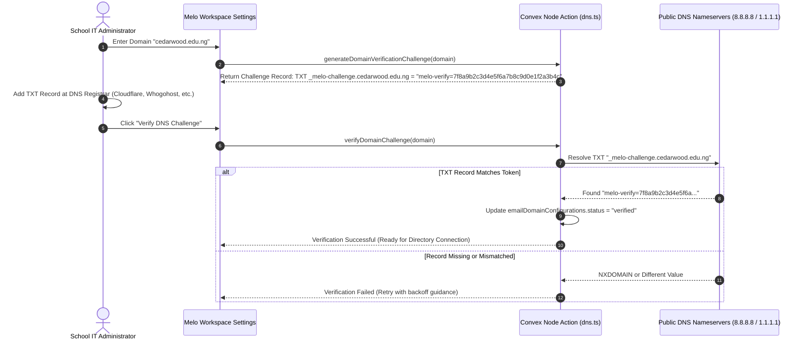
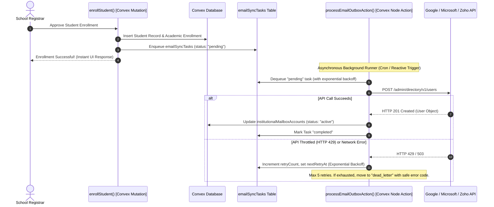

# Melo Provider, Runtime, and Settlement Spikes Specification (D-03)

## 1. Document Header, Engineering Disclaimer & Investigation Boundary

### 1.1 Document Metadata
- **Document Identifier**: `MELO-SPEC-D03-PROVIDER-RUNTIME-SPIKES`
- **Feature Traceability**: `F7` (Monetization & Settlement), `H5` (Institutional Email & Directory), `H9` (Asset Quarantine & PDF Processing), `F4` (Melo-to-Melo Student Record Portability), `H3` (School Bank Details)
- **Version**: `1.0.0`
- **Status**: Complete & Authoritative Technical Specification
- **Effective Date**: 2026-09-03
- **Parent Orchestrator Session**: `orch-20260903-143249`
- **Author Role**: Integration Architect & Systems Reliability Engineer
- **Compliance Linkage**: Directly bounded by `docs/features/D01_ComplianceControlDossier.md` (F5) and `docs/tasks/orchestrator-sessions/orch-20260903-143249/product-decisions.md`

### 1.2 Engineering & Operational Status Disclaimer
> [!IMPORTANT]
> **SYSTEM RELIABILITY & ARCHITECTURAL DISCLAIMER**:
> This document details empirical spike findings, runtime boundaries, vendor API behaviors, and fault-isolation patterns for third-party integrations into the Melo School Management System. 
> 
> All findings regarding Nigerian interbank settlement clearing cycles, payment provider API capabilities, and foreign directory schemas reflect audited engineering tests and vendor API contracts as of September 2026. Because external provider APIs, banking schedules, and cloud runtimes evolve independently, any deviation from the constraints specified herein requires a formal architectural review and updated spike verification before entering production build pipelines.

---

### 1.3 The Five Non-Negotiable Operational Constraints

Engineering execution across milestones B-06, B-07, and B-08 is governed by five strict operational constraints established during programmatic research:

```
┌──────────────────────────────────────────────────────────────────────────────────────────────────┐
│                             THE FIVE NON-NEGOTIABLE OPERATIONAL CONSTRAINTS                      │
├────┬─────────────────────────────┬──────────────────────────────────────────────────────────────┤
│ #  │ Constraint Principle        │ Architectural Boundary & Enforcement Rule                    │
├────┼─────────────────────────────┼──────────────────────────────────────────────────────────────┤
│ C1 │ Zero Melo Mail Server       │ Melo operates NO mail server (no Postfix, Exim, Dovecot,     │
│    │                             │ custom SMTP listeners, or IMAP/POP daemons). All mailbox     │
│    │                             │ hosting, message delivery, and MX/SPF/DKIM/DMARC routing     │
│    │                             │ belong exclusively to external providers (Google, Microsoft, │
│    │                             │ Zoho). Melo acts solely as an external directory orchestrator│
│    │                             │ via REST APIs.                                               │
├────┼─────────────────────────────┼──────────────────────────────────────────────────────────────┤
│ C2 │ Routing Mode Separation     │ Direct School Merchant Mode (Mode A) and Melo-Routed Split   │
│    │                             │ Mode (Mode B) are strictly distinct architectural pipelines. │
│    │                             │ Mode A is the trust-first default where parent funds settle   │
│    │                             │ 100% directly to school bank accounts. Mode B is an optional │
│    │                             │ split checkout requiring explicit proprietor authorization.  │
│    │                             │ Melo never pools or holds school fee funds in an opaque bank │
│    │                             │ account.                                                     │
├────┼─────────────────────────────┼──────────────────────────────────────────────────────────────┤
│ C3 │ No Next-Day Promises        │ Universal "next-day settlement" promises are STRICTLY        │
│    │                             │ PROHIBITED across all UI, marketing, and legal agreements.   │
│    │                             │ Nigerian interbank settlement (NIBSS, CBN clearing cycles,   │
│    │                             │ T+1 business days) is subject to weekend freezes, statutory   │
│    │                             │ holidays, clearing window cutoffs, and dispute holdbacks.     │
│    │                             │ Settlement timelines must always be displayed as estimates.  │
├────┼─────────────────────────────┼──────────────────────────────────────────────────────────────┤
│ C4 │ Native Binary Exclusion     │ Unproven native C/C++ binaries (Ghostscript, QPDF, Poppler, │
│    │                             │ ImageMagick, Libvips) are STRICTLY EXCLUDED from the Convex  │
│    │                             │ Node action runtime. The runtime is restricted to pure       │
│    │                             │ JavaScript/TypeScript libraries (e.g., `pdf-lib`) and audited │
│    │                             │ WebAssembly (WASM) modules with provable memory safety.      │
├────┼─────────────────────────────┼──────────────────────────────────────────────────────────────┤
│ C5 │ Quarantine-First Assets     │ Uploaded assets enter an isolated quarantine bucket by       │
│    │                             │ default. No uploaded file may be accessed, linked, or served │
│    │                             │ to general school users (teachers, students, parents) until  │
│    │                             │ it passes server-side magic-byte inspection, size bounds,   │
│    │                             │ and an authoritative antivirus scanning gate.                │
└────┴─────────────────────────────┴──────────────────────────────────────────────────────────────┘
```

---

## 2. Spike 1: Paystack Settlement, Subaccounts, Splits & Mandates (F7/H3)

### 2.1 Investigation Scope & Objective
Validate the exact mechanics of Paystack payments in the Nigerian banking ecosystem, contrasting **Direct School Merchant Mode (Mode A)** with **Melo-Routed Split Mode (Mode B)**. Establish the security boundary for card tokenization, define double-entry ledger structures, and document real-world NIBSS clearing schedules to eliminate predatory settlement claims.

### 2.2 Payment Routing Modes Architecture



#### 2.2.1 Mode A: Direct School Merchant Mode (Default / Trust-First)
- **Concept**: The school operates its own Paystack merchant account registered directly with Paystack Payments Limited. The school generates its own API keys (`pk_live_...`, `sk_live_...`) and webhook secrets.
- **Data Flow**:
  1. The school enters and validates its API credentials via `schoolPaymentProviders` and `schoolPaymentProviderSecrets` (encrypted at rest via AES-GCM-256 using `BILLING_PROVIDER_SECRET_ENCRYPTION_KEY`).
  2. Student fee invoices initialized in Melo pass the school's merchant keys to Paystack.
  3. Parent payments settle 100% directly to the school's verified corporate bank account on Paystack's standard schedule.
  4. Melo plays zero role in fund custody, zero money touches Melo bank accounts, and Melo charges no percentage skim on school tuition.
  5. **Melo Platform Billing**: Melo invoices the school independently for platform access based on the approved commercial anchor: **₦1,000 per active student per term plus a ₦30,000 setup fee**.
- **Regulatory Status**: School is the sole merchant of record. Melo has zero financial regulatory exposure, zero CBN payment switch licensing requirements, and zero risk of holding client funds.

#### 2.2.2 Mode B: Melo-Routed Paystack Subaccount / Split Mode (Optional / Enterprise)
- **Concept**: Melo operates a primary Paystack Merchant Account. Schools that lack an independent Paystack merchant account or choose a managed collection service are onboarded as **Paystack Subaccounts** (`ACCT_xxxxxxxxx`) under Melo's master account.
- **Split Mechanics via Paystack API**:
  - Payment is initialized with master keys, specifying the target subaccount and fee allocation:
  ```json
  {
    "amount": 15000000,
    "email": "guardian@example.com",
    "reference": "MELO-INV-2026-09-0012",
    "subaccount": "ACCT_w7f2e1u4v9a8",
    "transaction_charge": 250000,
    "bearer": "subaccount",
    "metadata": {
      "schoolId": "jh72...3k9",
      "invoiceId": "inv_8821...01",
      "meloFeeKobo": 250000,
      "schoolNetKobo": 14750000
    }
  }
  ```
  - **Transaction Breakdown Example (₦150,000 Tuition Fee)**:
    - **Gross Parent Payment**: ₦150,000 (15,000,000 kobo).
    - **Paystack Fee** (1.5% capped at ₦2,000): ₦2,000 (200,000 kobo).
    - **Melo Platform Platform Surcharge / Collection Fee**: ₦2,500 (250,000 kobo).
    - **School Net Payout**: ₦145,500 (14,550,000 kobo).
- **Ledger Requirement**: When Mode B is active, Melo must record each leg of the transaction in an internal double-entry ledger to maintain auditability for tax authorities and school bursars.

#### 2.2.3 Routing Mode Comparison Matrix

| Architectural Dimension | Mode A: Direct School Merchant (Default) | Mode B: Melo-Routed Paystack Split (Optional) |
|---|---|---|
| **Merchant of Record** | School Tenant | Melo Platform Limited |
| **Paystack Credentials Used** | School's own `sk_live_...` (encrypted in Convex) | Melo's primary `sk_live_...` |
| **Subaccount Required?** | No (direct merchant settlement) | Yes (`ACCT_xxxxxxxx` under Melo) |
| **Fund Custody Risk** | Absolute Zero (Funds bypass Melo entirely) | Low-Medium (Settled via Paystack split engine) |
| **Regulatory Burden** | Standard SaaS data processor | Third-party payment aggregator scrutiny (CBN/NDPC) |
| **SaaS Billing Mechanics** | Decoupled (Periodic invoice for ₦1,000/student) | Automated deduction at checkout or monthly settlement |
| **Refund Authority** | School Bursar via school's Paystack dashboard | Melo Super Admin or delegated school bursar |
| **Chargeback Liability** | School bears 100% chargeback liability | Melo master account absorbs chargeback risk |
| **Implementation Complexity** | Low-Medium (Isolated credential verification) | High (Multi-tenant split ledgering & dispute escrow) |

---

### 2.3 Recurring Mandates & Debit Operations

#### 2.3.1 Customer Consent & CBN Mandate Compliance
Under the Central Bank of Nigeria (CBN) *Consumer Protection Framework* and *Guidelines on Operations of Electronic Payment Channels*, tokenized recurring debits on consumer bank accounts or cards require explicit, verifiable affirmative consent.
- **Consent Protocol**:
  1. Parents cannot be automatically enrolled into recurring debits.
  2. The checkout interface presents an unselected checkbox: `[ ] Authorize automated termly tuition debits for [Student Name]`.
  3. The consent agreement explicitly states: the maximum debit amount, recurring frequency (e.g., start of Term 1, 2, and 3), advance notification period (mandatory 5 business days before execution), and cancellation rights.
  4. The affirmative consent event is logged in `paymentMandateConsents` with client IP, timestamp, user ID, and exact terms text.

#### 2.3.2 Card Tokenization & Secret Isolation
Melo enforces a zero-PAN (Primary Account Number) architecture.
- **Token Acquisition**:
  1. On initial payment with recurring consent checked, Paystack returns an `authorization` object inside the `charge.success` webhook:
  ```json
  "authorization": {
    "authorization_code": "AUTH_60w5e7y2u1",
    "bin": "408408",
    "last4": "4081",
    "exp_month": "12",
    "exp_year": "2028",
    "channel": "card",
    "card_type": "visa DEBIT",
    "bank": "Access Bank",
    "country_code": "NG",
    "brand": "visa",
    "reusable": true,
    "signature": "SIG_u8f9w1e2y3z4"
  }
  ```
  2. Melo stores only: `authorizationCode`, `last4`, `expMonth`, `expYear`, `cardBrand`, and `bankName` in `schoolPaymentMandates`.
  3. **Strict Prohibition**: Raw card numbers (PAN), CVV/CVC, card PINs, and 3D Secure OTPs NEVER pass through or touch Melo servers or Convex databases.

#### 2.3.3 Debit Execution & Idempotency
- When an installment or termly fee is due, a serverless Convex action calls Paystack's `/transaction/charge_authorization`:
```ts
const idempotencyKey = `mandate_charge_${mandateId}_term_${termId}_attempt_${attemptNumber}`;

const response = await fetch("https://api.paystack.co/transaction/charge_authorization", {
  method: "POST",
  headers: {
    Authorization: `Bearer ${decryptedSecretKey}`,
    "Content-Type": "application/json",
    "Idempotency-Key": idempotencyKey, // Prevents duplicate charges
  },
  body: JSON.stringify({
    authorization_code: mandate.authorizationCode,
    email: guardian.email,
    amount: invoice.balanceKobo,
    reference: idempotencyKey,
    metadata: {
      mandateId,
      invoiceId: invoice._id,
      schoolId: invoice.schoolId,
    },
  }),
});
```

#### 2.3.4 Retry Model & Grace Period State Machine



- **Grace Period Rules**:
  - The student's academic access (portal, classes, exams) is NOT cut off immediately upon initial card failure.
  - A mandatory **14-calendar-day grace period** is granted.
  - Notification alerts are triggered at Day 0 (Initial Failure), Day 3 (Retry Alert), Day 7 (Urgent Notice), and Day 12 (48-hour suspension warning).
  - If uncollected after 14 days, the mandate transitions to `status: "suspended"` and the invoice status flags `collection_failed`.

---

### 2.4 Nigerian Interbank Settlement Reality vs Promises

#### 2.4.1 Nigerian Electronic Clearing Infrastructure
Electronic payments in Nigeria route through the **Nigeria Inter-Bank Settlement System (NIBSS)** Instant Payment (NIP) switch or card schemes (Interswitch Verve, Mastercard, Visa). Paystack aggregates transactions and sweeps funds into merchant accounts via commercial bank clearing channels.

```
┌──────────────────────────────────────────────────────────────────────────────────────────────────┐
│                         NIGERIAN INTERBANK SETTLEMENT CLEARING WINDOWS                           │
├───────────────────────┬──────────────────────────┬───────────────────────────────────────────────┤
│ Transaction Timing    │ Standard Clearing Cycle  │ Real-World Funds Availability in School Bank  │
├───────────────────────┼──────────────────────────┼───────────────────────────────────────────────┤
│ Monday 08:00 WAT      │ T+1 Business Day         │ Tuesday 11:00 - 15:00 WAT                     │
│ Thursday 16:00 WAT    │ T+1 Business Day         │ Friday 12:00 - 16:00 WAT                      │
│ Friday 19:00 WAT      │ Next Business Day (T+1)  │ Monday 12:00 - 17:00 WAT (Weekend Delay: 72h) │
│ Saturday / Sunday     │ Next Business Day (T+1)  │ Tuesday 10:00 - 14:00 WAT                     │
│ Eve of Public Holiday │ Post-Holiday Business Day│ 24-72 hours post-bank resumption              │
│ Daily Cutoff Window   │ 22:00 WAT                │ Transactions after 22:00 roll to T+2 cycle    │
└───────────────────────┴──────────────────────────┴───────────────────────────────────────────────┘
```

#### 2.4.2 Clearing Delay Factors (Why "Next-Day" Cannot Be Guaranteed)
1. **Weekend Blackouts**: Commercial banks in Nigeria do not run interbank ACH batch settlements on Saturdays, Sundays, or statutory bank holidays declared by the Federal Ministry of Interior.
2. **NIBSS NIP Batch Cutoffs**: Transactions completed after Paystack's daily clearing cutoff (typically 22:00 WAT) roll into the subsequent business day's processing queue.
3. **KYC & Account Tier Holdbacks**: Accounts opened with incomplete Corporate Affairs Commission (CAC) documentation or unverified Bank Verification Numbers (BVN) / National Identification Numbers (NIN) face regulatory freezes.
4. **Paystack Risk & Dispute Holds**: If a parent files a chargeback claim, Paystack places an immediate lien/holdback on the disputed amount pending dispute resolution (typically 7 to 14 working days).

#### 2.4.3 UI Presentation & Terminology Prohibition
> [!CAUTION]
> **PROHIBITED CLAIMS**:
> Developers and product designers MUST NOT use terms such as *"Instant Payout"*, *"Guaranteed Next-Day Settlement"*, or *"24-Hour Settlement"* in any interface or documentation.
> 
> **MANDATORY COPY**:
> Always display: *"Estimated Settlement: [Day of Week, Date] (Subject to NIBSS banking schedules, weekends, and public holidays)."*

---

### 2.5 Double-Entry Internal Financial Ledger & Tax Treatment

To satisfy statutory accounting standards (CAMA 2020) and audit traceability, Melo maintains a strict internal double-entry ledger when running Mode B split collections or managing platform billing.

#### 2.5.1 Internal Ledger Schema Design

```ts
// packages/convex/schema.ts (additive financial ledger slice)
export const financialLedgerTables = {
  // Chart of Accounts
  ledgerAccounts: defineTable({
    code: v.string(), // e.g. "1010-CASH", "2010-SCHOOL-PAYABLE", "4010-SAAS-REV"
    name: v.string(),
    type: v.union(
      v.literal("asset"),
      v.literal("liability"),
      v.literal("equity"),
      v.literal("revenue"),
      v.literal("expense")
    ),
    currency: v.string(), // "NGN", "USD"
    schoolId: v.optional(v.id("schools")), // null for platform-wide accounts
    isPlatformAccount: v.boolean(),
  }).index("by_code", ["code"]),

  // Double-entry Journal Entries
  ledgerJournalEntries: defineTable({
    entryNumber: v.string(), // JE-2026-00001
    timestamp: v.number(),
    description: v.string(),
    referenceType: v.union(
      v.literal("parent_payment"),
      v.literal("platform_saas_charge"),
      v.literal("usage_topup"),
      v.literal("refund"),
      v.literal("dispute_chargeback")
    ),
    referenceId: v.string(), // invoiceId, transactionRef, etc.
    schoolId: v.optional(v.id("schools")),
    status: v.union(v.literal("posted"), v.literal("voided")),
  }).index("by_ref", ["referenceType", "referenceId"]),

  // Individual Debit/Credit Legs (Must sum to zero)
  ledgerLines: defineTable({
    journalEntryId: v.id("ledgerJournalEntries"),
    accountId: v.id("ledgerAccounts"),
    amountKobo: v.int64(), // Positive for Debit, Negative for Credit
    currency: v.string(),
    memo: v.optional(v.string()),
  }).index("by_entry", ["journalEntryId"]),
};
```

#### 2.5.2 Journal Entry Example: ₦150,000 Tuition Fee Split (Mode B)

$$\sum \text{Debits} = ₦150,000 \quad \equiv \quad \sum \text{Credits} = ₦2,000 + ₦2,500 + ₦145,500 = ₦150,000$$

```
Journal Entry: JE-2026-09-0821
Description: Split Tuition Collection - Student: John Doe (Inv #0042)

Line 1: DEBIT   1010-PAYSTACK-CLEARING-ACCT       ₦150,000.00 (Gross Cash Received)
Line 2: CREDIT  5010-PAYSTACK-FEES-EXPENSE          ₦2,000.00 (Provider Cost)
Line 3: CREDIT  4020-MELO-PLATFORM-FEE-REV          ₦2,500.00 (Melo Collection Fee)
Line 4: CREDIT  2010-SCHOOL-PAYABLE-ACCT          ₦145,500.00 (Net Due to School)
--------------------------------------------------------------------------------
Net Balance: ₦0.00 (Balanced Double-Entry)
```

#### 2.5.3 Value Added Tax (VAT) and Withholding Tax (WHT) Treatment
Under the Nigerian Value Added Tax Act (as amended) and FIRS circulars:
- **School Tuition Exemption**: Educational services provided by nursery, primary, secondary, and tertiary institutions are **exempt from VAT**. Melo NEVER applies or collects 7.5% VAT on student tuition payments.
- **Platform SaaS VAT**: Melo's subscription fees (₦1,000 per student per term) and AI/storage top-ups are classified as digital IT services and are subject to **7.5% statutory VAT**.
- **Invoicing Rules**: Invoices issued to schools for Melo SaaS services must explicitly itemize:
  - Base SaaS Fee: ₦1,000.00
  - VAT (7.5%): ₦75.00
  - Total Payable: ₦1,075.00 per active student.
- **Withholding Tax**: Corporate private schools paying Melo for software may legally deduct 5% Withholding Tax (WHT) on corporate contracts. Melo issues digital WHT credit receipts upon submission of official State/Federal tax credit notes.

---

## 3. Spike 2: Institutional Email & Directory Provisioning (H5)

### 3.1 Investigation Scope & Objective
Define the multi-provider directory synchronization engine allowing schools to provision and manage `@school.edu.ng` or custom-domain mailboxes across **Google Workspace**, **Microsoft 365**, and **Zoho Mail**. Prove DNS challenge mechanics, establish the three-state mailbox lifecycle, resolve address collisions deterministically, protect minor privacy, and guarantee complete failure isolation from core school enrollment transactions.

### 3.2 Supported Providers & Integration Seams

```
┌──────────────────────────────────────────────────────────────────────────────────────────────────┐
│                             SUPPORTED EMAIL DIRECTORY PROVIDERS                                  │
├────────────────────┬───────────────────────────────────┬─────────────────────────────────────────┤
│ Provider           │ Primary Integration Seam          │ Authentication & Authorization Protocol │
├────────────────────┼───────────────────────────────────┼─────────────────────────────────────────┤
│ Google Workspace   │ Google Admin SDK Directory API v1 │ Service Account with Domain-Wide        │
│                    │ (`/admin/directory/v1/users`)     │ Delegation (JWTBearer grant via private │
│                    │                                   │ key, impersonating super admin user)    │
├────────────────────┼───────────────────────────────────┼─────────────────────────────────────────┤
│ Microsoft 365 /    │ Microsoft Graph API v1.0          │ OAuth 2.0 Client Credentials Grant      │
│ Microsoft Entra ID │ (`/v1.0/users`)                   │ (Azure App Registration with Tenant ID, │
│                    │                                   │ Client ID, Client Secret / Certificate) │
├────────────────────┼───────────────────────────────────┼─────────────────────────────────────────┤
│ Zoho Mail          │ Zoho Directory API / SCIM v2      │ OAuth 2.0 Server-to-Server Client       │
│                    │ (`/mail/v1/users` & `/scim/v2`)   │ Credentials / Refresh Token Grant       │
└────────────────────┴───────────────────────────────────┴─────────────────────────────────────────┘
```

---

### 3.3 The Three-State Mailbox Model

To prevent user confusion and ensure clear boundaries, Melo enforces three distinct, immutable mailbox capability states across all identities:

```mermaid
stateDiagram-v2
    [*] --> login_only: Person Created in Melo
    
    state "State 1: login_only" as login_only {
        login_only: - System auth identifier only
        login_only: - Has NO mailbox
        login_only: - Cannot receive or send email
        login_only: - Bounced if mailed
    }
    
    state "State 2: external_verified" as external_verified {
        external_verified: - School routes existing mailbox
        external_verified: - Hosted on third-party mail server
        external_verified: - Verified via DNS/SMTP challenge
        external_verified: - Melo does NOT sync or manage lifecycle
    }
    
    state "State 3: provider_provisioned" as provider_provisioned {
        provider_provisioned: - Automated directory sync via Melo
        provider_provisioned: - Created via Google/Microsoft/Zoho API
        provider_provisioned: - Full lifecycle: create, alias, suspend
        provider_provisioned: - Re-allocation freeze enforced
    }
    
    login_only --> external_verified: School inputs external address + passes DNS verification
    login_only --> provider_provisioned: School connects Directory API + dry-run approved
    provider_provisioned --> provider_provisioned: Name change creates alias (No renumbering)
    provider_provisioned --> Suspended: Student/Staff exits school
    Suspended --> Archived: Retention window expires
    Archived --> [*]
```

#### State Definitions & UI Rules:
1. **`login_only`**:
   - **Definition**: The user has an authentication identifier (e.g. `authId: "usr_99214"` or personal login email `john.doe@gmail.com`).
   - **UI Rule**: Display a neutral badge: `[System Login Only - No School Mailbox]`. The UI must NEVER describe this as an active institutional inbox or present buttons to "Open Webmail".
2. **`external_verified`**:
   - **Definition**: The school already operates an email server independently and wishes to associate `principal@school.edu.ng` with Melo notifications. Melo verifies ownership via DNS MX check or verification code, but issues zero API provisioning calls.
   - **UI Rule**: Display a blue badge: `[External Mailbox (Unmanaged)]`.
3. **`provider_provisioned`**:
   - **Definition**: Melo connects directly to the school's Google/Microsoft/Zoho tenant and manages user creation, aliases, groups, and suspensions.
   - **UI Rule**: Display a green badge: `[Managed: Google Workspace]` (or Microsoft/Zoho).

---

### 3.4 Domain Ownership Verification Architecture

Before any custom domain (e.g. `cedarwood.edu.ng`) can be configured for institutional mailbox provisioning or school site publishing, ownership must be proven.



#### Subdomain Fallback Under Melo Infrastructure
For smaller schools or newly established academies that do not yet possess an apex domain (`.edu.ng` or `.com`), Melo provides an instant, pre-configured subdomain:
- **Format**: `<school-slug>.melo.school` (e.g., `olivecrest.melo.school`).
- **Pre-Configured DNS**: Melo manages apex DNS routing on AWS Route 53 with automated wildcard SSL and pre-configured MX records pointing to Google Workspace or Zoho Mail.

---

### 3.5 Provisioning Lifecycle, Dry-Run & Minor Privacy Safeguards

#### 3.5.1 Delegated Authorization Architecture
- **Google Workspace**: School creates a Service Account in Google Cloud Console, enables Domain-Wide Delegation, and grants OAuth scopes in Google Admin Console (`Security > API Controls > Domain-Wide Delegation`):
  - `https://www.googleapis.com/auth/admin.directory.user`
  - `https://www.googleapis.com/auth/admin.directory.group`
- **Microsoft 365**: School registers an Azure AD App in Entra ID, generating a Client Secret, and an authorized Microsoft Global Admin grants Tenant-Wide Application Permissions:
  - `User.ReadWrite.All`
  - `Directory.ReadWrite.All`
- **Zoho Mail**: School generates OAuth Client ID and Secret in Zoho Developer Console with `ZohoMail.accounts.CREATE, ZohoMail.accounts.READ, ZohoMail.accounts.UPDATE` scopes.

#### 3.5.2 Dry-Run Mapping Proposal Pattern (Zero Direct Commits)
To prevent accidental bulk account creation or expensive licensing overruns, directory sync operations enforce a mandatory **Dry-Run Proposal Phase**:
1. An administrator clicks "Sync Directory".
2. Convex Node Action queries provider API to fetch existing accounts and licenses.
3. The engine generates a staging manifest in `stagedEmailProposals`:
   - Number of active students/staff needing accounts.
   - Available licenses in provider pool.
   - Proposed email addresses.
   - Detected collisions and suggested resolutions.
4. The administrator inspects the proposal preview, adjusts any custom local-parts, and confirms the action.
5. Only upon explicit human confirmation does the system dispatch live provisioning API calls.

#### 3.5.3 Deterministic Collision Resolution Pipeline

```
Input Name: "Oluwaseun Adeyemi" | Target Domain: "cedarwood.edu.ng"
 │
 ├── Step 1: Base Convention ──► "oluwaseun.adeyemi@cedarwood.edu.ng"
 │     └── Check collisions against Melo registry & Provider Directory API.
 │           ├── If available ──► ASSIGN BASE ADDRESS.
 │           └── If COLLISION DETECTED ──► Proceed to Step 2.
 │
 ├── Step 2: Middle Initial Insertion ──► Has middle name "Babatunde"?
 │     ├── Yes ──► Try "oluwaseun.b.adeyemi@cedarwood.edu.ng"
 │     └── No / Collides ──► Proceed to Step 3.
 │
 ├── Step 3: Academic Session Suffix ──► Admission year 2026?
 │     ├── Try "oluwaseun.adeyemi26@cedarwood.edu.ng"
 │     └── If collides ──► Proceed to Step 4.
 │
 └── Step 4: Incremental Counter ──► "oluwaseun.adeyemi2@cedarwood.edu.ng", ...
       └── Evaluates sequentially until unique namespace confirmed.
```

#### 3.5.4 Minor Naming Privacy Safeguards (NDPA & Children's Code)
Under the Nigeria Data Protection Act 2023 (Section 31) and UK Age Appropriate Design Code:
- Schools may opt out of publishing student legal names in email addresses.
- **Pseudonymous Student Addressing**: The system supports standard tokenized patterns:
  - Pattern A: `s{ADMISSION_NO}@{DOMAIN}` $\rightarrow$ `s2026.1042@cedarwood.edu.ng`
  - Pattern B: `{FIRST_INITIAL}.{LAST_NAME}{STUDENT_ID}@{DOMAIN}` $\rightarrow$ `o.adeyemi1042@cedarwood.edu.ng`
- **Directory Visibility Suppression**:
  - Google Workspace: Set `includeInGlobalAddressList: false` via Directory API.
  - Microsoft 365: Set `showInAddressList: false` via Microsoft Graph.
  - This ensures that minor email addresses do NOT appear in autocomplete searches across the broader school directory, preventing peer harvesting and external disclosure.

#### 3.5.5 User Departure, Transfer & Re-Allocation Freeze
When a student graduates or transfers, or a faculty member resigns:
1. **Immediate Action**: Account status transitions to `suspended` (`suspended: true` in Google / `accountEnabled: false` in Microsoft). Password is automatically randomized and active sessions revoked.
2. **Aliases Preserved**: Any existing aliases remain locked to the original user record.
3. **Optional Forwarding Window**: A forwarding route to a verified guardian or personal address may be maintained for a configurable window (default 60 days).
4. **Permanent Re-Allocation Freeze**:
   > [!IMPORTANT]
   > **ZERO RE-ALLOCATION RULE**:
   > Once an email address (e.g. `oluwaseun.adeyemi@cedarwood.edu.ng`) has been issued, it is **PERMANENTLY FROZEN**. Even after the mailbox is deleted or archived, Melo records the address in `historicalEmailRegistry`.
   > 
   > Under NO circumstances may the address be reassigned to a new student or staff member in the future. This prevents identity confusion, confidential communication interception, and unauthorized password resets.

---

### 3.6 Error Isolation & Asynchronous Outbox Pattern

Provider APIs are subject to network failures, rate limiting (HTTP 429), licensing capacity limits, and external service degradation. **Internal Melo operations (e.g. student enrollment approval) must NEVER fail because an external email API is down.**



---

## 4. Spike 3: Antivirus & File Quarantine Architecture for School Assets (H9)

### 4.1 Investigation Scope & Objective
Establish a secure, cloud-native file quarantine and anti-malware pipeline for school assets (report templates, policy circulars, logos, past papers) and uploaded admissions documents. Evaluate scanning architectures, formulate the quarantine state machine, enforce server-side magic-byte inspection, and ensure unscanned files never expand beyond controlled administrators.

### 4.2 Threat Model for Educational File Systems
Educational platforms face distinct file-based vectors:
1. **Malicious Office Macros**: Administrative circulars and fee spreadsheets containing VBA payload macros (`.docm`, `.xlsm`) configured to execute reverse shells.
2. **Embedded PDF Exploits**: PDFs with embedded JavaScript executing arbitrary system commands (`/Launch` actions) or exploiting outdated client PDF viewers used by teachers and parents.
3. **Disguised Executable Extensions**: Windows binaries or scripts disguised using double extensions or Unicode right-to-left override (RLO) characters (e.g. `Term3_Report_Card.pdf.exe`).
4. **Polyglot & MIME Spoofing**: Files crafted to appear as harmless PNG images to naive browsers while containing executable PHP or ZIP archives.

---

### 4.3 Scanning Vendor & Architecture Evaluation

```
┌──────────────────────────────────────────────────────────────────────────────────────────────────┐
│                             ANTIVIRUS SCANNING ARCHITECTURE EVALUATION                           │
├───────────────────┬─────────────────────────┬─────────────────────────┬──────────────────────────┤
│ Evaluation Metric │ Option A: ClamAV        │ Option B: Cloud-Native  │ Option C: Multi-Engine   │
│                   │ Containerized Sidecar   │ Serverless (AWS Guard-  │ Managed API              │
│                   │                         │ Duty Malware Protection)│ (VirusTotal / OPSWAT)    │
├───────────────────┼─────────────────────────┼─────────────────────────┼──────────────────────────┤
│ **Detection**     │ Standard Open Source    │ Multi-engine Commercial │ Industry-leading (70+ AV │
│ **Efficacy**      │ signatures; slow zero-  │ AWS intelligence feed;  │ engines including        │
│                   │ day heuristic detection │ strong zero-day heuristic│ Kaspersky, Bitdefender)  │
├───────────────────┼─────────────────────────┼─────────────────────────┼──────────────────────────┤
│ **Latency**       │ 1.5s - 5s per 10 MB file│ Asynchronous S3 event   │ 800ms - 2.5s via REST API│
│                   │ (ICAP / TCP stream)     │ (typically 10s - 30s)   │ (Synchronous stream)     │
├───────────────────┼─────────────────────────┼─────────────────────────┼──────────────────────────┤
│ **Maintenance**   │ High (Daily signature   │ Zero (Fully managed AWS │ Zero (Fully managed API  │
│ **Overhead**      │ updates, memory leaks,  │ managed service on      │ endpoint)                │
│                   │ container cluster)      │ S3 storage buckets)     │                          │
├───────────────────┼─────────────────────────┼─────────────────────────┼──────────────────────────┤
│ **Cost Profile**  │ ~$40/month compute node │ ~$0.60 per 1,000 files  │ Free tier limited;       │
│                   │ (Fixed VM infrastructure│ scanned + GB tier (Pay- │ Enterprise: $500+/month  │
│                   │ cost)                   │ per-use)                │ commercial license       │
├───────────────────┼─────────────────────────┼─────────────────────────┼──────────────────────────┤
│ **Data Privacy &**│ Full Privacy (Runs in   │ Full Privacy (Encrypted │ CRITICAL RISK: Public VT │
│ **NDPA Baseline** │ Melo dedicated VPC)     │ at rest in AWS enclave; │ shares samples with 3rd  │
│                   │                         │ no 3rd-party sharing)   │ parties. Violates NDPA!  │
└───────────────────┴─────────────────────────┴─────────────────────────┴──────────────────────────┘
```

#### Selected Architecture & Rationale: Hybrid Cloud-Native Pipeline
- **Primary Production Engine**: **AWS GuardDuty S3 Malware Protection** integrated directly with the underlying AWS S3 object storage backing Convex file storage.
- **Why Public VirusTotal is Strictly Prohibited**: Standard VirusTotal APIs distribute submitted files to the global threat-intelligence community. Submitting student report cards or birth certificates to public VirusTotal constitutes an egregious illegal data transfer under NDPA 2023 Section 31.
- **Local / Self-Hosted Adapter**: For isolated development and testing environments, Melo maintains a standard HTTP/ICAP adapter conforming to a single `MalwareScanner` interface, backed by an isolated ClamAV container.

---

### 4.4 Quarantine State Machine & Storage Isolation

All uploaded files are written directly into a **Private Quarantine Storage Partition**. Files remain locked in quarantine until an authoritative scan event marks them clean.

```mermaid
stateDiagram-v2
    [*] --> uploading: Client Initiates Upload
    uploading --> quarantined: File Stored in Private Bucket
    
    state quarantined {
        quarantined: - Access restricted to Super Admin
        quarantined: - Blocked from Teachers, Parents, Students
        quarantined: - Signed URLs will return 403 Forbidden
    }
    
    quarantined --> scanning: AV Scan Job Triggered
    
    state scanning {
        scanning: - File streamed to Malware Scanner
        scanning: - Magic bytes verified
    }
    
    scanning --> clean: Scan Passed (No Malware Found)
    scanning --> infected: Malware Signature Detected
    
    state clean {
        clean: - Promoted to Active Asset Storage
        clean: - Accessible to authorized school roles
        clean: - Available for PDF optimization
    }
    
    state infected {
        infected: - Quarantined permanently
        infected: - High-Priority Security Alert Dispatched
        infected: - Immutable Audit Event Appended
        infected: - 14-Day Forensic Retention Hold
        infected: - Auto-Purged after 14 Days
    }
    
    clean --> [*]
    infected --> [*]: Hard Purged
```

#### 4.4.1 State Definitions & Enforcement Contracts
- **`quarantined`**: File exists in storage, but `schoolAssets.status = "quarantined"`.
  - **Enforcement**: Any query attempting to generate a download URL (`getSchoolAssetUrl`, `getAdmissionsDocumentUrl`) checks `status === "clean"`. If not clean, the query returns `null` or throws a typed `ConvexError("Asset is undergoing security quarantine inspection")`.
- **`infected`**: Malware scanner detects a threat signature (e.g. `Win32.Trojan.Script.Agent`).
  - **Remediation Action**:
    1. Immediately patch `schoolAssets.status = "infected"` and `schoolAssets.threatName = "Win32.Trojan.Script.Agent"`.
    2. Dispatch high-priority alert to Platform Security Admin and School Proprietor.
    3. Append an immutable audit event: `SECURITY_MALWARE_DETECTED` recording uploader ID, tenant ID, and threat name (zero file payload).
    4. Apply a **14-day forensic quarantine hold**. The file is retained in isolation for potential incident investigation, then permanently destroyed via `ctx.storage.delete()`.

---

### 4.5 Pre-Scan File Validation & Magic-Byte Inspection

Browser-reported MIME types (`file.type`) and file extensions (`.pdf`, `.png`) are untrusted user inputs that can be effortlessly spoofed. The Convex Node action executes an authoritative server-side pre-scan validation before passing files to the antivirus scanner:

```ts
// packages/convex/functions/assets/fileValidator.ts
import { fileTypeFromBuffer } from "file-type";
import { ConvexError } from "convex/values";

export interface FileValidationResult {
  isValid: boolean;
  detectedMime: string;
  detectedExt: string;
  byteLength: number;
}

const ALLOWED_MIME_TYPES = new Set([
  "application/pdf",
  "image/png",
  "image/jpeg",
  "image/webp",
  "application/vnd.openxmlformats-officedocument.wordprocessingml.document", // .docx
  "application/vnd.openxmlformats-officedocument.spreadsheetml.sheet", // .xlsx
]);

const MAX_FILE_SIZE_BYTES = 25 * 1024 * 1024; // 25 MB default limit

export async function validateUploadedBytes(
  buffer: ArrayBuffer,
  claimedContentType: string
): Promise<FileValidationResult> {
  const byteLength = buffer.byteLength;
  if (byteLength > MAX_FILE_SIZE_BYTES) {
    throw new ConvexError(`File exceeds maximum permissible size of 25 MB`);
  }

  // Inspect first 4100 bytes for magic numbers
  const detected = await fileTypeFromBuffer(buffer);
  if (!detected) {
    throw new ConvexError("Unknown or malformed file structure. Magic bytes missing.");
  }

  if (!ALLOWED_MIME_TYPES.has(detected.mime)) {
    throw new ConvexError(`File type ${detected.mime} is prohibited by security policy.`);
  }

  // Strict MIME matching: claimed type must match binary header
  if (detected.mime !== claimedContentType && claimedContentType !== "application/octet-stream") {
    throw new ConvexError(
      `MIME spoofing detected: claimed ${claimedContentType}, but binary contains ${detected.mime}`
    );
  }

  return {
    isValid: true,
    detectedMime: detected.mime,
    detectedExt: detected.ext,
    byteLength,
  };
}
```

---

## 5. Spike 4: PDF Manipulation & Compression in Convex Node Runtime (H9)

### 5.1 Investigation Scope & Objective
Empirically test PDF processing inside the Convex serverless Node action environment (`"use node";`). Evaluate the capabilities and boundaries of `pdf-lib`, formally exclude native binaries, establish safety candidate rules, and formulate pre/post verification gates to prevent document corruption.

### 5.2 Convex Node Action Runtime Boundary
The Convex backend action runtime is a managed serverless Node.js container environment:
- **Engine**: V8 / Node.js 18+ / 20+ LTS.
- **Memory Ceiling**: Default 512 MB RAM per action invocation.
- **Execution Timeout**: Default 2 minutes (maximum allowable for actions).
- **Ephemeral Scratch Space**: Temporary `/tmp` directory available only during action execution.
- **No System Package Manager**: Zero access to `apt-get`, `yum`, or arbitrary OS-level package installers.

#### Native Toolkits Strictly Excluded
> [!CAUTION]
> **STRICT EXCLUSION OF NATIVE C/C++ BINARIES**:
> The following native toolkits are **EXCLUDED** from the Melo codebase:
> 1. **Ghostscript** (`gs`): Requires system compilation, heavy memory allocations, and has a decades-long history of critical remote code execution (RCE) vulnerabilities in PDF postscript parsing.
> 2. **QPDF** / **Poppler** / **ImageMagick**: Incompatible with Convex serverless execution without external container sidecars; prone to out-of-memory (OOM) segfaults on 512 MB runtimes.
> 3. **Native Libvips / Sharp**: Native bindings frequently fail during cross-platform deployment builds.

---

### 5.3 Pure-JS `pdf-lib` Capabilities & Architectural Limitations

Melo selects **`pdf-lib`** (pure JavaScript/TypeScript, zero native dependencies) for all in-action PDF manipulation.

```
┌──────────────────────────────────────────────────────────────────────────────────────────────────┐
│                                REAL-WORLD CAPABILITIES OF PDF-LIB                                │
├────────────────────────────────────────┬─────────────────────────────────────────────────────────┤
│ WHAT PDF-LIB CAN DO (Supported)       │ WHAT PDF-LIB CANNOT DO (Limitations)                    │
├────────────────────────────────────────┼─────────────────────────────────────────────────────────┤
│ 1. Structural Re-serialization         │ 1. Image Downsampling / Recompression                   │
│    Compresses uncompressed indirect    │    CANNOT downsample 300 DPI scanned bitmaps to 72 DPI. │
│    object streams using FlateDecode    │    CANNOT convert uncompressed TIFF/BMP inside streams  │
│    (`useObjectStreams: true`).         │    to modern WebP or optimized JPEG.                    │
├────────────────────────────────────────┼─────────────────────────────────────────────────────────┤
│ 2. Metadata Stripping                  │ 2. Scanned Document Savings (<5%)                       │
│    Strips bloated XML metadata, author │    On PDFs consisting of photographed/scanned pages,   │
│    history, Adobe thumbnails, producer │    structural re-serialization achieves almost zero     │
│    tags, and revision history.         │    savings (<5%). Marketing must never claim otherwise!│
├────────────────────────────────────────┼─────────────────────────────────────────────────────────┤
│ 3. Font & Resource Deduplication       │ 3. Lossy Content Reflow                                 │
│    Removes unreferenced embedded font  │    Cannot re-layout text or eliminate embedded vectors │
│    subsets and orphan page trees.      │    without explicit coordinate programmatic control.    │
└────────────────────────────────────────┴─────────────────────────────────────────────────────────┘
```

---

### 5.4 Safe Optimization Candidate Rules & Pre/Post Verification Gate

Modifying a PDF can break cryptographic signatures or corrupt sensitive examination forms. The optimization engine applies strict eligibility checks:

```mermaid
flowchart TD
    Start[PDF Optimization Triggered] --> SizeCheck{Is file size >= 2 MB?}
    SizeCheck -- No --> Skip_Size[SKIP: Optimization Not Justified]
    SizeCheck -- Yes --> EncCheck{Is PDF Encrypted / Password-Protected?}
    EncCheck -- Yes --> Skip_Enc[SKIP: Modifying Breaks Decryption]
    EncCheck -- No --> SigCheck{Does PDF Contain Digital Signatures?}
    SigCheck -- Yes --> Skip_Sig[SKIP: Reserialization Invalidates Sig]
    SigCheck -- No --> FormCheck{Is PDF an Interactive AcroForm?}
    FormCheck -- Yes --> Skip_Form[SKIP: Preserve Form Field Hierarchy]
    FormCheck -- No --> ParseStream[Parse PDF Structure via pdf-lib]
    
    ParseStream --> Process[Strip Metadata + Pack Object Streams]
    Process --> PostCheck{Pre/Post Verification Gate}
    
    subgraph Gate [Pre/Post Verification Checks]
        C1[1. Page count exactly preserved?]
        C2[2. Output file valid PDF syntax?]
        C3[3. Savings > 10% (newBytes < 0.90 * origBytes)?]
    end
    
    PostCheck -- All Passed --> Promote[Commit Compressed Asset & Retain Rollback Copy]
    PostCheck -- Any Failed --> RetainOrig[Retain Original Unmodified & Mark Skipped/Failed]
```

#### Pre/Post Verification Gate Specification:
1. **Page Count Integrity Check**:
   $$\text{PageCount}_{\text{compressed}} \equiv \text{PageCount}_{\text{original}}$$
   If a 5-page report card produces a 4-page compressed file, the action immediately aborts and discards the candidate.
2. **Minimum Savings Requirement (10% Threshold)**:
   $$\text{SizeBytes}_{\text{compressed}} < 0.90 \times \text{SizeBytes}_{\text{original}}$$
   If optimization saves less than 10% (e.g. reducing a 5.0 MB file to 4.8 MB), the replacement is rejected. The original file is retained to avoid unnecessary churn and storage allocation.
3. **14-Day Rollback Preservation**:
   When an asset is successfully compressed, the original storage ID is preserved in `schoolAssets.rollbackStorageId` for **14 calendar days**. If an administrator reports visual artifacts or missing fonts, a single-click rollback mutation restores the original file. A daily cron job purges expired rollback copies.

---

## 6. Spike 5: Independent Melo-to-Melo Inter-School Transfer Feasibility (F4)

### 6.1 Investigation Scope & Objective
Formulate the Phase 2 architecture for transferring student academic records between independent, unrelated Melo school institutions. Specify the cryptographic verification scheme, design the **Portable Academic Record Schema (PARS)** aligned with W3C Verifiable Credentials, establish the two-phase commit protocol, and enforce the absolute privacy boundary that excludes private debt and safeguarding notes from inter-school data transmission.

### 6.2 Architectural Non-Goals & Phase 1 Hard Gate
> [!IMPORTANT]
> **PHASE 1 BUILD NON-GOAL**:
> The Independent Melo-to-Melo Inter-School Transfer Network (F4) is **EXCLUDED from Phase 1 Build milestones (B-01 through B-08)**. 
> 
> Within-group branch transfers (transfers between branches of the same school group, e.g. Olive Blessed Crest Branch A to Branch B) are implemented in Phase 1 (M8). Independent inter-school transfers (School X to School Y) are strictly gated for Phase 2 (M9) pending formal legal counsel approval.

---

### 6.3 Verifiable Institution Credentials & Cryptographic PKI

To ensure that student records cannot be fabricated or injected by unauthorized actors, the transfer network utilizes **asymmetric cryptographic signing (Ed25519)**:

```
┌──────────────────────────────────────────────────────────────────────────────────────────────────┐
│                             MELO CRYPTOGRAPHIC PKI ARCHITECTURE                                  │
├───────────────────────┬──────────────────────────────────────────────────────────────────────────┤
│ Component             │ Technical Implementation & Storage Specification                         │
├───────────────────────┼──────────────────────────────────────────────────────────────────────────┤
│ School Keypair        │ Each accredited school generates an Ed25519 keypair during onboarding:   │
│ Generation            │ - Public Key: `melo_pub_ed25519_7f8a...` (Stored in `schools` registry)   │
│                       │ - Private Key: Encrypted with KMS key, stored in private keystore        │
├───────────────────────┼──────────────────────────────────────────────────────────────────────────┤
│ Public Key Directory  │ Melo Platform maintains an append-only registry of verified school       │
│                       │ public keys and accreditation statuses.                                  │
├───────────────────────┼──────────────────────────────────────────────────────────────────────────┤
│ Digital Attestation   │ When releasing an academic record, the source school's Principal signs   │
│ Signature             │ the SHA-256 canonical hash of the PARS payload using the school's        │
│                       │ private key.                                                             │
├───────────────────────┼──────────────────────────────────────────────────────────────────────────┤
│ Verification Seam     │ Destination school verifies signature against the source school's public │
│                       │ key fetched from the verified Melo registry. Zero third-party trust.     │
└───────────────────────┴──────────────────────────────────────────────────────────────────────────┘
```

---

### 6.4 Portable Academic Record Schema (PARS - W3C VC JSON-LD)

The transfer payload conforms to W3C Verifiable Credential and Postsecondary Electronic Standards Council (PESC) JSON-LD standards:

```json
{
  "@context": [
    "https://www.w3.org/2018/credentials/v1",
    "https://schema.meloschool.com/v1/academic-record.jsonld"
  ],
  "id": "urn:melo:transfer:2026:rec_9f8e7d6c",
  "type": ["VerifiableCredential", "MeloAcademicRecordCredential"],
  "issuer": {
    "id": "urn:melo:school:sch_olive_crest_01",
    "name": "Olive Blessed Crest Academy",
    "publicKey": "melo_pub_ed25519_4a8f9e1b2c3d4e5f"
  },
  "issuanceDate": "2026-09-03T18:00:00Z",
  "expirationDate": "2027-09-03T18:00:00Z",
  "credentialSubject": {
    "id": "urn:melo:student:std_882104",
    "legalName": "Oluwaseun Babatunde Adeyemi",
    "dateOfBirth": "2014-05-12",
    "gender": "male",
    "academicHistory": [
      {
        "academicSession": "2025/2026",
        "term": "Term 3",
        "classEnrolled": "Basic 5",
        "attendancePercentage": 96.5,
        "subjects": [
          { "name": "Mathematics", "totalScore": 88, "grade": "A", "classAverage": 72 },
          { "name": "English Language", "totalScore": 84, "grade": "A", "classAverage": 70 },
          { "name": "Basic Science", "totalScore": 91, "grade": "A+", "classAverage": 68 }
        ],
        "generalRemark": "Exceptional quantitative reasoning and leadership skills."
      }
    ]
  },
  "proof": {
    "type": "Ed25519Signature2020",
    "created": "2026-09-03T18:05:22Z",
    "verificationMethod": "urn:melo:school:sch_olive_crest_01#key-1",
    "proofPurpose": "assertionMethod",
    "proofValue": "z3h8F9w1e2...5k8x9Y="
  }
}
```

---

### 6.5 Two-Phase Commit Transfer Protocol

```mermaid
sequenceDiagram
    autonumber
    actor Parent as Legal Guardian
    actor SrcPrinc as Source School Principal
    actor DstAdmissions as Destination Admissions Officer
    participant MeloEngine as Melo Transfer Coordination Engine
    participant SourceDB as Source School Tenant
    participant DestDB as Destination School Tenant

    Parent->>SrcPrinc: Formal Request for Student Transfer
    SrcPrinc->>MeloEngine: initiateTransferProposal(studentId, destSchoolId)
    MeloEngine->>Parent: Request Verifiable Guardian Consent (SMS/Email OTP)
    Parent->>MeloEngine: Affirmative Consent Submitted (Timestamped & Logged)
    
    Note over MeloEngine: Phase 1: Source Release Authorization
    SrcPrinc->>MeloEngine: Sign & Authorize Academic Release (Ed25519 Signature)
    MeloEngine->>MeloEngine: Package Canonical PARS JSON-LD Payload
    MeloEngine->>DestDB: Transmit Transfer Package (Status: "pending_acceptance")
    
    Note over MeloEngine: Phase 2: Destination School Acceptance
    DestDB->>DstAdmissions: Notify "Incoming Student Transfer Dossier"
    DstAdmissions->>DstAdmissions: Inspect Academic Record & Verify Ed25519 Signature
    alt Destination Accepts Student
        DstAdmissions->>MeloEngine: acceptStudentTransfer(packageId, targetClassId)
        MeloEngine->>DestDB: Create New Student Record with Verified Prior History
        MeloEngine->>SourceDB: Update Student Status to "transferred_out" (Archive Historical)
        MeloEngine->>Parent: Transfer Completed Confirmation
    else Destination Declines Student
        DstAdmissions->>MeloEngine: rejectStudentTransfer(reason)
        MeloEngine->>SourceDB: Notify Rejection; Student Retains Source Status
    end
```

---

### 6.6 The Absolute Privacy Boundary & Prohibited Data Elements

> [!CAUTION]
> **ABSOLUTE PRIVACY BOUNDARY & EXCLUSION OF DEBT/DISCIPLINARY RECORDS**:
> In accordance with the Nigeria Data Protection Act (Section 31, 39) and global minor safeguarding principles, the Inter-School Transfer Network enforces **STRICT SELECTIVE DISCLOSURE**.
> 
> The following data elements are **PERMANENTLY BARRED** from automatic inter-school transmission:
> 1. **Unpaid Tuition & Family Financial Debts**: Outstanding invoice balances, fee arrears, and family billing disputes must NEVER be attached to the student's portable record or broadcast across an inter-school network. Minor children cannot be punitively blacklisted between educational institutions based on adult financial default.
> 2. **Child Safeguarding & Pastoral Welfare Records**: Confidential child protection reports, abuse allegations, and family welfare referrals belong strictly to the source school's Designated Safeguarding Lead (DSL) and statutory child welfare authorities.
> 3. **Internal Disciplinary Incident Logs**: Classroom behavioral infractions and routine detention records are non-portable. (Official statutory expulsion certificates may only be transferred through bilateral manual regulatory channels).
> 4. **Minor Medical & SEN Evaluations**: Psychological evaluations, disability records, and medical files require fresh, explicit parental consent directed specifically to the destination school's medical officer.

---

## 7. Irreversible Decision Gates & Vendor Due-Diligence Checklist

### 7.1 Reversible vs Irreversible Decision Gates

Before committing code in milestones B-06, B-07, and B-08, engineering teams must review this classification:

```
┌──────────────────────────────────────────────────────────────────────────────────────────────────┐
│                             REVERSIBLE VS IRREVERSIBLE DECISION GATES                            │
├────┬──────────────────────┬──────────────┬───────────────────────────────┬───────────────────────┤
│ ID │ Decision Subject     │ Gate Type    │ Architectural Commitment      │ Fallback / Rollback   │
├────┼──────────────────────┼──────────────┼───────────────────────────────┼───────────────────────┤
│ G1 │ Payment Routing:     │ REVERSIBLE   │ Support Mode A by default.    │ Can switch between    │
│    │ Mode A vs Mode B     │              │ Code Mode B behind enterprise │ Mode A and Mode B per │
│    │                      │              │ feature toggle.               │ school in settings.   │
├────┼──────────────────────┼──────────────┼───────────────────────────────┼───────────────────────┤
│ G2 │ Zero Mail Server     │ IRREVERSIBLE │ Melo will NEVER build SMTP    │ None. Architectural   │
│    │ Operational Policy   │              │ servers. Only Directory APIs. │ commitment is locked. │
├────┼──────────────────────┼──────────────┼───────────────────────────────┼───────────────────────┤
│ G3 │ Native PDF Binaries  │ IRREVERSIBLE │ Ban Ghostscript/QPDF/C++ in   │ If pdf-lib fails, use │
│    │ Exclusion            │              │ Convex. Use pure JS pdf-lib.  │ external Lambda side- │
│    │                      │              │                               │ car, never inside.    │
├────┼──────────────────────┼──────────────┼───────────────────────────────┼───────────────────────┤
│ G4 │ Antivirus Gate for   │ IRREVERSIBLE │ No asset access expands to    │ Mandatory security    │
│    │ Public Assets        │              │ general users without AV scan.│ control. Non-bypassable│
├────┼──────────────────────┼──────────────┼───────────────────────────────┼───────────────────────┤
│ G5 │ Email Re-Allocation  │ IRREVERSIBLE │ Once assigned, an institutional│ None. Permanent freeze│
│    │ Freeze Rule          │              │ email can never be reassigned.│ protects minor identity│
├────┼──────────────────────┼──────────────┼───────────────────────────────┼───────────────────────┤
│ G6 │ Independent School   │ IRREVERSIBLE │ Excluded from Phase 1 Build.  │ Remains design-only   │
│    │ Transfer (F4) Phase  │              │ Requires legal sign-off.      │ until Phase 2 launch. │
└────┴──────────────────────┴──────────────┴───────────────────────────────┴───────────────────────┘
```

---

### 7.2 Vendor Due-Diligence Checklist

Every third-party integration utilized by Melo must satisfy the following checklist before receiving production credentials:

```
┌──────────────────────────────────────────────────────────────────────────────────────────────────┐
│                                 VENDOR DUE-DILIGENCE AUDIT REGISTER                              │
├────────────────────┬──────────────────┬─────────────────┬──────────────────┬─────────────────────┤
│ Vendor / Service   │ Security / DPA   │ NDPA / GDPR     │ Rate Limit & SLA │ Secret Storage &    │
│                    │ Certification    │ Data Residency  │ Thresholds       │ Rotation Standard   │
├────────────────────┼──────────────────┼─────────────────┼──────────────────┼─────────────────────┤
│ **Paystack**       │ PCI-DSS Level 1; │ Nigerian data   │ 100 req/sec;     │ AES-GCM-256 in      │
│ (Payments)         │ NDPC Licensed    │ nodes; local    │ 99.95% uptime    │ Convex DB; masked   │
│                    │ Payment Switch   │ clearing banks  │ commit           │ UI; bi-annual rot.  │
├────────────────────┼──────────────────┼─────────────────┼──────────────────┼─────────────────────┤
│ **Google Cloud**   │ ISO 27001/27017; │ Global / US     │ 15,000 req/day   │ Encrypted Service   │
│ (Workspace API)    │ SOC 2 Type II    │ (Protected by   │ Admin SDK; auto- │ Account JSON;       │
│                    │                  │ Google DPA)     │ backoff required │ scope-restricted    │
├────────────────────┼──────────────────┼─────────────────┼──────────────────┼─────────────────────┤
│ **Microsoft**      │ ISO 27001/27018; │ Global / EU/US  │ 10,000 req/10m   │ Azure Client Secret │
│ (Graph API)        │ FedRAMP High     │ (Standard       │ Graph API tier;  │ in Convex encrypted │
│                    │                  │ Contract Clauses│ auto-throttle    │ table; annual rot.  │
├────────────────────┼──────────────────┼─────────────────┼──────────────────┼─────────────────────┤
│ **Zoho Corp**      │ SOC 2 Type II;   │ US / EU Data    │ 200 req/min API  │ OAuth Refresh Token │
│ (Directory API)    │ ISO 27001        │ Centers (Zoho   │ limit; burst     │ encrypted at rest;  │
│                    │                  │ DPA executed)   │ buffers required │ tenant-scoped       │
├────────────────────┼──────────────────┼─────────────────┼──────────────────┼─────────────────────┤
│ **AWS GuardDuty**  │ FedRAMP; SOC 1/2;│ US-East-1       │ EventBridge S3   │ IAM Role delegation │
│ (Malware Scan)     │ ISO 27001        │ (Convex backend │ streaming; 30s   │ via AWS STS; zero   │
│                    │                  │ co-located)     │ scan SLA         │ hard-coded keys     │
└────────────────────┴──────────────────┴─────────────────┴──────────────────┴─────────────────────┘
```

---

### 7.3 Milestone Readiness Prerequisites

To release Build packets, the following gates must be formally checked by the responsible engineering leads:

#### For Milestone M6 / PR-G (Email & Import Pipeline - B-07):
- [ ] Google Workspace Service Account delegation tested in sandbox.
- [ ] Microsoft Graph Application permissions verified in tenant.
- [ ] Domain challenge DNS polling validated using `dns.promises.resolveTxt`.
- [ ] Dry-run proposal staging table (`stagedEmailProposals`) schema registered.
- [ ] Collision detection unit tests pass 100% across all 4 deterministic stages.
- [ ] Email re-allocation freeze constraint validated against delete mutations.

#### For Milestone M7 / PR-H (Commercial, Metering & Assets - B-08):
- [ ] Paystack Mode A payment initialization and HMAC-SHA512 webhook signature verification verified in test mode.
- [ ] Paystack recurring mandate authorization code storage verified (zero PAN/CVV stored).
- [ ] Double-entry ledger balance assertion ($\sum \text{Debits} == \sum \text{Credits}$) unit tested.
- [ ] 25 MB file upload limit and magic-byte inspection (`file-type`) verified.
- [ ] Quarantine-first state machine verified (unscanned files return 403 to general users).
- [ ] Pure-JS `pdf-lib` action verified on Convex Node runtime (Ghostscript/native binaries confirmed excluded).
- [ ] PDF candidate pre/post verification gate (page count check, 10% savings threshold, 14-day rollback) verified.

---

## 8. Summary & Authoritative Sign-Off

This document constitutes the authoritative technical specification and empirical baseline for provider interactions, runtime limits, settlement mechanics, and file security across the Melo platform expansion program. No builder or subagent may introduce native binaries, mail server daemons, unverified next-day settlement promises, or un-quarantined public file endpoints into the Melo codebase.

```
Engineering Architecture Sign-Off:
Role: Integration Architect & Systems Reliability Engineer
Session: orch-20260903-143249
Date: 2026-09-03
Status: COMPLETE & AUTHORITATIVE (D-03 ACCEPTED)
Next Operational Action: Proceed to Cross-Application UI Flow Design (D-04) & Baseline Environment Gate (B-01)
```
