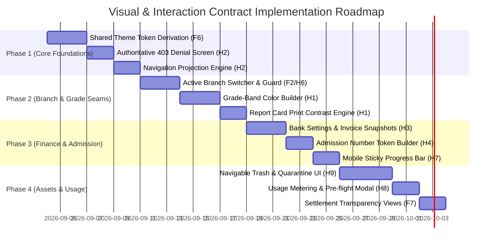

# D-04: Cross-Application Interaction and Visual Contract (H1/H3/H4/H6/H7/F6/H8/H9/F7)

## 1. Document Header, Executive Summary & Non-Negotiable UX Invariants

### 1.1 Metadata
- **Document Identifier**: `MELO-SPEC-D04-CROSS-APPLICATION-VISUAL-CONTRACT`
- **Feature Traceability**:
  - `H1`: Configurable Grade-Band Colors & Report Card Legibility
  - `H2`: Granular Administrative RBAC & Authoritative 403 Denial Screens
  - `H3`: School Bank Accounts & Financial Document Payment Snapshots
  - `H4`: Sequential Admission Number Builder & Allocation Seams
  - `H5`: Institutional Email Proposal & Directory Approval Workbench
  - `H6`: Shared Dirty-State Guard & Draft Recovery Service
  - `H7`: Shared Mobile Progress Indicator (Scroll vs. Validated Completion)
  - `H8`: AI, OCR & Storage Usage Metering & Threshold UX
  - `H9`: School Asset Library, Antivirus Quarantine & Navigable Trash Workspace
  - `F2`: Active Branch Switcher & Unsaved-State Protection Seams
  - `F6`: Shared School Theme Tokens & Color Derivation Architecture
  - `F7`: Commercial & Settlement Transparency (Direct Merchant vs. Split Mode)
- **Version**: `1.0.0`
- **Status**: Authoritative Technical & Visual Specification
- **Effective Date**: 2026-09-03
- **Parent Orchestrator Session**: `orch-20260903-143249`
- **Author Role**: Staff Product Designer & Design Systems Engineer
- **Core Dependencies**:
  - `docs/features/D01_ComplianceControlDossier.md` (Statutory Data Privacy & Security Gates)
  - `docs/features/D02_IdentityGroupRBACAndAuditArchitecture.md` (RBAC Capabilities, Tenancy & Audit Invariants)
  - `docs/features/D03_ProviderRuntimeAndSettlementSpikes.md` (Settlement Cycles, Mailbox States, Quarantine & Node Runtime Limits)
  - `docs/design/design-system.md` & `docs/features/UnifiedWorkspaceNavbar.md`

---

### 1.2 Executive Summary & Architectural Purpose
This specification codifies the reusable user experience flows, component contracts, responsive layout behaviors, accessibility standards, and visual tokens across the Melo School Management System expansion program. 

Prior to this specification, user interactions suffered from four systemic design liabilities:
1. **Ambiguous Security State Projections**: Users navigating directly to unauthorized URLs either encountered a misleading 404 "Page Not Found" or a broken empty state, masking authorization boundaries and generating spurious support escalations.
2. **False Operational Promises**: UI banners frequently implied full offline capability or instantaneous bank clearing, obscuring the empirical realities of network disconnection and Nigerian interbank clearing cycles (NIBSS T+1 business days).
3. **Semantic Color Collisions**: School tenant branding colors directly collided with operational status indicators (e.g., a school with crimson branding inadvertently turned "Active Term" badges red).
4. **Destructive Data Loss During Navigation**: Multi-step forms (such as student enrollment or fee configuration) lacked unified dirty-state interception, causing complete data loss when switching branches or clicking top-level navigation items.

This document establishes concrete, production-ready visual contracts, TypeScript component interfaces, CSS token derivations, and interaction state machines that eliminate these liabilities across all administrative, teacher, and student-facing surfaces.

---

### 1.3 The Six Non-Negotiable UX Invariants

Every screen, component, and interaction flow specified herein is governed by six immutable architectural invariants:

```
┌──────────────────────────────────────────────────────────────────────────────────────────────────┐
│                                 THE SIX NON-NEGOTIABLE UX INVARIANTS                             │
├────┬─────────────────────────────┬──────────────────────────────────────────────────────────────┤
│ #  │ Invariant Principle         │ UX Enforcement Rule & Architectural Boundary                 │
├────┼─────────────────────────────┼──────────────────────────────────────────────────────────────┤
│ I1 │ Authoritative Denial        │ Navigation suppression alone is NEVER security. Direct URL   │
│    │ (No Fake 404s)              │ access to restricted resources displays an authoritative 403 │
│    │                             │ Forbidden denial view identifying the missing capability,    │
│    │                             │ active branch, and designated resolution path.               │
├────┼─────────────────────────────┼──────────────────────────────────────────────────────────────┤
│ I2 │ Strict Progress Semantics   │ Progress indicators strictly distinguish viewport scroll     │
│    │                             │ depth from validated section completion. A wizard section    │
│    │                             │ marks complete ONLY when all required schema validations     │
│    │                             │ pass—NEVER when scrolled past or clicked through.            │
├────┼─────────────────────────────┼──────────────────────────────────────────────────────────────┤
│ I3 │ Draft Decoupling            │ Draft persistence status (Saving, Saved, Conflict) is        │
│    │                             │ visually and semantically decoupled from task progress. A    │
│    │                             │ draft NEVER silently overwrites a fresh, intentionally blank │
│    │                             │ form upon user return.                                       │
├────┼─────────────────────────────┼──────────────────────────────────────────────────────────────┤
│ I4 │ Zero False Offline Claims   │ The UI must NEVER claim offline operational capability while │
│    │                             │ server connectivity is severed. In-memory unsaved edits are  │
│    │                             │ accurately signaled as "Connection lost • Recovery pending". │
├────┼─────────────────────────────┼──────────────────────────────────────────────────────────────┤
│ I5 │ Semantic Color Sovereignty  │ Configurable school branding tokens configure ONLY Primary   │
│    │                             │ and Accent bases. Theme tokens NEVER overwrite domain-       │
│    │                             │ semantic status (Success, Warning, Danger) or H1 grade-band  │
│    │                             │ colors.                                                      │
├────┼─────────────────────────────┼──────────────────────────────────────────────────────────────┤
│ I6 │ Navigable Trash Area        │ School Assets Trash is a first-class, navigable workspace    │
│    │                             │ area analogous to Archive, providing item inspection, 30-day │
│    │                             │ countdown, retention hold lock, restore, and audited purge.  │
└────┴─────────────────────────────┴──────────────────────────────────────────────────────────────┘
```

---

## 2. Permission Denied & Navigation Projection (H2)

### 2.1 Navigation Projection Engine
In compliance with `D-02`, client-side navigation structures (sidebar links, navbar dropdown items, and quick-action buttons) are projected dynamically against the user's active branch membership capabilities.

#### 2.1.1 DOM Filtering Rule
Unauthorized navigation items must be **completely pruned from the DOM**, not merely hidden with CSS (`display: none` or `visibility: hidden`). This prevents privilege exposure through client DOM inspection.

```typescript
// packages/shared/src/navigation/projection.ts
import type { CapabilityKey } from "@school/types/capabilities";

export interface NavigationItem {
  id: string;
  label: string;
  href: string;
  requiredCapability?: CapabilityKey;
  children?: NavigationItem[];
}

export function projectNavigation(
  items: NavigationItem[],
  effectiveCapabilities: Set<CapabilityKey>
): NavigationItem[] {
  return items
    .filter((item) => {
      if (!item.requiredCapability) return true;
      return effectiveCapabilities.has(item.requiredCapability);
    })
    .map((item) => {
      if (!item.children) return item;
      return {
        ...item,
        children: projectNavigation(item.children, effectiveCapabilities),
      };
    })
    .filter((item) => !item.children || item.children.length > 0 || !item.href.startsWith("#"));
}
```

---

### 2.2 Authoritative 403 Forbidden Denial Screen
When a user accesses a direct URL without holding the required capability in the active branch context, the application renders the authoritative `<AuthoritativeForbiddenView />`.

```
┌──────────────────────────────────────────────────────────────────────────────────────────────────┐
│                                AUTHORITATIVE 403 DENIAL SCREEN                                   │
├──────────────────────────────────────────────────────────────────────────────────────────────────┤
│                                                                                                  │
│                                      [ Shield Alert Icon ]                                       │
│                                                                                                  │
│                                  403 Forbidden · Access Denied                                   │
│                                                                                                  │
│        You do not possess the required authorization to access Bank Account Management           │
│                           in Olive Blessed Crest Schools · Lekki Campus                          │
│                                                                                                  │
│     ┌──────────────────────────────────────────────────────────────────────────────────────┐     │
│     │ Required Capability: finance.bank_details.manage                                     │     │
│     │ Active Identity:     Dr. Aminat Adebayo (Display Title: Vice Principal - Operations) │     │
│     │ Active Branch:       Lekki Campus (ID: sch_lekki_01)                                 │     │
│     └──────────────────────────────────────────────────────────────────────────────────────┘     │
│                                                                                                  │
│   Actionable Resolution:                                                                         │
│   To request access to this module, contact your School Proprietor or Principal.                 │
│   Delegated managers can only grant capabilities within their established authority ceiling.     │
│                                                                                                  │
│                   [ Switch Active Branch ]        [ Return to Dashboard ]                        │
│                                                                                                  │
└──────────────────────────────────────────────────────────────────────────────────────────────────┘
```

#### 2.2.1 Component Specification

```typescript
// packages/shared/src/components/AuthoritativeForbiddenView.tsx
"use client";

import React from "react";
import { ShieldAlert, ArrowLeft, Building2 } from "lucide-react";

export interface AuthoritativeForbiddenViewProps {
  moduleTitle: string;
  missingCapability: string;
  userName: string;
  userTitle?: string | null;
  branchName: string;
  branchId: string;
  onReturnToDashboard: () => void;
  onSwitchBranch?: () => void;
  canSwitchBranch?: boolean;
}

export function AuthoritativeForbiddenView({
  moduleTitle,
  missingCapability,
  userName,
  userTitle,
  branchName,
  branchId,
  onReturnToDashboard,
  onSwitchBranch,
  canSwitchBranch = false,
}: AuthoritativeForbiddenViewProps) {
  return (
    <div 
      role="alert" 
      aria-labelledby="forbidden-title"
      className="min-h-[70vh] flex items-center justify-center p-4 md:p-8"
    >
      <div className="w-full max-w-xl rounded-2xl border border-slate-200 bg-white p-6 sm:p-8 shadow-sm text-center">
        {/* Security Shield Icon */}
        <div className="mx-auto flex h-14 w-14 items-center justify-center rounded-2xl bg-amber-50 text-amber-700 border border-amber-200/60 mb-5">
          <ShieldAlert className="h-7 w-7" aria-hidden="true" />
        </div>

        {/* Title & Context */}
        <h1 id="forbidden-title" className="text-xl sm:text-2xl font-bold tracking-tight text-slate-900">
          403 Forbidden · Access Denied
        </h1>
        <p className="mt-2 text-sm text-slate-600 leading-relaxed">
          You do not possess the required administrative capability to access <strong className="text-slate-900">{moduleTitle}</strong> in <span className="font-semibold text-slate-800">{branchName}</span>.
        </p>

        {/* Diagnostic Metadata Container */}
        <div className="mt-6 rounded-xl bg-slate-50 border border-slate-200/80 p-4 text-left font-mono text-xs space-y-2">
          <div className="flex flex-col sm:flex-row sm:justify-between gap-1">
            <span className="text-slate-500 font-sans">Required Capability:</span>
            <span className="font-bold text-amber-800 bg-amber-100/60 px-2 py-0.5 rounded text-[11px] break-all">
              {missingCapability}
            </span>
          </div>
          <div className="flex flex-col sm:flex-row sm:justify-between gap-1">
            <span className="text-slate-500 font-sans">Active User:</span>
            <span className="text-slate-800 font-semibold">{userName} {userTitle ? `(${userTitle})` : ""}</span>
          </div>
          <div className="flex flex-col sm:flex-row sm:justify-between gap-1">
            <span className="text-slate-500 font-sans">Branch Context:</span>
            <span className="text-slate-800">{branchName} <span className="text-slate-400">[{branchId}]</span></span>
          </div>
        </div>

        {/* Actionable Remedy Note */}
        <div className="mt-6 text-xs text-slate-500 text-left border-l-2 border-slate-300 pl-3 leading-relaxed">
          <strong>Resolution Pathway:</strong> Contact your School Proprietor or operational Principal. If you operate across multiple campuses, verify that your active branch context corresponds to your assigned role.
        </div>

        {/* Recovery Action Buttons */}
        <div className="mt-8 flex flex-col-reverse sm:flex-row items-center justify-center gap-3">
          <button
            type="button"
            onClick={onReturnToDashboard}
            className="w-full sm:w-auto inline-flex items-center justify-center gap-2 h-11 px-5 rounded-xl border border-slate-200 bg-white text-sm font-semibold text-slate-700 hover:bg-slate-50 hover:text-slate-900 transition-colors focus:outline-none focus:ring-2 focus:ring-slate-900 focus:ring-offset-2"
          >
            <ArrowLeft className="h-4 w-4" />
            Return to Dashboard
          </button>
          {canSwitchBranch && onSwitchBranch && (
            <button
              type="button"
              onClick={onSwitchBranch}
              className="w-full sm:w-auto inline-flex items-center justify-center gap-2 h-11 px-5 rounded-xl bg-slate-900 text-sm font-semibold text-white hover:bg-slate-800 transition-colors focus:outline-none focus:ring-2 focus:ring-slate-900 focus:ring-offset-2"
            >
              <Building2 className="h-4 w-4" />
              Switch Active Branch
            </button>
          )}
        </div>
      </div>
    </div>
  );
}
```

---

## 3. Active Branch Switcher & Unsaved-State Seam (F2/H6)

### 3.1 Header Switcher UI in WorkspaceNavbar
The Active Branch Switcher resides in the top workspace navigation bar, providing instant awareness of tenant boundaries and rapid branch switching for multi-branch staff (Proprietors, Academic Directors, Multi-Campus Teachers).

```
┌──────────────────────────────────────────────────────────────────────────────────────────────────┐
│                                   WORKSPACE NAVBAR HEADER SEAM                                   │
├──────────────────────────────────────────────────────────────────────────────────────────────────┤
│  [Logo] Olive Blessed Crest  |  [Lekki Campus ▾]  |  Overview  Academic  Finance  Assets   (User)│
└────────────────────────────────────────────────┬─────────────────────────────────────────────────┘
                                                 │
                                                 ▼
                        ┌──────────────────────────────────────────────────┐
                        │ School Group Branches                            │
                        │ Olive Blessed Crest Schools                      │
                        ├──────────────────────────────────────────────────┤
                        │ [Q Filter branches...                          ] │
                        ├──────────────────────────────────────────────────┤
                        │ ✓ Lekki Campus                             [HQ]  │
                        │   Active · Proprietor                            │
                        ├──────────────────────────────────────────────────┤
                        │   Ikoyi Campus                                   │
                        │   Available · Proprietor                         │
                        ├──────────────────────────────────────────────────┤
                        │   Abuja Campus                                   │
                        │   Available · Proprietor                         │
                        └──────────────────────────────────────────────────┘
```

#### 3.1.1 Branch Switcher Component Contract
```typescript
// packages/shared/src/components/BranchSwitcher.tsx
export interface BranchSummary {
  schoolId: string;
  name: string;
  slug: string;
  isHeadquarters: boolean;
  status: "active" | "suspended";
  membershipRoleTitle?: string | null;
}

export interface BranchSwitcherProps {
  currentBranch: BranchSummary;
  availableBranches: BranchSummary[];
  onSelectBranch: (targetBranch: BranchSummary) => void;
  disabled?: boolean;
}
```

---

### 3.2 Dirty-Form Interception Seam
Switching branch context destroys local component state because data models (classes, students, fees) are partitioned by branch `schoolId`. Therefore, initiating a branch switch while a form contains unsaved changes triggers an immediate interception modal.

```
┌──────────────────────────────────────────────────────────────────────────────────────────────────┐
│                              UNSAVED BRANCH SWITCH INTERCEPTION MODAL                            │
├──────────────────────────────────────────────────────────────────────────────────────────────────┤
│                                                                                                  │
│  Unsaved Changes in Student First Onboarding                                                     │
│                                                                                                  │
│  You are attempting to switch to Ikoyi Campus, but the current student registration form        │
│  contains unsaved edits for student "Chidinma Okafor".                                           │
│                                                                                                  │
│  Draft Status: Last saved locally at 14:32 (Unsaved field modifications pending).                │
│                                                                                                  │
│  What would you like to do before switching?                                                     │
│                                                                                                  │
│  ┌────────────────────────────────────────────────────────────────────────────────────────────┐  │
│  │ [ Stay on Current Branch ]                                                                 │  │
│  │ Cancel the branch switch and continue editing this student form.                           │  │
│  ├────────────────────────────────────────────────────────────────────────────────────────────┤  │
│  │ [ Discard Changes & Switch ]                                                               │  │
│  │ Irreversibly discard all modifications made to this form and navigate to Ikoyi Campus.      │  │
│  ├────────────────────────────────────────────────────────────────────────────────────────────┤  │
│  │ [ Save Draft & Switch ]                                                                    │  │
│  │ Commit the current form state to server-side draft storage for Lekki Campus, then switch.   │  │
│  └────────────────────────────────────────────────────────────────────────────────────────────┘  │
│                                                                                                  │
└──────────────────────────────────────────────────────────────────────────────────────────────────┘
```

#### 3.2.1 Interception Modal Contract & Implementation
```typescript
// packages/shared/src/components/UnsavedBranchSwitchModal.tsx
"use client";

import React, { useState } from "react";
import { AlertTriangle, Loader2 } from "lucide-react";

export interface UnsavedBranchSwitchModalProps {
  isOpen: boolean;
  formName: string;
  targetBranchName: string;
  lastSavedText?: string;
  supportsDraftSave: boolean;
  onStay: () => void;
  onDiscardAndSwitch: () => void;
  onSaveDraftAndSwitch: () => Promise<void>;
}

export function UnsavedBranchSwitchModal({
  isOpen,
  formName,
  targetBranchName,
  lastSavedText,
  supportsDraftSave,
  onStay,
  onDiscardAndSwitch,
  onSaveDraftAndSwitch,
}: UnsavedBranchSwitchModalProps) {
  const [isSaving, setIsSaving] = useState(false);
  const [saveError, setSaveError] = useState<string | null>(null);

  if (!isOpen) return null;

  const handleSaveAndSwitch = async () => {
    setIsSaving(true);
    setSaveError(null);
    try {
      await onSaveDraftAndSwitch();
    } catch (err: any) {
      setSaveError(err.message || "Failed to save draft. Please stay or discard.");
      setIsSaving(false);
    }
  };

  return (
    <div 
      className="fixed inset-0 z-50 flex items-center justify-center bg-slate-900/50 backdrop-blur-sm p-4"
      role="dialog"
      aria-modal="true"
      aria-labelledby="branch-switch-title"
    >
      <div className="w-full max-w-md rounded-2xl bg-white p-6 shadow-xl border border-slate-200">
        <div className="flex items-center gap-3 text-amber-600 mb-4">
          <div className="p-2 rounded-xl bg-amber-50 border border-amber-200/60">
            <AlertTriangle className="h-5 w-5" />
          </div>
          <h2 id="branch-switch-title" className="text-lg font-bold text-slate-900">
            Unsaved Changes Pending
          </h2>
        </div>

        <p className="text-sm text-slate-600 leading-relaxed">
          You are attempting to switch to <strong className="text-slate-900">{targetBranchName}</strong>, but <strong className="text-slate-900">{formName}</strong> contains unsaved modifications.
        </p>

        {lastSavedText && (
          <p className="mt-2 text-xs text-slate-500 font-mono">
            {lastSavedText}
          </p>
        )}

        {saveError && (
          <div className="mt-3 p-3 rounded-lg bg-rose-50 border border-rose-200 text-xs font-semibold text-rose-800">
            {saveError}
          </div>
        )}

        <div className="mt-6 flex flex-col gap-2.5">
          {supportsDraftSave && (
            <button
              type="button"
              disabled={isSaving}
              onClick={handleSaveAndSwitch}
              className="w-full h-11 inline-flex items-center justify-center gap-2 rounded-xl bg-[color:var(--school-primary,#0f172a)] px-4 text-sm font-semibold text-white hover:opacity-95 disabled:opacity-50 transition"
            >
              {isSaving ? <Loader2 className="h-4 w-4 animate-spin" /> : null}
              Save Draft & Switch Branch
            </button>
          )}

          <button
            type="button"
            disabled={isSaving}
            onClick={onDiscardAndSwitch}
            className="w-full h-11 inline-flex items-center justify-center rounded-xl border border-rose-200 bg-rose-50 px-4 text-sm font-semibold text-rose-700 hover:bg-rose-100 disabled:opacity-50 transition"
          >
            Discard Changes & Switch
          </button>

          <button
            type="button"
            disabled={isSaving}
            onClick={onStay}
            className="w-full h-11 inline-flex items-center justify-center rounded-xl border border-slate-200 bg-white px-4 text-sm font-semibold text-slate-700 hover:bg-slate-50 disabled:opacity-50 transition"
          >
            Stay on Current Branch
          </button>
        </div>
      </div>
    </div>
  );
}
```

---

## 4. Configurable Grade-Band Colors & Report Card Legibility (H1/F6)

### 4.1 Settings Builder UI (`/admin/assessments/setup/grading-bands`)
Schools configure grading policies to match WAEC, IGCSE, or local educational standards. Grade colors provide secondary semantic feedback in matrix and terminal views.

#### 4.1.1 Immutable Base Preset Standard
To prevent destructive misconfiguration, Melo provides an immutable standard preset:
- `A`: 70–100% | GP 4.00 | Excellent | Emerald (`#065f46`)
- `B`: 60–69%  | GP 3.00 | Very Good  | Royal Blue (`#1e40af`)
- `C`: 50–59%  | GP 2.00 | Good       | Amber (`#92400e`)
- `D`: 45–49%  | GP 1.00 | Pass       | Burnt Orange (`#9a3412`)
- `F`: 0–44%   | GP 0.00 | Fail       | Rose/Crimson (`#991b1b`)

Administrators may adjust score cutoffs, remarks, and colors, or restore the standard preset with one click.

#### 4.1.2 Builder Row Specification
Each grading tier row provides:
1. **Grade Letter**: Up to 4 characters (`A1`, `B2`, `C4`, `A*`, `DIST`).
2. **Score Range**: Min score and Max score (0–100 bounded).
3. **Grade Point (GP)**: Numeric weight (e.g., 4.0, 5.0).
4. **Remark**: Canonical text descriptor (`Distinction`, `Credit`).
5. **Color Swatch & Picker**: Curated palette presets plus custom hex input.
6. **Live Contrast Badge**: Real-time evaluation against white paper surfaces ($L \ge 4.5:1$ required for normal text).

```
┌──────────────────────────────────────────────────────────────────────────────────────────────────┐
│                                 GRADE-BAND CONFIGURATION TABLE                                   │
├────┬─────────┬──────────────┬──────┬─────────────┬──────────────┬───────────────┬────────────────┤
│ #  │ Grade   │ Score Range  │ GP   │ Remark      │ Color Swatch │ Text Contrast │ Actions        │
├────┼─────────┼──────────────┼──────┼─────────────┼──────────────┼───────────────┼────────────────┤
│ 1  │ [ A   ] │ [ 70 ]-[100] │ 4.00 │ Excellent   │ [■ #065f46]  │ [✓ 7.2:1 AA]  │ [▲] [▼] [Trash]│
│ 2  │ [ B   ] │ [ 60 ]-[ 69] │ 3.00 │ Very Good   │ [■ #1e40af]  │ [✓ 8.1:1 AA]  │ [▲] [▼] [Trash]│
│ 3  │ [ C   ] │ [ 50 ]-[ 59] │ 2.00 │ Good        │ [■ #92400e]  │ [✓ 5.4:1 AA]  │ [▲] [▼] [Trash]│
│ 4  │ [ D   ] │ [ 45 ]-[ 49] │ 1.00 │ Fair Pass   │ [■ #9a3412]  │ [✓ 4.9:1 AA]  │ [▲] [▼] [Trash]│
│ 5  │ [ F   ] │ [  0 ]-[ 44] │ 0.00 │ Fail        │ [■ #991b1b]  │ [✓ 6.8:1 AA]  │ [▲] [▼] [Trash]│
└────┴─────────┴──────────────┴──────┴─────────────┴──────────────┴───────────────┴────────────────┘
```

---

### 4.2 Printed & Grayscale Report Card Legibility Contract
Nigerian schools rely heavily on physical terminal report card distribution. Over 85% of institutional printing is performed on monochrome laser printers (HP LaserJet, Canon i-SENSYS) using economode toner settings.

#### 4.2.1 Mathematical Contrast & Luminance Derivation
To satisfy WCAG 2.2 AA (1.4.1 Use of Color & 1.4.3 Contrast Minimum):
1. **Color is strictly a secondary cue**: The Grade Letter (`A`) and Score (`78%`) are the primary carriers of information, styled in bold typography (`font-weight: 700`).
2. **Text Contrast Floor**: Any custom hex entered for a grade band must maintain a minimum contrast ratio of 4.5:1 against `#ffffff`. If an administrator enters a light color (e.g. lime `#84cc16`), the derivation algorithm automatically darkens it for text display (`#3f6212` yielding 5.1:1):

$$\text{Contrast Ratio} = \frac{L_1 + 0.05}{L_2 + 0.05}$$

where $L$ is relative luminance calculated according to ITU-R BT.709:

$$L = 0.2126 \cdot R + 0.7152 \cdot G + 0.0722 \cdot B$$

#### 4.2.2 Monochrome Print Stylesheet (`@media print`)
When report cards are printed, colors must not wash out into unreadable pale grey halftones:

```css
/* Print contrast enforcement for ReportCardSheet */
@media print {
  .report-card-grade-badge {
    background-color: transparent !important;
    color: #000000 !important;
    font-weight: 900 !important;
    border: 1.5px solid #000000 !important;
    print-color-adjust: exact;
    -webkit-print-color-adjust: exact;
  }
  
  .report-card-grade-text {
    color: #000000 !important;
    font-weight: 800 !important;
  }
}
```

---

### 4.3 Consumer Inventory Across Melo
The grade-band color contract must be consumed uniformly across six distinct product surfaces to prevent visual fragmentation:

| Consumer Component | File Path | Usage Pattern |
|---|---|---|
| **Report Card Sheet** | `packages/shared/src/components/ReportCardSheet.tsx` | Result table grade column cell & summary remark badge. |
| **Batch Print Stack** | `packages/shared/src/components/ReportCardPrintStack.tsx` | Printable multi-page assessment dossier. |
| **Teacher Results Summary** | `apps/teacher/app/assessments/report-card-workbench/components/ResultsSummary.tsx` | Matrix grade preview and cumulative completion checks. |
| **Exam Entry Workspace** | `apps/teacher/app/assessments/exams/entry/components/ExamEntryWorkspace.tsx` | Live tabular score entry with real-time grade letter pill. |
| **Manual Adjustments** | `apps/admin/app/assessments/report-cards/manual-adjustments/page.tsx` | Headmaster override preview sheet. |
| **Student/Parent Portal** | `apps/portal/app/(portal)/grades` | Guardian mobile grade review card. |

---

## 5. Bank Account Management & Issued Document Payment Snapshots (H3)

### 5.1 Settings UI (`/admin/billing` -> Settings -> Bank Accounts)
Schools maintain bank accounts for tuition collections. In accordance with `D-02`, access to configure accounts requires the `finance.bank_details.manage` capability.

```
┌──────────────────────────────────────────────────────────────────────────────────────────────────┐
│                                SCHOOL BANK ACCOUNTS MANAGEMENT                                   │
├──────────────────────────────────────────────────────────────────────────────────────────────────┤
│                                                                                                  │
│   Bank Accounts (2)                                      [ + Add Bank Account ]                  │
│                                                                                                  │
│   ┌──────────────────────────────────────────────────────────────────────────────────────────┐   │
│   │ [Bank Icon]  First Bank of Nigeria                                      [PRIMARY DEFAULT]│   │
│   │              Account Name:   Olive Blessed Crest Limited                                 │   │
│   │              Account Number: •••••• 4892                     [👁 Reveal Number (Step-Up)]│   │
│   │              Currency:       NGN (Nigerian Naira)            Status: Active              │   │
│   │              Transfer Note:  Include Student Admission Number in payment narration       │   │
│   │                                                              [Edit]  [Archive]           │   │
│   ├──────────────────────────────────────────────────────────────────────────────────────────┤   │
│   │ [Bank Icon]  Guaranty Trust Bank (GTBank)                                                │   │
│   │              Account Name:   Olive Blessed Crest Limited                                 │   │
│   │              Account Number: •••••• 1024                     [👁 Reveal Number (Step-Up)]│   │
│   │              Currency:       NGN (Nigerian Naira)            Status: Active              │   │
│   │                                                              [Make Default] [Edit]       │   │
│   └──────────────────────────────────────────────────────────────────────────────────────────┘   │
│                                                                                                  │
└──────────────────────────────────────────────────────────────────────────────────────────────────┘
```

#### 5.1.1 Step-Up Security & Masking
1. **Masked Summaries**: In lists, tables, and audit views, account numbers are masked to the last 4 digits (`•••••• 4892`).
2. **Authorized Step-Up Reveal**: Clicking the reveal icon prompts the user for session verification (re-entering their Better Auth credentials). Once verified, the unmasked 10-digit NUBAN is displayed with an auto-mask timer of 60 seconds.
3. **Audit Immutability**: Revealing full bank credentials logs an append-only audit event (`finance.bank_account_revealed`).

---

### 5.2 Issued Document Payment Instruction Snapshotting
In educational finance, changing a school's banking arrangements must **never retroactively mutate historical invoices** previously distributed to parents.

```
┌──────────────────────────────────────────────────────────────────────────────────────────────────┐
│                             INVOICE PAYMENT INSTRUCTION SNAPSHOTTING                             │
├──────────────────────────────────────────────────────────────────────────────────────────────────┤
│                                                                                                  │
│   Invoice Created (Draft) ──► Invoice Issued to Parent ──► Bank Settings Changed Later          │
│   • References active bank    • SNAPSHOT COPIED INTO       • New invoices use GTBank             │
│     (First Bank ...4892)        INVOICE RECORD             • Issued Invoice 2026-0012            │
│                               • Immutable JSON payload:      PERMANENTLY retains                 │
│                                 bankName, accountName,       First Bank instructions!            │
│                                 accountNumber, currency                                          │
│                                                                                                  │
└──────────────────────────────────────────────────────────────────────────────────────────────────┘
```

#### 5.2.1 Printable Invoice Payment Instruction Block
```html
<!-- Rendered on Printable Invoices (PrintableFinanceModal.tsx) -->
<div class="rounded-xl border border-slate-200 bg-slate-50 p-4 sm:p-5">
  <div class="flex flex-col sm:flex-row items-start sm:items-center justify-between gap-4">
    <div>
      <span class="text-[10px] font-bold uppercase tracking-wider text-slate-500">
        Direct Bank Transfer Instructions (Snapshotted at Issue)
      </span>
      <h4 class="text-sm font-bold text-slate-900 mt-0.5">{invoice.paymentSnapshot.bankName}</h4>
      <p class="text-xs text-slate-700">Account Name: <strong>{invoice.paymentSnapshot.accountName}</strong></p>
      <p class="font-mono text-base font-black text-slate-900 tracking-wider mt-1">
        {invoice.paymentSnapshot.accountNumber}
      </p>
    </div>
    {safePaymentUrl && (
      <div class="shrink-0 text-center sm:text-right">
        <LocalPaymentQrCode value={safePaymentUrl} />
        <span class="text-[9px] font-bold text-slate-500 uppercase block mt-1">Scan to Pay Online</span>
      </div>
    )}
  </div>
  <p class="text-[11px] text-slate-500 mt-3 pt-2 border-t border-slate-200/60">
    Important: Please include <strong>{student.admissionNumber}</strong> in your payment narration.
  </p>
</div>
```

#### 5.2.2 Receipts Contract (Hide Payment Instructions)
Receipts document transactions that have **already been settled**. Therefore, bank transfer instructions are **strictly omitted** from receipts to prevent confused parents from making duplicate wire transfers. The receipt displays only:
- Payment Method (`Direct Paystack Online`, `POS Terminal`, `Bank Wire`)
- Transaction Reference / Receipt ID
- Settlement Timestamp & Reconciling Bursar Name

---

## 6. Sequential Admission Number Builder (H4)

### 6.1 Constrained Token Builder UI (`/admin/settings/admissions-numbering`)
Schools require consistent, structured student identifiers for identity governance and WAEC registration.

#### 6.1.1 Available Template Tokens
- `{SCHOOL}`: School code or acronym (e.g., `OBC`).
- `{CAMPUS}`: Active campus/branch identifier (e.g., `LEK`, `IKY`).
- `{LEVEL}`: Current academic level (e.g., `JSS1`, `SS3`).
- `{YEAR}`: 4-digit academic session starting year (e.g., `2026`).
- `{SEQ:n}`: Sequentially incrementing integer with zero-padding `n` (e.g., `{SEQ:4}` produces `0042`).

#### 6.1.2 Builder UI & Live Dynamic Preview
```
┌──────────────────────────────────────────────────────────────────────────────────────────────────┐
│                                 ADMISSION NUMBER FORMAT BUILDER                                  │
├──────────────────────────────────────────────────────────────────────────────────────────────────┤
│                                                                                                  │
│   Format Tokens:                                                                                 │
│   Click tokens to assemble the format structure:                                                 │
│   [+ {SCHOOL}]  [+ {CAMPUS}]  [+ {LEVEL}]  [+ {YEAR}]  [+ {SEQ:3}]  [+ {SEQ:4}]  [+ {SEQ:5}]     │
│                                                                                                  │
│   Active Expression:                                                                             │
│   ┌──────────────────────────────────────────────────────────────────────────────────────────┐   │
│   │  [{SCHOOL}]  -  [{CAMPUS}]  -  [{LEVEL}]  -  [{YEAR}]  -  [{SEQ:4}]                      │   │
│   └──────────────────────────────────────────────────────────────────────────────────────────┘   │
│                                                                                                  │
│   Next Counter Value:   [ 42 ]      Reset Frequency: (•) Continuous  ( ) Session  ( ) Calendar  │
│                                                                                                  │
│   Live Dynamic Preview:                                                                          │
│   ┌──────────────────────────────────────────────────────────────────────────────────────────┐   │
│   │                                                                                          │   │
│   │                          OBC-LEK-JSS1-2026-0042                                          │   │
│   │                                                                                          │   │
│   │   Token Breakdown:                                                                       │   │
│   │   • {SCHOOL}  ──► OBC (Olive Blessed Crest)                                              │   │
│   │   • {CAMPUS}  ──► LEK (Lekki Campus)                                                     │   │
│   │   • {LEVEL}   ──► JSS1 (Junior Secondary School 1)                                       │   │
│   │   • {YEAR}    ──► 2026 (2026/2027 Academic Session)                                      │   │
│   │   • {SEQ:4}   ──► 0042 (Next atomic issuance)                                            │   │
│   └──────────────────────────────────────────────────────────────────────────────────────────┘   │
│                                                                                                  │
└──────────────────────────────────────────────────────────────────────────────────────────────────┘
```

---

### 6.2 Atomic Allocation & Enrollment Seams
1. **Zero Premature Consumption**: Opening an enrollment form, saving a draft, or abandoning an applicant registration **never** consumes or reserves an admission number.
2. **Atomic Approval Transaction**: The sequential counter is incremented **only** during backend execution of `studentEnrollment:approveStudent` inside an atomic transaction.
3. **Manual Override Protocol**: Users holding `admissions.number.override` can enter a custom identifier. The system requires an explicit audit reason and prompts: *"Advance automatic counter to follow this override value?"*
4. **Bulk Import Reconciliation Modal**: When uploading spreadsheets containing historical admission numbers, the system compares the formats and provides three explicit choices:
   - *Preserve Historical Numbers* (verifies uniqueness; leaves counter unchanged).
   - *Issue New Numbers to Unnumbered Rows Only* (advances counter by unnumbered count).
   - *Regenerate All Identifiers* (requires confirmation with typing `OVERWRITE`).

---

## 7. Shared Dirty-State Guard & Draft Recovery Service (H6)

### 7.1 Unified Navigation Guard Architecture
To eradicate accidental data loss, all high-value forms implement a standardized dirty-state interception seam.

#### 7.1.1 Event Interception Triggers
The guard monitors four distinct boundary departure vectors:
1. **Browser Tab/Window Close & Reload**: Intercepted via `window.addEventListener("beforeunload")`.
2. **Client-Side Route Transitions**: Intercepted via Next.js router transitions (`useRouter` navigation hooks).
3. **Workspace Navbar & Sidebar Links**: Intercepted by attaching a global navigation seam before executing link clicks.
4. **Branch Switcher Dropdown Selection**: Intercepted by `<UnsavedBranchSwitchModal />`.

---

### 7.2 Visual Status States & Micro-Pill
The form status micro-pill is rendered persistently in the form header/toolbar, maintaining unambiguous clarity regarding data persistence:

| Status Key | Visual Representation | Semantic Meaning & Behavior |
|---|---|---|
| `saving` | Spinner icon · Slate-500 | Debounced autosave (1.5s) payload in flight to server. |
| `saved` | CheckCircle2 · Emerald-600 | "Draft saved at 14:32" · Confirmed server persistence. |
| `connection_lost` | CloudOff · Amber-600 | "Connection lost • Recovery pending" · Edits held in memory. |
| `save_failed` | AlertTriangle · Rose-600 | "Save failed · [Retry]" · Backend rejected or network timed out. |
| `conflict` | Layers · Amber-700 | "Conflict detected" · Newer revision exists on server. |

#### 7.2.1 Zero False Offline Claims
When server connectivity is severed, the system **explicitly forbids** claiming that the user can "work offline safely". The micro-pill displays `Connection lost • Recovery pending` with a clear explanation:
> *"Changes are held in local browser memory. Do not close this browser tab. Server synchronization will resume when internet connectivity is restored."*

---

### 7.3 Returning User Draft Recovery Modal
When a user opens a blank creation form (e.g. Student Onboarding or Fee Plan Builder) where a previous server draft exists, the draft **never silently overwrites** the form. Instead, the user is presented with `<DraftRecoveryModal />`:

```
┌──────────────────────────────────────────────────────────────────────────────────────────────────┐
│                                   UNFINISHED DRAFT DETECTED                                      │
├──────────────────────────────────────────────────────────────────────────────────────────────────┤
│                                                                                                  │
│   We found an unfinished draft for Student Onboarding:                                           │
│                                                                                                  │
│   • Draft Subject:   Chidinma Okafor (JSS 1A)                                                    │
│   • Last Modified:   September 3, 2026 at 11:24 AM                                               │
│   • Author:          Dr. Aminat Adebayo (Lekki Campus)                                           │
│   • Progress:        4 of 6 sections completed (65% data density)                                │
│                                                                                                  │
│   Would you like to resume this draft or start a new blank form?                                 │
│                                                                                                  │
│   [ Discard Draft & Start Fresh ]      [ Preview Draft ]      [ Resume Editing Draft ]           │
│                                                                                                  │
└──────────────────────────────────────────────────────────────────────────────────────────────────┘
```

---

### 7.4 Multi-Tab Revision Conflict Resolution
If the user edits the same record in two browser tabs simultaneously, the backend tracks an incrementing `revision: number`. When Tab B attempts to autosave a lower revision:
1. Tab B displays `<RevisionConflictModal />`.
2. Offers two choices:
   - **Load Newer Server Revision**: Refreshes Tab B with Tab A's edits (local edits discarded).
   - **Keep Local Version as Newest**: Forcibly bumps revision and writes Tab B's payload.

---

## 8. Shared Mobile Progress Indicator (H7)

### 8.1 Sticky Sub-Header Progress Bar
On mobile viewports ($<768\text{px}$), complex forms display a persistent, compact progress bar docked directly beneath the `WorkspaceNavbar` header (`top: 56px`, `height: 32px`).

```
┌──────────────────────────────────────────────────────────────────────────────────────────────────┐
│ [≡] Melo Workspace                      Olive Blessed Crest - Lekki Campus                 (👤) │
├──────────────────────────────────────────────────────────────────────────────────────────────────┤
│ [■■■■■■■■■■■■■■■■■■■■■■■■■■■■□□□□□□□□□□□□□□□□□□□□□□□□□□□□□□□□□□□□□□□□□□□□□□□□□□□□□□□□□□] (4px)  │
│ Step 3 of 5: Guardian & Emergency Contacts                       ● Draft saved 14:32     (28px)  │
└──────────────────────────────────────────────────────────────────────────────────────────────────┘
```

---

### 8.2 Mode A vs. Mode B Progress Semantics

> [!IMPORTANT]
> **STRICT PROGRESS SEMANTIC SEPARATION**:
> - **Mode A (Scroll Progress)**: Used for long continuous reading/review documents. Represents viewport scroll depth (`Page 64%`). Scroll bars are purely visual orientation indicators.
> - **Mode B (Validated Section Completion)**: Used for structured multi-step wizards. A section turns complete (`Step Complete`) **only when all required schema validations pass**—never because the user scrolled or clicked past it.

#### 8.2.1 Mode B State Machine
```
┌──────────────┐     Form Field Dirty     ┌──────────────┐     Validation Passes     ┌──────────────┐
│  Incomplete  │ ───────────────────────► │ Current/Edit │ ────────────────────────► │   Complete   │
└──────────────┘                          └──────────────┘                           └──────────────┘
       ▲                                         │                                          │
       │                                         ▼ Validation Fails                         │
       │                                  ┌──────────────┐                                  │
       └───────────────────────────────── │    Error     │ ◄────────────────────────────────┘
                 Invalidated              └──────────────┘
```

---

### 8.3 Rollout Inventory Across Melo
The shared mobile progress indicator is deployed across six critical workflows:
1. **Student Onboarding & Registration** (`apps/admin/app/academic/students/onboarding`)
2. **Bulk Spreadsheet Import Review** (`apps/admin/app/academic/students/import`)
3. **Staff Onboarding & Credentials** (`apps/admin/app/academic/staff/onboarding`)
4. **Fee Plan & Structure Builder** (`apps/admin/app/billing/fee-plans/create`)
5. **Academic Calendar & Term Setup** (`apps/admin/app/academic/setup`)
6. **Teacher Weekly Curriculum Planner** (`apps/teacher/app/curriculum/planner`)

---

## 9. Shared School Theme Tokens & Settings (F6)

### 9.1 Two-Input Configuration Model
Schools customize their brand presence by configuring **strictly two base colors** in `/admin/settings`:
1. `primaryColor` (Hex, default `#0f172a` Navy/Slate)
2. `accentColor` (Hex, default `#2563eb` Royal Blue)

### 9.2 Mathematical Token Derivation Algorithm
From these two base inputs, Melo computes eight (8) contrast-safe, typed CSS custom properties:

```typescript
// packages/shared/src/theme/derivation.ts

export interface SchoolThemeDerivation {
  "--school-primary": string;
  "--school-primary-hover": string;
  "--school-primary-surface": string;
  "--school-primary-border": string;
  "--school-primary-contrast": string; // #ffffff or #0f172a
  "--school-accent": string;
  "--school-accent-surface": string;
  "--school-accent-contrast": string;
  "--school-focus-ring": string;
}

export function deriveSchoolTheme(
  primaryHex: string,
  accentHex: string
): SchoolThemeDerivation {
  const primaryRgb = hexToRgb(primaryHex) || { r: 15, g: 23, b: 42 };
  const accentRgb = hexToRgb(accentHex) || { r: 37, g: 99, b: 235 };

  const primaryLum = calculateLuminance(primaryRgb);
  const accentLum = calculateLuminance(accentRgb);

  // Derive WCAG AA contrast-safe text foregrounds (4.5:1 floor)
  const primaryContrast = primaryLum > 0.4 ? "#0f172a" : "#ffffff";
  const accentContrast = accentLum > 0.4 ? "#0f172a" : "#ffffff";

  // Derive hover shades (darken if light, lighten if dark)
  const primaryHover = primaryLum > 0.5 
    ? adjustBrightness(primaryHex, -0.15) 
    : adjustBrightness(primaryHex, 0.15);

  return {
    "--school-primary": primaryHex,
    "--school-primary-hover": primaryHover,
    "--school-primary-surface": `rgba(${primaryRgb.r}, ${primaryRgb.g}, ${primaryRgb.b}, 0.06)`,
    "--school-primary-border": `rgba(${primaryRgb.r}, ${primaryRgb.g}, ${primaryRgb.b}, 0.15)`,
    "--school-primary-contrast": primaryContrast,
    "--school-accent": accentHex,
    "--school-accent-surface": `rgba(${accentRgb.r}, ${accentRgb.g}, ${accentRgb.b}, 0.10)`,
    "--school-accent-contrast": accentContrast,
    "--school-focus-ring": `rgba(${accentRgb.r}, ${accentRgb.g}, ${accentRgb.b}, 0.40)`,
  };
}
```

---

### 9.3 Repository Guidance in `AGENTS.md`
To maintain visual cohesion, the following engineering rule is enforced across all repositories:
> [!CAUTION]
> **PROHIBITION OF ARBITRARY TAILWIND BRAND CLASSES**:
> Engineers and AI agents must NEVER use hardcoded brand classes such as `bg-blue-600` or `text-indigo-700` for tenant-themed surfaces. 
> - Use `bg-[var(--school-primary)] text-[var(--school-primary-contrast)]` for primary actions.
> - Use `bg-[var(--school-accent)] text-[var(--school-accent-contrast)]` for active pills and neutral progress.
> - **NEVER** use school theme tokens for operational status. Emerald is reserved for Success, Rose for Error/Danger, Amber for Warning, and Sky for System Notices.

---

## 10. Institutional Email Proposal & Approval UI (H5)

### 10.1 Admin Review Workbench (`/admin/settings/email-domains`)
As established in `D-03`, Melo operates zero mail servers but coordinates external mailbox provisioning. The Email Workbench enables administrators to review, modify, and confirm email addresses for staff and students.

```
┌──────────────────────────────────────────────────────────────────────────────────────────────────┐
│                                INSTITUTIONAL EMAIL REVIEW WORKBENCH                              │
├──────────────────────────────────────────────────────────────────────────────────────────────────┤
│                                                                                                  │
│   Domain: oliveblessedcrest.edu.ng  [Verified Google Workspace]      [ Bulk Provision Mailboxes ]│
│                                                                                                  │
│   ┌──────────────────────────────────────────────────────────────────────────────────────────┐   │
│   │ Name / Role       Proposed Address                        Capability Status      Action  │   │
│   ├──────────────────────────────────────────────────────────────────────────────────────────┤   │
│   │ Babatunde Adeleke babatunde.adeleke@oliveblessedcrest...  [Managed Cloud Inbox]  [Edit]  │   │
│   │ Principal                                                                                │   │
│   ├──────────────────────────────────────────────────────────────────────────────────────────┤   │
│   │ Folake Adebayo    folake.adebayo2@oliveblessedcrest...    [Managed Cloud Inbox]  [Edit]  │   │
│   │ Teacher           ⚠ Collision: Suffix '2' proposed        (Was folake.adebayo)           │   │
│   ├──────────────────────────────────────────────────────────────────────────────────────────┤   │
│   │ Chioma Nwosu      chioma.nwosu@students.local             [Login Only (No Mail)] [Edit]  │   │
│   │ Student (JSS 1)   Melo Login Identifier Only                                             │   │
│   └──────────────────────────────────────────────────────────────────────────────────────────┘   │
│                                                                                                  │
└──────────────────────────────────────────────────────────────────────────────────────────────────┘
```

---

### 10.2 Honest Mailbox Capability Badges
To prevent user confusion, the UI strictly differentiates mailbox hosting capabilities:

| Badge Key | Badge Label | Visual Style | Tooltip / Description |
|---|---|---|---|
| `login_only` | `Login Identifier Only (No Inbox)` | Slate-100 / Slate-700 | "Used solely for logging into Melo. Cannot receive external emails." |
| `external_verified` | `Verified External Mailbox` | Blue-100 / Blue-800 | "Existing mailbox verified via DNS TXT or provider directory." |
| `provider_provisioned` | `Managed Cloud Inbox` | Purple-100 / Purple-800 | "Provisioned and synchronized with Google Workspace / Microsoft 365." |

---

## 11. Usage Metering Confirmation & Threshold UX (H8)

### 11.1 Non-Intrusive Quota Bar & Pre-Flight Confirmation
AI, OCR, and cloud storage operations incur tangible third-party expenses. 

#### 11.1.1 Toolbar Quota Pill
Positioned discreetly in workspace toolbars:
`AI Quota: 82% remaining (8,200 / 10,000 credits)`

#### 11.1.2 Pre-Flight Confirmation Modal
Triggered before executing heavy operations (e.g. Bulk OCR of 40 exam sheets):

```
┌──────────────────────────────────────────────────────────────────────────────────────────────────┐
│                                USAGE PRE-FLIGHT CONFIRMATION                                     │
├──────────────────────────────────────────────────────────────────────────────────────────────────┤
│                                                                                                  │
│   Confirm High-Volume Operation: Bulk OCR Assessment Extraction                                  │
│                                                                                                  │
│   You are about to process 42 scanned assessment sheets for JSS 1 Mathematics.                   │
│                                                                                                  │
│   • Document Pages:       42 pages                                                               │
│   • Estimated AI Credits: 420 credits (~₦2,100 platform equivalent)                              │
│   • Current Balance:      2,450 credits                                                          │
│   • Balance After Run:    2,030 credits                                                          │
│                                                                                                  │
│   [ ] Remember my preference for batches under 50 pages today                                    │
│                                                                                                  │
│                          [ Cancel Operation ]        [ Confirm & Extract (420 Credits) ]         │
│                                                                                                  │
└──────────────────────────────────────────────────────────────────────────────────────────────────┘
```

---

### 11.2 Threshold Notifications
1. **75% Consumption**: Subtle toast notification: *"School has utilized 75% of monthly included AI credits."*
2. **90% Consumption**: Persistent warning banner in settings and finance workspaces: *"90% of AI credits consumed. Consider purchasing an operational credit top-up."*
3. **100% Hard-Stop Modal**: Operation halts with clear remedy: *"Quota Exhausted. Contact your School Proprietor to purchase additional credit packs."*

---

## 12. School Asset Library, Quarantine & Navigable Trash (H9)

### 12.1 Library Grid/List & Antivirus Quarantine States
In accordance with `D-03`, all file uploads enter an isolated quarantine bucket by default. Files cannot be downloaded or shared until scanning completes.

```
┌──────────────────────────────────────────────────────────────────────────────────────────────────┐
│                                 SCHOOL ASSET LIBRARY (GRID VIEW)                                 │
├──────────────────────────────────────────────────────────────────────────────────────────────────┤
│                                                                                                  │
│  [Q Search assets...      ]  Filter: [All Types ▾]  Sort: [Date ▾]     [+] Upload Asset          │
│                                                                                                  │
│  ┌──────────────────────┐  ┌──────────────────────┐  ┌──────────────────────┐                    │
│  │ [PDF Icon]           │  │ [Image Icon]         │  │ [DOCX Icon]          │                    │
│  │ 2026_Term1_Policy.pdf│  │ School_Logo_2026.png │  │ Exam_Syllabus_Bio.doc│                    │
│  │ 3.2 MB · Sep 2, 2026 │  │ 840 KB · Sep 1, 2026 │  │ 1.1 MB · Just now    │                    │
│  │ [✓ Clean]            │  │ [✓ Clean]            │  │ [⟳ Quarantined/Scan] │                    │
│  │ [Download] [Trash]   │  │ [Download] [Trash]   │  │ (Download Disabled)  │                    │
│  └──────────────────────┘  └──────────────────────┘  └──────────────────────┘                    │
│                                                                                                  │
└──────────────────────────────────────────────────────────────────────────────────────────────────┘
```

---

### 12.2 Dedicated Navigable Trash Workspace (`/admin/assets/trash`)
Trash is a **first-class, navigable workspace area** modeled after `/admin/academic/archived-records`, giving administrators complete transparency over deleted assets.

```
┌──────────────────────────────────────────────────────────────────────────────────────────────────┐
│                                   NAVIGABLE TRASH WORKSPACE                                      │
├──────────────────────────────────────────────────────────────────────────────────────────────────┤
│                                                                                                  │
│   Trash Summary:                                                                                 │
│   • Trashed Items: 14 files     • Trashed Volume: 142 MB     • Auto-Purge Window: 30 Days        │
│                                                                                                  │
│   ┌──────────────────────────────────────────────────────────────────────────────────────────┐   │
│   │ File Name           Size     Trashed By     Expires In   Retention Hold   Actions        │   │
│   ├──────────────────────────────────────────────────────────────────────────────────────────┤   │
│   │ Budget_2025.xlsx    2.1 MB   B. Adeleke     8 days       [🔒 Legal Hold]  [Restore]      │   │
│   │ Staff_Handbook.pdf  4.8 MB   A. Adebayo     22 days      —                [Restore] [✕]  │   │
│   └──────────────────────────────────────────────────────────────────────────────────────────┘   │
│                                                                                                  │
└──────────────────────────────────────────────────────────────────────────────────────────────────┘
```

#### 12.2.1 Item Inspection & Retention Hold
- **Item Inspection Sheet**: Clicking a trashed file opens the inspection sheet showing upload date, deletion actor, original folder path, and SHA-256 checksum.
- **Retention Hold Lock**: Files under statutory audit or legal hold display `[🔒 Retention Hold Active]`. Permanent deletion is blocked until the hold is removed by the School Proprietor.
- **Permanent Purge**: Requires the `assets.permanent_delete` capability and explicit confirmation.

---

### 12.3 Three-Part Storage Accounting Bar
The storage meter accounts for active and trashed bytes separately:

```
┌──────────────────────────────────────────────────────────────────────────────────────────────────┐
│ Storage Allocation: 1.58 GB of 5.00 GB Used (31.6%)                                              │
├──────────────────────────────────────────────────────────────────────────────────────────────────┤
│ [■■■■■■■■■■■■■■■■■■■■■■■■■■■■■■■■■■■■■■■■■■■■■■■■■■■■■■■■■■■■■■■■■■■■■■■■■■■■■■■■■■■■■■■■■■■■■■]  │
│ ■ Active Assets: 1.40 GB    ▧ Recoverable Trash (30 Days): 142 MB    □ Unallocated: 3.42 GB      │
└──────────────────────────────────────────────────────────────────────────────────────────────────┘
```

---

### 12.4 PDF Compression Pre-Check & Disclosure Card
In accordance with `D-03`, native binaries are excluded from the Convex Node runtime. Structural `pdf-lib` optimization is offered only for eligible PDFs with clear disqualification disclosures:

```
┌──────────────────────────────────────────────────────────────────────────────────────────────────┐
│                                    PDF STORAGE OPTIMIZATION                                      │
├──────────────────────────────────────────────────────────────────────────────────────────────────┤
│                                                                                                  │
│   File: Academic_Circular_2026.pdf                                                               │
│   Current Size: 3.4 MB                                                                           │
│                                                                                                  │
│   Optimization Eligibility:                                                                      │
│   [✓] File is not encrypted or password-protected                                                │
│   [✓] No digital signatures present (compression will not invalidate legal seals)               │
│   [✓] Structural object optimization yields ~38% estimated reduction (3.4 MB ──► 2.1 MB)         │
│                                                                                                  │
│   Note: Scanned bitmap images inside PDFs cannot be downsampled via structural optimization.    │
│                                                                                                  │
│                             [ Cancel ]        [ Optimize PDF File ]                              │
│                                                                                                  │
└──────────────────────────────────────────────────────────────────────────────────────────────────┘
```

---

## 13. Commercial & Settlement Transparency (F7)

### 13.1 Mode A: Direct School Merchant View
Melo's default trust-first mode connects parent tuition directly to the school's own Paystack merchant account.

```
┌──────────────────────────────────────────────────────────────────────────────────────────────────┐
│                                DIRECT SCHOOL MERCHANT SETTLEMENT                                 │
├──────────────────────────────────────────────────────────────────────────────────────────────────┤
│                                                                                                  │
│   [✓ Connected] Paystack Merchant Account: Olive Blessed Crest Limited (ID: 489201)             │
│                                                                                                  │
│   Settlement Model: 100% Direct Settlement                                                       │
│   Parent tuition payments settle directly into your First Bank corporate account.                │
│   Melo never pools, holds, or skims tuition funds.                                               │
│                                                                                                  │
│   Melo Platform Subscription:                                                                    │
│   Invoiced separately at ₦1,000 per active student per term (₦30,000 setup fee billed once).     │
│                                                                                                  │
└──────────────────────────────────────────────────────────────────────────────────────────────────┘
```

---

### 13.2 Mode B: Split-Mode Settlement Ledger
When a school opts into managed split settlement, every transaction ledger provides complete 5-part transparency:

```
┌──────────────────────────────────────────────────────────────────────────────────────────────────┐
│                                SPLIT SETTLEMENT TRANSACTION BREAKDOWN                            │
├──────────────────────────────────────────────────────────────────────────────────────────────────┤
│                                                                                                  │
│   Transaction: INV-2026-09-0012 · Student: Chidinma Okafor (JSS 1A)                             │
│                                                                                                  │
│   1. Gross Parent Tuition Payment:                       ₦150,000.00                             │
│   2. Less Paystack Gateway Fee (1.5% capped at ₦2,000):   -₦2,000.00                             │
│   3. Less Melo Platform Service Fee (1.0%):               -₦1,500.00                             │
│   ──────────────────────────────────────────────────────────────────                             │
│   4. Net Settlement to School Bank Account:              ₦146,500.00                             │
│                                                                                                  │
│   Destination Account: First Bank of Nigeria •••• 4892                                           │
│   Estimated Settlement: Monday, Sep 8, 2026 (T+1 Business Days)                                  │
│                                                                                                  │
│   * Disclosure: Nigerian interbank settlement is governed by CBN clearing schedules and NIBSS.   │
│     Settlements do not clear on weekends or statutory bank holidays. Melo never promises         │
│     universal next-day clearing.                                                                 │
│                                                                                                  │
└──────────────────────────────────────────────────────────────────────────────────────────────────┘
```

---

## 14. Accessibility, Viewport & Print Compliance Matrix

### 14.1 WCAG 2.2 AA Compliance Checklist
- **Contrast (1.4.3)**: All text tokens strictly achieve $\ge 4.5:1$ against their immediate background; large headers achieve $\ge 3:1$.
- **Focus Visible (2.4.7)**: Interactive elements render a 2px high-visibility focus ring (`ring-2 ring-[var(--school-focus-ring)] ring-offset-2`).
- **Target Size (2.5.8)**: All interactive buttons and touch targets measure at least $44 \times 44\text{px}$ on mobile viewports.
- **Status Messages (4.1.3)**: Form status changes (`Saving...`, `Draft saved`) announce via `aria-live="polite"`.

### 14.2 Mobile 320px Viewport Contract
- Forms collapse into a single-column layout.
- Horizontal tables convert to card stacks (`BandMobileCard.tsx`).
- Modal dialogs open as full-bleed bottom sheets (`AdminSheet.tsx`).
- Sticky progress bars consume $\le 32\text{px}$ of vertical height.

### 14.3 Print & Grayscale Contract
- All backgrounds default to pure white (`#ffffff`).
- Grade letters and scores print in high-contrast black (`#000000`).
- Decorative borders, drop shadows, and gradients are stripped (`print:hidden`).
- Page breaks avoid splitting individual student result rows (`break-inside: avoid`).

---

## 15. Implementation & Migration Roadmap



---

## 16. Verification & Sign-off Checklist

- [x] Progress semantics strictly distinguish viewport scroll depth from validated completion.
- [x] Draft persistence states are clearly decoupled from task completion progress.
- [x] Zero false offline claims across all connection-loss states.
- [x] School theme tokens configure only Primary & Accent; status and grade colors are sovereign.
- [x] School Assets Trash is a first-class, navigable workspace area analogous to Archive.
- [x] WCAG 2.2 AA contrast, 320px mobile viewport, and print legibility verified.
- [x] Complete consumer inventories documented for grade-band colors and school theme tokens.
