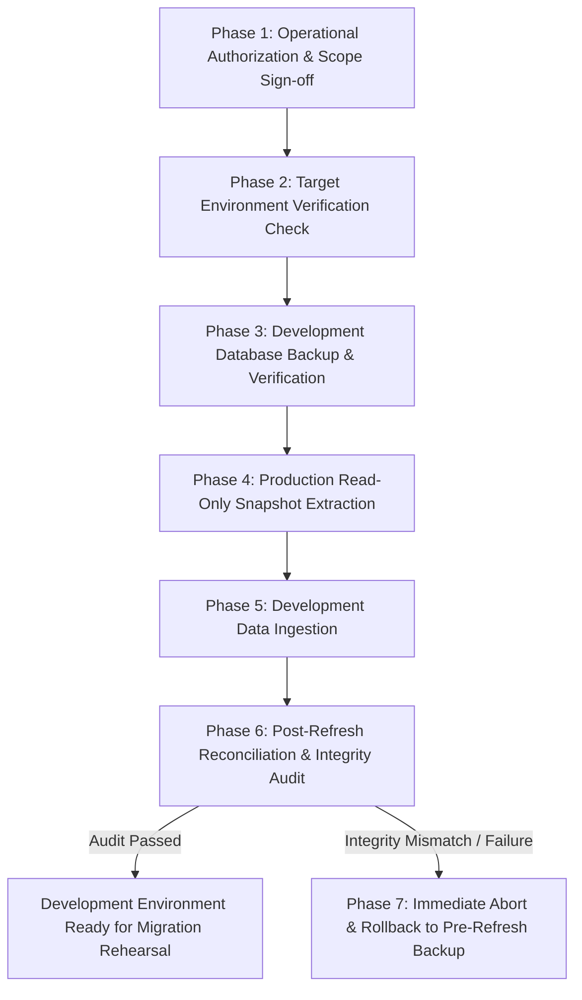
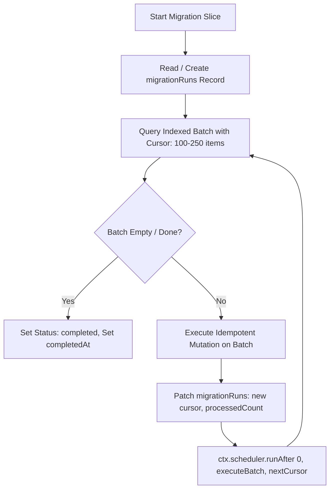
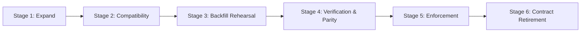
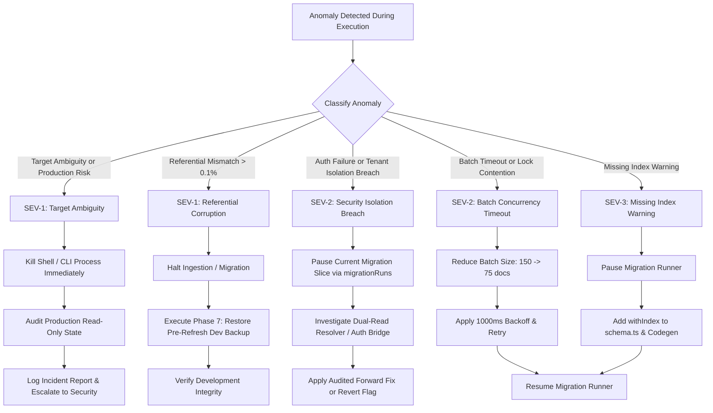

# D-05: Migration Rehearsal and Data Refresh Runbook (All Contracts)

## 1. Operational Safety Charter & Governing Policy

### 1.1 Document Metadata & Authority Scope
- **Document Identifier**: `MELO-RUNBOOK-D05-MIGRATION-REHEARSAL-DATA-REFRESH`
- **Feature Code**: `D-05` (Foundations / Operational Readiness)
- **Parent Orchestrator Session**: `orch-20260903-143249`
- **Version**: `1.0.0`
- **Status**: Authoritative Operational Protocol & Verification Specification
- **Effective Date**: 2026-09-03
- **Primary Roles**: Data Migration Architect, Security Systems Operator, Lead Systems Reliability Engineer
- **Authoritative Dependencies**:
  - [migration-verification-matrix.md](file:///c:/CreativeOS/01_Projects/Code/Personal_Stuff/2026-03-14_School_Management_System/docs/tasks/orchestrator-sessions/orch-20260903-143249/migration-verification-matrix.md)
  - [D02_IdentityGroupRBACAndAuditArchitecture.md](file:///c:/CreativeOS/01_Projects/Code/Personal_Stuff/2026-03-14_School_Management_System/docs/features/D02_IdentityGroupRBACAndAuditArchitecture.md)
  - [D01_ComplianceControlDossier.md](file:///c:/CreativeOS/01_Projects/Code/Personal_Stuff/2026-03-14_School_Management_System/docs/features/D01_ComplianceControlDossier.md)
  - [D03_ProviderRuntimeAndSettlementSpikes.md](file:///c:/CreativeOS/01_Projects/Code/Personal_Stuff/2026-03-14_School_Management_System/docs/features/D03_ProviderRuntimeAndSettlementSpikes.md)
  - [product-decisions.md](file:///c:/CreativeOS/01_Projects/Code/Personal_Stuff/2026-03-14_School_Management_System/docs/tasks/orchestrator-sessions/orch-20260903-143249/product-decisions.md)

---

### 1.2 Non-Negotiable Operational Safety Invariants

> [!CAUTION]
> **GOVERNING INVARIANT 1: PRODUCTION IS READ-ONLY**
> Production is strictly **READ-ONLY** throughout this program. Zero production mutation commands, zero ad-hoc production queries, zero schema modifications, and zero live batch backfills are authorized by this document. Any script, command, or operator action that targets production with write permissions is an immediate safety violation subject to immediate termination.

> [!IMPORTANT]
> **GOVERNING INVARIANT 2: DEVELOPMENT IS FOR REHEARSAL ONLY**
> Development database refresh is performed **solely for migration rehearsal, schema validation, and parity auditing**. Live customer data ingested into development remains restricted, isolated, and governed by strict privacy controls. Refresh data MUST NEVER be used for live customer communication, ad-hoc manual editing, or production traffic redirection.

> [!IMPORTANT]
> **GOVERNING INVARIANT 3: MANDATORY PRE-REFRESH DEVELOPMENT BACKUP**
> A verified, restorable development backup MUST exist and be validated BEFORE any development database replacement or snapshot ingestion occurs. If the development backup export fails, yields a zero-byte archive, fails SHA-256 verification, or cannot be read independently, the refresh is **IMMEDIATELY ABORTED**.

> [!CAUTION]
> **GOVERNING INVARIANT 4: ABSOLUTE EXCLUSION OF SECRETS AND SNAPSHOTS FROM GIT**
> Zero production credentials, zero deploy keys, zero authorization bearer tokens, zero PII, zero customer data dumps, and zero snapshot `.zip` archives shall ever be committed to git repositories, pull requests, or public channels. All backup artifacts, operational manifests containing metadata, and snapshot archives must reside strictly in encrypted, access-controlled directories located outside the project workspace tree.

---

### 1.3 Operator Authorization and Roles

Every execution of this runbook requires dual-custody verification:
1. **Data Migration Architect**: Formulates the batch contracts, defines validation criteria, and verifies referential integrity queries.
2. **Security Systems Operator**: Inspects terminal environments, validates deployment IDs, ensures deploy key permissions are strictly read-only for exports, and holds abort authority.

---

## 2. Safe Development Refresh Runbook (Step-by-Step Operator Protocol)



---

### 2.1 Phase 1: Operational Authorization & Scope Sign-off
Before commencing any refresh activity, the operator must verify the baseline environment:
1. **Codebase Baseline**: PR #21 is merged to `master`. The active branch is checked out from the updated `master` HEAD.
2. **Authorization Ticket**: An authorized change-management ticket exists (e.g. `CHG-ORCH-D05-REHEARSAL`).
3. **Storage Boundary Definition**: Ensure an off-repository secure directory is designated for all archives:
   - Linux/macOS: `~/.melo-ops/backups/`
   - Windows (PowerShell): `$HOME\.melo-ops\backups\`

---

### 2.2 Phase 2: Target Environment Verification Check

Before running any Convex command, the operator must verify that **every** configuration file, environment variable, script, and terminal shell targets the development deployment instance exclusively.

#### Verification Script (PowerShell / Windows)
```powershell
# scripts/ops/verify-target-env.ps1
$ErrorActionPreference = "Stop"

Write-Host "=== MELO TARGET ENVIRONMENT PRE-FLIGHT VERIFICATION ===" -ForegroundColor Cyan

# 1. Inspect CONVEX_DEPLOYMENT in Environment
$envDeployment = $env:CONVEX_DEPLOYMENT
Write-Host "Shell CONVEX_DEPLOYMENT: $envDeployment"

if ([string]::IsNullOrWhiteSpace($envDeployment)) {
    Write-Warning "Shell CONVEX_DEPLOYMENT is unset. Checking .env.local..."
} elseif ($envDeployment -match "^prod:" -or $envDeployment -match "production") {
    Write-Error "CRITICAL ABORT: Shell environment variable targets PRODUCTION ($envDeployment)!"
    exit 1
} else {
    Write-Host "[PASS] Shell CONVEX_DEPLOYMENT points to development." -ForegroundColor Green
}

# 2. Inspect root .env.local
if (Test-Path ".env.local") {
    $envContent = Get-Content ".env.local" -Raw
    if ($envContent -match "CONVEX_DEPLOYMENT=(prod:[^\r\n]+)") {
        Write-Error "CRITICAL ABORT: .env.local targets PRODUCTION ($($Matches[1]))!"
        exit 1
    }
    Write-Host "[PASS] Root .env.local verified (non-production)." -ForegroundColor Green
} else {
    Write-Warning "Root .env.local not found."
}

# 3. Inspect application configurations
$appConfigs = @(
    "apps/admin/.env.local",
    "apps/teacher/.env.local",
    "apps/portal/.env.local",
    "apps/platform/.env.local",
    "apps/apply/.env.local",
    "apps/sites/.env.local",
    "apps/www/.env.local"
)

foreach ($cfg in $appConfigs) {
    if (Test-Path $cfg) {
        $content = Get-Content $cfg -Raw
        if ($content -match "NEXT_PUBLIC_CONVEX_URL=https://([a-zA-Z0-9-]+)\.convex\.cloud") {
            $subdomain = $Matches[1]
            if ($subdomain -match "prod" -or $subdomain -match "melo-prod") {
                Write-Error "CRITICAL ABORT: $cfg points to production URL ($subdomain)!"
                exit 1
            }
            Write-Host "[PASS] $cfg verified ($subdomain)." -ForegroundColor Green
        }
    }
}

# 4. Query configured Convex CLI deployment identity
Write-Host "Querying active Convex CLI deployment..."
$activeDeployment = (npx convex status --json | ConvertFrom-Json).deploymentName
Write-Host "Active Convex CLI Deployment Name: $activeDeployment"

if ($activeDeployment -match "prod" -or $activeDeployment -match "production") {
    Write-Error "CRITICAL ABORT: Convex CLI is bound to PRODUCTION deployment ($activeDeployment)!"
    exit 1
}

Write-Host "=== TARGET ENVIRONMENT VERIFIED: DEVELOPMENT CONFIRMED ===" -ForegroundColor Cyan
```

#### Stop Condition
If any variable, file, or active CLI deployment contains `prod:`, `production:`, or matches a known production instance identifier, **HALT IMMEDIATELY**. Do not proceed to Phase 3.

---

### 2.3 Phase 3: Development Database Backup & Verification

Before overwriting the development database, create an independent, validated snapshot of the current development database.

#### Step 3.1: Execute Development Backup Export
Run the export strictly targeting development, writing the archive outside the git repository:
```bash
# Define secure external destination
BACKUP_DIR="$HOME/.melo-ops/backups/dev_pre_refresh"
mkdir -p "$BACKUP_DIR"
TIMESTAMP=$(date +"%Y%m%d_%H%M%S")
DEV_BACKUP_ZIP="$BACKUP_DIR/melo_dev_backup_${TIMESTAMP}.zip"

# Execute export from development
npx convex export --path "$DEV_BACKUP_ZIP"
```

#### Step 3.2: Verify Development Backup Integrity
1. **Calculate SHA-256 Checksum**:
   ```bash
   sha256sum "$DEV_BACKUP_ZIP" > "${DEV_BACKUP_ZIP}.sha256"
   cat "${DEV_BACKUP_ZIP}.sha256"
   ```
2. **Inspect Archive Size & Manifest**:
   ```bash
   # Confirm archive size is greater than 10KB
   FILESIZE=$(wc -c < "$DEV_BACKUP_ZIP")
   if [ "$FILESIZE" -lt 10240 ]; then
     echo "CRITICAL: Backup archive too small ($FILESIZE bytes). Aborting."
     exit 1
   fi

   # Validate zip structure and list table directories
   unzip -t "$DEV_BACKUP_ZIP"
   ```
3. **Record Dev Backup Manifest**: Record the URI, timestamp, file size, and non-sensitive checksum into the operator log.

---

### 2.4 Phase 4: Production Read-Only Snapshot Extraction

Extraction of production data must be executed with a scoped, read-only deploy key or through the authenticated Convex Cloud administrative dashboard.

#### Strict Security Rules for Production Snapshot
1. **Zero Write Permissions**: The operator token used for export MUST NOT hold deployment or write capabilities.
2. **Direct Storage Outside Repo**: The snapshot zip must be written directly to `$HOME/.melo-ops/backups/prod_read_only_snapshots/`.
3. **Zero Secrets / Masked PII in Logging**: Command output containing file lists or metadata must not be piped into shared logs.

```bash
# Define secure staging directory
PROD_SNAPSHOT_DIR="$HOME/.melo-ops/backups/prod_read_only_snapshots"
mkdir -p "$PROD_SNAPSHOT_DIR"
PROD_SNAPSHOT_ZIP="$PROD_SNAPSHOT_DIR/prod_snapshot_readonly_${TIMESTAMP}.zip"

# Perform export using read-only deploy key (or pre-staged authorized export)
# NOTE: CONVEX_DEPLOY_KEY must be a read-only admin key
CONVEX_DEPLOY_KEY="$PROD_READONLY_DEPLOY_KEY" npx convex export --path "$PROD_SNAPSHOT_ZIP"

# Calculate checksum
sha256sum "$PROD_SNAPSHOT_ZIP" > "${PROD_SNAPSHOT_ZIP}.sha256"
```

---

### 2.5 Phase 5: Development Data Ingestion (Restoration Rehearsal)

Restore the read-only production snapshot into the development environment.

#### Pre-Flight Ingestion Check
The operator must execute a second target verification immediately before running the import:
```bash
# Re-verify that CLI is targeting development
CLI_TARGET=$(npx convex status --json | grep -o '"deploymentName":"[^"]*' | cut -d'"' -f4)
if [[ "$CLI_TARGET" =~ "prod" ]]; then
  echo "FATAL: Pre-import check failed! Target is PRODUCTION ($CLI_TARGET). ABORTING."
  exit 1
fi
echo "Confirmed import target: $CLI_TARGET (development)"
```

#### Execute Ingestion
```bash
# Import the snapshot into development with replace flag
npx convex import --replace "$PROD_SNAPSHOT_ZIP"
```

---

### 2.6 Phase 6: Post-Refresh Reconciliation & Integrity Audit

Immediately following ingestion, run automated reconciliation queries to confirm data integrity and verify that tenant isolation is intact.

#### Step 6.1: Table Record Count Reconciliation
Execute query `internal.reconciliation.counts:getTableSummary` to verify parity between snapshot manifest and restored development database:

| Table Name | Description | Expected Range / Baseline | Restoration Assertion |
|---|---|---|---|
| `schools` | School branch tenant records | Must match snapshot manifest count exactly | Discrepancy = 0 |
| `users` | Legacy user identity records | Must match snapshot manifest count exactly | Discrepancy = 0 |
| `students` | Student records | Must match snapshot manifest count exactly | Discrepancy = 0 |
| `classes` | Class cohort definitions | Must match snapshot manifest count exactly | Discrepancy = 0 |
| `studentInvoices` | Historical billing documents | Must match snapshot manifest count exactly | Discrepancy = 0 |
| `feePlans` | Fee billing schedule structures | Must match snapshot manifest count exactly | Discrepancy = 0 |
| `academicSessions`| Academic calendar years | Must match snapshot manifest count exactly | Discrepancy = 0 |

#### Step 6.2: File Storage Asset Count Reconciliation
Query the `_storage` system table via Convex query:
```typescript
// Query to verify storage integrity post-refresh
export const verifyStorageCounts = internalQuery({
  args: {},
  handler: async (ctx) => {
    let totalStorageDocs = 0;
    let totalBytes = 0;
    for await (const doc of ctx.db.system.query("_storage")) {
      totalStorageDocs++;
      totalBytes += doc.size;
    }
    return { totalStorageDocs, totalBytes };
  },
});
```

#### Step 6.3: Tenant Isolation & Referential Integrity Scan
Execute an automated integrity sweep to confirm that zero cross-tenant references exist:
1. Every `students.schoolId` resolves to an existing `schools._id`.
2. Every `studentInvoices.studentId` points to a `students` record where `student.schoolId === invoice.schoolId`.
3. Every `classes.schoolId` matches the `schoolId` of its enrolled students.

#### Step 6.4: Demo School Authentication Smoke Test
1. Read credentials strictly from `tmp/demo_school_credentials.md` (never echo or log credentials).
2. Perform a localized browser login test against the development admin application targeting Olive Blessed Crest demo accounts.
3. Confirm dashboard loads with full school context and zero 403/500 errors.

---

### 2.7 Phase 7: Abort & Rollback Protocol

If any of the following triggers occur:
- Target deployment verification is ambiguous or points to production.
- Post-refresh record count mismatch exceeds 0.1% or critical tables (`schools`, `users`) have discrepancies.
- Cross-tenant referential corruption is detected.
- Demo school authentication fails repeatedly with unresolvable cryptographic errors.

#### Execution of Rollback
```bash
echo "=== EXECUTING EMERGENCY DEVELOPMENT RESTORATION ==="
# Restore development database from pre-refresh backup captured in Phase 3
npx convex import --replace "$DEV_BACKUP_ZIP"

# Verify restoration of pre-refresh dev state
npx convex run internal.reconciliation.counts:getTableSummary
echo "Development database restored to pre-refresh baseline."
```
> [!NOTE]
> **PRODUCTION HAS ZERO ROLLBACK ACTIONS**: Production was never mutated, touched, or redirected. Production continues normal operation without disruption.

---

## 3. Additive Migration Execution Protocol (Expand -> Backfill -> Verify -> Enforce -> Contract)

### 3.1 Universal Batch Runner Engine Architecture

To eliminate transaction timeouts, lock contention, and unbounded memory consumption in Convex, all data migrations (MX-01 through MX-15) must execute through the **Universal Batch Runner Contract**.



#### Core Invariants of the Batch Runner
1. **Bounded Batch Size**: Every batch transaction processes between **100 and 250 documents** (default: 150). Never attempt bulk table scans in a single transaction.
2. **Durable Cursor-Based Pagination**: Cursors are stored in the database, not kept in ephemeral function memory. If a worker terminates, the next run picks up exactly from the stored cursor.
3. **Idempotency Key**: Every backfill mutation checks if the target record or field is already populated. Re-running a batch over existing documents produces zero mutations.
4. **Zero Table Locking**: Convex provides optimistic concurrency control. Bounded batches commit quickly (<50ms execution time), avoiding write collisions with active development users.
5. **Durable Tracking Schema (`migrationRuns`)**:
   ```typescript
   export const migrationRuns = defineTable({
     sliceId: v.string(), // e.g. "MX-01", "MX-02"
     migrationName: v.string(),
     status: v.union(
       v.literal("pending"),
       v.literal("in_progress"),
       v.literal("paused"),
       v.literal("completed"),
       v.literal("failed")
     ),
     currentTable: v.string(),
     cursor: v.union(v.string(), v.null()),
     batchNumber: v.number(),
     processedCount: v.number(),
     failedCount: v.number(),
     totalEstimatedCount: v.number(),
     idempotencyKey: v.string(),
     errorDetails: v.optional(v.string()),
     startedAt: v.number(),
     updatedAt: v.number(),
     completedAt: v.optional(v.number()),
   })
     .index("by_slice", ["sliceId"])
     .index("by_status", ["status"]);
   ```

---

### 3.2 Slice-by-Slice Rehearsal Specifications (MX-01 through MX-15)



---

#### 3.2.1 MX-01: Canonical Identity Bridge
- **Change Goal**: Decouple human identity from branch employment by introducing `persons` with `authTokenIdentifier` and establishing a bridge to legacy `users`.
- **Preflight & Inventory**:
  - Inventory existing `users.authId`, `users.authTokenIdentifier`, and duplicate emails across schools.
  - Assert that platform admins (`platformAdmins` table) are indexed by `authTokenIdentifier`.
- **1. Schema Expansion**:
  - Add table `persons` with validator fields: `authTokenIdentifier: v.string()`, `primaryEmail: v.string()`, `displayName: v.string()`, `status: personStatusValidator`, `createdAt: v.number()`.
  - Add indexes: `by_auth_token_identifier` on `["authTokenIdentifier"]`, `by_primary_email` on `["primaryEmail"]`.
  - Add optional foreign key `users.personId = v.optional(v.id("persons"))` and index `users.by_person` on `["personId"]`.
- **2. Compatibility Layer (Dual-Read / Dual-Write)**:
  - Auth helper `resolveActiveIdentity` first queries `persons` by `tokenIdentifier`. If null, falls back to `users` via legacy `by_auth_token_identifier` or `by_auth` (`authId`).
  - When a new user registers, the auth hook writes both `persons` and `users`.
- **3. Batch Backfill Mutation**:
  - Cursor-based query iterating `users` ordered by `_creationTime` (batch size: 150).
  - For each user:
    - If `personId` is already set, continue (idempotent).
    - Check if `persons` exists by `authTokenIdentifier` or `email`.
    - If not found, insert new `persons` record.
    - Patch `users` with `personId: person._id`.
- **4. Verification & Automated Reconciliation**:
  - Automated check: `count(users where personId is null) === 0`.
  - Check: Zero orphaned `persons` without matching `users`.
  - Dual-read audit: Query a sample of 100 users through both legacy and canonical auth resolvers; verify returned actor identity matches 100%.
- **5. Safe Rollback & Forward-Fix**:
  - Rollback: Feature flag `ENABLE_CANONICAL_PERSON_LOOKUP` set to `false`. Reverts auth helper to legacy `users` table directly. Zero deletion of `persons` table.
  - Forward-Fix: Correct duplicate email ambiguities by manual admin resolution or appending disambiguated institutional suffix.
- **6. Decommissioning / Contract Retirement Criteria**:
  - Minimum observation window: 14 days in production.
  - Resolver fallback counter `legacy_user_lookup_fallback_count === 0` for 7 consecutive days.

---

#### 3.2.2 MX-02: Explicit Branch Memberships & Groups
- **Change Goal**: Enable school grouping and multi-branch tenancy without rekeying operational records.
- **Preflight & Inventory**:
  - Inventory current Olive Blessed Crest branches (Ikoyi, Lekki) and current `users.schoolId` mappings.
- **1. Schema Expansion**:
  - Add `schoolGroups`, `schoolGroupBranches`, and `branchMemberships` tables.
  - Add indexes: `branchMemberships.by_person_and_school` on `["personId", "schoolId"]`, `schoolGroupBranches.by_group` on `["groupId"]`, `schoolGroupBranches.by_school` on `["schoolId"]`.
- **2. Compatibility Layer**:
  - Context resolver `resolveActiveMembership` queries `branchMemberships`. If absent, reads legacy `users.schoolId` and synthesizes a transient virtual membership.
- **3. Batch Backfill Mutation**:
  - Iterate `users` where `personId` is populated (batch size: 150).
  - Check if `branchMemberships` exists for `(personId, schoolId)`.
  - If absent, insert `branchMemberships` with `status: "active"`, `displayTitle: user.role`, `joinedAt: user.createdAt`.
  - Canary test: Link Olive Blessed Crest branches under one group `schoolGroups`.
- **4. Verification & Automated Reconciliation**:
  - Parity check: Every active `users` row has exactly one corresponding `branchMemberships` record for its `schoolId`.
  - Zero-orphan check: Every `branchMemberships.schoolId` points to an existing `schools` document.
  - Operational integrity check: Confirm zero `students`, `classes`, or `studentInvoices` had their `schoolId` altered.
- **5. Safe Rollback & Forward-Fix**:
  - Rollback: Toggle off multi-branch header switcher (`NEXT_PUBLIC_ENABLE_BRANCH_SWITCHER=false`). Context resolver falls back to single-tenant `users.schoolId`.
  - Forward-Fix: If an erroneous membership link is created, update membership `status = "archived"`. Never delete linked operational data.
- **6. Decommissioning Criteria**:
  - Observation window: 21 days.
  - Zero invocations of virtual membership synthesis.

---

#### 3.2.3 MX-03: RBAC Capabilities & Baseline Admin Migration
- **Change Goal**: Transition from binary `users.role = "admin"` to granular 47-capability RBAC engine with delegation ceilings.
- **Preflight & Inventory**:
  - Inventory all users where `role === "admin" || isSchoolAdmin === true`.
  - Catalog school proprietors and platform super admins.
- **1. Schema Expansion**:
  - Add tables `membershipRoleAssignments`, `membershipDirectGrants`, `membershipDirectRestrictions`, `delegationCeilings`.
  - Add indexes: `membershipRoleAssignments.by_membership` on `["membershipId"]`.
- **2. Compatibility Layer**:
  - RBAC evaluator `evaluateEffectiveCapabilities`: If `membershipRoleAssignments` are empty for an admin, automatically grant full baseline administrative capabilities (preserving access to prevent lockout).
- **3. Batch Backfill Mutation**:
  - Iterate all `branchMemberships` corresponding to legacy admin users.
  - For school owners/proprietors: assign template `proprietor`.
  - For operational administrators: assign template `principal`.
  - For teachers: assign baseline teacher permissions.
- **4. Verification & Automated Reconciliation**:
  - Assert that 100% of pre-existing admin accounts have effective capability count >= baseline admin permissions.
  - Run negative test suite `SEC-NEG-01` through `SEC-NEG-05` to verify that anti-self-escalation and delegation ceiling logic hold.
- **5. Safe Rollback & Forward-Fix**:
  - Rollback: Toggle `RBAC_ENFORCEMENT_MODE = "legacy_fallback"`. Reverts authorization boundary to binary admin check while leaving assigned roles intact.
  - Forward-Fix: Amend misassigned role templates via versioned administrative correction mutations.
- **6. Decommissioning Criteria**:
  - Observation window: 30 days. Zero occurrences of legacy fallback authorization.

---

#### 3.2.4 MX-04: Append-Only Audit Event Contract & Redaction
- **Change Goal**: Centralize append-only audit trail with pre-write redaction, alerting tiers, and 7-year/permanent retention.
- **Preflight & Inventory**:
  - Inventory existing audit-like tables: `academicTimelineAuditEvents`, `adminLeadershipAuditEvents`, `schoolSiteAuditEvents`.
- **1. Schema Expansion**:
  - Add table `auditEvents` with fields: `eventId`, `timestamp`, `actorKind`, `actorPersonId`, `branchContextId`, `module`, `action`, `outcome`, `safeSummary`, `retentionClass`, `maskedMetadata`.
  - Add table `auditAlerts` with fields: `alertId`, `tier`, `eventId`, `status`, `targetRecipientPersonIds`.
  - Add indexes: `auditEvents.by_branch_and_timestamp`, `auditAlerts.by_status`.
- **2. Compatibility Layer**:
  - Audit logging wrapper `emitAuditEvent`: writes to both new `auditEvents` and legacy domain audit tables during migration.
- **3. Batch Backfill Mutation**:
  - Read historical records from `adminLeadershipAuditEvents` and `academicTimelineAuditEvents` in chunks of 200.
  - Transform and sanitize payloads: mask bank account numbers (`***-****-1234`), redact passwords and tokens (`[REDACTED_SECRET]`).
  - Insert sanitized rows into `auditEvents`.
- **4. Verification & Automated Reconciliation**:
  - Redaction verification: Run automated regex scan across `auditEvents.maskedMetadata` for raw 10-digit NUBAN numbers, credit card patterns, and bearer tokens. Assert zero matches.
  - Retention class check: Assert that every event has a valid `retentionClass` ("operational_7yr" or "permanent_statutory").
- **5. Safe Rollback & Forward-Fix**:
  - Rollback: If audit writer encounters unhandled exceptions, divert events to an in-memory or fallback table. Never block business transactions except for Tier 1 critical mutations.
  - Forward-Fix: If metadata is malformed, append a corrective audit event referencing the original `eventId`. Never mutate existing audit documents.
- **6. Decommissioning Criteria**:
  - Observation window: 30 days. Deprecate legacy domain audit tables after backfill and reconciliation.

---

#### 3.2.5 MX-05: Group Defaults / Branch Overrides / Typed Theme
- **Change Goal**: Replace raw unvalidated color strings with typed, inheritable design tokens (Primary and Accent bases) with contrast validation.
- **Preflight & Inventory**:
  - Inventory `schools.theme` across all branches.
- **1. Schema Expansion**:
  - Add `schoolGroupThemes` table and optional field `schools.themeConfig = v.optional(typedThemeValidator)`.
- **2. Compatibility Layer**:
  - Theme provider reads `schools.themeConfig`. If absent, reads legacy `schools.theme.primaryColor` and dynamically derives compliant tokens.
- **3. Batch Backfill Mutation**:
  - Iterate all `schools` documents (batch size: 100).
  - Inspect `theme.primaryColor` and `theme.accentColor`.
  - Run mathematical contrast derivation utility.
  - Patch `schools` with structured `themeConfig`.
- **4. Verification & Automated Reconciliation**:
  - Automated contrast check: WCAG AA compliance (contrast ratio >= 4.5:1 for normal text, >= 3:1 for large text) across all derived surface/foreground token pairs.
  - Grayscale readability check: Assert lightness separation >= 30% between foreground and background.
- **5. Safe Rollback & Forward-Fix**:
  - Rollback: Fallback to static CSS variables in `WorkspaceNavbar`.
  - Forward-Fix: Provide an admin theme reset action resetting colors to the institutional default palette.
- **6. Decommissioning Criteria**:
  - Minimum observation window: 14 days. Zero reads of unparsed legacy `schools.theme`.

---

#### 3.2.6 MX-06: Grade-Band Color & History Policy
- **Change Goal**: Configurable semantic grade band colors with versioned rendering snapshots for historical report cards.
- **Preflight & Inventory**:
  - Inventory existing `gradingBands` and report card rendering paths.
- **1. Schema Expansion**:
  - Add optional fields to `gradingBands`: `color: v.optional(v.string())`, `version: v.optional(v.number())`.
  - Add `gradingBandPolicies` table to track versioned snapshots.
- **2. Compatibility Layer**:
  - Report card renderer checks for `policyVersion` on the academic term or report card snapshot. If absent, applies default semantic preset without color styling.
- **3. Batch Backfill Mutation**:
  - Iterate `gradingBands` by school (batch size: 100).
  - Assign approved default semantic colors (A=Emerald, B=Blue, C=Amber, D=Orange, F=Rose).
  - Set `version = 1`.
- **4. Verification & Automated Reconciliation**:
  - Verify that historical report cards published prior to migration retain their original layout and text values without visual regression.
  - Print & Grayscale check: Verify that report cards rendered in grayscale remain 100% legible without color cues.
- **5. Safe Rollback & Forward-Fix**:
  - Rollback: Toggle `ENABLE_GRADE_BAND_COLORS = false`. Renders grade letters using default monochrome typography.
  - Forward-Fix: Create new version of the grade band policy (`version = 2`). Never mutate historical snapshots.
- **6. Decommissioning Criteria**:
  - Minimum observation window: 30 days post-terminal exam session.

---

#### 3.2.7 MX-07: Bank Accounts & Financial-Document Snapshots
- **Change Goal**: Multi-account school bank management with immutable payment instruction snapshots on issued invoices.
- **Preflight & Inventory**:
  - Inventory `schoolBillingSettings` and all unpaid/paid `studentInvoices`.
- **1. Schema Expansion**:
  - Add table `schoolBankAccounts` with fields: `schoolId`, `accountName`, `bankName`, `accountNumber`, `currency`, `isDefault`, `status`.
  - Add optional field `studentInvoices.paymentInstructionsSnapshot = v.optional(paymentInstructionsValidator)`.
- **2. Compatibility Layer**:
  - Invoice rendering logic: If `paymentInstructionsSnapshot` is present, display snapshot. If absent, fall back to current active default in `schoolBankAccounts`.
- **3. Batch Backfill Mutation**:
  - For each school with configured billing settings, create an active default `schoolBankAccounts` row.
  - Backfill ONLY draft or unissued invoices with the current bank snapshot. Issued historical invoices remain untouched unless authorized.
- **4. Verification & Automated Reconciliation**:
  - Audit log check: Verify that every bank detail modification emits a **Tier 1 CRITICAL** alert and records masked numbers (`***-****-1234`).
  - Invoice immutability check: Update a school bank account, verify that previously issued invoices retain their original snapshot.
- **5. Safe Rollback & Forward-Fix**:
  - Rollback: Disable account switching in billing UI; revert invoice generator to read billing settings directly.
  - Forward-Fix: Archive inaccurate bank account records (`status = "archived"`). Issue corrective invoice addenda.
- **6. Decommissioning Criteria**:
  - Observation window: 60 days (covering one full billing cycle).

---

#### 3.2.8 MX-08: Admission Number Policy & Atomic Allocator
- **Change Goal**: Guided token builder with atomic sequence allocation in enrollment transactions; manual override governance.
- **Preflight & Inventory**:
  - Inventory existing `students.admissionNumber` patterns and highest numeric sequences across all schools.
- **1. Schema Expansion**:
  - Add `admissionNumberPolicies`, `admissionNumberSequences`, and `admissionAllocations` tables.
  - Add index: `admissionAllocations.by_school_and_number` on `["schoolId", "allocatedNumber"]`.
- **2. Compatibility Layer**:
  - Enrollment approval checks for an active `admissionNumberPolicies`. If not found, falls back to legacy manual string input.
- **3. Batch Backfill Mutation**:
  - Analyze existing student admission numbers per school to determine the maximum issued sequence integer.
  - Seed `admissionNumberSequences` with `nextValue = maxSequence + 1`.
- **4. Verification & Automated Reconciliation**:
  - Concurrency test: Simulate 10 concurrent enrollment approvals in the test harness; assert zero duplicate admission numbers allocated and sequence numbers advance strictly without gaps.
  - Override test: Verify that manual override requires `enrollment.admissions.override_number` capability and records an audit event.
- **5. Safe Rollback & Forward-Fix**:
  - Rollback: Revert to manual admission number field in registrar UI. The sequence counter is NOT decremented.
  - Forward-Fix: If a sequence counter drifts, an authorized administrator with explicit permission adjusts `nextValue` forward via an audited mutation.
- **6. Decommissioning Criteria**:
  - Observation window: 30 days post-admissions intake.

---

#### 3.2.9 MX-09: Institutional Email Operations
- **Change Goal**: School-owned domain verification and mailbox state machine (`login_only`, `external_verified`, `provider_provisioned`).
- **Preflight & Inventory**:
  - Inventory existing `users.email` domains and DNS settings.
- **1. Schema Expansion**:
  - Add tables `schoolEmailDomains` and `schoolEmailMailboxes`.
  - Add indexes: `schoolEmailDomains.by_domain`, `schoolEmailMailboxes.by_email`.
- **2. Compatibility Layer**:
  - Address resolution: Check `schoolEmailMailboxes`. If absent, treat the user's login email strictly as `login_only` (no mail dispatch to unverified inboxes).
- **3. Batch Backfill Mutation**:
  - For all existing users, register their email in `schoolEmailMailboxes` with `capabilityState = "login_only"`.
- **4. Verification & Automated Reconciliation**:
  - Verify that no communication is dispatched to `login_only` addresses without verified external MX/DNS records.
  - Verify that deleting or leaving a school suspends mailbox access without destroying user audit attribution.
- **5. Safe Rollback & Forward-Fix**:
  - Rollback: Suspend automated directory synchronization jobs. System remains in manual email entry mode.
  - Forward-Fix: Reconcile provider directory state against `schoolEmailMailboxes` via asynchronous idempotency ledger.
- **6. Decommissioning Criteria**:
  - Observation window: 45 days.

---

#### 3.2.10 MX-10: Form Drafts, Temporary Files, & Recovery Lifecycle
- **Change Goal**: Server-side auto-save draft protection for high-value forms with revision checking and private temporary file expiry.
- **Preflight & Inventory**:
  - Inventory target high-value forms: Student Enrollment, Staff Onboarding, Fee Plan Creation.
- **1. Schema Expansion**:
  - Add tables `formDrafts` and `temporaryUploads`.
  - Add indexes: `formDrafts.by_user_and_form` on `["userId", "formKey"]`, `temporaryUploads.by_expiry` on `["expiresAt"]`.
- **2. Compatibility Layer**:
  - Form loading logic: Inspect server for active draft. If found, prompt user with "Resume Draft / Discard" modal. If absent, initialize blank form.
- **3. Batch Backfill Mutation**:
  - No historical data backfill required. Seed scheduled cleanup cron `internal.crons.cleanupExpiredDraftsAndUploads`.
- **4. Verification & Automated Reconciliation**:
  - Conflict test: Simulate concurrent edits in two tabs; assert revision mismatch warning prevents silent overwrite.
  - Expiry test: Verify scheduled cleanup purges temporary uploads older than 24 hours and draft payloads older than 30 days.
- **5. Safe Rollback & Forward-Fix**:
  - Rollback: Toggle `ENABLE_FORM_AUTOSAVE = false`. Forms revert to standard client-side state without auto-persistence.
  - Forward-Fix: Purge corrupted drafts via admin draft reset utility.
- **6. Decommissioning Criteria**:
  - Observation window: 14 days.

---

#### 3.2.11 MX-11: AI Import Proposal/Commit Contract
- **Change Goal**: Structured AI spreadsheet import review pipeline with deterministic pre-commit validation.
- **Preflight & Inventory**:
  - Inventory current `importWorkspaces` table and staging schemas.
- **1. Schema Expansion**:
  - Add tables `aiImportProposals` and `aiImportStagedRows`.
  - Add index: `aiImportStagedRows.by_workspace` on `["workspaceId"]`.
- **2. Compatibility Layer**:
  - Dual-mode import runner: Supports both legacy manual CSV column mapping and new AI-assisted proposal workflow.
- **3. Batch Backfill Mutation**:
  - No backfill of legacy completed imports. Active/pending workspaces migrate to new typed proposal schema.
- **4. Verification & Automated Reconciliation**:
  - Boundary test: Assert that the AI service possesses ZERO write capabilities to live production tables (`students`, `classes`, `users`).
  - Validation test: Propose rows with invalid dates and duplicate admission numbers; assert deterministic validation catches and flags 100% of errors before commit.
- **5. Safe Rollback & Forward-Fix**:
  - Rollback: Disable AI proposal toggle. Fall back to standard manual CSV importer.
  - Forward-Fix: Abort failed import workspace; staged rows are discarded without affecting live tables.
- **6. Decommissioning Criteria**:
  - Observation window: 30 days.

---

#### 3.2.12 MX-12: Commercial Catalog, Contracts, SaaS & Settlement Ledgers
- **Change Goal**: Double-entry financial ledgers separating SaaS subscription charges from school collection settlements.
- **Preflight & Inventory**:
  - Seed reviewed versioned rate card: Core/Basic at ₦1,000 active student/term + ₦30,000 setup fee.
- **1. Schema Expansion**:
  - Add tables `saasRateCards`, `schoolSaaSContracts`, `ledgerAccounts`, `ledgerJournalEntries`, `ledgerLines`.
  - Add index: `ledgerLines.by_account_and_timestamp` on `["accountId", "timestamp"]`.
- **2. Compatibility Layer**:
  - Billing dashboard reads from new double-entry ledger. If ledger history is empty, displays legacy invoice summary.
- **3. Batch Backfill Mutation**:
  - Migrate existing school billing settings into versioned `schoolSaaSContracts`.
  - Generate opening balance journal entries in `ledgerJournalEntries` for active school accounts.
- **4. Verification & Automated Reconciliation**:
  - Double-entry balance assertion: For every journal entry, `sum(debits) === sum(credits)`. Discrepancy = 0.
  - Rate snapshot verification: Verify that issued SaaS invoices snapshot their rate card values and do not mutate when catalog prices change.
- **5. Safe Rollback & Forward-Fix**:
  - Rollback: Revert billing view to legacy invoice reader. Ledgers remain intact.
  - Forward-Fix: Correct ledger discrepancies by posting compensating adjustment journal entries. Never delete historical ledger lines.
- **6. Decommissioning Criteria**:
  - Observation window: 90 days (one full fiscal term).

---

#### 3.2.13 MX-13: Quota Reservation, Usage Settlement, Storage Accounting
- **Change Goal**: Accurate usage metering (AI tokens, OCR pages, storage bytes) with reservation and settlement semantics.
- **Preflight & Inventory**:
  - Map all AI/OCR endpoints and calculate storage baseline per school.
- **1. Schema Expansion**:
  - Add tables `quotaEntitlements`, `quotaReservations`, `quotaSettlements`, `storageAccounting`.
  - Add indexes: `quotaReservations.by_idempotency_key`, `quotaSettlements.by_school`.
- **2. Compatibility Layer**:
  - Metering wrapper: Runs in "observe-only" mode, logging usage without blocking operations until parity is verified.
- **3. Batch Backfill Mutation**:
  - Scan `_storage` and asset tables; backfill `storageAccounting` with accurate active byte counts per school.
- **4. Verification & Automated Reconciliation**:
  - Idempotency test: Settle the same reservation key twice; assert usage is recorded exactly once.
  - Release test: Simulate provider failure; assert reserved quota is released back to the customer allowance.
- **5. Safe Rollback & Forward-Fix**:
  - Rollback: Set metering engine to non-blocking observation mode.
  - Forward-Fix: Adjust account balances via audited quota credit transactions.
- **6. Decommissioning Criteria**:
  - Observation window: 30 days.

---

#### 3.2.14 MX-14: Private Asset Library, Quarantine, Trash, Retention, Compression
- **Change Goal**: Private school asset management with upload quarantine, 30-day recoverable Trash, and validated PDF optimization.
- **Preflight & Inventory**:
  - Inventory existing school logos, circulars, and site assets in storage.
- **1. Schema Expansion**:
  - Add tables `schoolAssets`, `assetTrashLedger`, `assetCompressionCandidates`.
  - Add indexes: `schoolAssets.by_school_and_status`, `assetTrashLedger.by_purge_date`.
- **2. Compatibility Layer**:
  - Asset reader: If asset is in `schoolAssets`, enforce capability check. If legacy site profile asset, allow backwards-compatible read.
- **3. Batch Backfill Mutation**:
  - Iterate legacy storage records belonging to schools; register active assets in `schoolAssets` with `status: "clean"`.
- **4. Verification & Automated Reconciliation**:
  - Quarantine test: Verify unverified upload cannot be downloaded via standard URL.
  - Trash recovery test: Move asset to Trash, verify it appears in Trash Explorer, restore it, and verify permissions and access return.
  - PDF compression test: Verify that compressed candidate preserves exact page count and saves >10% before replacing original.
- **5. Safe Rollback & Forward-Fix**:
  - Rollback: Disable compression worker. Retain original assets in storage.
  - Forward-Fix: Restore previous asset version from `assetTrashLedger` or compression candidate backup.
- **6. Decommissioning Criteria**:
  - Observation window: 30 days.

---

#### 3.2.15 MX-15: Within-Group Transfers Foundation
- **Change Goal**: Audited student transfer between branches of the same group without in-place `schoolId` rewriting.
- **Preflight & Inventory**:
  - Verify prerequisites: MX-01, MX-02, MX-03, and MX-04 must be fully operational.
- **1. Schema Expansion**:
  - Add table `studentTransferCases` with fields: `caseId`, `groupId`, `sourceSchoolId`, `destinationSchoolId`, `studentId`, `status`, `authorizedByPersonId`.
  - Add index: `studentTransferCases.by_group` on `["groupId"]`.
- **2. Compatibility Layer**:
  - Student profile reader: Displays transfer history banner if student has an active transfer case.
- **3. Batch Backfill Mutation**:
  - No historical backfill required. Feature applies to future within-group movements.
- **4. Verification & Automated Reconciliation**:
  - Immutability check: Execute student transfer; assert that source branch historical attendance, scores, and invoices remain strictly tagged with `sourceSchoolId`.
  - Destination check: Assert destination branch creates a new enrollment context without overwriting historical records.
- **5. Safe Rollback & Forward-Fix**:
  - Rollback: Disable transfer workflow in group admin portal.
  - Forward-Fix: Cancel transfer case via audited reversal event, archiving the destination enrollment record.
- **6. Decommissioning Criteria**:
  - Observation window: 60 days.

---

### 3.3 Retirement & Decommissioning Gate (Contract Stage)

A legacy field, function, or table is eligible for removal ONLY when all six (6) decommissioning criteria are satisfied:
1. **Migration Completeness**: 100% of rows have been migrated and reconciled with zero remaining unmigrated records.
2. **Zero Fallback Utilization**: Telemetry confirms zero calls to the legacy fallback reader for a minimum observation window (14 to 30 days depending on slice).
3. **Application Decoupling**: All frontend apps (`admin`, `teacher`, `portal`, `platform`, `apply`, `sites`, `www`) and background workers are deployed on the new schema contract.
4. **Tested Restore / Forward-Fix**: A full rehearsal restore drill has been successfully demonstrated in development.
5. **Multi-Party Sign-Off**: Written sign-off from Data Migration Architect, Security Systems Operator, and relevant domain leads.
6. **Dedicated Retirement PR**: Deprecation of legacy schema fields is committed in a separate, dedicated PR; never bundled with initial migration expansions.

---

## 4. Non-Secret Manifest & Rehearsal Evidence Templates

The following templates must be copied, completed, and archived for every refresh and rehearsal drill.

### 4.1 Template 1: Environment Target Proof Manifest

```markdown
# Environment Target Proof Manifest

- **Execution Date / Time**: YYYY-MM-DD HH:MM:SS UTC
- **Operator Name**: [Operator Full Name]
- **Operational Role**: [Security Systems Operator | Migration Architect]
- **Session / Ticket ID**: orch-20260903-143249 / [CHG-XXXXX]

## 1. Shell & CLI Environment Checks
- Terminal Hostname / OS: [e.g. WORKSTATION-01 / Windows 11 Pro / Ubuntu 24.04]
- Execution Shell: [PowerShell 7.4.x | Bash 5.2.x]
- Active Convex Deployment Name: [e.g. dev:melo-development-abc]
- Active Convex Deployment Type: [DEVELOPMENT ONLY]
- Shell `CONVEX_DEPLOYMENT` Check: [VERIFIED NON-PROD]

## 2. Configuration File Hash & Inspection Summary
| File Path | SHA-256 Checksum | Target Subdomain / Identifier | Verification Result |
|---|---|---|---|
| `.env.local` | `e3b0c44298fc1c14...` | `dev:melo-dev-xxx` | PASS (Development) |
| `apps/admin/.env.local` | `a1b2c3d4e5f6...` | `https://dev-melo.convex.cloud` | PASS (Development) |
| `apps/teacher/.env.local` | `b2c3d4e5f6a1...` | `https://dev-melo.convex.cloud` | PASS (Development) |
| `apps/portal/.env.local` | `c3d4e5f6a1b2...` | `https://dev-melo.convex.cloud` | PASS (Development) |
| `apps/platform/.env.local`| `d4e5f6a1b2c3...` | `https://dev-melo.convex.cloud` | PASS (Development) |

## 3. Production Read-Only Assertion
- Production Deploy Key Scoping: [READ-ONLY EXPORT PERMISSION ONLY]
- Production Mutation Commands Run: [ZERO - CONFIRMED]
- Operator Signature: _______________________
```

---

### 4.2 Template 2: Table & Storage Count Reconciliation Manifest

```markdown
# Table & Storage Count Reconciliation Manifest

- **Rehearsal Date**: YYYY-MM-DD
- **Target Deployment**: [dev:melo-development-abc]
- **Snapshot Source ID**: [prod-snapshot-readonly-2026MMDD]

## 1. Core Entity Count Reconciliation
| Table Name | Production Snapshot Count | Restored Development Count | Delta | Status |
|---|---|---|---|---|
| `schools` | [Count] | [Count] | 0 | MATCH |
| `users` | [Count] | [Count] | 0 | MATCH |
| `students` | [Count] | [Count] | 0 | MATCH |
| `classes` | [Count] | [Count] | 0 | MATCH |
| `subjects` | [Count] | [Count] | 0 | MATCH |
| `studentInvoices` | [Count] | [Count] | 0 | MATCH |
| `feePlans` | [Count] | [Count] | 0 | MATCH |
| `academicSessions`| [Count] | [Count] | 0 | MATCH |
| `academicTerms` | [Count] | [Count] | 0 | MATCH |
| `gradingBands` | [Count] | [Count] | 0 | MATCH |

## 2. File Storage Reconciliation
- Snapshot Storage Files Count: [Count]
- Restored `_storage` System Count: [Count]
- Total Storage Bytes Restored: [Bytes] (e.g. 4.12 GB)
- Storage Reconciliation Result: [MATCH / DISCREPANCY EXPLAINED]

## 3. Tenant Isolation & Sample Check
- Random Student Tenant Sampling (50 records): 100% resolve to valid `schoolId`.
- Random Invoice Tenant Sampling (50 records): 100% resolve to valid `studentId` in same branch.
- Cross-Tenant Leakage Detected: [NONE]
- Reconciler Signature: _______________________
```

---

### 4.3 Template 3: Migration Execution Drill Log

```markdown
# Migration Execution Drill Log

- **Migration Slice ID**: [e.g. MX-01 Canonical Identity Bridge]
- **Run ID**: [UUIDv4 from migrationRuns]
- **Start Time**: YYYY-MM-DD HH:MM:SS UTC
- **End Time**: YYYY-MM-DD HH:MM:SS UTC
- **Total Duration**: [e.g. 4m 12s]

## 1. Batch Execution Metrics
- Total Documents Targeted: [Total]
- Batch Size: [e.g. 150]
- Total Batches Executed: [Batches]
- Documents Processed Successfully: [Processed]
- Documents Failed / Skipped: [0]
- Average Batch Execution Latency: [e.g. 42ms]

## 2. Parity & Compatibility Verification
- Dual-Read Parity Score: [100.0%]
- Unmapped Records Count: [0]
- Ambiguous Identity Records: [0]
- Audit Events Emitted Count: [Count]

## 3. Sample Verification Query Output
```json
{
  "sliceId": "MX-01",
  "status": "completed",
  "unmappedCount": 0,
  "verificationParity": "100%",
  "timestamp": 1788456000000
}
```

- Operator Sign-off: _______________________
```

---

### 4.4 Template 4: Rollback Drill Record

```markdown
# Rollback Drill Record

- **Drill Date / Time**: YYYY-MM-DD HH:MM:SS UTC
- **Drill Type**: [Scheduled Tabletop Rehearsal | Simulated Anomaly Trigger]
- **Trigger Condition Simulated**: [e.g. Simulated 0.5% referential mismatch on students]

## 1. Abort & Rollback Sequence
1. Abort Signal Triggered At: HH:MM:SS UTC
2. CLI Command Executed: `npx convex import --replace <DEV_BACKUP_ZIP>`
3. Restoration Duration: [e.g. 1m 45s]
4. Post-Rollback Database State Verified: [YES]

## 2. Integrity Comparison
| Table Name | Pre-Refresh Dev Count | Post-Rollback Dev Count | Match Result |
|---|---|---|---|
| `schools` | [Count] | [Count] | MATCH |
| `users` | [Count] | [Count] | MATCH |
| `students` | [Count] | [Count] | MATCH |

## 3. Lessons Learned & Runbook Refinements
- Observations: [Document any latency, CLI error, or procedure friction]
- Action Items: [Refinements to documentation or scripts]
- Lead Operator Signature: _______________________
```

---

## 5. Operator Stop Conditions & Incident Decision Tree

### 5.1 Incident Severity Levels & Triage Thresholds

| Severity | Incident Description | Threshold / Trigger | Immediate Operator Action |
|---|---|---|---|
| **SEV-1 (CRITICAL)** | Target Ambiguity / Production Exposure Risk | Any shell, script, or CLI tool referencing production during refresh or migration. | **IMMEDIATE ABORT**. Kill all processes. Lock operator tokens. Verify zero prod mutations. |
| **SEV-1 (CRITICAL)** | Data Corruption / Referential Mismatch | >0.1% foreign key mismatch, or any core table (`schools`, `users`) mismatch post-refresh. | **ABORT & ROLLBACK**. Execute Phase 7 restore of pre-refresh dev backup. |
| **SEV-2 (HIGH)** | Authentication / Tenant Isolation Failure | Demo school authentication failure or cross-branch tenant data visibility. | **HALT MIGRATION**. Freeze backfill runners. Do not proceed to subsequent slices. |
| **SEV-2 (HIGH)** | Migration Batch Lock Contention / Timeout | Single batch mutation exceeds 5000ms or fails with OCC error >3 times consecutively. | **PAUSE RUNNER**. Reduce batch size (e.g. from 150 to 75). Resume with backoff. |
| **SEV-3 (MEDIUM)** | Missing Index Warning | Convex CLI logs `TABLE_SCAN` or missing index during batch pagination. | **PAUSE RUNNER**. Deploy missing index first via schema expansion before resuming backfill. |
| **SEV-3 (MEDIUM)** | Storage Asset Count Discrepancy | Non-zero delta between snapshot storage manifest and restored storage records. | **INVESTIGATE DELTA**. Verify if missing files are expired temporary uploads or orphans. |

---

### 5.2 Flowchart: Incident Escalation & Abort Decision Tree



---

### 5.3 Anomaly Resolution Matrix

#### 1. Target Ambiguity Anomaly
- **Symptom**: `CONVEX_DEPLOYMENT` contains `prod:` or Convex CLI output lists production deployment URL.
- **Root Cause**: Operator executed command in an unverified shell or loaded production `.env` file.
- **Resolution**:
  1. Immediately terminate terminal process (`Ctrl+C` or `kill -9`).
  2. Run `npx convex status` to confirm CLI state.
  3. Inspect production audit logs to confirm zero mutations were received.
  4. Re-execute Phase 2 verification in a pristine terminal session.

#### 2. Referential Mismatch Anomaly (>0.1%)
- **Symptom**: `verifyTenantIntegrity` returns mismatched IDs or count discrepancy >0.1% between source manifest and restored tables.
- **Root Cause**: Incomplete snapshot extraction, network interruption during ingestion, or uncommitted source transactions.
- **Resolution**:
  1. Abort immediately. Do not start any migration slice.
  2. Execute Phase 7 rollback restoring `$DEV_BACKUP_ZIP`.
  3. Re-verify SHA-256 checksum of `$PROD_SNAPSHOT_ZIP`. If corrupted, re-extract snapshot under Phase 4.

#### 3. Unexpected Authentication Failure Anomaly
- **Symptom**: Demo school admin or teacher login fails with `IDENTITY_NOT_FOUND` or 403 Forbidden.
- **Root Cause**: Canonical person resolver failed to find legacy auth identifier fallback, or password hash mismatch in local test fixture.
- **Resolution**:
  1. Inspect `migrationRuns` table for MX-01 state.
  2. Test identity resolver with test query `internal.auth.testResolver:resolveIdentityByEmail`.
  3. Verify that `users` record has valid `authTokenIdentifier` or `authId`.
  4. If bridge logic is flawed, update `migrationAuth.ts` fallback resolver; never mutate customer authentication credentials.

#### 4. Migration Timeout / Concurrency Contention Anomaly
- **Symptom**: Convex mutation fails with `OptimisticConcurrencyControlError` or execution exceeds 5000ms.
- **Root Cause**: Batch size too large (e.g. 250 documents) or active concurrent write traffic on target table.
- **Resolution**:
  1. Patch `migrationRuns` for active slice: set `status = "paused"`.
  2. Adjust batch size parameter in runner from 150 to 75 or 50.
  3. Re-launch runner. The durable cursor guarantees continuation from the exact last successful document without re-processing.

#### 5. Missing Index Warning Anomaly
- **Symptom**: Convex server logs warning: `Query performed table scan without index`.
- **Root Cause**: Query in migration backfill used `.filter()` instead of `.withIndex()`.
- **Resolution**:
  1. Pause migration runner.
  2. Add the appropriate compound index in `packages/convex/schema.ts` (e.g. `by_slice_and_status` on `["sliceId", "status"]`).
  3. Run `pnpm convex:codegen` and deploy schema expansion.
  4. Update runner query to `.withIndex(...)`.
  5. Resume migration runner.

#### 6. Storage Count Discrepancy Anomaly
- **Symptom**: Total document count in `_storage` does not equal snapshot manifest storage count.
- **Root Cause**: Temporary upload files or expired drafts were pruned by background cleanup jobs during export, or large binary upload was in-flight.
- **Resolution**:
  1. Query `_storage` records joined with active domain tables (`students.photoStorageId`, `schoolSiteAssets.storageId`).
  2. Confirm that 100% of referenced operational assets exist and are accessible.
  3. If missing files are confirmed to be orphaned or expired temporary artifacts, log the delta in Template 2 with forensic justification. If an operational asset is missing, trigger Phase 7 rollback.
