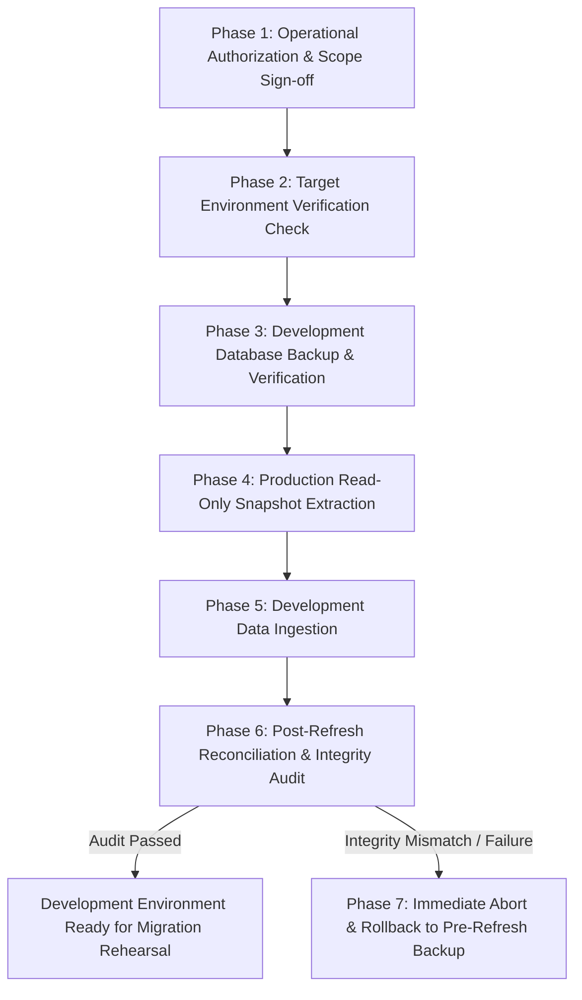
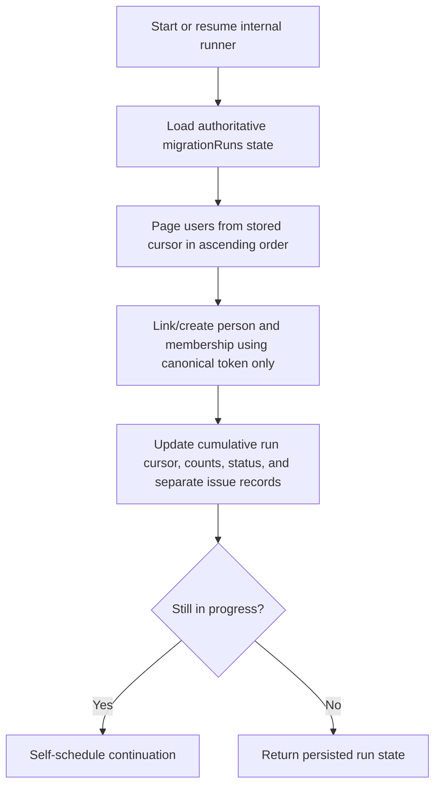
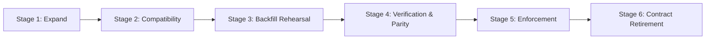
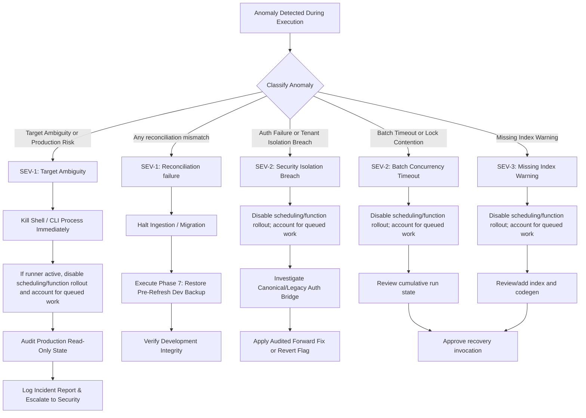

# D-05: Migration Rehearsal and Data Refresh Runbook (All Contracts)

## 1. Operational Safety Charter & Governing Policy

### 1.1 Document Metadata & Authority Scope
- **Document Identifier**: `MELO-RUNBOOK-D05-MIGRATION-REHEARSAL-DATA-REFRESH`
- **Feature Code**: `D-05` (Foundations / Operational Readiness)
- **Parent Orchestrator Session**: `orch-20260903-143249`
- **Version**: `1.1.1`
- **Status**: Corrected operational runbook — implementation alignment recorded; independent re-review and migration/restore validation remain pending
- **Effective Date**: 2026-09-03
- **Primary Roles**: Data Migration Architect, Security Systems Operator, Lead Systems Reliability Engineer
- **Authoritative Dependencies**:
  - [migration-verification-matrix.md](file:///c:/CreativeOS/01_Projects/Code/Personal_Stuff/2026-03-14_School_Management_System/docs/tasks/orchestrator-sessions/orch-20260903-143249/migration-verification-matrix.md)
  - [D02_IdentityGroupRBACAndAuditArchitecture.md](file:///c:/CreativeOS/01_Projects/Code/Personal_Stuff/2026-03-14_School_Management_System/docs/features/D02_IdentityGroupRBACAndAuditArchitecture.md)
  - [D01_ComplianceControlDossier.md](file:///c:/CreativeOS/01_Projects/Code/Personal_Stuff/2026-03-14_School_Management_System/docs/features/D01_ComplianceControlDossier.md)
  - [D03_ProviderRuntimeAndSettlementSpikes.md](file:///c:/CreativeOS/01_Projects/Code/Personal_Stuff/2026-03-14_School_Management_System/docs/features/D03_ProviderRuntimeAndSettlementSpikes.md)
  - [product-decisions.md](file:///c:/CreativeOS/01_Projects/Code/Personal_Stuff/2026-03-14_School_Management_System/docs/tasks/orchestrator-sessions/orch-20260903-143249/product-decisions.md)

---

### 1.2 Non-Negotiable Operational Safety Invariants

> [!CAUTION]
> **GOVERNING INVARIANT 1: PRODUCTION IS READ-ONLY**
> Production is strictly **READ-ONLY** throughout this program. Zero production mutation commands, zero ad-hoc production queries, zero schema modifications, and zero live batch backfills are authorized by this document. Any script, command, or operator action that targets production with write permissions is an immediate safety violation subject to immediate termination.

> [!IMPORTANT]
> **GOVERNING INVARIANT 2: DEVELOPMENT IS FOR REHEARSAL ONLY**
> Development database refresh is performed **solely for migration rehearsal, schema validation, and parity auditing**. Live customer data ingested into development remains restricted, isolated, and governed by strict privacy controls. Refresh data MUST NEVER be used for live customer communication, ad-hoc manual editing, or production traffic redirection.

> [!IMPORTANT]
> **GOVERNING INVARIANT 3: MANDATORY PRE-REFRESH DEVELOPMENT BACKUP**
> A verified, restorable development backup MUST exist and be validated BEFORE any development database replacement or snapshot ingestion occurs. If the development backup export fails, yields a zero-byte archive, fails SHA-256 verification, or cannot be read independently, the refresh is **IMMEDIATELY ABORTED**.

> [!CAUTION]
> **GOVERNING INVARIANT 4: ABSOLUTE EXCLUSION OF SECRETS AND SNAPSHOTS FROM GIT**
> Zero production credentials, zero deploy keys, zero authorization bearer tokens, zero PII, zero customer data dumps, and zero snapshot `.zip` archives shall ever be committed to git repositories, pull requests, or public channels. All backup artifacts, operational manifests containing metadata, and snapshot archives must reside strictly in encrypted, access-controlled directories located outside the project workspace tree.

---

### 1.3 Operator Authorization and Roles

Every execution of this runbook requires dual-custody verification:
1. **Data Migration Architect**: Formulates the batch contracts, defines validation criteria, and verifies referential integrity queries.
2. **Security Systems Operator**: Inspects terminal environments, validates deployment IDs, ensures deploy key permissions are strictly read-only for exports, and holds abort authority.

---

## 2. Safe Development Refresh Runbook (Step-by-Step Operator Protocol)



---

### 2.1 Phase 1: Operational Authorization & Scope Sign-off
Before commencing any refresh activity, the operator must verify the baseline environment:
1. **Codebase Baseline**: PR #21 is merged to `master`. The active branch is checked out from the updated `master` HEAD.
2. **Authorization Ticket**: An authorized change-management ticket exists (e.g. `CHG-ORCH-D05-REHEARSAL`).
3. **Storage Boundary Definition**: Ensure an off-repository secure directory is designated for all archives:
   - Linux/macOS: `~/.melo-ops/backups/`
   - Windows (PowerShell): `$HOME\.melo-ops\backups\`

---

### 2.2 Phase 2: Target Environment Verification Check

Before running any Convex command, the operator must verify that **every** configuration file, environment variable, script, and terminal shell targets the development deployment instance exclusively.

#### Verification Procedure (PowerShell / Windows)

Environment-value listing commands and any command that prints environment values are prohibited. Before a refresh, the Security Systems Operator creates or reviews an access-controlled, non-repository allowlist containing only the exact approved development deployment ID and approved Convex URLs. The allowlist contains no credential values and is not copied to logs, tickets, or Git.

```powershell
# Run from the repository root. The external allowlist is non-secret but access controlled.
$ErrorActionPreference = "Stop"
$allowlistPath = Join-Path $HOME ".melo-ops/approved-development-targets.json"
$approvedTargets = Get-Content -Raw $allowlistPath | ConvertFrom-Json
if ($approvedTargets.Count -lt 1) { throw "Abort: no approved development target." }

function Get-ConfiguredValue([string]$path, [string]$key) {
  $line = Select-String -Path $path -Pattern "^$([regex]::Escape($key))=" | Select-Object -First 1
  if (-not $line) { throw "Abort: required target key is absent." }
  return $line.Line.Substring($key.Length + 1).Trim('"', "'")
}

$rootDeployment = Get-ConfiguredValue ".env.local" "CONVEX_DEPLOYMENT"
$rootUrl = Get-ConfiguredValue ".env.local" "CONVEX_URL"
$approved = $approvedTargets | Where-Object {
  $_.deploymentId -eq $rootDeployment -and $_.convexUrls -contains $rootUrl
} | Select-Object -First 1
if (-not $approved) { throw "Abort: root deployment ID/URL pair is not on the approved development allowlist." }
if ($env:CONVEX_DEPLOYMENT -ne $approved.deploymentId) { throw "Abort: shell deployment ID does not exactly match the approved development ID." }

$convexClientConfigPaths = @(
  "apps/admin/.env.local", "apps/apply/.env.local", "apps/platform/.env.local",
  "apps/portal/.env.local", "apps/teacher/.env.local"
)
foreach ($path in $convexClientConfigPaths) {
  if (-not (Test-Path $path)) { throw "Abort: required Convex client configuration is absent." }
  $url = Get-ConfiguredValue $path "NEXT_PUBLIC_CONVEX_URL"
  if ($approved.convexUrls -notcontains $url) { throw "Abort: client URL is not on the approved development allowlist." }
}

# Review remaining apps too: www has a server-side URL; sites must remain a no-Convex-target app.
$wwwUrl = Get-ConfiguredValue "apps/www/.env.local" "CONVEX_URL"
$wwwPublicUrl = Get-ConfiguredValue "apps/www/.env.local" "NEXT_PUBLIC_CONVEX_URL"
if ($approved.convexUrls -notcontains $wwwUrl -or $approved.convexUrls -notcontains $wwwPublicUrl) { throw "Abort: www URL is not on the approved development allowlist." }
if (Test-Path "apps/sites/.env.local") {
  $sitesText = Get-Content -Raw "apps/sites/.env.local"
  if ($sitesText -match "(?m)^(CONVEX|NEXT_PUBLIC_CONVEX)_") { throw "Abort: sites has an unreviewed Convex target." }
}
Write-Host "All application target checks passed without printing target values."
```

The procedure reads only the named deployment/URL keys into process memory and emits no values. It must not inspect, print, copy, hash, or enumerate any unrelated environment value. The operator records only a pass/fail result and the allowlist version in the external manifest. It covers every application: `admin`, `apply`, `platform`, `portal`, `teacher`, `www`, and `sites`; `sites` is explicitly checked as a no-Convex-target app, not omitted. Before a development schema deployment, run the reviewed development command only after this check; no production deployment, import, or environment-inspection command is authorized by this runbook.

#### Script and command review (required for every refresh)
Review current target semantics for root `package.json` (`convex:dev`, `convex:deploy`, `convex:codegen`, `demo:seed`, `judge:seed`, and workspace dev/start commands); `scripts/setup-convex.ps1`, `scripts/setup-convex.sh`, and `scripts/verify-convex-setup.ts`; `convex.json`; all seven application package/config directories; and every newly added script found by searching `scripts/`, `package.json`, `apps/*/package.json`, and `packages/*/package.json` for `convex`, `CONVEX_`, `import`, `export`, `deploy`, `seed`, or `migration`. Record path, command, whether it can reach or mutate Convex, target-proof result, and disposition in the external manifest. A script that can initialize, deploy, codegen, seed, import, export, or otherwise reach Convex is not run unless its target is independently allowlisted. The setup scripts and verifier are reviewed even when not used; the verifier can invoke codegen.

#### Stop Condition
If any variable, file, or active CLI deployment contains `prod:`, `production:`, or matches a known production instance identifier, **HALT IMMEDIATELY**. Do not proceed to Phase 3.

---

### 2.3 Phase 3: Development Database Backup & Verification

Before overwriting the development database, create an independent, validated snapshot of the current development database.

#### Step 3.1: Execute Development Backup Export
Run the export strictly targeting development, writing the archive outside the git repository:
```bash
# Define secure external destination
BACKUP_DIR="$HOME/.melo-ops/backups/dev_pre_refresh"
mkdir -p "$BACKUP_DIR"
TIMESTAMP=$(date +"%Y%m%d_%H%M%S")
DEV_BACKUP_ZIP="$BACKUP_DIR/melo_dev_backup_${TIMESTAMP}.zip"

# Execute export from the already allowlisted development target. Keep all output private.
PRIVATE_LOG="$BACKUP_DIR/refresh-command.log"
npx convex export --include-file-storage --path "$DEV_BACKUP_ZIP" >"$PRIVATE_LOG" 2>&1
```

#### Step 3.2: Verify Development Backup Integrity
1. **Calculate SHA-256 Checksum**:
   ```bash
   sha256sum "$DEV_BACKUP_ZIP" > "${DEV_BACKUP_ZIP}.sha256"
   ```
   Do not print, attach, or copy the checksum or command log.
2. **Inspect Archive Size & Manifest**:
   ```bash
   # Confirm archive size is greater than 10KB
   FILESIZE=$(wc -c < "$DEV_BACKUP_ZIP")
   if [ "$FILESIZE" -lt 10240 ]; then
     echo "CRITICAL: Backup archive too small ($FILESIZE bytes). Aborting."
     exit 1
   fi

   # Validate zip structure and list table directories
   unzip -t "$DEV_BACKUP_ZIP"
   ```
3. **Record Dev Backup Manifest**: Record the URI, timestamp, file size, and non-sensitive checksum into the operator log.

---

### 2.4 Phase 4: Authorized Snapshot Handoff

This runbook contains no production-targeting CLI command. A separately authorized, read-only production export may be handed to the dual-custody operators through an approved secure process. Its authorization, access control, source deployment ID, and checksum are recorded outside Git without exposing credentials, snapshot contents, paths, or command output. If that evidence is absent or ambiguous, abort the refresh.

### 2.5 Phase 5: Development Data Ingestion (Restoration Rehearsal)

Restore the read-only production snapshot into the development environment.

#### Pre-Flight Ingestion Check
Repeat the explicit development-target procedure from Phase 2 immediately before import. Abort if `CONVEX_DEPLOYMENT` is absent, differs from the approved development reference, or a production-target flag is present. Convex has no `status --json` command; do not substitute an unverified CLI probe for this gate.

#### Execute Ingestion
```bash
# Import the snapshot into development with replace flag
npx convex import --replace-all "$PROD_SNAPSHOT_ZIP" >"$PRIVATE_LOG" 2>&1
```

---

### 2.6 Phase 6: Post-Refresh Reconciliation & Integrity Audit

Immediately following ingestion, run automated reconciliation queries to confirm data integrity and verify that tenant isolation is intact.

#### Step 6.1: Table Record Count Reconciliation
Use a reviewed, read-only reconciler to enumerate the complete source snapshot manifest and the restored development deployment. This runbook intentionally does not assume an `internal.reconciliation.counts:getTableSummary` function exists. The manifest must enumerate **every exported application table**, including zero-count tables, with count and byte total where available; the reconciler must enumerate the same complete set after restore. A hand-picked core-table list or sampling is not acceptance evidence. Record the actual utility/version and non-secret aggregate output in the external manifest.

| Reconciliation scope | Source manifest assertion | Restored-development assertion | Required result |
|---|---|---|---|
| Every exported application table | table name and exact document count | same table name and exact document count | every delta = `0` |
| Table-set completeness | all source table names, including empty tables | identical table-name set | no missing or extra table |
| File storage | object count and total bytes from source manifest | object count and total bytes after restore | both deltas = `0` |
| Storage references | all manifest/domain storage references count | same references resolve after restore | zero unresolved references |

#### Step 6.2: File Storage Asset Count Reconciliation
Use the same reviewed, read-only reconciler (or a verified source snapshot manifest) to count restored file-storage entries and bytes. Do not add an ad-hoc system-table query merely to run this procedure; the utility must be reviewed, deployed to development, and documented before use. Record only aggregate, non-PII values. A difference is not “explained” into acceptance: it is a failed reconciliation until the source manifest or restore target is corrected and a new zero-delta run is recorded.

#### Step 6.3: Tenant Isolation & Referential Integrity Scan
Execute an automated integrity sweep to confirm that zero cross-tenant references exist:
1. Every `students.schoolId` resolves to an existing `schools._id`.
2. Every `studentInvoices.studentId` points to a `students` record where `student.schoolId === invoice.schoolId`.
3. Every `classes.schoolId` matches the `schoolId` of its enrolled students.

#### Step 6.4: Demo School Authentication Smoke Test
1. Read credentials strictly from `tmp/demo_school_credentials.md` (never echo or log credentials).
2. Perform a localized browser login test against the development admin application targeting Olive Blessed Crest demo accounts.
3. Confirm dashboard loads with full school context and zero 403/500 errors.

---

### 2.7 Phase 7: Abort & Rollback Protocol

If any of the following triggers occur:
- Target deployment verification is ambiguous or points to production.
- Any table-set, table-count, storage count/byte, or referenced-storage discrepancy is non-zero.
- Cross-tenant referential corruption is detected.
- Demo school authentication fails repeatedly with unresolvable cryptographic errors.

#### Execution of Rollback
```bash
# Restore development only after repeating the exact deployment/URL allowlist check.
# Keep command output in the access-controlled external log.
npx convex import --replace-all "$DEV_BACKUP_ZIP" >"$PRIVATE_LOG" 2>&1

# Reconciliation is required before declaring the baseline restored.
```
> [!NOTE]
> **PRODUCTION HAS ZERO ROLLBACK ACTIONS**: Production was never mutated, touched, or redirected. Production continues normal operation without disruption.

---

## 3. Additive Migration Execution Protocol (Expand -> Backfill -> Verify -> Enforce -> Contract)

### 3.1 Implemented Identity Batch Runner (MX-01 / MX-02 only)

The repository currently implements one durable migration runner: the internal mutation `functions/academic/identityMigration:backfillCanonicalIdentityBatch`. It reconciles canonical identities and creates the corresponding branch membership; it is not a universal runner for MX-01 through MX-15. It owns one long-lived `migrationRuns` record for the active `sliceId`, updating that record after each page. While that record is `in_progress`, the runner schedules its own continuation with `ctx.scheduler.runAfter(0, ...)`.



#### Implemented contract

1. **Invocation, batch size, and cursor:** accepts optional `cursor`, optional `batchSize`, and optional `sliceId` (default `MX-01`). `batchSize` defaults to `150` and is clamped to **1–150**. The first invocation for a slice starts from its supplied cursor (or `null`). Once a run exists, subsequent caller cursors are ignored: pagination resumes only from that run's stored cursor. The returned cursor is `null` when user pagination has reached the end; migration completion still depends on the persisted status and open issues.
2. **Identity rule:** it reads `users.authTokenIdentifier`; it does not match by email or promote `users.authId`/provider subject into a canonical token. A person awaiting an exact reviewed token mapping remains `reconciliation_required`. `reconcileLegacyUserIdentity` is a separate internal, reviewed mapping operation; it validates one user/person/token relationship and resolves open issues.
3. **Idempotent linkage:** an existing matching `persons` row is reused; a `users.personId` and a `(personId, schoolId)` membership are only added when absent. Duplicate token, prelink, and membership conflicts are captured as `identityMigrationIssues`, not silently selected or merged.
4. **Persistent cumulative run state:** the first invocation inserts the run record; later batches patch that same record. Its `cursor`, `processedCount`, and `failedCount` are cumulative for the run, not per-batch values. `identityMigrationIssues` separately retains the run's unresolved/conflicting rows by `sliceId`. The implemented run fields are `sliceId`, `batchNumber`, `cursor`, `processedCount`, `failedCount`, `status`, `startedAt`, `updatedAt`, optional `completedAt`, and optional `errorMessage`.
5. **Implemented states and continuation:** `in_progress` means a continuation is self-scheduled; `completed` means the final page completed with no open issues; `failed` means the final page had failures or open identity issues. Resolving identity issues can schedule a final runner invocation, which marks an end-of-stream failed run `completed` only after no open issues remain. There is no persisted `paused`, `scheduled`, or cancellation state.
6. **Safe pause/stop limitation and procedure:** the runner has no pause or cancellation mechanism, and merely withholding another operator call is **not** a safe stop because an `in_progress` invocation has already scheduled its continuation. To contain it, do not manually invoke the runner; have the authorized deployment/scheduling owner disable the function rollout or scheduling path outside this runner. Already-scheduled or executing work can still run before that containment takes effect and can update the stored cursor and cumulative counts. Do not claim a stop until that owner has accounted for the queued/executing work and the run record is stable. Preserve the run record and issues for review. To recover, restore the approved scheduling/function rollout and invoke the runner for the slice; do not supply a continuation cursor because the persisted cursor is authoritative.

All other MX entries below are proposed rehearsal contracts, not claims that a common runner, run-state model, scheduler, or automatic role seeding exists for them.

---

### 3.2 Slice-by-Slice Proposed Rehearsal Specifications (MX-01 through MX-15)

Except for the MX-01/MX-02 identity batch described in §3.1, these are future contracts. They do not authorize execution or describe implemented migration-runner behavior.



---

#### 3.2.1 MX-01: Canonical Identity Bridge
- **Change Goal**: Decouple human identity from branch employment by introducing `persons` with `authTokenIdentifier` and establishing a bridge to legacy `users`.
- **Preflight & Inventory**:
  - Inventory existing `users.authId`, optional `users.authTokenIdentifier`, and missing/duplicate canonical tokens. Do not use duplicate emails as an identity-reconciliation input.
  - Assert that platform admins (`platformAdmins` table) are indexed by `authTokenIdentifier`.
- **1. Schema Expansion**:
  - The implemented table has optional `authTokenIdentifier` only for reconciliation-required legacy records, plus `identityReconciliationState`, contact `email`, `name`, `status`, and timestamps.
  - The canonical lookup is `persons.by_token_identifier`; `persons.by_email` is not an authentication or migration-link index.
  - Add optional foreign key `users.personId = v.optional(v.id("persons"))` and index `users.by_person` on `["personId"]`.
- **2. Compatibility Layer (Dual-Read / Dual-Write)**:
  - Auth resolvers use exact `tokenIdentifier` first. Trusted legacy compatibility is an exact provider-subject lookup through `users.by_auth` only for an unlinked legacy row; no email fallback is allowed.
  - No automatic dual-write/new-user provisioning contract is asserted here.
- **3. Batch Backfill Mutation**:
  - Cursor-based query iterating `users` ordered by `_creationTime` (batch size: 150).
  - For each user:
    - Reuse an existing `personId` only when its canonical token agrees with the legacy row.
    - Check `persons` by exact `authTokenIdentifier` only.
    - If no canonical token exists, retain/create a reconciliation-required person and record an open issue; do not use email or subject as a substitute.
    - Add `users.personId` and the matching membership only when the relationship is unambiguous.
- **4. Verification & Automated Reconciliation**:
  - Automated check: `count(users where personId is null) === 0`.
  - Check: Zero orphaned `persons` without matching `users`.
  - Dual-read audit: Query a sample of 100 users through both legacy and canonical auth resolvers; verify returned actor identity matches 100%.
- **5. Safe Rollback & Forward-Fix**:
  - Rollback: Feature flag `ENABLE_CANONICAL_PERSON_LOOKUP` set to `false`. Reverts auth helper to legacy `users` table directly. Zero deletion of `persons` table.
  - Forward-Fix: Resolve only reviewed canonical-token ambiguities through the internal reconciliation operation; email changes cannot repair identity ownership.
- **6. Decommissioning / Contract Retirement Criteria**:
  - Minimum observation window: 14 days in production.
  - Resolver fallback counter `legacy_user_lookup_fallback_count === 0` for 7 consecutive days.

---

#### 3.2.2 MX-02: Explicit Branch Memberships & Groups
- **Change Goal**: Enable school grouping and multi-branch tenancy without rekeying operational records.
- **Preflight & Inventory**:
  - Inventory current Olive Blessed Crest branches (Ikoyi, Lekki) and current `users.schoolId` mappings.
- **1. Schema Expansion**:
  - Add `schoolGroups`, `schoolGroupBranches`, and `branchMemberships` tables.
  - Add indexes: `branchMemberships.by_person_and_school` on `["personId", "schoolId"]`, `schoolGroupBranches.by_group` on `["groupId"]`, `schoolGroupBranches.by_school` on `["schoolId"]`.
- **2. Compatibility Layer**:
  - Context resolver `resolveActiveMembership` queries `branchMemberships`. If absent, reads legacy `users.schoolId` and synthesizes a transient virtual membership.
- **3. Batch Backfill Mutation**:
  - Iterate `users` where `personId` is populated (batch size: 150).
  - Check if `branchMemberships` exists for `(personId, schoolId)`.
  - If absent, insert `branchMemberships` using the legacy row’s archived/active lifecycle and timestamps. Do not derive a display title or authority from `user.role`.
  - Canary test: Link Olive Blessed Crest branches under one group `schoolGroups`.
- **4. Verification & Automated Reconciliation**:
  - Parity check: Every active `users` row has exactly one corresponding `branchMemberships` record for its `schoolId`.
  - Zero-orphan check: Every `branchMemberships.schoolId` points to an existing `schools` document.
  - Operational integrity check: Confirm zero `students`, `classes`, or `studentInvoices` had their `schoolId` altered.
- **5. Safe Rollback & Forward-Fix**:
  - Rollback: Toggle off multi-branch header switcher (`NEXT_PUBLIC_ENABLE_BRANCH_SWITCHER=false`). Context resolver falls back to single-tenant `users.schoolId`.
  - Forward-Fix: If an erroneous membership link is created, update membership `status = "archived"`. Never delete linked operational data.
- **6. Decommissioning Criteria**:
  - Observation window: 21 days.
  - Zero invocations of virtual membership synthesis.

---

#### 3.2.3 MX-03: RBAC Capabilities & Baseline Admin Migration
- **Change Goal**: Establish a separately approved capability-RBAC migration after an endpoint and authority inventory.
- **Current implementation boundary**: `rbacMigration` exposes isolated template-maintenance and legacy-admin backfill mutations, but it is not integrated with `migrationRuns`, has no durable MX-03 run state, and does not schedule itself. This runbook does not authorize or claim automatic role/template seeding.
- **Preflight & Inventory**:
  - Reconcile owners, platform administrators, legacy admin flags, and all endpoint authority consumers through a reviewed inventory. A title or legacy role alone is insufficient authority evidence.
- **Execution and verification gate**:
  - Define an explicit reviewed mapping and rollback/forward-correction plan before any assignment mutation. Verify anti-self-escalation, ceiling, branch-scope, and deny-by-default behavior before enforcement.
- **Decommissioning Criteria**:
  - The legacy authorization path remains until the independent migration, evidence, and observation gate is approved; no timing or automatic fallback-retirement claim is made here.

---

#### 3.2.4 MX-04: Append-Only Audit Event Contract & Redaction
- **Change Goal**: Centralize append-only audit trail with pre-write redaction, alerting tiers, and 7-year/permanent retention.
- **Preflight & Inventory**:
  - Inventory existing audit-like tables: `academicTimelineAuditEvents`, `adminLeadershipAuditEvents`, `schoolSiteAuditEvents`.
- **1. Schema Expansion**:
  - Add table `auditEvents` with fields: `eventId`, `timestamp`, `actorKind`, `actorPersonId`, `branchContextId`, `module`, `action`, `outcome`, `safeSummary`, `retentionClass`, `maskedMetadata`.
  - Add table `auditAlerts` with fields: `alertId`, `tier`, `eventId`, `status`, `targetRecipientPersonIds`.
  - Add indexes: `auditEvents.by_branch_and_timestamp`, `auditAlerts.by_status`.
- **2. Compatibility Layer**:
  - Audit logging wrapper `emitAuditEvent`: writes to both new `auditEvents` and legacy domain audit tables during migration.
- **3. Batch Backfill Mutation**:
  - Read historical records from `adminLeadershipAuditEvents` and `academicTimelineAuditEvents` in chunks of 200.
  - Transform and sanitize payloads: mask bank account numbers (`***-****-1234`), redact passwords and tokens (`[REDACTED_SECRET]`).
  - Insert sanitized rows into `auditEvents`.
- **4. Verification & Automated Reconciliation**:
  - Redaction verification: Run automated regex scan across `auditEvents.maskedMetadata` for raw 10-digit NUBAN numbers, credit card patterns, and bearer tokens. Assert zero matches.
  - Retention class check: Assert that every event has a valid `retentionClass` ("operational_7yr" or "permanent_statutory").
- **5. Safe Rollback & Forward-Fix**:
  - Rollback: If audit writer encounters unhandled exceptions, divert events to an in-memory or fallback table. Never block business transactions except for Tier 1 critical mutations.
  - Forward-Fix: If metadata is malformed, append a corrective audit event referencing the original `eventId`. Never mutate existing audit documents.
- **6. Decommissioning Criteria**:
  - Observation window: 30 days. Deprecate legacy domain audit tables after backfill and reconciliation.

---

#### 3.2.5 MX-05: Group Defaults / Branch Overrides / Typed Theme
- **Change Goal**: Replace raw unvalidated color strings with typed, inheritable design tokens (Primary and Accent bases) with contrast validation.
- **Preflight & Inventory**:
  - Inventory `schools.theme` across all branches.
- **1. Schema Expansion**:
  - Add `schoolGroupThemes` table and optional field `schools.themeConfig = v.optional(typedThemeValidator)`.
- **2. Compatibility Layer**:
  - Theme provider reads `schools.themeConfig`. If absent, reads legacy `schools.theme.primaryColor` and dynamically derives compliant tokens.
- **3. Batch Backfill Mutation**:
  - Iterate all `schools` documents (batch size: 100).
  - Inspect `theme.primaryColor` and `theme.accentColor`.
  - Run mathematical contrast derivation utility.
  - Patch `schools` with structured `themeConfig`.
- **4. Verification & Automated Reconciliation**:
  - Automated contrast check: WCAG AA compliance (contrast ratio >= 4.5:1 for normal text, >= 3:1 for large text) across all derived surface/foreground token pairs.
  - Grayscale readability check: Assert lightness separation >= 30% between foreground and background.
- **5. Safe Rollback & Forward-Fix**:
  - Rollback: Fallback to static CSS variables in `WorkspaceNavbar`.
  - Forward-Fix: Provide an admin theme reset action resetting colors to the institutional default palette.
- **6. Decommissioning Criteria**:
  - Minimum observation window: 14 days. Zero reads of unparsed legacy `schools.theme`.

---

#### 3.2.6 MX-06: Grade-Band Color & History Policy
- **Change Goal**: Configurable semantic grade band colors with versioned rendering snapshots for historical report cards.
- **Preflight & Inventory**:
  - Inventory existing `gradingBands` and report card rendering paths.
- **1. Schema Expansion**:
  - Add optional fields to `gradingBands`: `color: v.optional(v.string())`, `version: v.optional(v.number())`.
  - Add `gradingBandPolicies` table to track versioned snapshots.
- **2. Compatibility Layer**:
  - Report card renderer checks for `policyVersion` on the academic term or report card snapshot. If absent, applies default semantic preset without color styling.
- **3. Batch Backfill Mutation**:
  - Iterate `gradingBands` by school (batch size: 100).
  - Assign approved default semantic colors (A=Emerald, B=Blue, C=Amber, D=Orange, F=Rose).
  - Set `version = 1`.
- **4. Verification & Automated Reconciliation**:
  - Verify that historical report cards published prior to migration retain their original layout and text values without visual regression.
  - Print & Grayscale check: Verify that report cards rendered in grayscale remain 100% legible without color cues.
- **5. Safe Rollback & Forward-Fix**:
  - Rollback: Toggle `ENABLE_GRADE_BAND_COLORS = false`. Renders grade letters using default monochrome typography.
  - Forward-Fix: Create new version of the grade band policy (`version = 2`). Never mutate historical snapshots.
- **6. Decommissioning Criteria**:
  - Minimum observation window: 30 days post-terminal exam session.

---

#### 3.2.7 MX-07: Bank Accounts & Financial-Document Snapshots
- **Change Goal**: Multi-account school bank management with immutable payment instruction snapshots on issued invoices.
- **Preflight & Inventory**:
  - Inventory `schoolBillingSettings` and all unpaid/paid `studentInvoices`.
- **1. Schema Expansion**:
  - Add table `schoolBankAccounts` with fields: `schoolId`, `accountName`, `bankName`, `accountNumber`, `currency`, `isDefault`, `status`.
  - Add optional field `studentInvoices.paymentInstructionsSnapshot = v.optional(paymentInstructionsValidator)`.
- **2. Compatibility Layer**:
  - Invoice rendering logic: If `paymentInstructionsSnapshot` is present, display snapshot. If absent, fall back to current active default in `schoolBankAccounts`.
- **3. Batch Backfill Mutation**:
  - For each school with configured billing settings, create an active default `schoolBankAccounts` row.
  - Backfill ONLY draft or unissued invoices with the current bank snapshot. Issued historical invoices remain untouched unless authorized.
- **4. Verification & Automated Reconciliation**:
  - Audit log check: Verify that every bank detail modification emits a **Tier 1 CRITICAL** alert and records masked numbers (`***-****-1234`).
  - Invoice immutability check: Update a school bank account, verify that previously issued invoices retain their original snapshot.
- **5. Safe Rollback & Forward-Fix**:
  - Rollback: Disable account switching in billing UI; revert invoice generator to read billing settings directly.
  - Forward-Fix: Archive inaccurate bank account records (`status = "archived"`). Issue corrective invoice addenda.
- **6. Decommissioning Criteria**:
  - Observation window: 60 days (covering one full billing cycle).

---

#### 3.2.8 MX-08: Admission Number Policy & Atomic Allocator
- **Change Goal**: Guided token builder with atomic sequence allocation in enrollment transactions; manual override governance.
- **Preflight & Inventory**:
  - Inventory existing `students.admissionNumber` patterns and highest numeric sequences across all schools.
- **1. Schema Expansion**:
  - Add `admissionNumberPolicies`, `admissionNumberSequences`, and `admissionAllocations` tables.
  - Add index: `admissionAllocations.by_school_and_number` on `["schoolId", "allocatedNumber"]`.
- **2. Compatibility Layer**:
  - Enrollment approval checks for an active `admissionNumberPolicies`. If not found, falls back to legacy manual string input.
- **3. Batch Backfill Mutation**:
  - Analyze existing student admission numbers per school to determine the maximum issued sequence integer.
  - Seed `admissionNumberSequences` with `nextValue = maxSequence + 1`.
- **4. Verification & Automated Reconciliation**:
  - Concurrency test: Simulate 10 concurrent enrollment approvals in the test harness; assert zero duplicate admission numbers allocated and that committed values follow the policy; gaps are permitted and must be auditable.
  - Override test: Verify that manual override requires `enrollment.admissions.override_number` capability and records an audit event.
- **5. Safe Rollback & Forward-Fix**:
  - Rollback: Revert to manual admission number field in registrar UI. The sequence counter is NOT decremented.
  - Forward-Fix: If a sequence counter drifts, an authorized administrator with explicit permission adjusts `nextValue` forward via an audited mutation.
- **6. Decommissioning Criteria**:
  - Observation window: 30 days post-admissions intake.

---

#### 3.2.9 MX-09: Institutional Email Operations
- **Change Goal**: A future, provider-approved domain and mailbox-operation model with states `login_only`, `external_verified`, and `provider_provisioned`.
- **Migration boundary**: A login/contact email is not a canonical identity key or a mailbox-provisioning instruction. This runbook defines no automatic collection, matching, or registration of legacy `users.email` values into mailbox records.
- **Preflight and execution gate**: Follow D-01/D-03 counsel, school authorization, domain-control, provider, licensing, data-residency, sandbox, and browser-flow gates before any mailbox operation. `login_only` remains non-inbox state and no communication may be dispatched to it.
- **Reconciliation gate**: Any approved provider operation must use its own reviewed idempotency/reconciliation record and preserve identity/membership attribution. There is no MX-09 migration-runner state or scheduled job contract in this runbook.

---

#### 3.2.10 MX-10: Form Drafts, Temporary Files, & Recovery Lifecycle
- **Change Goal**: Server-side auto-save draft protection for high-value forms with revision checking and private temporary file expiry.
- **Preflight & Inventory**:
  - Inventory target high-value forms: Student Enrollment, Staff Onboarding, Fee Plan Creation.
- **1. Schema Expansion**:
  - Add tables `formDrafts` and `temporaryUploads`.
  - Add indexes: `formDrafts.by_user_and_form` on `["userId", "formKey"]`, `temporaryUploads.by_expiry` on `["expiresAt"]`.
- **2. Compatibility Layer**:
  - Form loading logic: Inspect server for active draft. If found, prompt user with "Resume Draft / Discard" modal. If absent, initialize blank form.
- **3. Batch Backfill Mutation**:
  - No historical data backfill is required. Any cleanup job requires a separate implemented-and-reviewed contract; it is not part of the migration runner in §3.1.
- **4. Verification & Automated Reconciliation**:
  - Conflict test: Simulate concurrent edits in two tabs; assert revision mismatch warning prevents silent overwrite.
  - Expiry test: Verify any implemented cleanup behavior against its approved retention contract.
- **5. Safe Rollback & Forward-Fix**:
  - Rollback: Toggle `ENABLE_FORM_AUTOSAVE = false`. Forms revert to standard client-side state without auto-persistence.
  - Forward-Fix: Purge corrupted drafts via admin draft reset utility.
- **6. Decommissioning Criteria**:
  - Observation window: 14 days.

---

#### 3.2.11 MX-11: AI Import Proposal/Commit Contract
- **Change Goal**: Structured AI spreadsheet import review pipeline with deterministic pre-commit validation.
- **Preflight & Inventory**:
  - Inventory current `importWorkspaces` table and staging schemas.
- **1. Schema Expansion**:
  - Add tables `aiImportProposals` and `aiImportStagedRows`.
  - Add index: `aiImportStagedRows.by_workspace` on `["workspaceId"]`.
- **2. Compatibility Layer**:
  - Dual-mode import runner: Supports both legacy manual CSV column mapping and new AI-assisted proposal workflow.
- **3. Batch Backfill Mutation**:
  - No backfill of legacy completed imports. Active/pending workspaces migrate to new typed proposal schema.
- **4. Verification & Automated Reconciliation**:
  - Boundary test: Assert that the AI service possesses ZERO write capabilities to live production tables (`students`, `classes`, `users`).
  - Validation test: Propose rows with invalid dates and duplicate admission numbers; assert deterministic validation catches and flags 100% of errors before commit.
- **5. Safe Rollback & Forward-Fix**:
  - Rollback: Disable AI proposal toggle. Fall back to standard manual CSV importer.
  - Forward-Fix: Abort failed import workspace; staged rows are discarded without affecting live tables.
- **6. Decommissioning Criteria**:
  - Observation window: 30 days.

---

#### 3.2.12 MX-12: Commercial Catalog, Contracts, SaaS & Settlement Ledgers
- **Change Goal**: Double-entry financial ledgers separating SaaS subscription charges from school collection settlements.
- **Preflight & Inventory**:
  - Seed reviewed versioned rate card: Core/Basic at ₦1,000 active student/term + ₦30,000 setup fee.
- **1. Schema Expansion**:
  - Add tables `saasRateCards`, `schoolSaaSContracts`, `ledgerAccounts`, `ledgerJournalEntries`, `ledgerLines`.
  - Add index: `ledgerLines.by_account_and_timestamp` on `["accountId", "timestamp"]`.
- **2. Compatibility Layer**:
  - Billing dashboard reads from new double-entry ledger. If ledger history is empty, displays legacy invoice summary.
- **3. Batch Backfill Mutation**:
  - Migrate existing school billing settings into versioned `schoolSaaSContracts`.
  - Generate opening balance journal entries in `ledgerJournalEntries` for active school accounts.
- **4. Verification & Automated Reconciliation**:
  - Double-entry balance assertion: For every journal entry, `sum(debits) === sum(credits)`. Discrepancy = 0.
  - Rate snapshot verification: Verify that issued SaaS invoices snapshot their rate card values and do not mutate when catalog prices change.
- **5. Safe Rollback & Forward-Fix**:
  - Rollback: Revert billing view to legacy invoice reader. Ledgers remain intact.
  - Forward-Fix: Correct ledger discrepancies by posting compensating adjustment journal entries. Never delete historical ledger lines.
- **6. Decommissioning Criteria**:
  - Observation window: 90 days (one full fiscal term).

---

#### 3.2.13 MX-13: Quota Reservation, Usage Settlement, Storage Accounting
- **Change Goal**: Accurate usage metering (AI tokens, OCR pages, storage bytes) with reservation and settlement semantics.
- **Preflight & Inventory**:
  - Map all AI/OCR endpoints and calculate storage baseline per school.
- **1. Schema Expansion**:
  - Add tables `quotaEntitlements`, `quotaReservations`, `quotaSettlements`, `storageAccounting`.
  - Add indexes: `quotaReservations.by_idempotency_key`, `quotaSettlements.by_school`.
- **2. Compatibility Layer**:
  - Metering wrapper: Runs in "observe-only" mode, logging usage without blocking operations until parity is verified.
- **3. Batch Backfill Mutation**:
  - Scan `_storage` and asset tables; backfill `storageAccounting` with accurate active byte counts per school.
- **4. Verification & Automated Reconciliation**:
  - Idempotency test: Settle the same reservation key twice; assert usage is recorded exactly once.
  - Release test: Simulate provider failure; assert reserved quota is released back to the customer allowance.
- **5. Safe Rollback & Forward-Fix**:
  - Rollback: Set metering engine to non-blocking observation mode.
  - Forward-Fix: Adjust account balances via audited quota credit transactions.
- **6. Decommissioning Criteria**:
  - Observation window: 30 days.

---

#### 3.2.14 MX-14: Private Asset Library, Quarantine, Trash, Retention, Compression
- **Change Goal**: Private school asset management with upload quarantine, 30-day recoverable Trash, and validated PDF optimization.
- **Preflight & Inventory**:
  - Inventory existing school logos, circulars, and site assets in storage.
- **1. Schema Expansion**:
  - Add tables `schoolAssets`, `assetTrashLedger`, `assetCompressionCandidates`.
  - Add indexes: `schoolAssets.by_school_and_status`, `assetTrashLedger.by_purge_date`.
- **2. Compatibility Layer**:
  - Asset reader: If asset is in `schoolAssets`, enforce capability check. If legacy site profile asset, allow backwards-compatible read.
- **3. Batch Backfill Mutation**:
  - Iterate legacy storage records belonging to schools; register assets in `schoolAssets` with `status: "legacy_unverified"`; do not infer a clean scan result from legacy presence.
- **4. Verification & Automated Reconciliation**:
  - Quarantine test: Verify unverified upload cannot be downloaded via standard URL.
  - Trash recovery test: Move asset to Trash, verify it appears in Trash Explorer, restore it, and verify permissions and access return.
  - PDF compression test: Verify that compressed candidate preserves exact page count and saves >10% before replacing original.
- **5. Safe Rollback & Forward-Fix**:
  - Rollback: Disable compression worker. Retain original assets in storage.
  - Forward-Fix: Restore previous asset version from `assetTrashLedger` or compression candidate backup.
- **6. Decommissioning Criteria**:
  - Observation window: 30 days.

---

#### 3.2.15 MX-15: Within-Group Transfers Foundation
- **Change Goal**: Audited student transfer between branches of the same group without in-place `schoolId` rewriting.
- **Preflight & Inventory**:
  - Verify prerequisites: MX-01, MX-02, MX-03, and MX-04 must be fully operational.
- **1. Schema Expansion**:
  - Add table `studentTransferCases` with fields: `caseId`, `groupId`, `sourceSchoolId`, `destinationSchoolId`, `studentId`, `status`, `authorizedByPersonId`.
  - Add index: `studentTransferCases.by_group` on `["groupId"]`.
- **2. Compatibility Layer**:
  - Student profile reader: Displays transfer history banner if student has an active transfer case.
- **3. Batch Backfill Mutation**:
  - No historical backfill required. Feature applies to future within-group movements.
- **4. Verification & Automated Reconciliation**:
  - Immutability check: Execute student transfer; assert that source branch historical attendance, scores, and invoices remain strictly tagged with `sourceSchoolId`.
  - Destination check: Assert destination branch creates a new enrollment context without overwriting historical records.
- **5. Safe Rollback & Forward-Fix**:
  - Rollback: Disable transfer workflow in group admin portal.
  - Forward-Fix: Cancel transfer case via audited reversal event, archiving the destination enrollment record.
- **6. Decommissioning Criteria**:
  - Observation window: 60 days.

---

### 3.3 Retirement & Decommissioning Gate (Contract Stage)

A legacy field, function, or table is eligible for removal ONLY when all six (6) decommissioning criteria are satisfied:
1. **Migration Completeness**: 100% of rows have been migrated and reconciled with zero remaining unmigrated records.
2. **Zero Fallback Utilization**: Telemetry confirms zero calls to the legacy fallback reader for a minimum observation window (14 to 30 days depending on slice).
3. **Application Decoupling**: All frontend apps (`admin`, `teacher`, `portal`, `platform`, `apply`, `sites`, `www`) and background workers are deployed on the new schema contract.
4. **Tested Restore / Forward-Fix**: A full rehearsal restore drill has been successfully demonstrated in development.
5. **Multi-Party Sign-Off**: Written sign-off from Data Migration Architect, Security Systems Operator, and relevant domain leads.
6. **Dedicated Retirement PR**: Deprecation of legacy schema fields is committed in a separate, dedicated PR; never bundled with initial migration expansions.

---

## 4. Non-Secret Manifest & Rehearsal Evidence Templates

The following templates must be copied, completed, and archived for every refresh and rehearsal drill.

### 4.1 Template 1: Environment Target Proof Manifest

```markdown
# Environment Target Proof Manifest

- **Execution Date / Time**: YYYY-MM-DD HH:MM:SS UTC
- **Operator Name**: [Operator Full Name]
- **Operational Role**: [Security Systems Operator | Migration Architect]
- **Session / Ticket ID**: orch-20260903-143249 / [CHG-XXXXX]

## 1. Shell & CLI Environment Checks
- Terminal Hostname / OS: [e.g. WORKSTATION-01 / Windows 11 Pro / Ubuntu 24.04]
- Execution Shell: [PowerShell 7.4.x | Bash 5.2.x]
- Active Convex Deployment Name: [e.g. dev:melo-development-abc]
- Active Convex Deployment Type: [DEVELOPMENT ONLY]
- Shell `CONVEX_DEPLOYMENT` Check: [VERIFIED NON-PROD]

## 2. Configuration File Hash & Inspection Summary
| File Path | SHA-256 Checksum | Target Subdomain / Identifier | Verification Result |
|---|---|---|---|
| `.env.local` | `e3b0c44298fc1c14...` | `dev:melo-dev-xxx` | PASS (Development) |
| `apps/admin/.env.local` | `a1b2c3d4e5f6...` | `https://dev-melo.convex.cloud` | PASS (Development) |
| `apps/teacher/.env.local` | `b2c3d4e5f6a1...` | `https://dev-melo.convex.cloud` | PASS (Development) |
| `apps/portal/.env.local` | `c3d4e5f6a1b2...` | `https://dev-melo.convex.cloud` | PASS (Development) |
| `apps/platform/.env.local`| `d4e5f6a1b2c3...` | `https://dev-melo.convex.cloud` | PASS (Development) |

## 3. Production Read-Only Assertion
- Production Deploy Key Scoping: [READ-ONLY EXPORT PERMISSION ONLY]
- Production Mutation Commands Run: [ZERO - CONFIRMED]
- Operator Signature: _______________________
```

---

### 4.2 Template 2: Table & Storage Count Reconciliation Manifest

```markdown
# Table & Storage Count Reconciliation Manifest

- **Rehearsal Date**: YYYY-MM-DD
- **Target Deployment**: [dev:melo-development-abc]
- **Snapshot Source ID**: [prod-snapshot-readonly-2026MMDD]

## 1. Core Entity Count Reconciliation
| Table Name | Production Snapshot Count | Restored Development Count | Delta | Status |
|---|---|---|---|---|
| `[every source-manifest table; attach complete non-secret list]` | [Count] | [Count] | 0 | MATCH |

No abbreviated core-table list is sufficient. The external manifest must attach the full table-name/count comparison, including zero-count tables, and assert no missing or extra table. Any non-zero delta is `FAIL`; “explained” is not an acceptance status.

## 2. File Storage Reconciliation
- Snapshot Storage Files Count: [Count]
- Restored Storage Files Count: [Count]
- Snapshot Storage Bytes: [Bytes]
- Restored Storage Bytes: [Bytes]
- Storage Reconciliation Result: [MATCH (zero count and byte deltas) / FAIL]
- Every manifest/domain storage reference resolves after restore: [YES / FAIL]

## 3. Tenant Isolation & Sample Check
- Random Student Tenant Sampling (50 records): 100% resolve to valid `schoolId`.
- Random Invoice Tenant Sampling (50 records): 100% resolve to valid `studentId` in same branch.
- Cross-Tenant Leakage Detected: [NONE]
- Reconciler Signature: _______________________
```

---

### 4.3 Template 3: Migration Execution Drill Log

```markdown
# Migration Execution Drill Log

- **Migration Slice ID**: [e.g. MX-01 Canonical Identity Bridge]
- **Migration Run Record**: [`migrationRuns` Convex document ID; one long-lived record per active slice, patched with cumulative cursor/counts across batches; record linked `identityMigrationIssues` separately]
- **Start Time**: YYYY-MM-DD HH:MM:SS UTC
- **End Time**: YYYY-MM-DD HH:MM:SS UTC
- **Total Duration**: [e.g. 4m 12s]

## 1. Batch Execution Metrics
- Total Documents Targeted: [Total]
- Batch Size: [e.g. 150]
- Total Batches Executed: [Batches]
- Documents Processed Successfully: [Processed]
- Documents Failed / Skipped: [0]
- Average Batch Execution Latency: [e.g. 42ms]

## 2. Parity & Compatibility Verification
- Dual-Read Parity Score: [100.0%]
- Unmapped Records Count: [0]
- Ambiguous Identity Records: [0]
- Audit Events Emitted Count: [Count]

## 3. Sample Verification Query Output
```json
{
  "sliceId": "MX-01",
  "status": "completed",
  "unmappedCount": 0,
  "verificationParity": "100%",
  "timestamp": 1788456000000
}
```

- Operator Sign-off: _______________________
```

---

### 4.4 Template 4: Rollback Drill Record

```markdown
# Rollback Drill Record

- **Drill Date / Time**: YYYY-MM-DD HH:MM:SS UTC
- **Drill Type**: [Scheduled Tabletop Rehearsal | Simulated Anomaly Trigger]
- **Trigger Condition Simulated**: [e.g. Simulated 0.5% referential mismatch on students]

## 1. Abort & Rollback Sequence
1. Abort Signal Triggered At: HH:MM:SS UTC
2. CLI Command Executed: `npx convex import --replace-all <DEV_BACKUP_ZIP>` (development only after explicit target verification)
3. Restoration Duration: [e.g. 1m 45s]
4. Post-Rollback Database State Verified: [YES]

## 2. Integrity Comparison
| Table Name | Pre-Refresh Dev Count | Post-Rollback Dev Count | Match Result |
|---|---|---|---|
| `schools` | [Count] | [Count] | MATCH |
| `users` | [Count] | [Count] | MATCH |
| `students` | [Count] | [Count] | MATCH |

## 3. Lessons Learned & Runbook Refinements
- Observations: [Document any latency, CLI error, or procedure friction]
- Action Items: [Refinements to documentation or scripts]
- Lead Operator Signature: _______________________
```

---

## 5. Operator Stop Conditions & Incident Decision Tree

### 5.1 Incident Severity Levels & Triage Thresholds

| Severity | Incident Description | Threshold / Trigger | Immediate Operator Action |
|---|---|---|---|
| **SEV-1 (CRITICAL)** | Target Ambiguity / Production Exposure Risk | Any shell, script, or CLI tool referencing production during refresh or migration. | **IMMEDIATE ABORT AND CONTAINMENT**. Kill local processes; if the identity runner is active, use §3.1 to disable scheduling/function rollout and account for queued work. Lock operator tokens and verify zero production mutations. |
| **SEV-1 (CRITICAL)** | Reconciliation mismatch | Any non-zero table-set/count, storage count/byte, or referenced-storage discrepancy after refresh. | **ABORT & ROLLBACK**. Execute Phase 7 restore of pre-refresh dev backup. |
| **SEV-2 (HIGH)** | Authentication / Tenant Isolation Failure | Demo school authentication failure or cross-branch tenant data visibility. | **CONTAIN MIGRATION**. Follow §3.1's safe-stop procedure before subsequent slices. |
| **SEV-2 (HIGH)** | Migration Batch Lock Contention / Timeout | Single batch mutation exceeds 5000ms or fails with OCC error >3 times consecutively. | **CONTAIN MIGRATION**. The scheduling/function-rollout owner must account for already-scheduled work; then review the cumulative run record and use an approved 1–150 batch size for recovery. |
| **SEV-3 (MEDIUM)** | Missing Index Warning | Convex CLI logs `TABLE_SCAN` or missing index during batch pagination. | **CONTAIN MIGRATION** under §3.1 before deploying/reviewing the index. |
| **SEV-3 (MEDIUM)** | Storage Asset Count Discrepancy | Non-zero delta between snapshot storage manifest and restored storage records. | **INVESTIGATE DELTA**. Verify if missing files are expired temporary uploads or orphans. |

---

### 5.2 Flowchart: Incident Escalation & Abort Decision Tree



---

### 5.3 Anomaly Resolution Matrix

#### 1. Target Ambiguity Anomaly
- **Symptom**: `CONVEX_DEPLOYMENT` contains `prod:` or Convex CLI output lists production deployment URL.
- **Root Cause**: Operator executed command in an unverified shell or loaded production `.env` file.
- **Resolution**:
  1. Immediately terminate terminal process (`Ctrl+C` or `kill -9`).
  2. Re-run the explicit `CONVEX_DEPLOYMENT` equality check from Phase 2; do not use nonexistent a CLI status probe.
  3. Inspect production audit logs to confirm zero mutations were received.
  4. Re-execute Phase 2 verification in a pristine terminal session.

#### 2. Reconciliation Mismatch Anomaly (any non-zero delta)
- **Symptom**: The complete reconciler finds a missing/extra table, non-zero table count, storage count/byte, or referenced-storage discrepancy.
- **Root Cause**: Incomplete snapshot extraction, network interruption during ingestion, or uncommitted source transactions.
- **Resolution**:
  1. Abort immediately. Do not start any migration slice.
  2. Execute Phase 7 rollback restoring `$DEV_BACKUP_ZIP`.
  3. Re-verify SHA-256 checksum of `$PROD_SNAPSHOT_ZIP`. If corrupted, re-extract snapshot under Phase 4.

#### 3. Unexpected Authentication Failure Anomaly
- **Symptom**: Demo school admin or teacher login fails with `IDENTITY_NOT_FOUND` or 403 Forbidden.
- **Root Cause**: Canonical person resolver failed to find legacy auth identifier fallback, or password hash mismatch in local test fixture.
- **Resolution**:
  1. Inspect `migrationRuns` table for MX-01 state.
  2. Test the authenticated token-identifier mapping with an internal test seam; do not resolve identity by email.
  3. Verify that `users` record has valid `authTokenIdentifier` or `authId`.
  4. If bridge logic is flawed, update `migrationAuth.ts` fallback resolver; never mutate customer authentication credentials.

#### 4. Migration Timeout / Concurrency Contention Anomaly
- **Symptom**: Convex mutation fails with `OptimisticConcurrencyControlError` or execution exceeds 5000ms.
- **Root Cause**: Active concurrent write traffic on the target table or a batch size that is too large for the current workload (the runner clamps requests to 1–150 documents).
- **Resolution**:
  1. Do not manually invoke the runner again. There is no `paused` state or cancellation API, and an `in_progress` batch self-schedules its continuation.
  2. Have the authorized deployment/scheduling owner disable the scheduling or function-rollout path. They must account for work already scheduled or executing before declaring the run contained.
  3. When the persisted run record is stable, review its cumulative cursor/counts and issues. After the fix, restore the approved path and invoke the slice with an approved 1–150 batch size; do not pass a continuation cursor.

#### 5. Missing Index Warning Anomaly
- **Symptom**: Convex server logs warning: `Query performed table scan without index`.
- **Root Cause**: A migration query lacks the required index.
- **Resolution**:
  1. Use the §3.1 containment procedure; there is no runner-level pause operation.
  2. Add the appropriate compound index in `packages/convex/schema.ts` (e.g. `by_slice_and_status` on `["sliceId", "status"]`).
  3. Run `pnpm convex:codegen` and deploy schema expansion.
  4. Update the affected query to `.withIndex(...)`.
  5. After review, restore the approved scheduling/function rollout and resume from the stored run state without passing a cursor.

#### 6. Storage Count Discrepancy Anomaly
- **Symptom**: Total document count in `_storage` does not equal snapshot manifest storage count.
- **Root Cause**: Temporary upload files or expired drafts were pruned by background cleanup jobs during export, or large binary upload was in-flight.
- **Resolution**:
  1. Query `_storage` records joined with active domain tables (`students.photoStorageId`, `schoolSiteAssets.storageId`).
  2. Confirm every sampled/reconciled referenced operational asset is present; record the sample scope and any excluded temporary/orphaned artifacts.
  3. Do not accept a temporary/orphan explanation as a refresh result: correct the source manifest/target scope or restore process, then re-run to zero delta. Trigger Phase 7 rollback before any migration work.


---

## 6. Recorded Development Refresh Evidence (non-secret)

### 6.1 Development refresh execution manifest

This manifest records only verified non-secret facts already available to this documentation set. A blank, omitted, or unavailable evidence value is **pending**, not a pass. Backup archives, snapshots, command logs, credentials, PII, and secret values remain outside Git.

| Evidence item | Recorded non-secret fact | Status |
|---|---|---|
| Target proof | The refresh target was verified against an approved development deployment ID through the external allowlist procedure in §2.2. The deployment ID itself is intentionally not copied into Git. | `VERIFIED (external allowlist)` |
| Operator authorization | No non-secret operator authorization reference was supplied for inclusion in this repository. | `PENDING` |
| Pre-refresh development backup | A development backup was required and retained in access-controlled storage outside Git. Its independently verified SHA-256 checksum value was not supplied to this documentation set. | `PENDING checksum evidence` |
| Read-only production export | A production snapshot was handled through the authorized read-only handoff boundary. Its checksum value was not supplied to this documentation set. | `PENDING checksum evidence` |
| Full application-table reconciliation | Recorded aggregate result: **3,956 documents** and **zero table-count differences**. The full non-secret per-table source/restored manifest is not retained here, so its independent review remains open. | `RECORDED aggregate; PENDING manifest review` |
| Storage-file reconciliation | Recorded aggregate: **60 storage files**. Paired source/restored file-count evidence is not retained here. | `RECORDED aggregate; PENDING paired count evidence` |
| Storage-byte reconciliation | No verified source/restored storage-byte totals were supplied. | `PENDING — not performed/recorded` |
| Storage-reference reconciliation | No verified complete reference-resolution output was supplied. | `PENDING` |
| Tenant/auth smoke check | No verified tenant-isolation or authenticated demo smoke result was supplied for this record. | `PENDING` |
| Browser smoke check | No browser smoke result was supplied. | `PENDING — not performed/recorded` |

The aggregate evidence above does not prove migration correctness, restore/rollback validation, legal approval, provider validation, runtime validation, full tenant isolation, or browser behavior. Those gates remain open.
