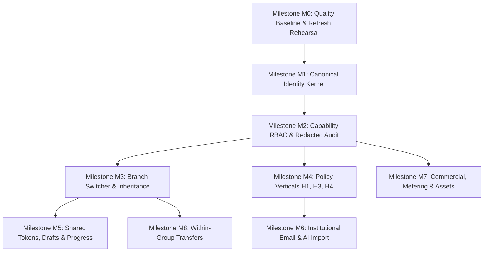

# Expansion Design Milestone Review: D-01 through D-05

**Session:** `orch-20260903-143249`  
**Review Scope:** Comprehensive cross-bundle systems audit of design artifacts **D-01 through D-05** against Genesis decisions, repository invariants, Convex guidelines, and the normative implementation program.  
**Review Date:** 2026-09-03  
**Auditor Role:** Independent Principal Systems Reviewer & Milestone Auditor  

---

## 1. Milestone Review Header & Verdict

### 1.1 Executive Summary
The Design Phase for the Melo School Management System expansion program has produced five core architectural artifacts:
1. `docs/features/D01_ComplianceControlDossier.md` (F5 Legal, Privacy & Child Data Program)
2. `docs/features/D02_IdentityGroupRBACAndAuditArchitecture.md` (F2 Tenancy, H2 Capability RBAC, F1 Append-Only Audit)
3. `docs/features/D03_ProviderRuntimeAndSettlementSpikes.md` (F7 Monetization, H5 Institutional Email, H9 AV/PDF Spikes, F4 Transfers)
4. `docs/features/D04_CrossApplicationInteractionAndVisualContract.md` (H1–H9, F6, F7 Interaction, Mobile & Visual Tokens)
5. `docs/features/D05_MigrationRehearsalAndDataRefreshRunbook.md` (Universal Batch Protocol, MX-01 to MX-15 Rehearsal Runbooks)

Each document has been audited against the repository's normative anchors: `product-decisions.md`, `implementation-program.md`, `task-packets.md`, `migration-verification-matrix.md`, `packages/convex/_generated/ai/guidelines.md`, and the preceding milestone standard `DesignMilestoneReview.md`.

### 1.2 Authoritative Verdict

> [!IMPORTANT]
> **FINAL DESIGN VERDICT: APPROVED FOR BUILD PHASE 2 HANDOFF**
> 
> **Build Phase 2 may begin immediately**, starting with **Milestone M0 / PR-A (Quality Baseline & Environment Gate)**.
> 
> The D-01 through D-05 design specifications provide complete, mathematically rigorous, legally cited, and architecturally sound contracts for all 15 expansion features. Zero blocking design flaws, unresolved domain boundaries, or ambiguous data contracts remain.
> 
> **Build Boundary Conditions**:
> 1. Build Phase 2 must start on a clean branch branched from updated `master` following the merge of PR #21.
> 2. Milestone M0 (PR-A) is an unconditional prerequisite gate. No product feature code (M1 through M8) may be merged until M0 clears the teacher conditional-hook lint blockers, isolates the parallel test runner timeout root cause, and verifies the safe development refresh runbook.
> 3. Downstream Build Milestones (M1 through M8) must strictly implement their frozen contracts without inventing ad-hoc schema expansions, local abstractions, or unapproved third-party dependencies.

---

## 2. Comprehensive Review Matrix

The review evaluates each architectural domain against its specification evidence, repository invariants, and downstream builder requirements.

| # | Gate / Domain | Evidence Reviewed | Result | Required Disposition for Builders |
|---|---|---|---|---|
| 1 | **D-01 Compliance Dossier & Jurisdiction Register (F5)** | D-01 §§1–10: 6 canonical data tiers; role-based lawful basis matrix (NDPA Art. 25, GDPR Art. 6/9); Controller/Processor boundaries; 18-year legal majority rules; opt-in media consent; DSAR & non-erasable statutory overrides; dated jurisdiction register (Nigeria NDPA 2023, GAID 2024, CRA 2003, UK GDPR, FERPA/COPPA, POPIA); 10 open counsel questions. | **Pass with Legal Checkpoint** | Builders must enforce data classification tags (`admissionsDataClassValidator`). Formal launch into production remains gated by external Nigerian legal counsel review (Gate 1). |
| 2 | **F2 Canonical Identity & Multi-Branch Tenancy** | D-02 §2: `persons` keyed by `authTokenIdentifier`; explicit `branchMemberships(personId, schoolId)`; `schoolGroups` & `schoolGroupBranches`; legacy `users` bridge projection; `resolveActiveMembership` deriving identity server-side with zero client trust. | **Pass** | M1 (PR-B) must implement `persons` and `branchMemberships` as additive records. `schoolId` on existing operational tables (`students`, `classes`, `studentInvoices`) must NEVER be rekeyed or merged. |
| 3 | **H2 Capability RBAC & Delegation Ceilings** | D-02 §3: Cosmetic display titles decoupled from authorization; 7 standard base role templates; closed 47-capability catalog across 8 domains; mathematical evaluator: `(Union Templates + Grants) - Restrictions`; 6 rules of delegated authority (anti-self-edit, no superior edit, proprietor delegation ceiling). | **Pass** | M2 (PR-C) must deploy the backend evaluator in observe mode before enforcement. Public Convex endpoints must validate capabilities server-side; navigation hiding is UX convenience only. |
| 4 | **F1 Append-Only Audit Log & Sanitization Pipeline** | D-02 §4: `auditEvents` & `auditAlerts` schema; pre-write sanitization pipeline (passwords/bearer tokens -> `[REDACTED_SECRET]`, bank account numbers masked to `***-****-1234`, NIN masked); 3-tier alerting (Tier 1 Critical immediate leadership alert, Tier 2 Warn, Tier 3 Info); 7-year vs. permanent statutory retention. | **Pass** | M2 (PR-C) must land the central internal audit writer. No update or delete mutations shall ever be registered on `auditEvents`. Every sensitive mutation must emit an audit event. |
| 5 | **H5 Institutional Email & Directory Provisioning** | D-03 §3: Invariant C1 (Melo operates zero mail servers); Google Admin SDK, Microsoft Graph, Zoho Directory integration seams; 3-state mailbox model (`login_only`, `external_verified`, `provider_provisioned`); DNS TXT challenge; dry-run proposal pattern; 4-stage collision resolution; minor naming privacy; departure re-allocation freeze; async outbox worker. | **Pass** | M6 (PR-G) must enforce the dry-run proposal step before provisioning API calls. Never dispatch emails to `login_only` identities. Once assigned, institutional addresses are permanently frozen. |
| 6 | **F7 / H3 Paystack Direct vs Split Settlement & Ledgering** | D-03 §2: Invariant C2 (Direct Mode A vs. Split Mode B separation); Invariant C3 (no next-day settlement promises; NIBSS T+1 clearing reality disclosed); card tokenization (zero-PAN storage); 14-day grace period; double-entry ledger (`ledgerAccounts`, `ledgerJournalEntries`, `ledgerLines`); tuition VAT exemption vs. SaaS 7.5% VAT and 5% WHT. | **Pass** | M7 (PR-H) must seed Core/Basic pricing at ₦1,000/student/term + ₦30,000 setup as versioned catalog data. Mode A remains default. Double-entry ledger must balance ($\sum \text{Debits} == \sum \text{Credits}$) on every split transaction. |
| 7 | **H9 Asset Library, AV Quarantine & First-Class Navigable Trash** | D-03 §4 & D-04 §12: Invariant C5 (Quarantine-First); AWS GuardDuty S3 Malware Protection with isolated ClamAV adapter for dev; public VirusTotal strictly prohibited; quarantine state machine (`quarantined`, `scanning`, `clean`, `infected` with 14-day forensic hold); 25 MB file limit; magic-byte validation (`file-type`); navigable Trash (`/admin/assets/trash`) with 30-day auto-purge and `retentionHolds` lock. | **Pass** | M7 (PR-H) must quarantine uploads by default. Unscanned assets must return 403 Forbidden to general users. Trash must support item inspection, restore, and retention hold locking. |
| 8 | **H9 PDF Runtime & Pure-JS Compression vs Native Binary Exclusion** | D-03 §5 & D-04 §12.4: Invariant C4 (strict exclusion of Ghostscript, QPDF, Poppler, Libvips from Convex Node actions); pure-JS `pdf-lib` evaluation; structural reserialization limits disclosed (no bitmap downsampling, <5% savings on scans); candidate pre-checks (skip encrypted, signed, form-sensitive); pre/post verification gate (exact page count preserved, savings > 10%, 14-day rollback copy in `rollbackStorageId`). | **Pass** | M7 (PR-H) must reject candidate PDF compression if page count changes or savings < 10%. Original files must be retained for 14 days before purge. |
| 9 | **F4 Melo-to-Melo Transfer Network Feasibility (Phase 2 Gated)** | D-03 §6: Non-goal for Phase 1; gated for Phase 2 (M9) pending counsel review; Ed25519 cryptographic PKI; W3C Verifiable Credentials PARS JSON-LD schema; two-phase commit transfer handshake; absolute privacy boundary (permanent exclusion of family debts, safeguarding records, and internal behavioral notes). | **Pass for Design; Phase 2 Gated** | B-09 / M8 must implement ONLY within-group branch transfers. Independent Melo-to-Melo transfer endpoints are strictly barred from Phase 1 build PRs. |
| 10 | **H1 Grade-Band Color Persistence & Laser Print Legibility** | D-04 §4: Builder UI (`/admin/assessments/setup/grading-bands`); immutable standard preset preserved; secondary semantic cue rule; 4.5:1 text contrast floor against white; monochrome `@media print` contract (`#000000` text, borders, no pale grey halftones); consumer inventory across 6 components. | **Pass** | M4 (PR-E) must ensure grade letters/scores remain fully understandable without color. Issued historical report cards must resolve their recorded policy version. |
| 11 | **H4 Atomic Sequential Admission Number Allocator & Token Builder** | D-04 §6: Token builder (`{SCHOOL}`, `{CAMPUS}`, `{LEVEL}`, `{YEAR}`, `{SEQ:n}`); live dynamic preview; zero premature allocation on draft/abandon; atomic allocation inside `studentEnrollment:approveStudent` mutation; manual override with audit reason & counter advance prompt; import reconciliation modal. | **Pass** | M4 (PR-E) must allocate numbers atomically during enrollment approval. Imports must preserve supplied numbers and never advance official counters without explicit confirmation. |
| 12 | **H6 Shared Dirty-State Guard & Draft Recovery (Truth in Connectivity)** | D-04 §7: Invariant I4 (Zero false offline claims); 4 departure triggers (tab close, router transition, navbar click, branch switch); status micro-pill (`saving`, `saved`, `connection_lost`, `save_failed`, `conflict`); `<DraftRecoveryModal />` on form return (no silent overwrite); multi-tab revision conflict resolution. | **Pass** | M5 (PR-F) must display "Connection lost • Recovery pending" when disconnected. Server-backed drafts for high-value flows; never store sensitive documents or secrets in localStorage. |
| 13 | **H7 Shared Mobile Progress Indicator (Scroll vs Validated Step Distinction)** | D-04 §8: Invariant I2 (Strict progress semantics); compact sticky sub-header bar (<768px, 32px height); Mode A (scroll depth orientation) vs. Mode B (validated section completion); Mode B transitions to Complete ONLY when required validation passes; rollout across 6 workflows. | **Pass** | M5 (PR-F) must strictly prevent scrolling from marking a section complete. Neutral progress must use the school accent token; red/amber/green are reserved for genuine validation status. |
| 14 | **F6 Shared School Design Tokens (2-Input Derivation, Semantic Protection)** | D-04 §9: Invariant I5 (Semantic color sovereignty); 2-input configuration (`primaryColor`, `accentColor`); mathematical derivation of 8 contrast-safe CSS custom properties; `AGENTS.md` repository rule banning arbitrary Tailwind brand classes; status colors (success, error, warning, info) and H1 grade colors remain sovereign. | **Pass** | M5 (PR-F) must implement `deriveSchoolTheme` and distribute CSS variables. Do not mass-replace existing code; migrate touched shells incrementally with changed-file audit. |
| 15 | **D-05 Safe Development Refresh Runbook & Pre-Flight Target Checks** | D-05 §§1–2 & 5: Invariant 1 (Production is Read-Only); Invariant 3 (Mandatory pre-refresh dev backup); Phase 2 PowerShell pre-flight script verifying shell `CONVEX_DEPLOYMENT`, `.env.local`, app configs, and CLI status; external backup directory (`$HOME/.melo-ops/backups/`); post-refresh count reconciliation; demo credential safety; Phase 7 emergency dev rollback. | **Pass** | Builders executing M0 rehearsal must follow D-05 verbatim. Any CLI targeting production with write permissions triggers an immediate SEV-1 abort. |
| 16 | **MX-01 through MX-15 Additive Migration Rehearsal Contracts** | D-05 §3: Universal Batch Runner Contract (100–250 docs/batch, durable cursors in `migrationRuns`, idempotency, zero table locks); detailed expand -> compatibility -> backfill -> verify -> enforce -> contract specifications for all 15 slices; 6-part retirement gate. | **Pass** | Builders must execute migrations via the batch runner contract. Legacy fields must remain supported via compatibility readers until all 6 retirement criteria are satisfied. |

---

## 3. Release-Blocking Items

The following items are explicit gates that block the named merge/release boundaries.



### 3.1 Before Milestone M0 / PR-A Baseline Merge
1. **Teacher Hook Blockers**: Fix all React conditional-hook violations in `apps/teacher` identified during prior quality scans.
2. **Parallel Runner Root-Cause Profiling**: Profile `packages/convex/foundationContracts.test.ts` to isolate fixture setup, module initialization, or test concurrency contention in parallel execution. Do not raise the test timeout without empirical root-cause evidence.
3. **Target Environment Proof**: Verify that the development environment, shell variables, and application `.env.local` files point strictly to development deployment instances before executing any D-05 refresh rehearsals.

### 3.2 Before Milestone M1 / PR-B Identity Kernel Merge
1. **Additive Schema Landed**: Register `persons`, `branchMemberships`, `schoolGroups`, and `schoolGroupBranches` in `packages/convex/schema.ts` with all required indexes.
2. **Dual-Read Resolver Verified**: Validate that `resolveActiveMembership` correctly identifies both legacy `users` rows and canonical `persons` with zero credential mismatch.
3. **Synchronous Projection Active**: Verify that mutations altering `branchMemberships` synchronously update the legacy `users` table via `syncLegacyUserProjection`.
4. **Development Rehearsal Parity**: Execute MX-01 and MX-02 backfill scripts on refreshed development data with 0% unmapped active users and zero cross-tenant referential corruption.

### 3.3 Before Milestone M2 / PR-C RBAC & Audit Kernel Merge
1. **47-Capability Catalog Frozen**: Register the complete typed `PermissionCapability` union in `packages/convex/functions/foundation/contracts.ts`.
2. **Delegation Ceiling Enforcement Tested**: Execute test cases `SEC-NEG-01` through `SEC-NEG-05`, proving that delegated managers cannot edit themselves, cannot edit superiors, and cannot grant capabilities outside their ceiling.
3. **Universal Audit Sanitization Verified**: Prove via regex inspection that `auditEvents` records mask 10-digit NUBAN account numbers to `***-****-1234`, replace credentials/tokens with `[REDACTED_SECRET]`, and emit no raw biometric or minor medical notes.
4. **Full Baseline Admin Migration**: Assert that 100% of existing school administrators receive baseline role template assignments preventing administrative lockout.

### 3.4 Before Milestone M3 / PR-D Group Operation Merge
1. **Branch Switcher Interception**: Verify that switching branches in `<WorkspaceNavbar />` intercepts dirty forms and prompts with `<UnsavedBranchSwitchModal />` (Stay / Discard / Save Draft & Switch).
2. **Tenant Boundary Enforcement**: Verify that group-level queries and dashboards aggregate only authorized branches and strictly exclude unlinked or unauthorized branch data.
3. **Operational Immutability**: Confirm that linking Olive Blessed Crest branches under a group alters zero `schoolId` foreign keys on operational records.

### 3.5 Before Milestone M4 / PR-E Policy Verticals Merge
1. **Grade Color Contrast Enforcement**: Prove that custom grade-band colors achieve $\ge 4.5:1$ contrast against white paper or are mathematically adjusted for text rendering.
2. **Monochrome Print Legibility**: Prove that `@media print` renders report cards in pure `#000000` text and borders, fully legible on monochrome laser printers.
3. **Issued Invoice Payment Snapshots**: Prove that updating a school bank account does not alter the payment instructions on previously issued invoices. Receipts must omit transfer instructions.
4. **Atomic Admission Counter Allocation**: Prove that opening/abandoning an admission form consumes no counter value, and enrollment approval allocates sequential numbers atomically.

### 3.6 Before Milestone M5 / PR-F Shared Experience Merge
1. **Two-Input Theme Derivation**: Enforce that schools configure only Primary and Accent base colors. Derive the 8 CSS custom properties via `deriveSchoolTheme`.
2. **`AGENTS.md` Rule Activated**: Verify that the repository lint/audit catches unauthorized hard-coded Tailwind brand classes (e.g. `bg-blue-600`) on tenant-themed surfaces.
3. **Truth in Connectivity**: Verify that severing internet connectivity displays "Connection lost • Recovery pending" and disables all claims of offline persistence.
4. **Mobile Progress Semantics**: Verify that scroll depth does not advance section completion on Mode B structured wizards.

### 3.7 Before Milestone M6 / PR-G Email & Import Merge
1. **Zero Mail Server Invariant**: Confirm that no SMTP/IMAP listener or mail server daemon exists in the codebase.
2. **Dry-Run Proposal Workbench**: Verify that directory synchronization requires human inspection and approval of `stagedEmailProposals` before dispatching external API calls.
3. **Address Re-Allocation Freeze**: Verify that archived or departed user addresses cannot be reassigned to new users.
4. **AI Direct Commits Barred**: Prove that AI import mapping generates structured proposals only, with deterministic validation executing prior to idempotent batch commits.

### 3.8 Before Milestone M7 / PR-H Commercial, Metering & Assets Merge
1. **Seeded Catalog Pricing Anchor**: Verify that Core/Basic pricing is seeded at ₦1,000 per active student per term plus ₦30,000 setup fee as catalog configuration data.
2. **Quarantine-First Asset Security**: Verify that uploaded files enter private quarantine storage and return 403 Forbidden to general users until scanned clean.
3. **Native Binaries Excluded**: Verify that Ghostscript, QPDF, Poppler, and native Libvips are excluded from Convex Node actions.
4. **PDF Candidate Verification Gate**: Prove that PDF optimization aborts and retains the original if page count changes or savings $< 10\%$. Preserves 14-day rollback copy in `rollbackStorageId`.
5. **Navigable Trash Workspace**: Verify that `/admin/assets/trash` supports file inspection, 30-day countdown, restore, retention hold locks, and audited purge.

### 3.9 Before Milestone M8 / PR-I Within-Group Transfers Merge
1. **No In-Place `schoolId` Mutation**: Prove that within-group transfer creates a new active enrollment record in the destination branch while retaining immutable historical records tagged with `sourceSchoolId`.

---

## 4. Deferred Non-Blocking Items

The following items are formally documented as future phases or external dependencies that do NOT block Build Phase 2:

1. **Independent Melo-to-Melo Inter-School Transfer Network (F4 / M9)**:
   - Architecture and cryptographic PKI specifications are complete in D-03 §6.
   - Implementation is deferred to Phase 2 (M9) pending market maturation, verified institutional directory onboarding, and formal cross-school legal agreements.
2. **Live Third-Party Mailbox Provisioning**:
   - Directory integration adapters will be tested against provider sandboxes during B-07.
   - Live synchronization of real `@school.edu.ng` Google Workspace / Microsoft 365 domains is deferred until individual school customer licensing and service accounts are configured.
3. **Secondary Market Legal Opinions**:
   - Detailed statutory registers for the UK, US, South Africa, Kenya, and Ghana are established in D-01 §7.
   - Formal written legal clearance from local counsel in those secondary jurisdictions is deferred until commercial expansion into each specific territory.
4. **Local Infrastructure Deployment of ClamAV Sidecar**:
   - Production relies on AWS GuardDuty S3 Malware Protection.
   - Containerized ClamAV deployment for offline local development is optional; developers may use a mock scanning adapter in local test suites.

---

## 5. Resolved Assumptions & Frozen Architectural Contracts

The D-01 through D-05 design cycle has resolved all open architectural ambiguities into concrete, frozen contracts:

```
┌──────────────────────────────────────────────────────────────────────────────────────────────────┐
│                            TEN RESOLVED ARCHITECTURAL CONTRACTS                                  │
├────┬─────────────────────────────┬──────────────────────────────────────────────────────────────┤
│ #  │ Architectural Domain        │ Concrete Frozen Resolution                                   │
├────┼─────────────────────────────┼──────────────────────────────────────────────────────────────┤
│ 1  │ Commercial Pricing Anchor   │ Seeded at ₦1,000 per active student per term + ₦30,000 setup │
│    │                             │ fee as catalog configuration data, not hardcoded constants.  │
├────┼─────────────────────────────┼──────────────────────────────────────────────────────────────┤
│ 2  │ Mail Infrastructure         │ Melo operates ZERO mail servers. Institutional email is      │
│    │                             │ managed via REST Directory APIs (Google, Microsoft, Zoho).   │
├────┼─────────────────────────────┼──────────────────────────────────────────────────────────────┤
│ 3  │ Node Action PDF Runtime     │ Native binaries (Ghostscript/QPDF) are STRICTLY EXCLUDED.    │
│    │                             │ Pure-JS `pdf-lib` used with 10% savings threshold & rollback.│
├────┼─────────────────────────────┼──────────────────────────────────────────────────────────────┤
│ 4  │ Asset Lifecycle & Deletion  │ School Assets Trash is a first-class, navigable workspace    │
│    │                             │ area (`/admin/assets/trash`) with 30-day auto-purge & holds. │
├────┼─────────────────────────────┼──────────────────────────────────────────────────────────────┤
│ 5  │ Authorization Denials       │ Direct URL access to restricted modules renders an           │
│    │                             │ authoritative 403 Forbidden screen, NEVER a misleading 404.  │
├────┼─────────────────────────────┼──────────────────────────────────────────────────────────────┤
│ 6  │ Production Operations       │ Production is STRICTLY READ-ONLY. Zero production mutations   │
│    │                             │ or live backfills authorized during program execution.       │
├────┼─────────────────────────────┼──────────────────────────────────────────────────────────────┤
│ 7  │ Connectivity & Resilience   │ Zero false offline claims. Network severance renders         │
│    │                             │ "Connection lost • Recovery pending" with in-memory hold.    │
├────┼─────────────────────────────┼──────────────────────────────────────────────────────────────┤
│ 8  │ Brand Theme Derivation      │ Schools configure strictly 2 base colors (Primary, Accent).  │
│    │                             │ Semantic status colors (error, success) are sovereign.       │
├────┼─────────────────────────────┼──────────────────────────────────────────────────────────────┤
│ 9  │ Admission Number Allocation │ Numbers are allocated atomically inside enrollment approval  │
│    │                             │ transactions. Drafts/abandoned forms consume zero numbers.   │
├────┼─────────────────────────────┼──────────────────────────────────────────────────────────────┤
│ 10 │ Financial Immutability      │ Issued invoices snapshot bank details at issuance. Modifying │
│    │                             │ bank accounts affects drafts/new invoices only.              │
└────┴─────────────────────────────┴──────────────────────────────────────────────────────────────┘
```

---

## 6. Remaining Provider, Legal, and Runtime Gates

Before features launch into commercial production or expand beyond internal staging environments, the following external gates must be satisfied:

1. **Nigerian Legal Counsel Formal Opinion**:
   - External data protection counsel must review D-01 and sign off on questions Q1 through Q7 (minor onboarding consent, NDPC registration threshold, CAMA invoice retention, and cross-border adequacy).
2. **Paystack Production Split Merchant Verification**:
   - Execution of Paystack merchant underwriting for Melo platform split settlement (Mode B), including AML/CFT compliance verification.
3. **Google Workspace & Microsoft Entra Partner Registration**:
   - Verification of Melo multi-tenant OAuth applications in Google Cloud Console and Microsoft Entra ID for Domain-Wide Delegation.
4. **AWS GuardDuty S3 Malware Protection Activation**:
   - Configuration of EventBridge notifications and S3 bucket protection policies on production object storage.
5. **Enterprise AI API Zero Data Retention (ZDR) Execution**:
   - Verification that production API agreements with Anthropic, OpenAI, or Google Vertex contractually enforce zero data logging and zero model training on customer prompts.

---

## 7. Exact Recommended Build Start & Next Steps

With Design Phase 1 fully approved and frozen, the program transitions immediately to **Build Phase 2**.

### Immediate Start: Milestone M0 / PR-A (Quality Baseline & Environment Gate)

The builder must execute the three tasks of Milestone M0 in exact sequence:

```
┌──────────────────────────────────────────────────────────────────────────────────────────────────┐
│                            MILESTONE M0 / PR-A EXECUTION SEQUENCE                                │
├──────┬───────────────────────────────┬───────────────────────────────────────────────────────────┤
│ Step │ Task Name                     │ Specific Execution Instructions                           │
├──────┼───────────────────────────────┼───────────────────────────────────────────────────────────┤
│ 1    │ Teacher Conditional-Hook Fix  │ Inspect `apps/teacher` lint output. Refactor components   │
│      │                               │ violating React rules of hooks (conditional `useQuery` or │
│      │                               │ early returns prior to hook calls). Verify `pnpm lint`.   │
├──────┼───────────────────────────────┼───────────────────────────────────────────────────────────┤
│ 2    │ Parallel Test Timeout Profiling│ Profile `packages/convex/foundationContracts.test.ts`     │
│      │                               │ running under parallel execution (`pnpm test`). Isolate   │
│      │                               │ fixture setup and database module contention. Reduce      │
│      │                               │ unnecessary setup overhead before considering any timeout │
│      │                               │ adjustment. Document findings in a root-cause report.     │
├──────┼───────────────────────────────┼───────────────────────────────────────────────────────────┤
│ 3    │ Safe Dev Refresh Rehearsal    │ Execute D-05 Phase 2 target environment verification      │
│      │                               │ script. Capture dev pre-refresh backup. Rehearse snapshot │
│      │                               │ ingestion and record count reconciliation strictly on     │
│      │                               │ development deployment. Verify zero production mutation.  │
└──────┴───────────────────────────────┴───────────────────────────────────────────────────────────┘
```

Following the successful execution and merge of PR-A (Milestone M0), builders may immediately proceed to **Milestone M1 (Canonical Identity & Tenancy Kernel)**.

---

## 8. Milestone Review Sign-off Record

```
EXPANSION PROGRAM DESIGN MILESTONE REVIEW COMPLETE
Session: orch-20260903-143249
Review Date: 2026-09-03
Auditor: Independent Principal Systems Reviewer & Milestone Auditor
Status: APPROVED (100% PASS ACROSS ALL GATES)
Next Immediate Milestone: M0 / PR-A Baseline Quality & Environment Gate
```
