# School Content and Admissions Settings UX

**Status:** Design handoff — D3  
**Source mockup:** [`docs/mockups/admin/school-content-and-admissions-settings.html`](../mockups/admin/school-content-and-admissions-settings.html)  
**Consumers:** B0 (contracts/permission primitives), B3 (admissions admin), B4 (site core/content loading)  
**Authority:** This document and its D3 mockup define the admin information architecture, field boundaries, interaction states, and governance controls. They do not approve any school fact, fee, policy, or sensitive collection.

## 1. Design decision and users

The school gets a **bounded settings workspace**, not a page builder. An editor manages typed factual values and files in a draft; a publisher reviews the effect and publishes an immutable revision. Admissions configuration follows the same versioned lifecycle, but high-risk changes require an explicit approval record and an auditable publication action. No editor may alter a submitted application snapshot.

### Primary users

| User | Main need | UX boundary |
| --- | --- | --- |
| Site content editor | Keep approved public facts and media current | Can save a typed draft and preview it; cannot publish or alter renderer/layout/domain activation. |
| Site publisher / lead school admin | Check and publish accurate public communication | Can publish valid standard content; sensitive-public values need current approval evidence. |
| Admissions catalogue editor | Prepare programmes, intakes, forms, requirements, and declarations | Draft only unless separately granted an admissions publish capability. |
| Admissions manager | Make an offering available with correct policy and staff access | Publishes/retire settings; cannot gain sensitive application/document access from this capability. |
| Privacy officer | Minimize sensitive collection and govern retention | Reviews sensitive-field purpose/retention, high-risk documents, legal holds, and retention policies; cannot make admissions decisions by default. |
| Platform delivery / support | Assist with code-owned delivery and investigated support issues | No routine applicant or document access; requests/break-glass are time-bound, reasoned, and audited. |

### Design principles

1. **Type before text.** Each value is edited in a named control with a known type, limit, and validator; it is never a free-form page block.
2. **Draft is private; preview is safe.** Public pages read only an immutable published revision. Draft preview is authorized, no-index, visibly watermarked, and never becomes canonical.
3. **Publish is a review, not a save button.** The publish panel shows changed semantic fields, affected routes/offering, approver requirements, validation results, and an immutable version outcome.
4. **High-risk collection is exceptional.** Sensitive form fields begin disabled. Enabling one requires purpose, access scope, retention policy, and privacy approval; government identity data also requires documented lawful/operational need.
5. **Permissions are composable and deny by default.** A broad `admin` label never automatically grants document download, sensitive-answer access, decision, conversion, audit, retention, or grants management.
6. **Code remains code-owned.** Renderer, component placement/order, routes, CSS/JS, analytics provider/script, deployment, production origin, and private admissions data are unavailable in the settings UI.

## 2. Information architecture and navigation

The workspace is school-scoped. Its persistent header identifies the school, current draft state, last saved time, and a single **Review & publish** entry point. On narrow viewports the navigation becomes a labelled drawer; the draft/publish status stays visible in the header.

| Navigation area | Purpose | Principal views / states |
| --- | --- | --- |
| Overview | Show what needs attention without exposing applicant data | draft summary, publish readiness, expiring approval/assets, domain guidance, support requests |
| Public site | Maintain site profile and typed public content | identity & contact, brand assets, approved copy, programmes, galleries, policies, CTAs/links, SEO |
| Admissions | Maintain catalogue and published application configuration | programmes/intakes, product/price disclosure, form versions/fields, document requirements, declarations, availability |
| Publishing & audit | Validate, compare, preview, publish, revert, and inspect configuration history | draft validation, change summary, field approvals, preview, version timeline, revert-by-clone |
| People & permissions | Grant/revoke scoped capabilities and review access | role templates, per-permission grants, intake/programme scope, expiry, audit trail |
| Domains & support | Explain managed-host state or external/no-site mode and route escalations | status checklist, provider-neutral record instructions, request status, delivery/design request |

**Not in navigation:** application queue, applicant documents, admissions decisions, conversion, audit of applicant data, and billing/payment operations. B3 may surface these in a separate admissions operations area based on explicit admissions grants; site content access does not open them.

### Key state transitions

```mermaid
stateDiagram-v2
  [*] --> Draft
  Draft --> Draft: typed save / optimistic version check
  Draft --> NeedsChanges: validation, missing approval, or stale conflict
  NeedsChanges --> Draft: resolve field issue / refresh-and-compare
  Draft --> Preview: authorized no-index preview
  Preview --> Draft
  Draft --> Published: authorized publish + full validation + immutable version
  Published --> Draft: edit creates next draft
  Published --> RevertDraft: revert selected version
  RevertDraft --> Draft: clone prior version; history remains immutable
  Published --> Retired: authorized retire/close offering
```

A published site revision and a published admissions version are separate immutable records. A release may link compatible version IDs, but publishing site copy must not silently change an active form, price, requirement, declaration, or application availability.

## 3. Permission and action matrix (B0 contract)

B0 must expose server-derived, school-scoped capability checks. The UI must use the returned capability projection; hiding a control is not authorization. A grant may be narrowed to a programme or intake, must record grantor/reason/expiry, and must be independently auditable.

### 3.1 Capability vocabulary and default role bundles

| Capability | Default bundle(s) | Allows | Explicitly does **not** allow |
| --- | --- | --- | --- |
| `settings.view` | all settings roles | Read allowed settings/projections | Applicant/application data |
| `settings.manage` | site editor, catalogue editor | Create/update permitted drafts; upload proposed asset | Publish, renderer/deployment changes |
| `site.preview` | site editor, publisher | Authorized school draft preview | Public/canonical publication |
| `site.publish.standard` | site publisher | Publish valid standard factual site fields | Sensitive-public fields without approval evidence |
| `site.publish.sensitive` | publisher with delegated approval / delivery co-review | Publish approved contacts, fees, policy/legal/safety claims and child imagery | Admissions form/price publication or applicant access |
| `site.revert` | site publisher | Create a new draft cloned from a selected public revision | Mutate/de-delete historical revision |
| `site.domain.request` | editor, publisher | Request domain/onboarding support | DNS, TLS, canonical activation |
| `admissions.catalogue.manage` | admissions catalogue editor | Draft programmes, intakes, products, forms, requirements, declarations | Make any draft public |
| `admissions.publish` | admissions manager | Publish/retire valid catalogue/form/declaration/availability versions | Sensitive collection without privacy approval |
| `admissions.sensitive.configure` | admissions manager + privacy approval workflow | Propose a sensitive field/requirement | Read sensitive application answers or documents |
| `privacy.approve` | privacy officer | Approve purpose, audience, access/retention control and expiry | Decision, conversion, ordinary site publication |
| `retention.manage` | privacy officer | Propose/approve retention policy and legal hold workflow | Delete active/snapshotted data directly |
| `grants.manage` | delegated school owner | Grant/revoke scoped capabilities | Grant a capability the grantor lacks; bypass audit |
| `applications.list`, `applications.view_basic`, `applications.view_sensitive` | B3 operations grants | Redacted queue/basic detail/explicit sensitive projection | Document access unless separately granted |
| `documents.review`, `documents.download` | B3 document grants | Review status / request signed access with reason + audit | Admission decision or content settings |
| `reviews.assign`, `reviews.record`, `decisions.record`, `conversions.execute` | B3 operations grants | Named operational actions in G1 state machine | Settings, retention, or automatic admission |
| `audit.view` | delegated manager/privacy role | Scoped, redacted audit records | Sensitive bodies, raw storage IDs, webhook payloads |

**Hard default:** platform admin/support has no `applications.*`, `documents.*`, `decisions.record`, `conversions.execute`, or sensitive settings capability. Break-glass access is a separate approved, expiring grant with reason and audit record.

### 3.2 Action matrix consumed by B0, B3, and B4

| UI action | Required capability / gate | Audit event minimum | Consumer | Result / denial behavior |
| --- | --- | --- | --- | --- |
| View a school settings tab | `settings.view` + school scope | optional access event for sensitive configuration | B3/B4 | Generic unavailable if out of scope |
| Save normal site/content draft | `settings.manage` | field IDs, prior/new draft version, actor | B4 | Optimistic conflict offers refresh/compare; never silent merge |
| Upload site asset | `settings.manage` | asset purpose, checksum, rights state | B4 | Starts `pending`; cannot reach public projection yet |
| Preview site draft | `site.preview` + draft scope | revision/version, preview actor/token use | B4 | No-index/no-follow, watermark, expiry; no canonical URL |
| Publish standard site content | `site.publish.standard` + all validators | changed field IDs, prior/published version, reason | B4 | Freeze immutable revision or return field-keyed blockers |
| Publish sensitive-public site content | `site.publish.sensitive` + current approval evidence | approver/evidence reference, expiry/review date | B4 | Block if evidence absent/expired; never allow “publish anyway” |
| Revert public site content | `site.revert` | source revision, new draft ID, reason | B4 | Clone source into draft; requires validate/preview/publish again |
| Request domain action | `site.domain.request` | request type/status, actor | B4/platform ops | Show provider-neutral instruction/status; no admin-entered redirect target |
| Save catalogue/form/requirement/declaration draft | `admissions.catalogue.manage` + scoped programme/intake | entity/version/field IDs | B3 | Existing published versions remain read-only |
| Enable sensitive field/requirement | `admissions.sensitive.configure` + `privacy.approve` evidence | purpose, class, audience, access, retention, approval | B3 | Disabled by default; all required metadata is blocking |
| Publish/retire admissions configuration | `admissions.publish`; sensitive values also require unexpired privacy/legal approval | resolved version IDs, availability, approval refs | B3 | Atomically freeze version; no effect on submitted applications |
| Change price/disclosure | `admissions.catalogue.manage` then `admissions.publish` + business/finance approval | old/new price version, currency, disclosure/review evidence | B3 | New immutable price version only; no edit to paid attempts |
| View/revert configuration history | `settings.view`; revert capability by domain | actor, revision/action | B3/B4 | Read-only timeline; no in-place historical edit |
| Change a staff grant | `grants.manage` | grant/revoke, scope, expiry, reason, grantor | B0/B3/B4 | Cannot self-escalate or grant beyond caller’s delegation |
| Open application queue/detail/document | corresponding B3 grants | view/download/review reason and outcome | B3 | Not part of content workspace; no URL/storage ID leakage |

### 3.3 Permission UX rules

- A missing capability renders a concise **“You need [capability bundle]”** callout with a **Request access** action. It does not disclose whether a private record exists.
- Scope is always visible on a grant: `All admissions`, a named programme, or a named intake. Empty scope is never interpreted as all schools.
- The grant editor uses additive checkboxes grouped by Site, Admissions settings, Applicant operations, Documents, Privacy/audit. It shows a plain-language consequence before saving, expiration is required for break-glass, and self-grant is unavailable.
- Grant changes, approval evidence, publishing, reverts, domain requests, sensitive configuration, and document access are auditable. Audit rows show actor, action, target/version, outcome, timestamp, scope, and reason—not form answers, medical detail, raw file IDs, or secrets.

## 4. Field registry: typed editors, validation, preview, and publication

The following registry is the field-level implementation contract. “Owner” means who may draft/edit; a publisher/approver is specified separately. Any field absent from the relevant renderer/form manifest is not rendered as a generic custom field.

### 4.1 Public-site fields (site-core / B4)

| Editable semantic field(s) | Owner / editor | Validator and constraints | Preview rule | Publication rule |
| --- | --- | --- | --- | --- |
| Display name, short name, text mark, tagline | Site content editor | required display name; bounded plain text; no markup; unique semantic IDs | Preview in header/metadata only through typed renderer projection | Standard publish; name change requires school confirmation and review of SEO/structured-data impact |
| Address parts, service hours, public phone, email | Site content editor | structured address; E.164/approved display phone; normalized email; bounded hours | Preview contact modules/JSON-LD candidate; never infer missing address | **Sensitive-public**: current school approval evidence and publisher capability required |
| Logo, favicon, social-share/hero/gallery/staff/facility/policy assets | Site content editor | purpose enum, file type/size/dimensions/checksum, alt text or decorative flag, focal point; rights status required | Pending/rejected/expired assets render a neutral “not publishable” placeholder only to editors | Asset must be approved/non-expired; identifiable child image additionally requires documented consent scope/expiry |
| Brand roles: primary, secondary, accent, background, surface, text, muted, focus | Site content editor | strict color format; contrast validation for text/focus pairs; code allowlisted typography pack key only | Token preview in renderer’s approved components; failed contrast shows exact token pair | Standard publish after contrast passes; no arbitrary CSS/font URL |
| Approved page copy (hero, welcome, programme summary, visit/contact instructions) | Site content editor | bounded plain text or restricted rich-text AST; permitted headings/lists/emphasis/typed links only; character/cardinality limit | Preview only in the renderer’s assigned semantic location; missing optional field uses intentional renderer empty state | Standard publish unless it makes a fee, legal, safety, medical, outcome, or statutory claim |
| Programme/service public cards | Site content editor | name, summary, order, visibility enum; no invented availability, outcomes, or accreditation claims | Renderer displays bounded list/order from manifest | Standard publish; claims and availability references require confirmation where relevant |
| Gallery membership and captions | Site content editor | references approved public assets only; bounded count/order; caption/alt checked | Draft gallery excludes unapproved assets | Publisher plus asset approvals; no admissions/private document can be selected |
| Policy summary, policy download, legal/safety/health claim | Site content editor proposes | approved policy asset/version; bounded summary; effective/review date | Watermarked preview labels pending/expired approval | **Sensitive-public**: policy/legal owner approval evidence + `site.publish.sensitive` |
| CTA label and intent | Site content editor | label length; intent enum `application|portal|contact|visit|reviewed_external`; reviewed external URL allowlist/HTTPS; no `javascript:`/open redirect | `application`/`portal` resolves through B0 link projection; unavailable state is shown, not guessed | Standard except external link/fee-related label needs review; content cannot provide production origin |
| Route SEO title, description, share asset selection | Site content editor | route must exist in renderer manifest; length limits; approved share asset; no raw JSON-LD | Preview metadata panel; canonical origin is system-supplied | Standard publish; contact/address claims retain sensitive-public gate |
| Navigation label/visibility for an existing route | Site content editor | only route IDs from renderer manifest; label length; visibility boolean | Preview existing code-owned nav; no add/reorder route control | Standard publish; route/component structure remains code-owned |
| Analytics preference / public site ID | Platform delivery (where approved) | provider enum + public ID format; consent-policy compatibility | Preview never loads third-party script | Delivery-controlled publication; no arbitrary script/snippet/pixel field |

### 4.2 Admissions catalogue and form fields (admissions domain / B3)

| Editable semantic field(s) | Owner / editor | Validator and constraints | Preview rule | Publication rule |
| --- | --- | --- | --- | --- |
| Programme name, slug, description, status | Admissions catalogue editor | unique school slug; bounded typed copy; status enum; no HTML | Offering preview uses draft only; inactive values show availability treatment | `admissions.publish`; published programme version is immutable; closing changes future availability only |
| Intake name/slug/cycle, dates, target class reference, status | Admissions catalogue editor | programme scope; valid chronological dates; existing school class only when approved; status enum | Preview shows `open/upcoming/paused/closed`; server time is authoritative | `admissions.publish`; active applicants retain their bound intake/version |
| Product name/slug, one-slot setting, active/paused/retired state | Admissions catalogue editor | `slotCount` hard-fixed to `1` in v1; school/intake scope; unique slug | Preview shows one child per purchase; no quantity selector | `admissions.publish`; retire/paused never deletes entitlement/application rows |
| Price amount/currency, effective dates, fee disclosure, refund-policy key | Catalogue editor proposes; finance/business owner approves | integer minor units; supported currency; valid effective range; approved disclosure/refund key required; no float | Fee screen clearly labels draft/not a payment promise | New immutable price version only; `admissions.publish` plus approval evidence; never alters a paid purchase/snapshot |
| Form section title/help text/order | Catalogue editor | bounded copy/order; stable semantic keys; restricted rich text only | Form preview follows code-owned section presentation, no section placement tools | Published form version freezes the resolved ordering/content |
| Form field key, label, help, kind, validation, required mode, conditional rule | Catalogue editor | fixed type enum; stable unique key; declarative condition grammar; kind-specific limits/options; no executable expression | Preview shows required/optional and conditional behavior with sample non-sensitive data | Publish creates immutable form version. Field changes create next version, never mutate submitted snapshot |
| Core child/guardian fields | System-owned definition; catalogue editor may configure approved optionality/label only where allowed | Required defaults from G1 cannot be removed without approved product policy; typed identity/contact validators | Preview uses required marker and purpose text | Form-version publish; cannot make NIN/passport/genotype/religion/medical default required |
| Sensitive field (medical/allergy, disability/support, blood group, genotype, religion) | Catalogue editor proposes; privacy officer approves | disabled by default; data class, purpose, necessity, conditional trigger, visibility, explicit staff access grant, retention policy/version, guardian notice required | Preview displays purpose and who can see it; masked sample only | `admissions.publish` only with unexpired `privacy.approve` evidence. High-risk field stays optional/conditional unless documented approval says otherwise |
| Government identity field/document | Catalogue editor proposes; privacy/legal owner approves | unavailable until documented lawful/operational purpose, collection minimization, access, retention, jurisdiction approval | Preview labelled “not enabled” until all gates are met | Not a template default; block publication without legal/privacy approval |
| Document requirement key/category/label, required mode, condition, MIME, max bytes/files, sensitivity/purpose/order | Catalogue editor proposes; privacy officer co-approves high-risk categories | category enum; MIME/size/count bounds; declared purpose, retention and audience; conditional grammar; v1 constraints | Preview lists file types/size and reason before upload; no file preview or storage ID | Published requirement version freezes; high-risk docs require privacy approval. A doctor’s report is conditional by default, not universally required |
| Declaration/consent title, body, purpose, mandatory/optional item, version | Catalogue editor proposes; legal/privacy/business owner as applicable approves | restricted rich-text AST; separate service declaration from optional consents; no pre-checked optional consent; version required | Preview shows exact text/version and individual choices | Publish creates immutable declaration version; prior submission evidence remains unchanged |
| Application availability and public CTA disclosure | Admissions manager | uses B0 `ApplicationLinkV1`; status from active published intake/product; no manually entered apply origin | Site/app preview uses typed `open|upcoming|paused|closed|unavailable` state | Publish/retire governs new activity only; callers never hard-code URL/price/version |
| Retention policy proposal / legal hold request | Privacy officer | policy key/version, eligible state, window, notice, hold exception, dry-run requirement | Preview is an impact summary/count estimate, never a destructive action | Separate approved retention workflow; no direct delete button and no retrospective mutation of immutable snapshots |

### 4.3 Immutable and code-owned boundary

| Must remain unavailable in this workspace | Reason / safe alternative |
| --- | --- |
| Component placement, new pages/routes, renderer key/module, templates, typography implementation, CSS, JS, HTML, iframes, forms embedded in page copy | Renderer and deployment are code-controlled. Use **Request a site change** with objective, desired route/field, asset/copy, and urgency. |
| Production application/portal origin, intake/product URL segments, redirect destination, canonical host, analytics script/provider | B0/core resolves typed links/domains; platform delivery owns approved analytics adapter/configuration. |
| Submitted application fields, snapshot items, declaration acceptance, document object, payment event, decision/conversion ledger | Immutable/auditable admissions record. Changes occur through G1’s request-changes, new revision, decision, conversion, or retention flows—not settings. |
| Raw storage IDs, signed URLs, document previews in content configuration | Public site assets and admissions documents have separate stores/projections. |
| Applicant queue/data, staff decision/conversion controls | B3 operational workspace with distinct explicit permissions; never implied by content editor/publisher access. |

## 5. Draft, validation, preview, publish, revert, and audit behavior

### Draft and conflict handling

- Saving writes only the mutable draft and displays `Saved just now` with a version number. It does not change a public page or an offering.
- All saves carry an expected draft version. On `DRAFT_VERSION_CONFLICT`, retain local input in the browser, show changed field IDs/time/actor when permitted, offer **Refresh and compare**, and require the editor to consciously reapply or discard each conflicting value. Never last-write-wins a sensitive field.
- A field-level validation error appears at the input and in the Review & publish checklist. Examples: invalid E.164 phone, contrast failure, expired asset consent, bad conditional grammar, price decimal, missing purpose, no active approval.
- Saving rejected/unauthorized values returns generic safe feedback and does not leak another school’s configuration.

### Preview

- **Site preview:** authorized draft-only, non-canonical, `noindex,nofollow`, no sitemap entry, watermark “Draft — not public,” and visible revision/timestamp. Draft assets are available only through preview-safe projection.
- **Application configuration preview:** uses synthetic, non-identifying sample values. It demonstrates field order, conditional branches, required markers, document instructions, declaration version, and `ApplicationLinkV1` availability state. It cannot start checkout, upload, or submit.
- Preview shows precise gaps rather than fabricated content: `Asset approval required`, `Application unavailable until an active intake and product are published`, or `Sensitive field hidden until privacy approval is recorded`.

### Publish review

The publish panel is a required gate, not a confirmation dialog. It contains:

1. scope (`Site revision`, `Admissions form v4`, `Intake`, etc.) and current/public version;
2. a semantic-field change list with old/new values redacted when sensitive;
3. validation status grouped by content, links, assets, approval, and permissions;
4. affected public routes and availability consequence;
5. approval-evidence references plus expiry/review date for sensitive-public or sensitive-collection changes;
6. publisher reason (required for sensitive publication, retirement, or revert); and
7. a clear outcome: **Publish immutable version**, **Save draft**, or **Return to fixes**.

Publishing atomically validates the resolved envelope, renderer schema/version (site), asset rights, link availability, settings version, and actor capability. Success creates a new immutable version/audit event and updates the relevant public pointer. It must never overwrite submitted snapshots, paid price disclosure, declarations accepted by guardians, or previous site public revisions.

### Revert and retire

- **Revert** is available from a read-only timeline. It clones a selected prior publication into a new draft with a provenance banner. It must go through current validation, preview, and publish rules; it does not mutate or delete the historical version.
- **Retire/close/pause** asks for reason and displays future effect (“New applications stop; existing drafts/submissions retain their versioned record”). It cannot delete an intake/product, paid entitlement, application, document, or audit history.
- **Emergency suspend** is platform ops only, reasoned/audited, uses fail-safe unavailable/no-index behavior, and is not a substitute for ordinary editing.

### Audit history presentation

The timeline is chronological and filterable by configuration domain (site, domain, asset, catalogue, form, requirement, declaration, grant, publication). Each row exposes actor, action, target/version, result, timestamp, scope, and reason. It renders a safe summary such as “Medical support field enabled with privacy approval” rather than the value entered. Raw file, medical, identity, webhook, and applicant contents are not audit-list payloads.

## 6. Validation and error-copy matrix

| Situation | UI copy | Recovery action |
| --- | --- | --- |
| Concurrent draft save | “This draft changed while you were editing. Your typed changes are still here.” | Refresh and compare; reapply selected fields |
| Sensitive-public fact lacks evidence | “This field needs current school approval before it can be published.” | Attach/select approval evidence or save as draft |
| Child image consent expired/missing | “This asset cannot appear publicly until consent and rights are current.” | Replace asset or request rights review |
| Contrast fails | “These text and background colours do not meet the contrast requirement.” | Choose a suggested accessible pair |
| Unapproved external link | “Links must use an approved destination. This address cannot be published yet.” | Select typed intent or submit link for review |
| Invalid price configuration | “Enter a whole amount in the smallest currency unit and attach the approved disclosure.” | Correct amount/effective dates/disclosure |
| Missing sensitive-field governance | “Sensitive collection needs a purpose, audience, access rule, retention policy, and privacy approval.” | Complete fields and request privacy review |
| Form version already published | “Published versions are locked to protect submitted applications.” | Duplicate as a new draft version |
| Application link unavailable | “The Apply CTA will show ‘Unavailable’ until an active published intake and product exist.” | Publish/activate required catalogue versions |
| Permission missing | “You can view this setting, but you do not have permission to make this change.” | Request scoped access |
| Domain not ready | “This domain is not serving public content yet. Complete verification, routing, certificate, and launch checks.” | View provider-neutral guidance or request support |
| Renderer/layout request | “Page structure is code-controlled to protect accessibility and quality.” | Request a site change; do not offer a builder |

## 7. Domain status and support patterns

The Domains & support view deliberately separates a school-managed DNS action from platform activation.

| State | Editor sees | Permitted action |
| --- | --- | --- |
| External/no-site | “Your school can share the canonical application link without connecting a website.” | Copy safe B0-provided link; request managed-site onboarding |
| Requested / verification pending | TXT ownership instruction generated by platform, current status, expiry | Copy instruction; mark ready for recheck; request help |
| Verified / routing pending | Provider-neutral routing record instruction, no fixed registrar claim | Copy instruction; notify DNS owner completed it |
| Certificate pending | Read-only status and safe wait/recheck guidance | Request support after documented threshold |
| Ready / active canonical | Canonical host, aliases, last publish, readiness checks | Request approved cutover/alias change |
| Suspended / failed | Non-sensitive reason code and support case | Open support request; never type an arbitrary redirect URL |

**Support request categories:** factual approval/rights review, domain/DNS assistance, code-controlled layout/route request, renderer data-field request, privacy/legal policy decision, payment/catalogue policy decision, access request, and break-glass request. A request captures scope and non-sensitive context only. It never uploads applicant documents or credentials into a content ticket.

## 8. Responsive, accessibility, and motion requirements

- Desktop uses a 256 px labelled sidebar and a 1120 px content container; editing uses a readable single column or 2-column form at ≥1024 px. At <768 px, navigation is a focus-trapped drawer, cards stack, table data becomes labelled rows, and the sticky publish bar stays reachable without obscuring form errors.
- Inputs are at least 44 px high with visible labels (placeholder never substitutes), errors connected with `aria-describedby`, and focus placed on the validation summary after a failed publish.
- State is never color-only: every draft/published/pending/blocked badge includes text and an icon/shape. Contrast meets WCAG 2.2 AA; brand token preview blocks publication on critical contrast failure.
- Publish, retire, revert, and grant dialogs identify the scope and irreversible effect, require keyboard-operable confirm/cancel controls, and restore focus to the triggering control. Destructive actions do not use an auto-dismiss toast as their only confirmation.
- The preview watermark is visible and announced. Preview/disabled examples have no operational target. Motion is limited to 150–200 ms opacity/transform transitions and disabled/reduced under `prefers-reduced-motion`.
- No private application information appears in screen-reader labels, tooltips, URLs, mock data, client logs, or autosaved field labels. Sensitive configuration labels show purpose/access/retention but not actual applicant values.

## 9. B0, B3, and B4 handoff contracts

### B0 — foundation contract

1. Freeze server-derived capability names/scope/expiry/delegation rules in section 3; provide a minimal capability projection for UI gating and an append-only audit contract.
2. Freeze draft/publication primitives: school-scoped draft versions, optimistic concurrency, immutable published versions, revert-by-clone, approval evidence references/expiry, and safe audit summaries.
3. Freeze the site profile/domain/asset/revision/renderer envelope plus admission catalogue/version ownership as additive contracts. Do not make a site profile mandatory for existing schools.
4. Freeze `ApplicationLinkV1` as an absolute, configured-origin projection with `open|upcoming|paused|closed|unavailable`; editable content stores link intent only.
5. Freeze sensitive-data metadata: data class, purpose, required mode, condition, role/access scope, retention policy/version, and approval reference. Submitted snapshot references remain immutable and separate.
6. Enforce that platform support has no default sensitive/applicant/document access; break-glass is time-bound, reasoned, scoped, and audited.

### B3 — admissions admin contract

1. Build the Admissions navigation/views and typed editors for catalogue, versioned forms, requirements, declarations, availability, and scoped grants using sections 3–6.
2. `slotCount` remains one for v1; price, disclosure, form, requirement, and declaration publication produces immutable versions. Existing applications preserve their bound versions.
3. Form preview uses safe synthetic data; it never sends a user to checkout, uploads a document, or exposes storage IDs.
4. Implement sensitive configuration as disabled-by-default, purpose-led, privacy-approved, retention-bound controls. Do not confuse configuration rights with `applications.view_sensitive` or document permissions.
5. Keep applicant review/decision/conversion screens separate from this workspace and use G1’s explicit operational capability checks.

### B4 — site-core/admin contract

1. Build the Site navigation/views and typed semantic editors, no generic blocks. Renderer route/field manifest controls what editors can see and where it appears.
2. Only validated immutable published revisions and approved public asset projections reach a renderer. Draft preview is authorized/no-index; pending, expired, private, or admissions assets never appear publicly.
3. Public CTAs use link intent and B0 resolver output; content cannot store an application origin, private URL, open redirect, script, or iframe.
4. Domain guidance uses lifecycle state and platform-generated provider-neutral instructions. Enforce canonical/ready state in core; do not provide editable canonical host or redirect URL controls.
5. Render missing optional content intentionally; do not substitute invented claims or source-booklet facts.

## 10. Design completion checklist

- [x] Bounded editor and code-owned boundary are explicit; no page-builder decision remains.
- [x] Every editable field group defines owner, validator, preview, and publication rule.
- [x] Site-core and admissions-domain fields are separated with B4/B3 ownership.
- [x] Permissions distinguish basic/sensitive/application/document/decision/conversion/audit/retention/grant actions.
- [x] Draft, conflict, preview, publish, revert, retirement, audit, asset rights, domain, and support states are specified.
- [x] Sensitive-data and immutable-submission safeguards are preserved.
- [x] Responsive and WCAG 2.2 AA behavior is build-ready.
