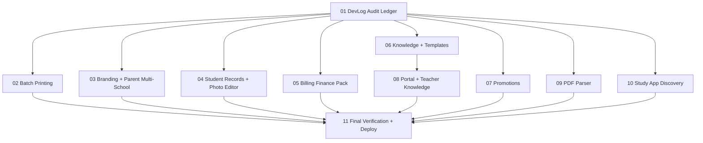

# DevLog Full Backlog Orchestration Session

**Session ID:** `20260426-devlog-full-backlog`
**Created:** 2026-04-26
**Workflow:** Takomi `mode-orchestrator`
**Purpose:** Audit every item in `00_Notes/DevLog.md`, write a complete comment ledger, then execute only confirmed regressions and open work through scoped task files.

## Operating Rules

- Start with audit, not feature work.
- Treat `[x]` DevLog items as verification/comment items unless the audit proves a regression.
- Treat `[-]` items as audit/refactor streams.
- Treat `[ ]` items as implementation or discovery tasks according to the approved plan.
- For every major feature, create or update the relevant `docs/features/*.md` file before code changes.
- Keep files focused; if a code file approaches 200 lines, split concerns unless there is a documented reason.
- For Convex work, read `packages/convex/_generated/ai/guidelines.md` before editing backend code.
- At final handoff, run `pnpm convex deploy`; if deploy fails, document the exact blocker.

## Model Routing Strategy

- Authoritative routing file: `model_routing_strategy.md`.
- Before dispatching a sub-agent, run `pi --list-models` and verify the requested model exists.
- Start with the cheapest capable model, then escalate immediately when work becomes vague, risky, cross-file, architecture-heavy, debugging-heavy, security-sensitive, or regression-sensitive.
- Treat `gpt-5.4-mini` as a fast junior implementer: use only for small, explicit, isolated work.
- Use `gpt-5.5` for serious architecture, tenant/security/billing decisions, final/deep review, regression detection, and high-risk refactors.
- Use `gpt-5.4` as the default implementation and normal review model.

## Skills Registry

| Skill | Use |
| --- | --- |
| `takomi` | Orchestration, task spawning, final synthesis |
| `convex` / `convex-best-practices` | Convex schema/functions, tenant boundaries, authorization |
| `convex-schema-validator` | Schema and validators for new/changed Convex tables/functions |
| `convex-security-check` | School scoping, parent/student access, billing safety |
| `nextjs-standards` | Next.js App Router, TypeScript, route verification |
| `frontend-design` / `ui-ux-pro-max` | UI debloating, mobile-first workbench cleanup |
| `webapp-testing` | Browser checks for print, portal, branding, billing, knowledge UI |
| `sync-docs` | Keep feature docs aligned with code changes |

## Workflows Registry

| Workflow | Use |
| --- | --- |
| `vibe-primeAgent` | First step for each implementation agent |
| `mode-orchestrator` | Session coordination and progress tracking |
| `vibe-spawnTask` | Task prompt format for delegated work |
| `mode-code` / `vibe-build` | Implementation tasks after audit approval |
| `mode-review` / `review_code` | Verification and regression review |
| `vibe-syncDocs` | Documentation updates after code changes |
| `vibe-finalize` | Final summary, verification, deploy handoff |

## Task Table

| # | Task | Type | Dependencies | Status |
| --- | --- | --- | --- | --- |
| 01 | DevLog Audit Ledger | Audit | none | completed |
| 02 | Report Card Batch Printing v2 | Build | 01 | completed |
| 03 | School Branding and Parent Multi-School Context | Build | 01 | pending |
| 04 | Student Records and Photo Editor | Build | 01 | pending |
| 05 | Billing Printable Finance Pack | Build | 01 | pending |
| 06 | Knowledge and Template Prevention Fixes | Audit + Build | 01 | pending |
| 07 | Promotions Audit and Fix | Audit + Build | 01 | pending |
| 08 | Portal and Teacher Knowledge Refactors | Audit + Build | 01, 06 | pending |
| 09 | PDF Parser Upgrade | Build | 01 | pending |
| 10 | Study App Discovery Brief | Discovery | 01 | pending |
| 11 | Final Verification, Docs, and Deploy | Finalize | 02-10 | pending |
| MR | Model Routing Strategy | Orchestration Policy | none | completed |

## Dependency Map

## Progress Checklist

- [ ] Create task files
- [x] Complete DevLog audit ledger
- [x] Confirm implementation scope from audit
- [ ] Execute scoped build tasks
- [ ] Update feature docs
- [ ] Run targeted tests/typechecks/build checks
- [ ] Run `pnpm convex deploy`
- [ ] Write `Orchestrator_Summary.md`

## Final Deliverables

- Complete DevLog comment ledger covering all checked, half-checked, and unchecked items.
- Updated `docs/features/*.md` files for every changed feature.
- Completed task files moved or copied into `completed/` with results.
- `Orchestrator_Summary.md` with verification results, deploy status, deferred items, and remaining risks.
