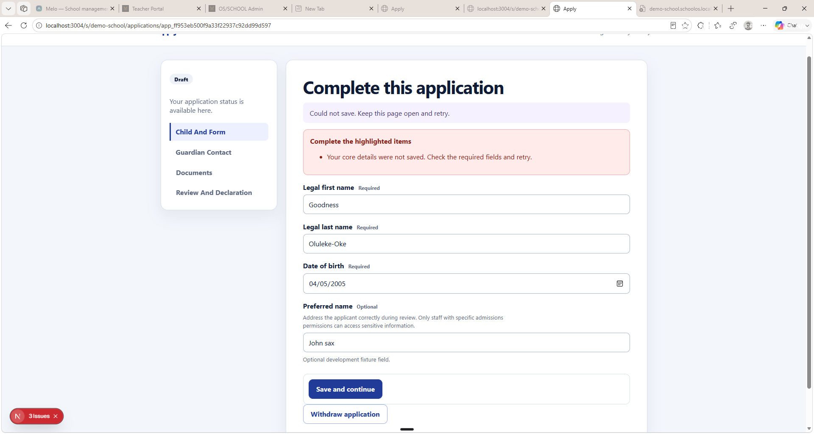
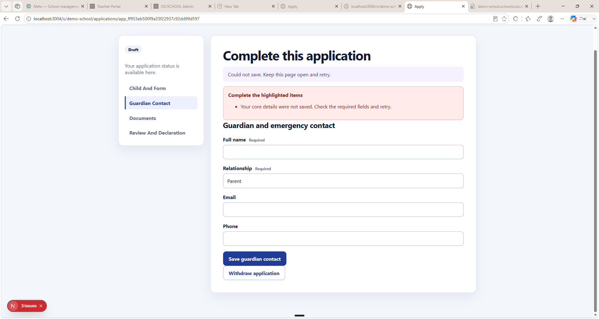
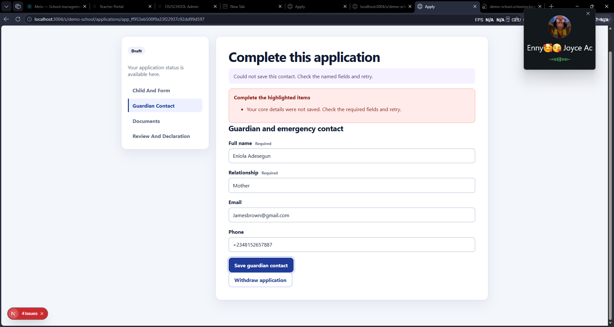
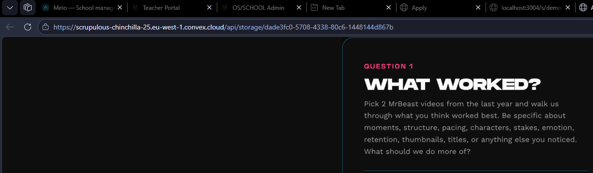
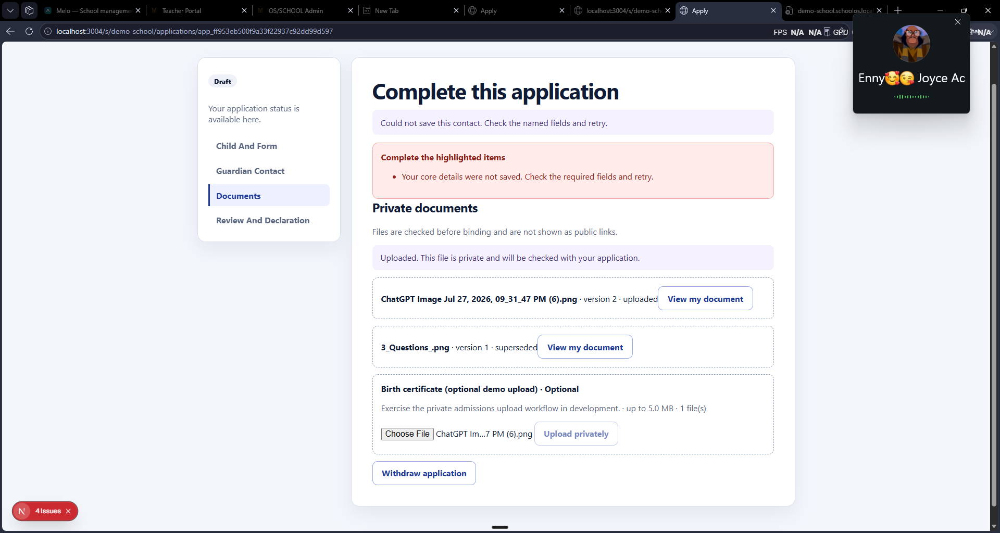

# Admissions Application — Future UX and Data-Safety Work

**Session:** `orch-20260722-114501`

**Captured from:** Manual guardian application testing

**Status:** Batch 1 implemented on `integration/obhis-admissions-release`; Batch 2 and Batch 3 remain deferred

**Recommended next step:** Complete the user-owned Batch 1 browser checks below before requesting Batch 2.

**Related post-merge quality work:** Atomic campaign setup, finance approval UX, full browser QA, component decomposition, typing, queue pagination/search, accessibility, recovery, performance, and mockup cleanup are tracked in [`Admissions_UI_Quality_Backlog.md`](Admissions_UI_Quality_Backlog.md).

## Implementation status — 2026-08-02

Batch 1 is integrated through merge commit `f75fc40`. The evidence-backed failure was a stale-version race between dynamic-field blur saving and section submission, compounded by unchanged answer replays. The implementation now provides idempotent exact draft replays, one serialized application write queue, 700ms per-edit debounce with a stable 7-second ceiling, deliberate application-scoped local recovery, bounded transient retries, explicit save states, field/section errors, and save-then-advance behavior.

Automated Apply tests, Apply typecheck, targeted Apply ESLint, Apply production build, focused Convex admissions tests, and Convex typecheck pass. Browser, visual, accessibility, offline/reconnect, refresh/restart, and multi-tab verification remain user-owned. See `follow-up/FU1_save_contract_result.md`, `follow-up/FU2_autosave_progression_result.md`, and `follow-up/FU3_batch1_integration_report.md`.

Batch 2 legal-name migration and Batch 3 document viewing/removal remain pending and were not combined into Batch 1.

## 1. Scope split

### Present task

Preserve the complete testing feedback as an actionable handoff document. No application behavior, schema, or document-storage flow is to be changed in this pass.

### Future implementation batches

1. **Batch 1 — Reliable draft saving and clear progression**
2. **Batch 2 — Legal-name standard and backward-compatible migration**
3. **Batch 3 — Private document viewing and upload management**

These batches should be implemented and verified separately to keep the current release test cycle controlled.

---

## 2. Batch 1 — Reliable draft saving and clear progression

**Implementation:** Complete on the integration branch; pending user browser verification.

### Problem statement

During manual testing, populated application sections did not save successfully. The interface displayed generic messages such as:

- “Could not save. Keep this page open and retry.”
- “Your core details were not saved. Check the required fields and retry.”
- “Could not save this contact. Check the named fields and retry.”

The current **Save and continue** label implies that completed work will be saved and that the applicant will advance to the next section. Instead, the save appears to be blocked by validation, without clearly identifying the invalid field. A core-details error also remained visible while navigating Guardian Contact and Documents, making it unclear whether the current section or an earlier section had failed.

### Required behavior

#### A. Automatic draft saving

- Save changed draft data automatically after a short debounce and at least every **5–10 seconds** while unsaved changes exist.
- Save only fields that are valid enough to persist as a draft; do not require the entire form or application to be complete.
- Keep unsaved edits locally if the connection is unavailable, then retry when connectivity returns.
- Show a concise save-state indicator:
  - `Saving…`
  - `Saved just now`
  - `Offline — changes waiting to sync`
  - `Could not save — retrying`
- Retry transient failures with bounded backoff.
- Flush pending changes when the user changes sections, leaves a field, or uses **Save and continue**.
- Prevent an older request from overwriting a newer edit.
- Define safe behavior for multiple tabs or devices editing the same draft, using the existing application version/optimistic-concurrency contract.
- Avoid sending writes when no values have changed.

#### B. Save and continue semantics

- **Save and continue** must save the current section and advance to the next section after a successful save.
- Draft saving must not require unrelated future sections to be complete.
- Validate the current section for progression; reserve full-application required-field validation for review/submission.
- If progression is blocked, identify the exact fields and place errors beside them.
- Move keyboard focus to the first invalid field or an error summary linked to each invalid field.
- Clear stale errors after the relevant section is corrected or a new save succeeds.
- Errors from Child and Form must not remain as the active error while the applicant is working in Guardian Contact or Documents, unless the interface explicitly labels them as unresolved earlier-section issues.
- A separate neutral action such as **Save draft** may remain available, but it must not imply section advancement.

#### C. Investigation required before implementation

- Reproduce the failing core-details save using the values shown during testing.
- Reproduce the failing guardian-contact save with populated name, relationship, email, and Nigerian phone number.
- Inspect the development Convex logs and mutation validation paths to identify the exact server-side rejection.
- Confirm whether the issue is field validation, stale application version, date serialization, phone formatting, published-form requirements, or another contract mismatch.
- Replace generic catch-all messages with safe, field-specific feedback where possible.

### Acceptance criteria

- Refreshing or restarting the browser restores the latest successfully entered draft values.
- A temporary loss of internet does not silently discard entered values.
- Autosave status is understandable without interrupting typing.
- **Save and continue** saves the current section and opens the next section.
- Incomplete later sections do not prevent saving the current draft.
- Invalid values produce named, actionable field errors.
- A successful save removes stale failure messages.
- Existing authorization, tenant isolation, application ownership, and optimistic concurrency protections remain intact.
- Automated tests cover debounce/state behavior and server draft semantics; manual testing covers offline recovery and navigation.

---

## 3. Batch 2 — Legal-name standard and backward compatibility

### Final naming decision captured

The applicant/student should follow birth-certificate-style legal naming:

- **Legal first name — required**
- **Legal middle name — required for new applications after rollout**
- **Legal last name — required**
- Preferred name may remain optional and separate.

For a parent/guardian, retain:

- **First name — required**
- **Last name — required**

The earlier idea of requiring a parent middle name is superseded by the final direction above. Do not store a parent only as one ambiguous “Full name” string in new records if the shared data model can safely support separate fields.

### Backward-compatibility requirements

- Existing people and applications containing only first and last names must remain valid and readable.
- Do not retroactively block legacy records because no middle name was previously collected.
- Introduce the student middle-name requirement through a versioned schema/form publication or an equivalent effective-date rule.
- New applications created after the migration boundary must require student middle name.
- Existing drafts should either remain under their original form snapshot or receive a deliberate, communicated migration path.
- Preserve legal names as entered; do not infer, split, reorder, or fabricate missing names.
- Review all downstream projections: Admin admissions, application snapshots, conversion to student records, exports, search/display names, and audit history.

### Acceptance criteria

- New student applications require first, middle, and last legal names.
- Parent/guardian details require separate first and last names.
- Legacy first-and-last-only records continue to work.
- Form snapshots and submitted application evidence remain immutable and understandable.
- Conversion and Admin views display all available legal-name components consistently.

---

## 4. Batch 3 — Private document viewing and upload management

### Problem A: Raw Convex storage URL is visible

Selecting **View my document** navigated the browser to a URL resembling:

`https://<development-deployment>.convex.cloud/api/storage/<storage-id>`

Although the file may still be access-controlled before the URL is issued, exposing the raw database/deployment storage URL is undesirable and inconsistent with the friendlier document-viewing behavior used elsewhere in the product.

### Required document-view behavior

- Open documents through an application-owned URL, for example:
  - `/s/{schoolSlug}/applications/{publicReference}/documents/{documentId}/view`
- Re-authorize the signed-in guardian and application ownership at access time.
- Use a short-lived server-mediated response or same-origin proxy so the browser-facing location does not expose the raw Convex deployment/storage identifier.
- Preserve correct filename and content type through `Content-Disposition` and `Content-Type` headers.
- Support safe inline viewing for permitted formats and download for unsupported formats.
- Never make private admission documents public merely to obtain a cleaner URL.
- Keep tenant, application, and document access checks fail-closed.

### Problem B: Uploaded documents cannot be removed

The Documents section lists uploaded and superseded files but provides no visible way for the guardian to delete or replace an accidental upload.

### Required document-management behavior

- Add **Remove document** for guardian-owned uploads while the application is editable.
- Require confirmation that names the file being removed.
- Immediately remove the file from the active application evidence after successful deletion.
- Define whether submitted, withdrawn, accepted, or converted applications allow removal; default to fail-closed after submission unless admissions policy explicitly permits replacement.
- Preserve an audit event/tombstone without exposing the deleted file contents.
- Decide whether physical storage deletion is immediate or handled by a bounded cleanup job after confirming no active references remain.
- Treat superseded versions deliberately: hide them from the normal guardian list or place them under a clear version-history disclosure.
- Make replacement behavior explicit rather than leaving multiple similarly named uploads unexplained.
- Ensure deletion failures are recoverable and never leave the interface claiming a file was removed when it remains bound.

### Acceptance criteria

- Guardians view documents through a same-origin, human-readable application route.
- Raw Convex deployment/storage URLs are not exposed in normal browser navigation.
- Unauthorized users cannot view documents by guessing routes or identifiers.
- Editable applications allow accidental uploads to be removed with confirmation.
- Submitted/locked application rules are explicit and enforced server-side.
- Auditability and storage cleanup are preserved.

---

## 5. Archived screenshot evidence

The five supplied screenshots are archived verbatim in the repository at:

`docs/tasks/orchestrator-sessions/orch-20260722-114501/future/evidence/admissions-application-manual-test-2026-07-30/`

The folder includes its own `README.md` evidence manifest. Future agents should inspect these files alongside the acceptance criteria above.

### Evidence 01 — Child and Form save failure

**File:** `evidence/admissions-application-manual-test-2026-07-30/01-child-form-save-failure.png`

Legal first name, legal last name, date of birth, and preferred name were populated. **Save and continue** returned a generic core-details failure and persistent error summary.

### Evidence 02 — Stale error on Guardian Contact

**File:** `evidence/admissions-application-manual-test-2026-07-30/02-guardian-contact-stale-error.png`

The previous core-details error remained visible after changing sections, while Guardian Contact displayed Full name, Relationship, Email, and Phone.

### Evidence 03 — Populated guardian contact save failure

**File:** `evidence/admissions-application-manual-test-2026-07-30/03-guardian-contact-save-failure.png`

Name, relationship, email, and phone were populated. **Save guardian contact** still returned a generic failure without identifying the rejected field.

### Evidence 04 — Raw Convex document URL

**File:** `evidence/admissions-application-manual-test-2026-07-30/04-raw-convex-storage-url.png`

Selecting a document opened a direct development Convex `/api/storage/...` URL in the browser address bar.

### Evidence 05 — No document deletion action

**File:** `evidence/admissions-application-manual-test-2026-07-30/05-documents-list-no-delete.png`

Uploaded and superseded files were visible with **View my document**, but there was no remove/delete action and version presentation was unclear.

The screenshots contain development test data and browser chrome. Treat them as internal engineering evidence. No production secrets or payment credentials are included.

---

## 6. Recommended implementation order

### First future pass: Batch 1

Fix the actual save mutation failure first, then implement partial draft persistence, autosave, offline recovery, and unambiguous progression. Data-loss prevention is the highest priority and should be resolved before gathering further application content.

### Second future pass: Batch 2

Introduce the legal-name model through a migration and form-versioning plan that preserves existing records and submitted snapshots.

### Third future pass: Batch 3

Add same-origin private document viewing and controlled upload deletion/replacement, with server-side authorization and audit behavior reviewed together.

### Final regression pass

Repeat the complete paid guardian journey:

1. Pay and return from Paystack.
2. Start/resume the application.
3. Enter data, disconnect briefly, reconnect, refresh, and confirm recovery.
4. Save and progress through each section.
5. Upload, view, replace, and remove a document.
6. Review and submit.
7. Confirm Admin sees the correct immutable application snapshot and document evidence.

---

## 7. Historical non-goals for the original documentation pass

The following constraints described the original documentation-only pass. Batch 1 was subsequently authorized and implemented as recorded above; Batch 2 and Batch 3 remain deferred.

- No autosave implementation during the original documentation pass.
- No schema migration now.
- No middle-name requirement now.
- No document proxy or deletion now.
- No changes to production.
- No browser automation by the assistant.

This document is the scope boundary for future work and should be updated with implementation notes and verification results when each batch is started.
